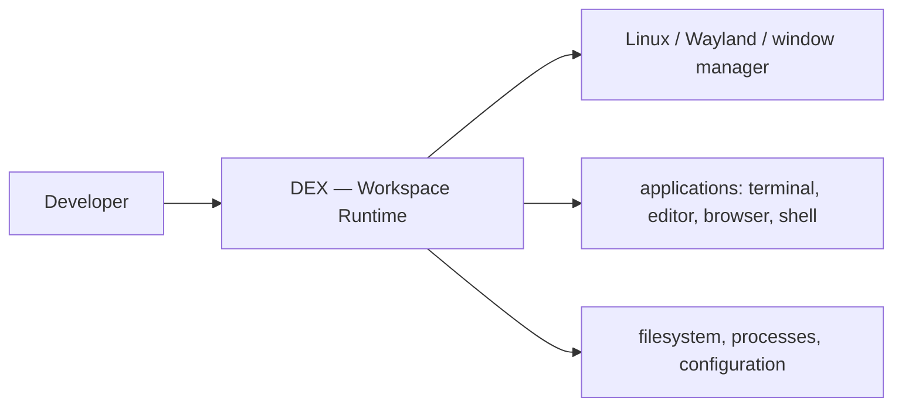

# DEX Manifesto

## Purpose

This manifesto is the identity of DEX. It states why DEX exists, what DEX
is, what DEX is not, and the values that govern every decision made in its
name. It is the root document of the documentation tree: every other
document answers to it, and when a decision conflicts with it, the
manifesto wins.

This is not a specification. It contains no interfaces, no schemas, and no
implementation. It is the reason those documents exist.

## Background — the missing layer

A developer's work does not live in applications. It lives in workspaces: a
terminal with the right sessions, an editor with the right files open, a
browser on the right page, a service running, a process tree in the right
state, and the context of what was being done. Applications are tools
inside that context — but no layer of the system treats the workspace
itself as an object.

The window manager manages windows. The desktop environment manages a
desktop. The IDE manages a project inside a single application. The
operating system manages processes and files. None of them manages the
developer's workspace: the complete, live state of a development effort.
The result is that starting work means re-assembling context by hand, every
time, on every machine.

DEX exists to fill that gap with a Workspace Runtime — the operating layer
that activates, restores, and orchestrates complete development workspaces.

## Identity

DEX is a Workspace Runtime.

It is the operating layer between the developer and the Linux system. It
treats the development workspace as a first-class object: declared,
activated, restored, and orchestrated.

DEX sits between the developer and the system, but it does not own the
system. It integrates and orchestrates; it does not replace. The full
boundaries of what DEX will not do are stated in
[`04_NonGoals.md`](04_NonGoals.md).

## What DEX is not

DEX is not a desktop environment. Managing a desktop of icons, panels, and
menus is not its purpose.

DEX is not a window manager. It does not own compositing or window layout;
it composes with the window manager that does.

DEX is not an IDE. It does not host the editor or the debugger; it
orchestrates them.

DEX is not an Electron dashboard. It is not a web surface over the
desktop; it is a native layer over the operating system.

DEX is not a launcher. Searching and launching are capabilities, not its
identity.

DEX is not an AI application. Intelligence is an optional capability that
must degrade gracefully; the runtime works fully without it.

## Why it exists

Starting a day of development should not be a manual assembly job. One act
of activation should restore the complete context of a project: the
windows, the processes, the sessions, the state. DEX exists to make the
workspace as durable and as recoverable as the filesystem — and to make
that recovery scriptable, so that a workspace can be declared once and
recreated anywhere.

## Values

Twelve values govern the project. Each is stated as a rule, because
documents live longer than debates. [`02_Principles.md`](02_Principles.md)
develops each value in full as immutable engineering rules; this section is
the compact creed.

| Value | Rule |
|---|---|
| Workspace First | The workspace is the atomic unit of the developer's day. Everything is organized around activating and restoring complete workspaces. |
| Offline First | The machine works fully without a network. Local state is the source of truth; synchronization is layered on top, never required. |
| CLI First | Every capability is scriptable from the command line. A capability that cannot be automated is a capability that does not exist. |
| Plugin First | Extensibility is designed into the platform from the start, bounded by a hard security boundary — never added as an afterthought. |
| Native First | Performance and integration with the host Linux system come before cross-platform reach. |
| Context over Applications | Applications are means, not ends. DEX is organized around the developer's context and treats applications as tools within it. |
| Lightweight Core | The core does as little as possible, well. Everything that can live outside the core lives outside it. |
| Strong Typing | Every seam between components is a typed contract. Unchecked boundaries are where systems rot. |
| Composition over Inheritance | Capabilities are composed from small pieces with clear boundaries, not inherited from large ones. |
| Feature First Architecture | The codebase is structured around product features, so the architecture maps to the product rather than to a framework. |
| Integrate, Don't Replace | DEX composes with the terminal, the editor, the browser, and the shell. It never seeks to absorb them. |
| AI is Optional | Intelligence is a feature, not an identity. Every AI capability degrades gracefully to a fully manual workflow. |

## Mission

DEX's mission is to become the standard Workspace Runtime for Linux
developers: the layer that makes a development workspace as durable, as
scriptable, and as recoverable as a file.

The long-term test of DEX is not the adoption of its components but the
durability of its concept. DEX should outlive any single tool it
integrates, any single window manager it composes with, and any single
feature it ships. [`01_Vision.md`](01_Vision.md) states this future in
full.

## Related Documents

- Long-term vision: [`01_Vision.md`](01_Vision.md)
- The twelve values developed in full: [`02_Principles.md`](02_Principles.md)
- Canonical terminology: [`03_Glossary.md`](03_Glossary.md)
- Scope discipline — what DEX will not do: [`04_NonGoals.md`](04_NonGoals.md)
- Product definition: [`../10-product/10_Master_PRD.md`](../10-product/10_Master_PRD.md)
- The Workspace Runtime concept: [`../10-product/15_Workspace_Runtime.md`](../10-product/15_Workspace_Runtime.md)
- System architecture: [`../20-architecture/20_System_Architecture.md`](../20-architecture/20_System_Architecture.md)