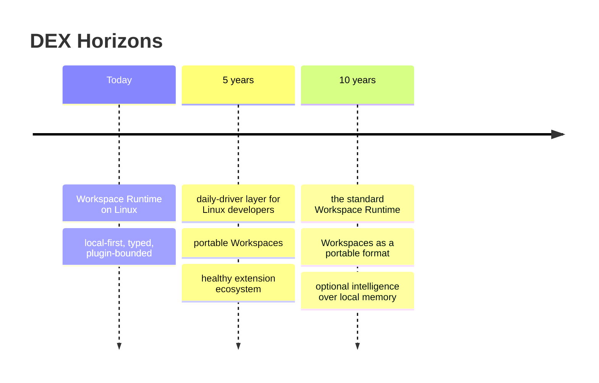

# DEX Vision

## Purpose

The long-term vision of DEX: where the project is going, on what
horizons, and how the project knows it has arrived. This document is
deliberately free of implementation. It exists so that short-term
decisions can be checked against a destination.

## Background

DEX exists because a developer's work lives in Workspaces that no layer of
the system treats as objects. The Manifesto states that problem and the
identity that answers it. This document states where that answer leads:
what the Workspace Runtime becomes as it matures.

## Five-Year Vision

- DEX is a daily driver for Linux developers: the layer they reach for
  first when they sit down to work.
- A Workspace is a portable object. One command restores a complete work
  session — windows, sessions, services, Context — and a Workspace created
  on one machine activates on another.
- The extension ecosystem is real: a catalog of Plugins and Widgets that
  extend the Runtime without weakening its boundary.
- The Knowledge Vault is the developer's durable memory: notes, decisions,
  and history survive across Workspaces and machines, always local.
- The CLI is the complete surface of the Runtime; the graphical shell is a
  polished client of the same surface, and the two never disagree.

## Ten-Year Vision

- DEX is the standard Workspace Runtime for Linux: the assumed operating
  layer, the way the shell and the package manager are assumed.
- Workspaces are a portable, documented format that moves between machines,
  between teams, and between contributors — the way containers moved
  applications.
- Intelligence is a natural, optional layer over the Knowledge Vault:
  assistance that knows the developer's Context because it reads local
  memory, and that disappears without cost when disabled.
- The platform has outlived the tools it integrates. The terminal, the
  editor, and the browser it orchestrates today are replaceable; the
  Workspace Runtime is not.

## Success Criteria

- **Restoration.** A developer restores a complete work session with one
  command, from a Snapshot or from a Manifest, on any machine DEX runs on.
- **Portability.** A Workspace declared by its Workspace Manifest activates
  on a second machine without manual re-assembly.
- **Auditability.** The core remains small enough for one engineer to
  reason about end to end; the extension boundary holds in the presence of
  third-party Plugins.
- **Ecosystem.** Adoption is measured by daily-driver use and extension
  quality, not by component count. The strongest signal is a user who
  chooses DEX on a fresh machine.
- **Durability.** The concepts outlive the components: Workspaces,
  Manifests, and the Knowledge Vault remain the vocabulary of the product
  as it evolves.

## What DEX should become

DEX should become the operating layer that makes a developer's Workspace
as durable, as scriptable, and as recoverable as a file — the layer
without which Linux development feels incomplete.

## Related Documents

- Identity: [`00_Manifesto.md`](00_Manifesto.md)
- The twelve values: [`02_Principles.md`](02_Principles.md)
- Canonical terminology: [`03_Glossary.md`](03_Glossary.md)
- Scope discipline: [`04_NonGoals.md`](04_NonGoals.md)
- Product roadmap: [`../10-product/11_Product_Roadmap.md`](../10-product/11_Product_Roadmap.md)
- The Workspace Runtime concept: [`../10-product/15_Workspace_Runtime.md`](../10-product/15_Workspace_Runtime.md)