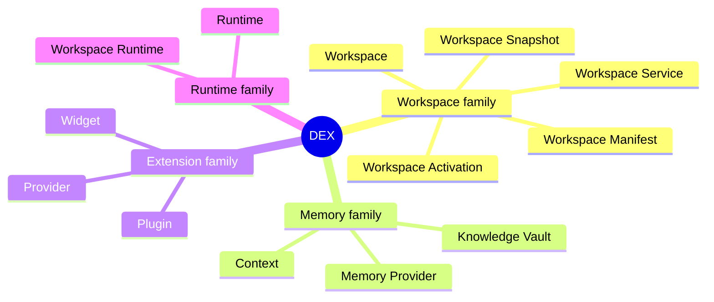

# DEX Glossary

## Purpose

This glossary is the single source of truth for DEX terminology. Every
document in this tree — vision, product, architecture, specification,
guide — uses these terms and these definitions, without synonyms and
without exception. If a document needs a concept that is not defined here,
the concept does not belong in DEX documentation until it is defined here.

The glossary defines concepts, not implementation. It says what a thing
*is*, not how it is built. Implementation detail lives in the
specifications; each term points to the document that owns its contract.

## Terms

### Workspace

The atomic unit of a developer's work. A Workspace is a declared,
self-contained environment that bundles the configuration, tooling, and
state for one development effort: the applications, sessions, and services
that make up a project, together with the Context of the work in progress.
A Workspace is declared by a Workspace Manifest and brought to life by
Workspace Activation.

### Workspace Runtime

The operating layer provided by DEX that activates, restores, and
orchestrates complete development Workspaces on Linux. The Workspace
Runtime is the identity of DEX: it is what DEX *is*. It sits between the
developer and the operating system, integrates rather than replaces, and
treats the Workspace as a first-class object.

### Workspace Manifest

The declarative, versioned document that defines a Workspace: what it
contains, what runs when it is activated, and what state it captures. The
Manifest is the contract between a Workspace and the Workspace Runtime —
the same declaration activates a Workspace on any machine.

*Contract: [`../30-specs/Manifest.md`](../30-specs/Manifest.md)*

### Workspace Activation

The operation by which the Workspace Runtime brings a Workspace to life:
launching its sessions and Workspace Services, restoring its windows and
state, and re-establishing Context. Activation is the central act of DEX —
the transition from "declared" to "live".

*Product definition: [`../10-product/15_Workspace_Runtime.md`](../10-product/15_Workspace_Runtime.md) ·
Contract: [`../30-specs/Workspace.md`](../30-specs/Workspace.md)*

### Workspace Snapshot

A point-in-time capture of a Workspace's runtime state, taken on demand or
on schedule. A Snapshot makes it possible to restore a Workspace to exactly
where work left off — after a reboot, on another machine, or after a failed
experiment.

*Contract: [`../30-specs/Snapshot.md`](../30-specs/Snapshot.md)*

### Workspace Service

A managed subsystem that a Workspace declares and depends on — a database,
a build daemon, a development server. The Workspace Runtime starts,
supervises, and stops Workspace Services as part of Activation and of
leaving a Workspace, so the state of a project's supporting processes is
part of the Workspace, not an accident of what happened to be running.

*Contract: [`../30-specs/Workspace.md`](../30-specs/Workspace.md)*

### Knowledge Vault

DEX's persistent, local memory layer: the durable store of a developer's
Context, notes, and history, spanning Workspaces and time. The Knowledge
Vault is the foundation of DEX's memory and of every AI capability; it is
owned by the Knowledge subsystem and it is always local.

*Contract: [`../30-specs/Knowledge.md`](../30-specs/Knowledge.md)*

### Memory Provider

An adapter that connects the Knowledge Vault to a storage or model backend
— a local database, an embedding store, a model endpoint. A Memory
Provider implements a fixed interface; swapping the backend never changes
the Vault's contract.

*Contract: [`../30-specs/Knowledge.md`](../30-specs/Knowledge.md)*

### Plugin

A Rust-hosted, capability-gated extension to the Workspace Runtime,
declared by a manifest, validated by the host, and executed in native
code. A Plugin extends the Runtime's command and event surface with exactly
the capabilities granted to it — never more, and never inside the
privileged webview.

*Contract: [`../30-specs/PluginAPI.md`](../30-specs/PluginAPI.md) ·
Decision: [`../50-adr/0005-plugin-boundary.md`](../50-adr/0005-plugin-boundary.md)*

### Widget

A sandboxed UI extension, rendered in an isolated context with no IPC
access of its own. A Widget's every effect is mediated by the Workspace
Runtime through shell-mediated commands; a Widget never imports
`@tauri-apps/api`.

*Contract: [`../30-specs/WidgetAPI.md`](../30-specs/WidgetAPI.md)*

### Provider

An adapter that implements a well-defined backend interface — storage,
memory, notification, model. A Provider is the seam that keeps DEX's core
independent of any specific service. Memory Provider is the specific case
in the Knowledge domain.

*Architecture: [`../20-architecture/20_System_Architecture.md`](../20-architecture/20_System_Architecture.md) ·
Knowledge: [`../30-specs/Knowledge.md`](../30-specs/Knowledge.md)*

### Runtime

The executing DEX host: the process(es) that load Plugins, run Workspace
Services, dispatch commands and events, and own system access. "The
Runtime" is the live instance of the Workspace Runtime.

*Architecture: [`../20-architecture/20_System_Architecture.md`](../20-architecture/20_System_Architecture.md)*

### Context

The developer's working state: which Workspace is active, what is open,
what was in progress. DEX is organized around Context rather than around
applications: applications are tools within Context, not the organizing
principle.

*Product definition: [`../10-product/15_Workspace_Runtime.md`](../10-product/15_Workspace_Runtime.md)*

## Automation Terms

**Trigger** — An event that starts a Workflow execution (file change, cron schedule, CLI command, startup).

**Condition** — A test evaluated after a Workflow action executes; the Workflow is defined as trigger → action → condition → result (Master PRD AU-1), and if the condition fails the result is not produced/skipped.

**Action** — A single operation performed by a Workflow (run command, send notification, activate Workspace).

**Result** — The outcome of a Workflow action (success, failure, partial).

**Workflow** — A sequence of Trigger → Action → Condition → Result steps that automate a development routine.

**Macro** — A recorded sequence of keyboard, mouse, or shell operations that can be replayed.

**Scheduler** — The Runtime component that fires Triggers on cron schedules or system events.

**Smart Action** — An AI-generated Workflow created from natural language description.

*Contract: [`../30-specs/Automation.md`](../30-specs/Automation.md)*

## Other Terms

**Desktop Experience** — Alternative expansion of DEX; used in architecture docs but not the canonical product name.

**omnizya-dex** — The Rust crate name for the DEX backend (library target: `omnizya_dex_lib`).

## Rules of use

- Use these terms exactly as defined; never invent synonyms. "Project" does
  not replace "Workspace"; "memory" does not replace "Knowledge Vault";
  "extension" does not replace "Plugin" or "Widget".
- When a term's formal contract exists, its specification owns the detail;
  every other document references it instead of re-explaining it.
- A term defined here may not be redefined elsewhere. Documents that need a
  narrower sense refer back to this glossary and state the qualifier.

## Related Documents

- Identity: [`00_Manifesto.md`](00_Manifesto.md)
- The twelve values: [`02_Principles.md`](02_Principles.md)
- The Workspace Runtime concept: [`../10-product/15_Workspace_Runtime.md`](../10-product/15_Workspace_Runtime.md)
- System architecture: [`../20-architecture/20_System_Architecture.md`](../20-architecture/20_System_Architecture.md)
- Specifications (formal contracts): [`../30-specs/`](../30-specs/)