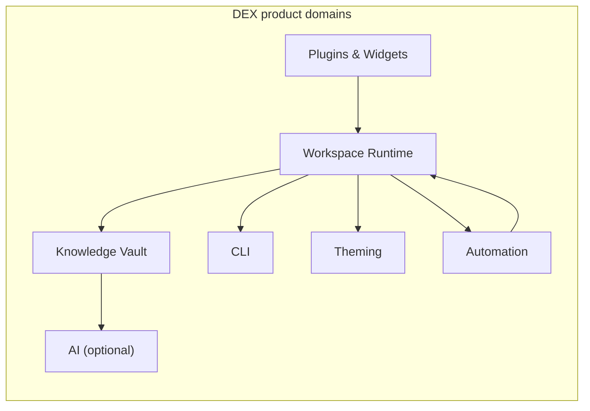

# DEX Master Product Requirements Document

## Purpose

This document is the product contract for DEX. It states what DEX is for,
who it serves, and the testable requirements each product domain must
satisfy. It is the single reference for "what the product must do"; the
roadmap (`11_Product_Roadmap.md`) states *when* each requirement ships, and
the specifications (`../30-specs/`) state *how* each requirement is
contracted.

This document is not a specification. It contains no schemas, no interfaces,
and no implementation. It is the requirements those documents answer to.

## Background

A developer's work lives in Workspaces: a terminal with the right sessions,
an editor with the right files, a browser on the right page, a service
running, and the Context of what was being done. No layer of the system
treats the Workspace itself as an object. The window manager manages
windows; the desktop manages a desktop; the IDE manages a project inside a
single application. None manages the complete, live state of a development
effort.

DEX fills that gap with a Workspace Runtime — the operating layer that
activates, restores, and orchestrates complete development Workspaces on
Linux. It integrates with the tools a developer already uses; it does not
replace them. It is local-first, scriptable, and extensible behind a hard
security boundary.

The Workspace Runtime is the core domain; every other domain either serves
it, extends it, or consumes it. The Knowledge Vault is the memory layer that
AI consumes; AI is never on the critical path.

## Goals

- **Workspace First.** The Workspace is the atomic unit of the developer's
  day. One act of Workspace Activation restores the complete Context of a
  development effort.
- **Offline First.** The machine is fully functional with no network. Local
  state is the source of truth.
- **CLI First.** Every capability is scriptable from the command line. The
  CLI is the complete surface; the graphical shell is a second client of the
  same surface.
- **Plugin First.** Extensibility is designed in from the start, bounded by
  a hard security boundary.
- **Native First.** Performance and integration with the host Linux system
  come before cross-platform reach.
- **Integrate, Don't Replace.** DEX composes with the terminal, the editor,
  the browser, and the shell; it never seeks to absorb them.
- **AI is Optional.** Intelligence degrades gracefully to a fully manual
  workflow.

## Non-Goals

DEX is not a desktop environment, a window manager, an IDE, an Electron
dashboard, a launcher, or an AI application. It does not replace the tools
it integrates, is not cross-platform-first, is not a cloud service, is not a
web application, does not define its own compositor, does not lock data into
proprietary formats, and is not AI-dependent. The full boundary is stated in
[`../00-vision/04_NonGoals.md`](../00-vision/04_NonGoals.md) and is binding
on every requirement below.

## Personas

DEX serves five primary personas, summarized here and developed in full in
[`12_User_Personas.md`](12_User_Personas.md):

| Persona | Core need |
|---|---|
| Core Linux Developer | A daily-driver Workspace Runtime on Hyprland that restores complete Context in one act. |
| Multi-Project Consultant | Fast, reliable switching between many Workspaces without losing state. |
| Terminal-First Engineer | A complete, scriptable CLI surface that never diverges from the shell. |
| Plugin/Widget Author | A bounded, documented extension surface with a hard security boundary. |
| AI-Curious User | Optional intelligence over local memory that degrades gracefully when disabled. |

## Requirements by Domain

Requirements are numbered and testable. Each is a statement of user-facing
behavior; the specification that owns its contract is referenced where one
exists.

### Workspace Runtime

- **WR-1 Activation.** The Runtime SHALL bring a Workspace to life from its
  Workspace Manifest: launching its sessions and Workspace Services,
  restoring its windows and state, and re-establishing Context. *Contract:
  [`../30-specs/Workspace.md`](../30-specs/Workspace.md).*
- **WR-2 Restoration.** The Runtime SHALL restore a Workspace from a
  Workspace Snapshot to exactly where work left off, after a reboot, on
  another machine, or after a failed experiment. *Contract:
  [`../30-specs/Snapshot.md`](../30-specs/Snapshot.md).*
- **WR-3 Snapshots.** The Runtime SHALL capture a Workspace Snapshot on
  demand and on schedule, and SHALL make each Snapshot restorable
  independently.
- **WR-4 Workspace Services.** The Runtime SHALL start, supervise, and stop
  the Workspace Services a Workspace declares, as part of Activation and of
  leaving a Workspace, so supporting processes are part of the Workspace
  rather than an accident of what was running.
- **WR-5 Declarative Manifests.** A Workspace declared by its Workspace
  Manifest SHALL activate on any machine the Runtime runs on, without manual
  re-assembly. *Contract: [`../30-specs/Manifest.md`](../30-specs/Manifest.md).*
- **WR-6 Context.** The Runtime SHALL track which Workspace is active, what
  is open, and what was in progress, and SHALL present Context as the
  top-level model of the shell.

### Knowledge Vault and Memory Providers

- **KV-1 Durable Memory.** The Knowledge Vault SHALL persist a developer's
  Context, notes, and history across Workspaces and time, always local.
  *Contract: [`../30-specs/Knowledge.md`](../30-specs/Knowledge.md).*
- **KV-2 Provider Abstraction.** The Vault SHALL connect to storage and
  model backends through Memory Providers that implement a fixed interface,
  so swapping a backend never changes the Vault's contract.
- **KV-3 Offline Operation.** The Vault SHALL operate fully with no network;
  synchronization, where present, is an opt-in extension and never a
  precondition.
- **KV-4 Query.** The Vault SHALL support querying stored Context and notes
  through the CLI and the shell, with results that are deterministic and
  local.

### Plugins and Widgets

- **PW-1 Plugin Boundary.** A Plugin SHALL be a Rust-hosted, capability-gated
  extension declared by a manifest, validated by the host, and executed in
  native code. *Contract: [`../30-specs/PluginAPI.md`](../30-specs/PluginAPI.md);
  Decision: [`../50-adr/0005-plugin-boundary.md`](../50-adr/0005-plugin-boundary.md).*
- **PW-2 Least Privilege.** A Plugin SHALL receive exactly the capabilities
  it declares, never more, and never inside the privileged webview.
- **PW-3 Widget Isolation.** A Widget SHALL render in an isolated context
  with no IPC access of its own; every effect SHALL be mediated by the
  Runtime through shell-mediated commands. *Contract:
  [`../30-specs/WidgetAPI.md`](../30-specs/WidgetAPI.md).*
- **PW-4 Lifecycle.** The Runtime SHALL install, update, and remove Plugins
  and Widgets with schema-validated manifests and versioned contracts.

### CLI (CLI First)

- **CLI-1 Complete Surface.** Every Runtime capability SHALL have a CLI form
  with a stable interface. A capability that cannot be automated is a
  capability that does not exist. *Contract: [`../30-specs/CLI.md`](../30-specs/CLI.md).*
- **CLI-2 Parity.** The CLI and the graphical shell SHALL drive the same
  commands, so what works in one works in the other, and nothing is
  GUI-only.
- **CLI-3 Scriptability.** CLI output SHALL be machine-parseable and
  deterministic, suitable for composition in scripts and automation.

### Theming

- **TH-1 Token-Driven.** All visual styling SHALL derive from the design
  token system; components SHALL consume semantic tokens only. *Decision:
  [`../50-adr/0003-design-tokens.md`](../50-adr/0003-design-tokens.md).*
- **TH-2 Live Switching.** The user SHALL switch themes at runtime, with the
  change applied before the next paint and persisted across sessions.
  *Contract: [`../30-specs/Theme.md`](../30-specs/Theme.md).*
- **TH-3 Transparency.** The shell window SHALL remain transparent; visual
  backdrop SHALL come from glass surfaces, never an opaque window paint.
  *Decision: [`../50-adr/0004-transparent-compositing.md`](../50-adr/0004-transparent-compositing.md).*

### Automation

- **AU-1 Workflow Engine.** The user SHALL define workflows as
  trigger → action → condition → result, and the Runtime SHALL execute them
  deterministically. *Contract: [`../30-specs/Automation.md`](../30-specs/Automation.md).*
- **AU-2 Scheduling.** The user SHALL schedule workflows by cron, by event,
  and at startup.
- **AU-3 Scope.** Automation SHALL target the development workflow —
  Workspaces, Workspace Services, and tooling — not the consumer desktop.

### AI (Optional, Degrading Gracefully)

- **AI-1 Optionality.** No core capability SHALL require a model, an API key,
  or a network. The Workspace Runtime and the Knowledge Vault SHALL work
  fully without intelligence.
- **AI-2 Graceful Degradation.** Every AI capability SHALL degrade to a fully
  manual workflow when disabled, with no loss of existing state or data.
- **AI-3 Local Memory.** AI capabilities SHALL consume the Knowledge Vault
  through Memory Providers and SHALL never be on the critical path of the
  Workspace Runtime.

## Cross-Cutting Constraints

- **Offline First.** The Runtime, the Knowledge Vault, and every Workspace
  SHALL work on a machine with no network. Secrets and knowledge stay local;
  anything that leaves the machine does so by explicit request.
- **Linux Native.** DEX SHALL be a native layer over Linux/Wayland, with all
  system access owned by Rust. The frontend SHALL never touch the
  filesystem, SQLite, or the shell directly.
- **Security.** The shell SHALL ship a strict Content Security Policy; every
  Plugin and Widget SHALL be capability-gated and manifest-validated. The
  extension boundary SHALL hold in the presence of third-party code.
- **Performance budgets.** The Runtime SHALL meet: cold start < 500 ms;
  60 FPS sustained for compositor-only motion; < 200 MB idle RAM. These are
  hard budgets, not targets.

## Success Metrics

- **Restoration.** A developer restores a complete work session with one
  command, from a Snapshot or from a Manifest, on any machine the Runtime
  runs on.
- **Portability.** A Workspace declared by its Manifest activates on a second
  machine without manual re-assembly.
- **Daily Driver.** A developer chooses DEX on a fresh machine and reaches
  for it first when they sit down to work.
- **Ecosystem.** Adoption is measured by daily-driver use and extension
  quality, not by component count.
- **Durability.** The concepts — Workspace, Workspace Manifest, Workspace
  Snapshot, Knowledge Vault — remain the vocabulary of the product as it
  evolves, outliving any single tool it integrates.

## Related Documents

- Identity and values: [`../00-vision/00_Manifesto.md`](../00-vision/00_Manifesto.md)
- Canonical terminology: [`../00-vision/03_Glossary.md`](../00-vision/03_Glossary.md)
- Scope boundary: [`../00-vision/04_NonGoals.md`](../00-vision/04_NonGoals.md)
- Roadmap and milestones: [`11_Product_Roadmap.md`](11_Product_Roadmap.md)
- Personas: [`12_User_Personas.md`](12_User_Personas.md)
- User stories: [`13_User_Stories.md`](13_User_Stories.md)
- Feature matrix: [`14_Feature_Matrix.md`](14_Feature_Matrix.md)
- The Workspace Runtime concept: [`15_Workspace_Runtime.md`](15_Workspace_Runtime.md)
- User flows: [`16_User_Flows.md`](16_User_Flows.md)
- UX principles: [`17_UX_Principles.md`](17_UX_Principles.md)
- System architecture: [`../20-architecture/20_System_Architecture.md`](../20-architecture/20_System_Architecture.md)
- Formal contracts: [`../30-specs/`](../30-specs/)