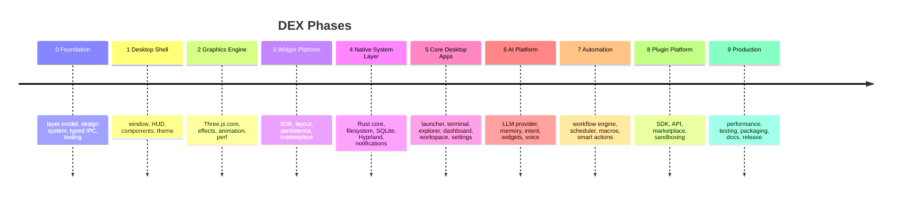

# DEX Product Roadmap

## Purpose

The roadmap is the product-level plan for DEX: ten phases, forty-five
milestones, and the deliverables that carry each milestone to a working
vertical slice. It is the source of truth for what ships and in what order.
Architecture reference: `20-architecture/20_System_Architecture.md` +
`50-adr/`.

## Background

DEX is a Workspace Runtime built in phases. Phase 0 establishes the layer
model and infrastructure that every later feature depends on; each subsequent
phase adds a capability surface — shell, graphics, widgets, native system
access, core applications, AI, automation, plugins — until the platform is
production-ready.

## Phase Gate

Every milestone ends with a working vertical slice and green checks under
the standard gate: `bun run verify` (nine steps, fail-fast) plus
`bun run tauri:dev` as the manual desktop check.

## Success Criteria

**Technical**

- Cold start < 500 ms
- 60 FPS sustained (compositor-only motion, no layout thrash)
- < 200 MB idle RAM
- Native Wayland performance — no Electron-style lag

**Product**

- Daily driver for developers
- Deep Hyprland integration (workspaces, windows, rules, socket events)
- Extensible widget + plugin ecosystem
- AI augments the user — never replaces them

## Development Rhythm

| Phase | Milestones | Est. commits | Outcome |
|---|---|---|---|
| 0 Foundation | 4 | 20–30 | Solid engineering foundation |
| 1 Desktop Shell | 4 | 30–40 | Functional desktop shell |
| 2 Graphics Engine | 4 | 30–50 | GPU visuals engine |
| 3 Widget Platform | 4 | 40–60 | Widget ecosystem |
| 4 Native System Layer | 5 | 50–70 | Deep Linux integration |
| 5 Core Desktop Apps | 6 | 80–120 | Core desktop applications |
| 6 AI Platform | 5 | 60–100 | AI assistant platform |
| 7 Automation | 4 | 40–70 | Automation engine |
| 8 Plugin Platform | 4 | 50–80 | Plugin ecosystem |
| 9 Production | 5 | 40–60 | Production-ready v1.0 |

## Phase 0 — Foundation (complete)

**Goal:** the layer every feature depends on. No business features.

- [x] **M0.1 Project Architecture** — folder structure, layered architecture
      (ADR-0001), coding standards, ADRs, engineering docs
- [x] **M0.2 Design System** — tokens, typography, colors, icons, motion,
      theme engine (ADR-0003/0004, `ui/styles`, `ui/primitives`, `ui/themes`)
- [x] **M0.3 Core Infrastructure** — typed IPC layer + command registry,
      contract clients, event bus, theme store, logger, error envelope
      (ADR-0002, ADR-0005; `core/api`, `core/services`, `core/utils`)
- [x] **M0.4 Development Tooling** — nine-step `bun run verify` gate, ESLint,
      Prettier, Rustfmt, Clippy, vitest runner, CI on push/PR to
      `develop`/`main`

## Phase 1 — Desktop Shell (current)

**Goal:** first usable shell surface, proving the seams end to end.

- [x] **M1.1 Window** — transparent, fullscreen, multi-monitor, DPI-aware
      (real startup handshake, event-driven window store)
- [x] **M1.2 HUD** — TopBar, Dock, StatusBar, Viewport wiring
- [x] **M1.3 UI Components** — GlassPanel, Button, Card, Tooltip, Modal,
      ContextMenu, Dropdown (complete the primitive set)
- [x] **M1.4 Theme** — dark, cyber, dynamic; live switching end to end

## Phase 2 — Graphics Engine

**Goal:** GPU visuals under the DOM chrome (`graphics/`).

- [x] **M2.1 Three.js Core** — renderer, scene, camera, lights
- [ ] **M2.2 Effects** — bloom, fog, background, grid, particles
- [ ] **M2.3 Animation Engine** — timeline, motion manager, transition manager
- [ ] **M2.4 Performance** — object pooling, texture cache, FPS monitor

## Phase 3 — Widget Platform

**Goal:** the widget ecosystem on top of the engine.

- [ ] **M3.1 Widget SDK** — registry, metadata, lifecycle
- [ ] **M3.2 Layout Engine** — drag, resize, snap, dock, float
- [ ] **M3.3 Persistence** — SQLite-backed positions/sizes/settings
- [ ] **M3.4 Widget Marketplace API** — discovery, install, update

## Phase 4 — Native System Layer

**Goal:** deep Linux integration, all Rust-owned.

- [ ] **M4.1 Rust Core** — commands, IPC, services (first real domains)
- [ ] **M4.2 Filesystem** — browse, watch, search
- [ ] **M4.3 SQLite** — access layer, repository pattern, migrations
- [ ] **M4.4 Hyprland** — socket, windows, workspaces, focus, rules
- [ ] **M4.5 Notifications**

## Phase 5 — Core Desktop Apps

**Goal:** the everyday desktop applications, feature-first.

- [ ] **M5.1 Launcher** — search, execute, recent
- [ ] **M5.2 Terminal** — PTY, tabs, sessions
- [ ] **M5.3 File Explorer** — tree, preview, favorites
- [ ] **M5.4 Dashboard** — CPU, RAM, GPU, network, storage
- [ ] **M5.5 Workspace Manager** — overview, window switcher, layouts
- [ ] **M5.6 Settings** — theme, plugins, AI, system

## Phase 6 — AI Platform

**Goal:** local-first AI that augments the desktop.

- [ ] **M6.1 LLM Provider** — Ollama, OpenAI, Anthropic
- [ ] **M6.2 Memory** — conversations, desktop state, context
- [ ] **M6.3 Intent Engine** — "Open Firefox" → intent → Rust → Hyprland → done
- [ ] **M6.4 AI Widgets** — chat, search, assistant
- [ ] **M6.5 Voice** — STT, TTS, wake word

## Phase 7 — Automation

**Goal:** programmable desktop.

- [ ] **M7.1 Workflow Engine** — trigger → action → condition → result
- [ ] **M7.2 Scheduler** — cron, events, startup
- [ ] **M7.3 Macros** — keyboard, mouse, shell
- [ ] **M7.4 Smart Actions** — AI-generated workflows

## Phase 8 — Plugin Platform

**Goal:** third-party extensibility with a hard security boundary (ADR-0005).

- [ ] **M8.1 SDK** — commands, widgets, services
- [ ] **M8.2 API** — permissions, versioning, lifecycle
- [ ] **M8.3 Marketplace** — browse, install, update, remove
- [ ] **M8.4 Sandboxing** — permission system

## Phase 9 — Production

**Goal:** ship v1.0.

- [ ] **M9.1 Performance** — profiling, benchmarks, memory
- [ ] **M9.2 Testing** — unit, integration, UI, Rust
- [ ] **M9.3 Packaging** — Arch, AppImage, Flatpak
- [ ] **M9.4 Documentation** — user, developer, API, SDK
- [ ] **M9.5 Release** — v1.0

## Long-Term Vision (v2)

Multi-user profiles · cloud sync · remote desktop · distributed AI agents ·
VR/AR workspace · web dashboard · mobile companion · collaborative
workspaces · opt-in telemetry · enterprise deployment.

## Related Documents

- System architecture and boundaries: `20-architecture/20_System_Architecture.md`
- Product definition and requirements: `10-product/10_Master_PRD.md`
- User personas: `10-product/12_User_Personas.md`
- User stories: `10-product/13_User_Stories.md`
- Feature matrix: `10-product/14_Feature_Matrix.md`
- Workspace Runtime: `10-product/15_Workspace_Runtime.md`
- User flows: `10-product/16_User_Flows.md`
- UX principles: `10-product/17_UX_Principles.md`
- Architecture decisions: `50-adr/`
- Future proposals: `60-rfc/`