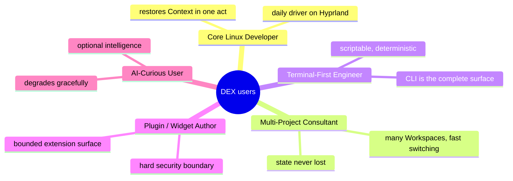

# DEX User Personas

## Purpose

Five personas describe the people DEX is built for. Each persona is a
composite of the needs the Workspace Runtime serves; no persona is
hypothetical. When a requirement, a flow, or an interface choice is in
doubt, the test is: does it serve one of these personas without costing
another?

Personas are product artifacts, not engineering ones. They define what DEX
must do for a user; the Master PRD (`10_Master_PRD.md`) converts that into
numbered, testable requirements.

## 1. Core Linux Developer

**Snapshot.** Ada is a Rust and systems developer who has used Arch Linux
with Hyprland as her daily driver for years. She has a carefully tuned
setup — a hand-rolled terminal multiplexer layout, a specific editor
config, a browser profile per project — and she guards it. Her machine is
her instrument.

**Goals.** Start work the moment she sits down; keep her environment
exactly as she left it; never re-assemble Context by hand; keep the machine
fast and native.

**Pains.** Every morning is a manual reconstruction: opening the right
sessions, restarting the right daemons, remembering which branch she was
on. Rebooting after a kernel update costs her twenty minutes of context.
Moving between her laptop and desktop means rebuilding everything.

**Workflow.** She lives in a terminal and a browser. Her day is one or two
Workspaces, each with a terminal multiplexer session tree, an editor
instance, and a development server that must be running and supervised. She
expects keyboard access to everything and a transparent, composited shell
that shows her wallpaper through the glass.

**What DEX must do for her.** Declare her environment once as a Workspace
Manifest; activate it with one command or keybinding, restoring windows,
sessions, Workspace Services, and Context; capture a Workspace Snapshot so
that a reboot costs nothing; and do all of it within the performance
budgets — cold start under 500 ms, 60 FPS, under 200 MB idle — or she will
uninstall it.

## 2. Multi-Project Consultant

**Snapshot.** Ben works on three to five client engagements a week, each
with its own toolchain, its own credential situation, and its own rhythm. He
moves between them several times a day. His work is measured in switching
cost.

**Goals.** Leave one engagement and arrive in another with zero loss of
state; keep engagements separated so a build daemon from one never pollutes
another; return to any engagement weeks later and find it exactly where he
left it.

**Pains.** Context switching between projects is where his time disappears:
closing down one stack, starting another, remembering where each was.
Stray services left running from an old engagement eat resources and cause
confusing failures.

**Workflow.** He uses separate Workspaces per engagement. A Work Session
begins with Workspace Activation of the engagement's Workspace; it ends with
leaving it — the Runtime supervises each Workspace's Workspace Services and
stops them on leave. Snapshots let him park an engagement mid-flight and
resume it after a gap of weeks.

**What DEX must do for him.** Make Workspace Activation and leave fast,
reliable, and complete; keep Workspace Services scoped to their Workspace;
let him snapshot and restore an engagement's state without depending on his
memory of what was running.

## 3. Terminal-First Engineer

**Snapshot.** Chloe does everything from a terminal. She scripts her setup,
automates her build, and greps her own muscle memory. A GUI feature she
cannot reach from the command line might as well not exist; a GUI feature
that *disagrees* with the CLI is a bug.

**Goals.** A complete, stable, scriptable surface for every Runtime
capability; deterministic, machine-parseable output; the same behavior from
the CLI and from the graphical shell, always.

**Pains.** Products that bolt a CLI onto a GUI produce two surfaces that
drift apart — the shell shows one state and the command line shows another.
Products whose output is designed for human eyes break her scripts.

**Workflow.** She drives the Runtime from a terminal multiplexer: `dex
workspace activate`, `dex snapshot create`, `dex vault query`, composed in
shell scripts and triggered by automation. When she opens the graphical
shell, it is a second client of the same commands, and the two never
disagree.

**What DEX must do for her.** Expose every capability through the CLI with a
stable interface (CLI First); make CLI output deterministic and
machine-parseable; guarantee parity between the CLI and the shell because
both drive the same commands.

## 4. Plugin / Widget Author

**Snapshot.** Dana builds tools for other developers. She has written
plugins for editors, extensions for shells, and widgets for dashboards.
She is security-conscious: she has seen extension ecosystems rot when the
extension boundary was an afterthought.

**Goals.** A documented, stable extension surface; a hard security boundary
so her code runs with exactly the capabilities it declares and can never
touch anything else; a marketplace path for distributing her Plugins and
Widgets.

**Pains.** Extension APIs that change between versions; permission systems
that are either toothless or opaque; widget frameworks that give UI code
raw system access and then have to be patched forever.

**Workflow.** She writes a Plugin in Rust, declares its manifest with the
capabilities it needs, installs it, and tests it against the Runtime's
versioned contract. For a Widget, she works against the sandboxed API where
every effect is mediated by shell-mediated commands — no direct IPC.

**What DEX must do for her.** Provide a schema-validated manifest and a
versioned, documented Plugin/Widget contract; enforce least privilege so
her Plugin gets exactly what it declares; keep the Widget sandbox honest so
Widget code never reaches the privileged webview.

## 5. AI-Curious User

**Snapshot.** Evan wants assistance over his own work: a chat over his
notes, a suggestion drawn from his own history. He is skeptical of cloud
dependencies and privacy leakage, and he will not let a model stand between
him and his machine.

**Goals.** Intelligence that reads his local Context and Knowledge Vault;
zero dependence on AI for the core path; complete, cost-free degradation
when he disables it.

**Pains.** Assistants that know nothing about his actual work. Assistant
features that block or degrade the primary workflow when the network drops
or the model endpoint changes. His notes and history being uploaded anywhere
without his explicit consent.

**Workflow.** He uses the Knowledge Vault to store Context and notes as a
normal part of Work Sessions. Optionally, he connects a Memory Provider to a
local model endpoint and asks questions over the Vault. When he disables the
Provider, the Vault, the Workspace Runtime, and every Workflow continue to
work unchanged.

**What DEX must do for him.** Make the Knowledge Vault fully functional and
useful without any AI; keep every AI capability behind Providers and off the
critical path; make disabling AI cost nothing and lose nothing.

## Persona-Priority Matrix

When product decisions conflict, this matrix settles the priority for a
given capability area.

| Capability area | Primary persona | Secondary |
|---|---|---|
| Workspace Activation / Restoration | Core Linux Developer | Multi-Project Consultant |
| Workspace Snapshots | Multi-Project Consultant | Core Linux Developer |
| CLI surface | Terminal-First Engineer | Core Linux Developer |
| Plugin/Widget boundary | Plugin/Widget Author | Core Linux Developer |
| Knowledge Vault | AI-Curious User | Terminal-First Engineer |
| AI features | AI-Curious User | — |
| Theming / shell feel | Core Linux Developer | — |

## Related Documents

- Master product requirements: [`10_Master_PRD.md`](10_Master_PRD.md)
- User stories: [`13_User_Stories.md`](13_User_Stories.md)
- Feature matrix: [`14_Feature_Matrix.md`](14_Feature_Matrix.md)
- The Workspace Runtime concept: [`15_Workspace_Runtime.md`](15_Workspace_Runtime.md)
- User flows: [`16_User_Flows.md`](16_User_Flows.md)
- UX principles: [`17_UX_Principles.md`](17_UX_Principles.md)
- Roadmap: [`11_Product_Roadmap.md`](11_Product_Roadmap.md)
- Canonical terminology: [`../00-vision/03_Glossary.md`](../00-vision/03_Glossary.md)