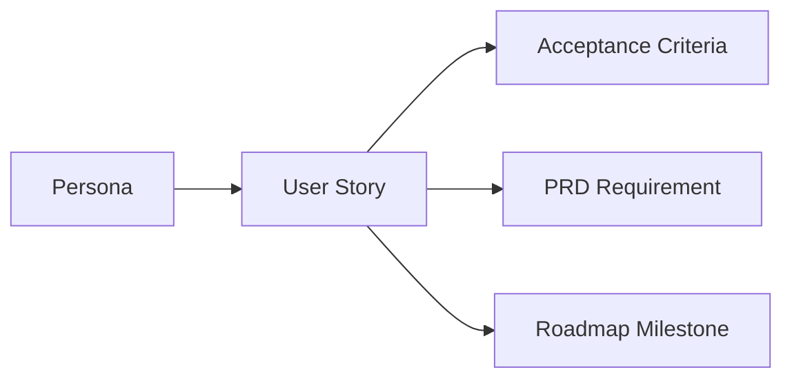

# DEX User Stories

## Purpose

User stories translate the personas into concrete, testable capabilities.
Each story follows the form *As a <persona>, I want <capability>, so that
<value>*, and carries one or two acceptance criteria that define when the
story is done. Stories are grouped by product domain and map to the
requirements in the Master PRD (`10_Master_PRD.md`) and the milestones in
the roadmap (`11_Product_Roadmap.md`).

A story is not a specification. It states the user-facing behavior; the
specification that owns the contract is referenced where one exists.

## Workspace Activation

- **As a** Core Linux Developer, **I want** to activate a Workspace from its
  Workspace Manifest with one command, **so that** my complete Context —
  windows, sessions, Workspace Services, and state — is restored without
  manual assembly.
  - **AC:** Activation launches every declared session and Workspace Service
    and restores window layout.
  - **AC:** Activation completes within the cold-start budget (< 500 ms to
    interactive).
- **As a** Multi-Project Consultant, **I want** to switch from one active
  Workspace to another without losing either, **so that** I can move between
  engagements in seconds.
  - **AC:** Leaving a Workspace stops its Workspace Services; activating the
    next starts its own.
- **As a** Terminal-First Engineer, **I want** to trigger Workspace
  Activation from the CLI, **so that** I can script the start of a work
  session.

## Restoration

- **As a** Core Linux Developer, **I want** to restore a Workspace from a
  Workspace Snapshot after a reboot, **so that** a kernel update or a crash
  costs me nothing.
  - **AC:** Restoration returns the Workspace to exactly where work left off.
- **As a** Multi-Project Consultant, **I want** to restore an engagement's
  Workspace on a different machine, **so that** I can pick up where I left
  off when I change hardware.
  - **AC:** A Workspace declared by its Manifest activates on a second
    machine without manual re-assembly.

## Snapshots

- **As a** Multi-Project Consultant, **I want** to capture a Workspace
  Snapshot on demand, **so that** I can park an engagement mid-flight and
  resume it weeks later.
  - **AC:** A Snapshot captures the Workspace's runtime state and is
    restorable independently.
- **As a** Core Linux Developer, **I want** to schedule automatic Snapshots,
  **so that** I have a recovery point even when I forget to capture one.
  - **AC:** Scheduled Snapshots run without user interaction and do not
    interrupt the active Work Session.

## Workspace Services

- **As a** Core Linux Developer, **I want** the Runtime to supervise my
  development server as a Workspace Service, **so that** it starts with
  Activation and stops when I leave the Workspace.
  - **AC:** The Workspace Service is started on Activation and stopped on
    leave.
- **As a** Multi-Project Consultant, **I want** each engagement's Workspace
  Services scoped to its own Workspace, **so that** a build daemon from one
  engagement never pollutes another.

## Knowledge Vault

- **As a** Terminal-First Engineer, **I want** to store Context and notes in
  the Knowledge Vault from the CLI, **so that** my memory of a Workspace
  survives across sessions and machines.
  - **AC:** Vault entries are persisted locally and queryable.
- **As a** AI-Curious User, **I want** to query the Knowledge Vault over my
  own history, **so that** I can recall what I was doing and why.
  - **AC:** Queries return deterministic, local results.
- **As a** AI-Curious User, **I want** the Vault to work with no network,
  **so that** my memory is never hostage to connectivity.
- **As a** AI-Curious User, **I want** to connect a Memory Provider to a
  local model endpoint, **so that** I can ask questions over the Vault
  without uploading my notes anywhere.

## Plugins

- **As a** Plugin/Widget Author, **I want** to declare a Plugin's
  capabilities in a schema-validated manifest, **so that** the Runtime
  grants exactly what I declare and nothing more.
  - **AC:** A manifest with unknown fields is rejected at install.
- **As a** Plugin/Widget Author, **I want** a versioned Plugin contract,
  **so that** my Plugin keeps working across Runtime updates.
- **As a** Core Linux Developer, **I want** to install a Plugin and have it
  extend the Runtime's command and event surface, **so that** the platform
  grows without weakening its boundary.
  - **AC:** A Plugin runs in native code with exactly its granted
    capabilities, never inside the privileged webview.

## Widgets

- **As a** Plugin/Widget Author, **I want** to build a Widget against a
  sandboxed API, **so that** my UI code has no IPC access of its own.
  - **AC:** A Widget's every effect is mediated by shell-mediated commands.
- **As a** Core Linux Developer, **I want** to add a Widget to my shell,
  **so that** I can surface the information I care about at a glance.
  - **AC:** A Widget renders in an isolated context and never imports the
    privileged API.
- **As a** Core Linux Developer, **I want** to arrange and persist Widget
  positions, **so that** my layout survives restarts.

## CLI

- **As a** Terminal-First Engineer, **I want** every Runtime capability
  reachable from the CLI, **so that** nothing is GUI-only.
  - **AC:** Every capability has a CLI form with a stable interface.
- **As a** Terminal-First Engineer, **I want** deterministic,
  machine-parseable CLI output, **so that** I can compose the Runtime in
  scripts.
- **As a** Terminal-First Engineer, **I want** the CLI and the shell to
  drive the same commands, **so that** the two surfaces never disagree.
  - **AC:** A state change made in the shell is reflected in the CLI and
    vice versa.

## Automation

- **As a** Terminal-First Engineer, **I want** to define a workflow as
  trigger → action → condition → result, **so that** I can automate my
  development routine.
  - **AC:** A workflow executes deterministically and reports its result.
- **As a** Core Linux Developer, **I want** to schedule a workflow at
  startup, **so that** my environment is ready before I sit down.
- **As a** Core Linux Developer, **I want** automation scoped to the
  development workflow, **so that** it orchestrates Workspaces and tooling
  rather than the consumer desktop.

## Theming

- **As a** Core Linux Developer, **I want** to switch themes at runtime,
  **so that** the shell matches my environment without a restart.
  - **AC:** The theme change applies before the next paint and persists.
- **As a** Core Linux Developer, **I want** the shell to stay transparent
  and composited, **so that** my wallpaper and desktop show through the
  glass.
- **As a** Core Linux Developer, **I want** visual consistency driven by
  design tokens, **so that** the shell reads as one system.

## AI Optionality

- **As a** AI-Curious User, **I want** to disable all AI capabilities,
  **so that** the Runtime and the Knowledge Vault keep working unchanged.
  - **AC:** Disabling AI loses no state and degrades no core capability.
- **As a** AI-Curious User, **I want** AI to consume the Knowledge Vault
  through Providers, **so that** intelligence is never on the critical path.
- **As a** Core Linux Developer, **I want** the core path to never require a
  model, an API key, or a network, **so that** DEX is complete without AI.

## Story-to-Requirement Map

| Story group | PRD requirement | Roadmap milestone |
|---|---|---|
| Activation | WR-1, WR-6 | M5.5, M4.4 |
| Restoration | WR-2 | M5.5 |
| Snapshots | WR-3 | M5.5 |
| Workspace Services | WR-4 | M4.1, M5.5 |
| Knowledge Vault | KV-1–KV-4 | M6.2 |
| Plugins | PW-1, PW-2, PW-4 | M8.1–M8.4 |
| Widgets | PW-3, PW-4 | M3.1–M3.4 |
| CLI | CLI-1–CLI-3 | M4.1 |
| Automation | AU-1–AU-3 | M7.1–M7.4 |
| Theming | TH-1–TH-3 | M1.4 |
| AI Optionality | AI-1–AI-3 | M6.1–M6.5 |

## Related Documents

- Master product requirements: [`10_Master_PRD.md`](10_Master_PRD.md)
- Personas: [`12_User_Personas.md`](12_User_Personas.md)
- Feature matrix: [`14_Feature_Matrix.md`](14_Feature_Matrix.md)
- The Workspace Runtime concept: [`15_Workspace_Runtime.md`](15_Workspace_Runtime.md)
- User flows: [`16_User_Flows.md`](16_User_Flows.md)
- Roadmap: [`11_Product_Roadmap.md`](11_Product_Roadmap.md)
- Canonical terminology: [`../00-vision/03_Glossary.md`](../00-vision/03_Glossary.md)