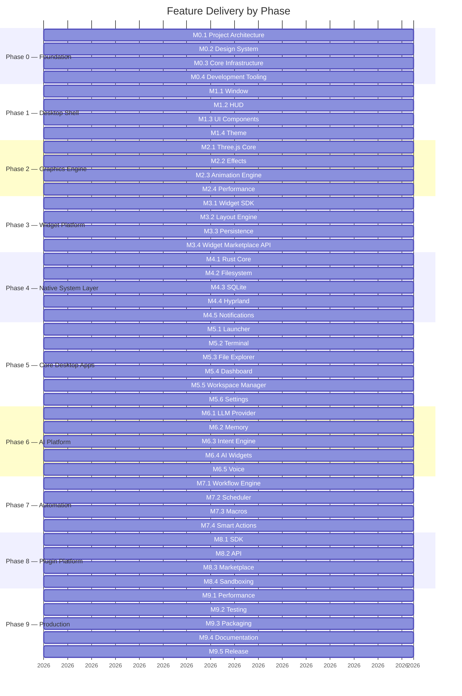

# DEX Feature Matrix

## Purpose

The feature matrix maps every feature named in the roadmap
(`11_Product_Roadmap.md`) to its product domain, phase, and milestone, and
records its status. It is grounded strictly in the roadmap: only features
the roadmap names appear here, and no feature is assigned a phase or
milestone the roadmap does not state.

This matrix answers two questions: *what ships* and *in what order*. The
requirements behind each feature are in the Master PRD
(`10_Master_PRD.md`); the user value behind each feature is in the user
stories (`13_User_Stories.md`).

## Matrix

Status: **Built** = delivered (milestone checked in the roadmap).
**Planned** = scheduled in the roadmap and not yet delivered.

| Feature | Domain | Phase | Milestone | Status |
|---|---|---|---|---|
| Project Architecture (layer model, ADRs, coding standards, engineering docs) | Foundation | 0 | M0.1 | Built |
| Design System (tokens, typography, colors, icons, motion, theme engine) | Theming | 0 | M0.2 | Built |
| Core Infrastructure (typed IPC, command registry, contract clients, event bus, theme store, logger, error envelope) | Core Infrastructure | 0 | M0.3 | Built |
| Development Tooling (nine-step `bun run verify` gate, ESLint, Prettier, Rustfmt, Clippy, vitest runner, CI on push/PR to develop/main) | Engineering | 0 | M0.4 | Built |
| Window (transparent, fullscreen, multi-monitor, DPI-aware) | Desktop Shell | 1 | M1.1 | Built |
| HUD (TopBar, Dock, StatusBar, Viewport) | Desktop Shell | 1 | M1.2 | Built |
| UI Components (GlassPanel, Button, Card, Tooltip, Modal, ContextMenu, Dropdown) | UI Primitives | 1 | M1.3 | Built |
| Theme (dark, cyber, dynamic; live switching) | Theming | 1 | M1.4 | Built |
| Three.js Core (renderer, scene, camera, lights) | Graphics | 2 | M2.1 | Planned |
| Effects (bloom, fog, background, grid, particles) | Graphics | 2 | M2.2 | Planned |
| Animation Engine (timeline, motion manager, transition manager) | Graphics | 2 | M2.3 | Planned |
| Graphics Performance (object pooling, texture cache, FPS monitor) | Graphics | 2 | M2.4 | Planned |
| Widget SDK (registry, metadata, lifecycle) | Widgets | 3 | M3.1 | Planned |
| Layout Engine (drag, resize, snap, dock, float) | Widgets | 3 | M3.2 | Planned |
| Widget Persistence (SQLite-backed positions/sizes/settings) | Widgets | 3 | M3.3 | Planned |
| Widget Marketplace API (discovery, install, update) | Widgets | 3 | M3.4 | Planned |
| Rust Core (commands, IPC, services — first real domains) | Native System Layer | 4 | M4.1 | Planned |
| Filesystem (browse, watch, search) | Native System Layer | 4 | M4.2 | Planned |
| SQLite (access layer, repository pattern, migrations) | Native System Layer | 4 | M4.3 | Planned |
| Hyprland (socket, windows, workspaces, focus, rules) | Native System Layer | 4 | M4.4 | Planned |
| Notifications | Native System Layer | 4 | M4.5 | Planned |
| Launcher (search, execute, recent) | Core Desktop Apps | 5 | M5.1 | Planned |
| Terminal (PTY, tabs, sessions) | Core Desktop Apps | 5 | M5.2 | Planned |
| File Explorer (tree, preview, favorites) | Core Desktop Apps | 5 | M5.3 | Planned |
| Dashboard (CPU, RAM, GPU, network, storage) | Core Desktop Apps | 5 | M5.4 | Planned |
| Workspace Manager (overview, window switcher, layouts) | Workspace Runtime | 5 | M5.5 | Planned |
| Settings (theme, plugins, AI, system) | Core Desktop Apps | 5 | M5.6 | Planned |
| LLM Provider (Ollama, OpenAI, Anthropic) | AI | 6 | M6.1 | Planned |
| Memory (conversations, desktop state, Context) | Knowledge Vault | 6 | M6.2 | Planned |
| Intent Engine (utterance → intent → command → action) | AI | 6 | M6.3 | Planned |
| AI Widgets (chat, search, assistant) | AI | 6 | M6.4 | Planned |
| Voice (STT, TTS, wake word) | AI | 6 | M6.5 | Planned |
| Workflow Engine (trigger → action → condition → result) | Automation | 7 | M7.1 | Planned |
| Scheduler (cron, events, startup) | Automation | 7 | M7.2 | Planned |
| Macros (keyboard, mouse, shell) | Automation | 7 | M7.3 | Planned |
| Smart Actions (AI-generated workflows) | Automation | 7 | M7.4 | Planned |
| Plugin SDK (commands, widgets, services) | Plugins | 8 | M8.1 | Planned |
| Plugin API (permissions, versioning, lifecycle) | Plugins | 8 | M8.2 | Planned |
| Plugin Marketplace (browse, install, update, remove) | Plugins | 8 | M8.3 | Planned |
| Plugin Sandboxing (permission system) | Plugins | 8 | M8.4 | Planned |
| Performance (profiling, benchmarks, memory) | Engineering | 9 | M9.1 | Planned |
| Testing (unit, integration, UI, Rust) | Engineering | 9 | M9.2 | Planned |
| Packaging (Arch, AppImage, Flatpak) | Engineering | 9 | M9.3 | Planned |
| Documentation (user, developer, API, SDK) | Engineering | 9 | M9.4 | Planned |
| Release (v1.0) | Engineering | 9 | M9.5 | Planned |

## Domain Count

| Domain | Features |
|---|---|
| Engineering | 6 |
| Desktop Shell | 3 |
| Theming | 2 |
| Graphics | 4 |
| Widgets | 4 |
| Native System Layer | 5 |
| Core Desktop Apps | 5 |
| Workspace Runtime | 1 (M5.5) + Workspace semantics across M4.x |
| Knowledge Vault | 1 (M6.2) |
| AI | 4 |
| Automation | 4 |
| Plugins | 4 |
| Foundation / Core Infrastructure | 3 |

## Reading the Matrix

- The Workspace Runtime is not a single row; it is the product's core domain
  and its semantics are delivered across milestones — Hyprland integration
  (M4.4), the Rust command surface (M4.1), and the Workspace Manager
  (M5.5). See [`15_Workspace_Runtime.md`](15_Workspace_Runtime.md).
- Status reflects the roadmap only. All Phase 0 milestones (M0.1–M0.4) and
  all Phase 1 milestones (M1.1–M1.4) are delivered; Phase 2 (Graphics Engine)
  is next.
- The phase gate applies to every milestone: each ends with a working
  vertical slice and green checks.

## Related Documents

- Roadmap and milestones: [`11_Product_Roadmap.md`](11_Product_Roadmap.md)
- Master product requirements: [`10_Master_PRD.md`](10_Master_PRD.md)
- User stories: [`13_User_Stories.md`](13_User_Stories.md)
- The Workspace Runtime concept: [`15_Workspace_Runtime.md`](15_Workspace_Runtime.md)
- System architecture: [`../20-architecture/20_System_Architecture.md`](../20-architecture/20_System_Architecture.md)
- Canonical terminology: [`../00-vision/03_Glossary.md`](../00-vision/03_Glossary.md)