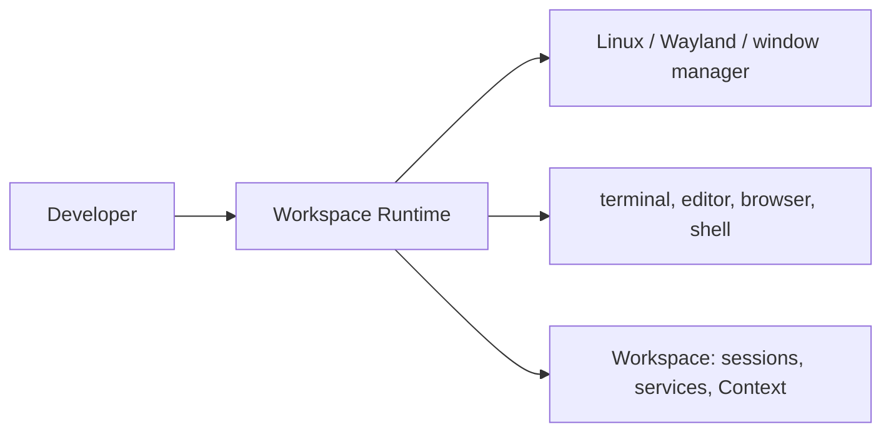
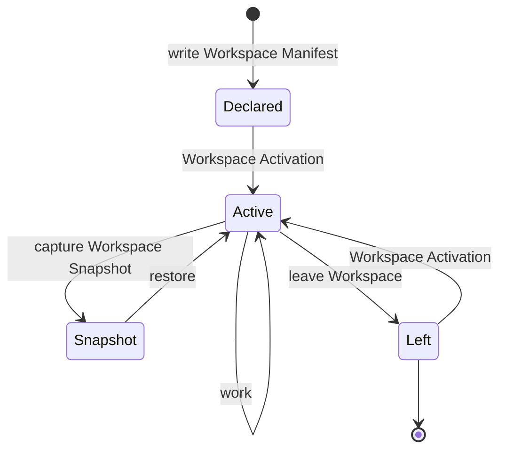
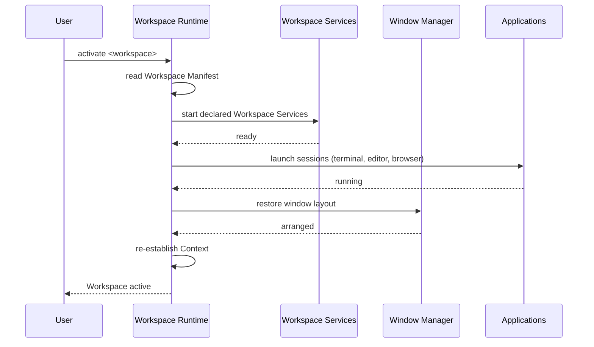
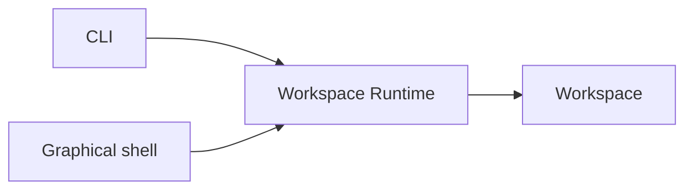

# The Workspace Runtime

## Purpose

This document is the product definition of DEX's core concept: the Workspace
Runtime. It states what the Workspace Runtime does for the user, the
user-facing lifecycle of a Workspace, and how the Runtime relates to the
host operating system and to the tools a developer already uses. It is a
product document: it describes behavior and workflow, not implementation.

The formal contracts for the Workspace and its Manifest live in the
specifications; this document references them rather than re-explaining
them. Canonical terminology is defined in the Glossary
([`../00-vision/03_Glossary.md`](../00-vision/03_Glossary.md)).

## What the Workspace Runtime does for the user

The Workspace Runtime is the operating layer between the developer and the
Linux system. It treats the Workspace — the complete, live state of a
development effort — as a first-class object that can be declared,
activated, restored, and orchestrated.

For the user, this means three things:

1. **One act of Workspace Activation restores Context.** Windows, sessions,
   Workspace Services, and state come back together, so starting work is not
   a manual assembly job.
2. **A Workspace is durable and recoverable.** A Workspace Snapshot or a
   Workspace Manifest restores the Workspace after a reboot, on another
   machine, or after a failed experiment — as recoverable as a file.
3. **A Workspace is scriptable.** The same declaration activates the
   Workspace anywhere, and every operation is reachable from the command
   line.

The Runtime sits between the developer and the system, but it does not own
the system. It integrates and orchestrates; it does not replace.

## The user-facing Workspace lifecycle

A Workspace moves through a lifecycle the user drives. Each stage is a
deliberate act with a clear outcome.

- **Declare.** The user writes a Workspace Manifest: what the Workspace
  contains, what runs when it is activated, and what state it captures. The
  Manifest is the contract between the Workspace and the Runtime — the same
  declaration activates the Workspace on any machine. *Contract:
  [`../30-specs/Manifest.md`](../30-specs/Manifest.md).*
- **Activate.** The user activates the Workspace. The Runtime brings it to
  life: launching its sessions and Workspace Services, restoring its windows
  and state, and re-establishing Context. Activation is the central act of
  DEX — the transition from "declared" to "live". *Contract:
  [`../30-specs/Workspace.md`](../30-specs/Workspace.md).*
- **Work.** The user works. The Runtime supervises the Workspace's Workspace
  Services and tracks Context — which Workspace is active, what is open,
  what was in progress.
- **Snapshot.** On demand or on schedule, the user captures a Workspace
  Snapshot: a point-in-time capture of the Workspace's runtime state. A
  Snapshot makes it possible to restore the Workspace to exactly where work
  left off. *Contract: [`../30-specs/Snapshot.md`](../30-specs/Snapshot.md).*
- **Leave.** The user leaves the Workspace. The Runtime stops its Workspace
  Services and parks its state, so the Workspace is cleanly suspended rather
  than an accident of what happened to be running.
- **Restore.** From a Snapshot or from the Manifest, the user restores the
  Workspace — after a reboot, on another machine, or after a failed
  experiment.

## Activation, in sequence

Activation is the central act, so it is worth showing in sequence: the user
issues one command, and the Runtime composes the Workspace from its declared
parts.

The user issues one command; the Runtime composes the Workspace from its
declared parts and reports the Workspace active.

## Relationship to the host OS

The Workspace Runtime is a layer over the host operating system, not a
replacement for it. The host owns windows and compositing; the Runtime
orchestrates through them. The Runtime does not define its own window
manager or compositor, and it does not manage a desktop of icons, panels,
and menus. It composes with the window manager of the host system — on
Hyprland/Wayland — and leaves the desktop, wallpaper, and compositor output
visible through the transparent shell.

## Relationship to existing tools: Integrate, Don't Replace

The Runtime composes with the terminal, the editor, the browser, and the
shell. It drives them — launches them, restores their state, feeds them
Context — and re-implements only what no existing tool provides. A feature
that duplicates an existing tool is a candidate for removal, not a roadmap
item.

The tools a developer already uses are the tools they are fastest with.
Replacing them would make DEX a competitor to its own ecosystem instead of
the layer that orchestrates it.

## CLI and shell: two clients of the same Runtime

The Workspace Runtime has one surface, and two clients present it.

- **The CLI is the complete surface.** Every Runtime capability is reachable
  and scriptable from the command line. A capability that cannot be
  automated is a capability that does not exist. *Contract:
  [`../30-specs/CLI.md`](../30-specs/CLI.md).*
- **The graphical shell is a second client of the same surface.** It drives
  the same commands, so what works in one works in the other, and nothing is
  GUI-only.

The two clients never disagree, because they are not two implementations —
they are two presentations of one Runtime.

## Related Documents

- Canonical terminology: [`../00-vision/03_Glossary.md`](../00-vision/03_Glossary.md)
- Identity: [`../00-vision/00_Manifesto.md`](../00-vision/00_Manifesto.md)
- Master product requirements: [`10_Master_PRD.md`](10_Master_PRD.md)
- User flows: [`16_User_Flows.md`](16_User_Flows.md)
- User stories: [`13_User_Stories.md`](13_User_Stories.md)
- Feature matrix: [`14_Feature_Matrix.md`](14_Feature_Matrix.md)
- Roadmap: [`11_Product_Roadmap.md`](11_Product_Roadmap.md)
- System architecture: [`../20-architecture/20_System_Architecture.md`](../20-architecture/20_System_Architecture.md)
- Workspace contract: [`../30-specs/Workspace.md`](../30-specs/Workspace.md)
- Manifest contract: [`../30-specs/Manifest.md`](../30-specs/Manifest.md)
- Snapshot contract: [`../30-specs/Snapshot.md`](../30-specs/Snapshot.md)
- CLI contract: [`../30-specs/CLI.md`](../30-specs/CLI.md)