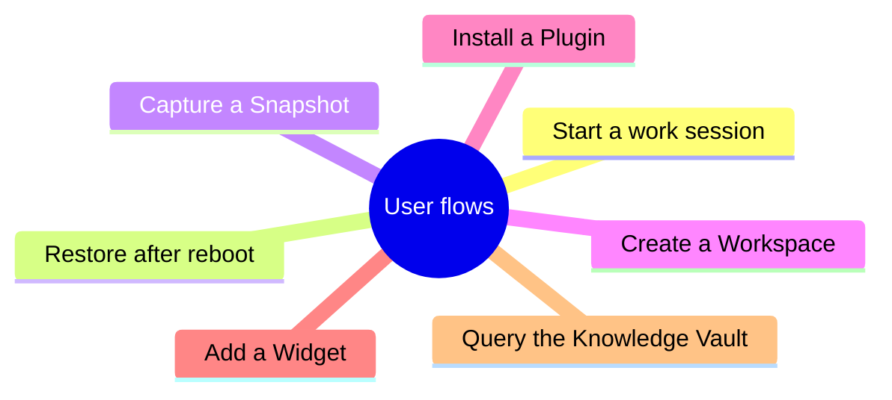
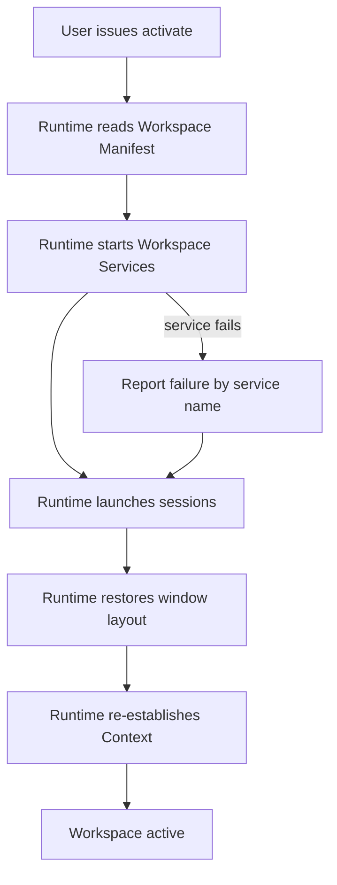
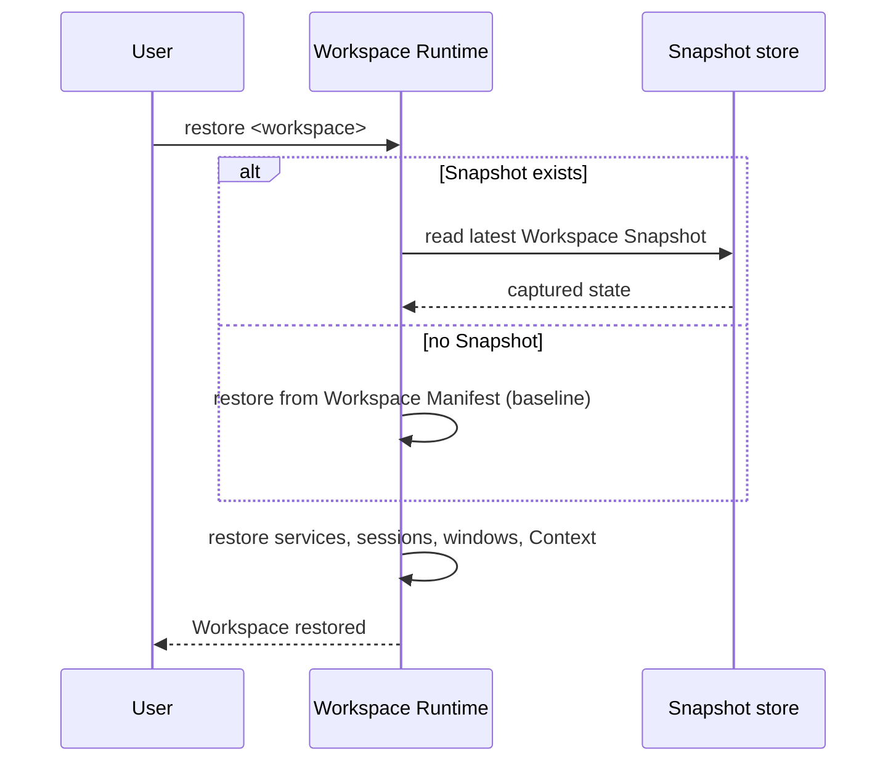
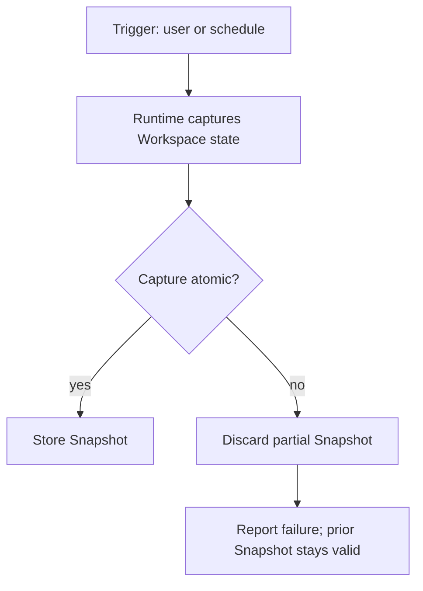
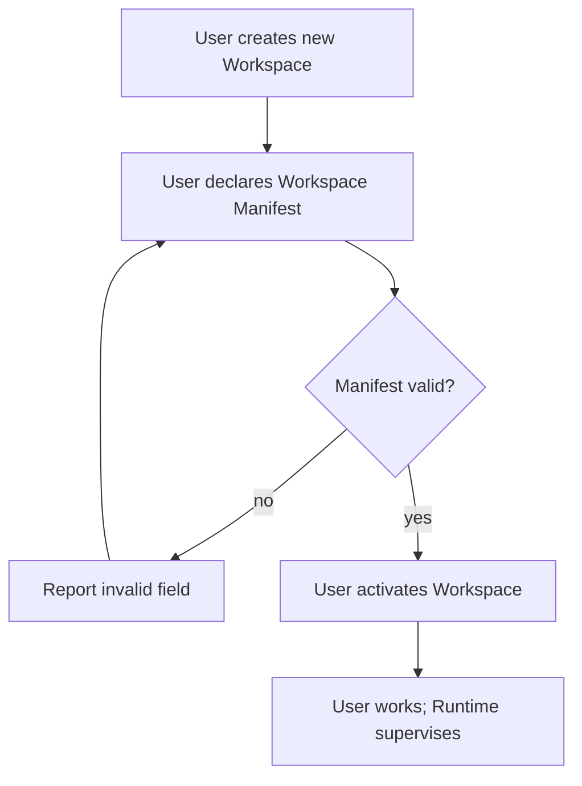
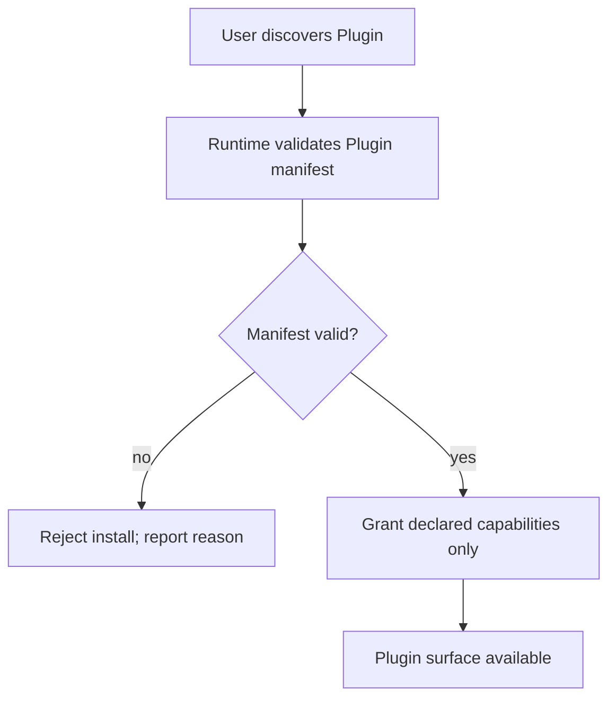
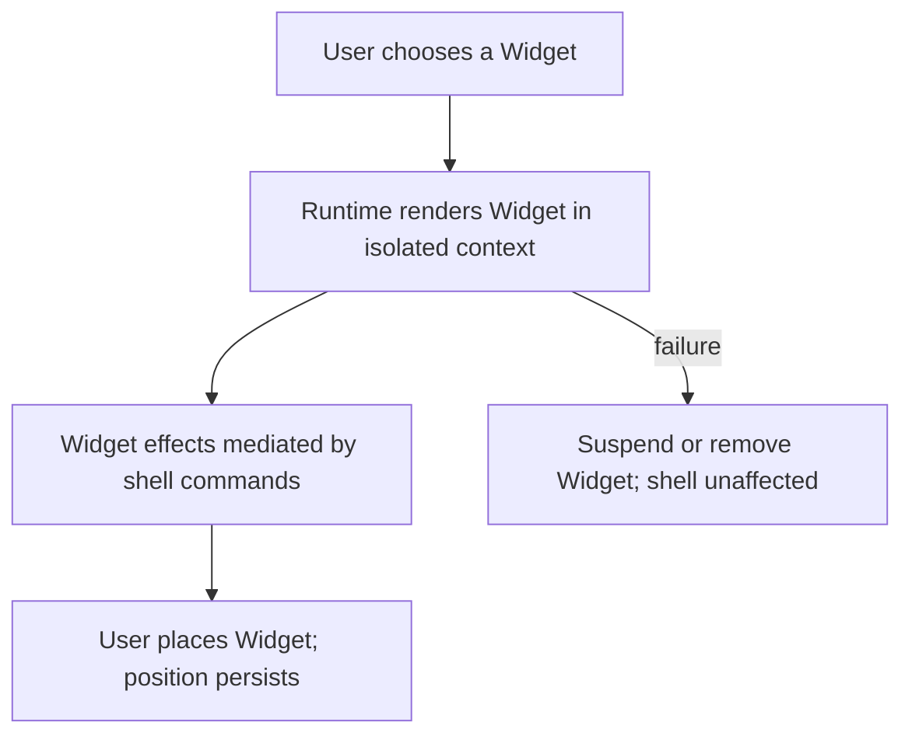
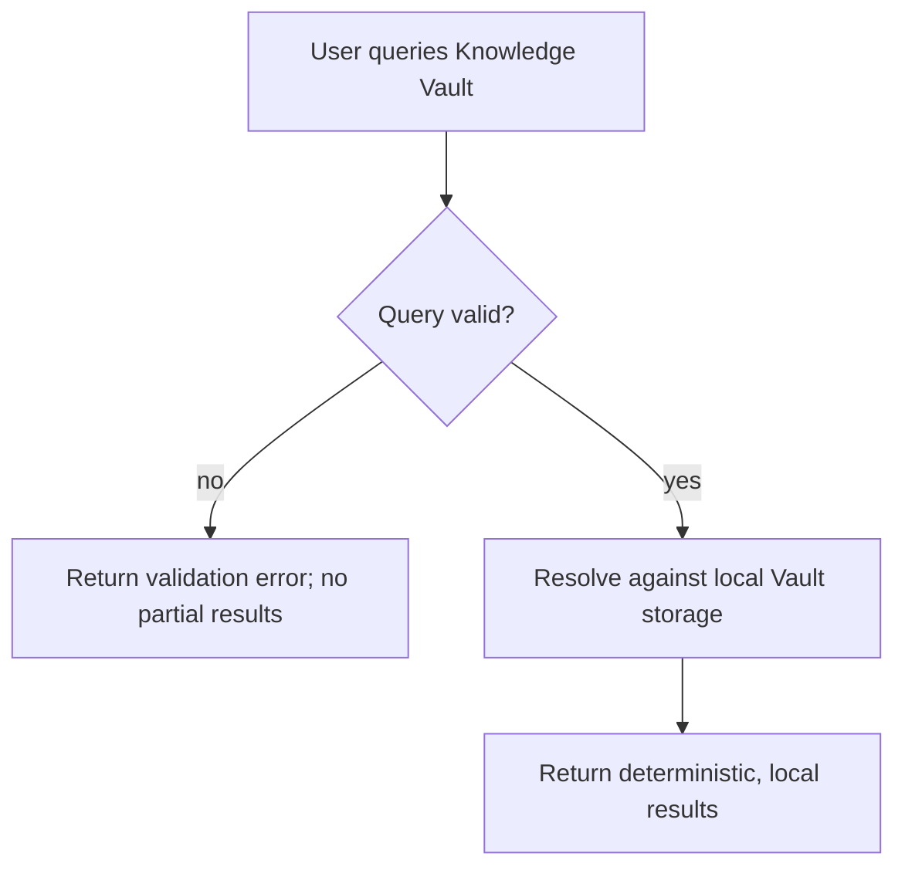

# DEX User Flows

## Purpose

Seven user flows describe how a user accomplishes the core tasks of DEX
through the Workspace Runtime. Each flow states its trigger, its steps, its
outcome, and how failures are handled. Flows are written from the user's
perspective; the contracts that make each step possible live in the
specifications and the lifecycle that underlies them in
[`15_Workspace_Runtime.md`](15_Workspace_Runtime.md).

## 1. Start a work session

**Trigger.** The user sits down to work on an existing Workspace.

**Steps.**

1. The user invokes Workspace Activation, from the CLI (`dex workspace
   activate <name>`) or from the shell.
2. The Runtime reads the Workspace Manifest.
3. The Runtime starts the declared Workspace Services.
4. The Runtime launches the Workspace's sessions (terminal, editor, browser).
5. The Runtime restores the window layout through the window manager.
6. The Runtime re-establishes Context.

**Outcome.** The user is in a complete, live Workspace with Context intact.

**Failure handling.** If any declared Workspace Service fails to start, the
Runtime reports the failure by service name and continues activating the
rest; the user can retry the failed service without restarting the
Workspace.

## 2. Restore after reboot

**Trigger.** The machine rebooted — kernel update, crash, or a fresh boot.

**Steps.**

1. The user starts a session and invokes restore (`dex workspace restore
   <name>`), or the Runtime restores the Workspace at startup if it was
   active when the machine shut down.
2. The Runtime reads the most recent Workspace Snapshot, or the Workspace
   Manifest if no Snapshot exists.
3. The Runtime restores the Workspace to the captured state: services,
   sessions, windows, Context.
4. The user confirms the Workspace is exactly where they left it.

**Outcome.** A reboot costs no Context; the Workspace is back exactly where
work left off.

**Failure handling.** If no Snapshot exists, the Runtime restores from the
Manifest and reports the difference; the user can continue from the declared
baseline.

## 3. Capture a Snapshot

**Trigger.** The user wants a recovery point, or a scheduled capture fires.

**Steps.**

1. The user invokes `dex snapshot create <workspace>` (or the schedule
   fires).
2. The Runtime captures the Workspace's runtime state — processes, sessions,
   windows, Context — without interrupting the Work Session.
3. The Runtime stores the Snapshot in local storage.

**Outcome.** A restorable point-in-time capture of the Workspace exists.

**Failure handling.** If a capture cannot complete atomically, the Runtime
discards the partial Snapshot and reports the failure; the previous
Snapshot remains valid.

## 4. Create a Workspace from scratch

**Trigger.** The user is starting a new development effort.

**Steps.**

1. The user creates a Workspace from the CLI or shell (`dex workspace new
   <name>`).
2. The user declares the Workspace Manifest: sessions to open, Workspace
   Services to run, files to restore.
3. The user activates the Workspace to verify the declaration.
4. The user works; the Runtime supervises the Workspace.

**Outcome.** A new, declared Workspace that can be activated, restored, and
portable to another machine.

**Failure handling.** If the Manifest fails validation, the Runtime reports
the invalid field; the Workspace is not created until the declaration is
valid.

## 5. Install a Plugin

**Trigger.** The user wants a capability the core does not provide.

**Steps.**

1. The user discovers a Plugin in the marketplace (`dex plugin install
   <name>`).
2. The Runtime downloads and schema-validates the Plugin manifest.
3. The Runtime grants exactly the capabilities the Plugin declares.
4. The Plugin's command and event surface becomes available.

**Outcome.** The Runtime is extended with exactly the declared
capabilities, and the extension boundary holds.

**Failure handling.** If the manifest fails validation or requests
undeclared capabilities, the Runtime rejects the install and reports why;
the Plugin is not installed.

## 6. Add a Widget

**Trigger.** The user wants information at a glance in the shell.

**Steps.**

1. The user chooses a Widget from the available set.
2. The Runtime renders the Widget in an isolated context.
3. The Widget's effects are mediated by shell-mediated commands; it has no
   IPC access of its own.
4. The user places the Widget; its position persists.

**Outcome.** A sandboxed Widget surfaces the information the user cares
about, with no weakening of the security boundary.

**Failure handling.** If the Widget fails to render or misbehaves, the
Runtime isolates the failure — the Widget is suspended or removed, and the
shell and other Widgets are unaffected.

## 7. Query the Knowledge Vault

**Trigger.** The user wants to recall Context, notes, or history from the
Knowledge Vault.

**Steps.**

1. The user queries the Vault from the CLI (`dex vault query <term>`) or
   the shell.
2. The Runtime resolves the query against local Vault storage.
3. The Runtime returns deterministic, local results.

**Outcome.** The user retrieves durable memory of their own work, offline,
with no dependency on connectivity.

**Failure handling.** If the query is malformed, the Runtime returns a
validation error with no partial results; the Vault remains consistent.

## Flow-Requirement Map

| Flow | PRD requirements | Lifecycle stage |
|---|---|---|
| Start a work session | WR-1, WR-6 | Declare → Activate |
| Restore after reboot | WR-2, WR-3 | Restore |
| Capture a Snapshot | WR-3 | Snapshot |
| Create a Workspace from scratch | WR-5 | Declare |
| Install a Plugin | PW-1, PW-2, PW-4 | Extension |
| Add a Widget | PW-3, PW-4 | Extension |
| Query the Knowledge Vault | KV-1–KV-4 | Memory |

## Related Documents

- The Workspace Runtime concept: [`15_Workspace_Runtime.md`](15_Workspace_Runtime.md)
- Master product requirements: [`10_Master_PRD.md`](10_Master_PRD.md)
- User stories: [`13_User_Stories.md`](13_User_Stories.md)
- Personas: [`12_User_Personas.md`](12_User_Personas.md)
- UX principles: [`17_UX_Principles.md`](17_UX_Principles.md)
- Formal contracts: [`../30-specs/`](../30-specs/)