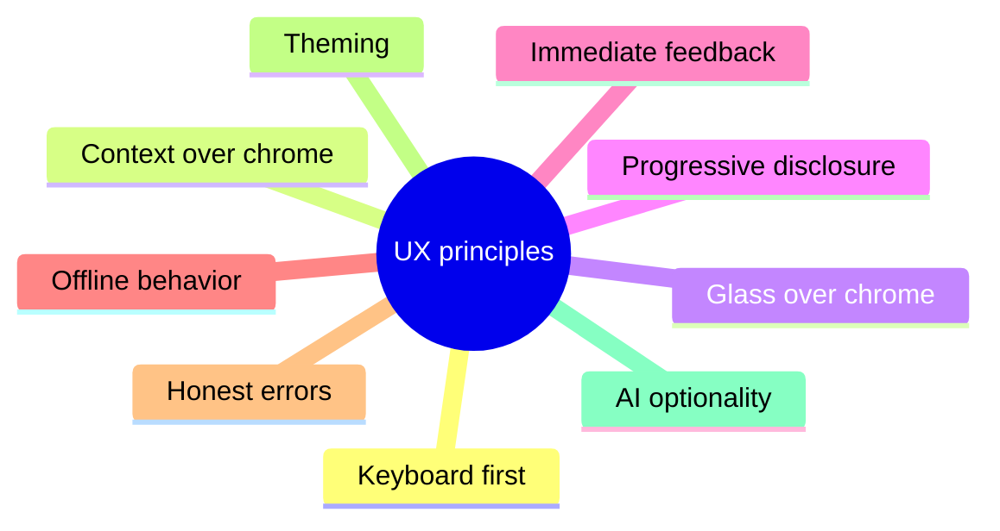
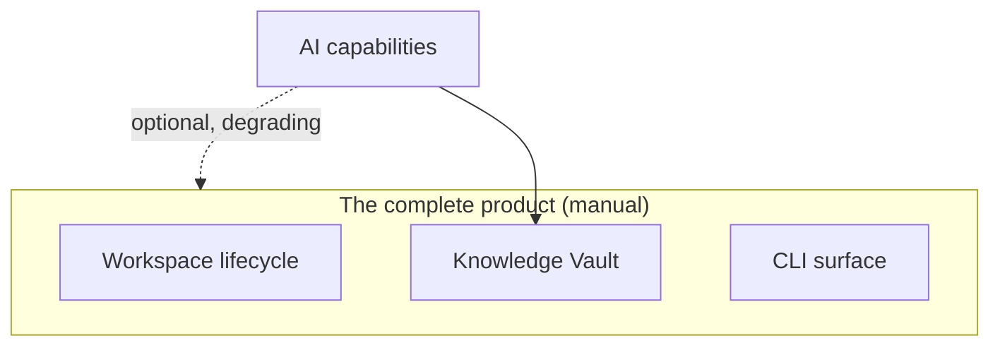

# DEX UX Principles

## Purpose

Product-level UX principles for the Workspace Runtime's graphical shell.
These principles state how the product should feel and behave; the
engineering rules that make them real — tokens, primitives, motion, and
accessibility — live in the Design System
([`../40-engineering/DesignSystem.md`](../40-engineering/DesignSystem.md))
and the Accessibility standard
([`../40-engineering/Accessibility.md`](../40-engineering/Accessibility.md)).
This document is about *why* the interface behaves as it does.

## Keyboard First

The shell is a developer interface on a keyboard-driven system. Every
capability reachable with a pointer is reachable from the keyboard, and the
default interaction path is the keyboard. Focus is always visible, key
bindings are discoverable, and no capability is pointer-only.

- Why: the terminal is the user's home surface; the shell must not force a
  mode switch.
- Implementation: focus rings from the token system, keyboard-reachable
  tooltips, icon-only controls labeled — see the Design System.

## Context over Chrome

The shell leads with Context — which Workspace is active, what is open, what
was in progress — and treats applications as tools within it. The interface
never re-creates the desktop environment: no icon sprawl, no launcher-first
layout, no chrome that exists for its own sake.

- Why: the user's mental model is "what am I working on", not "which program
  is in front of me".
- Consequence: the active Workspace and its Context are the top-level model
  of the shell; application windows are artifacts of Context, not its
  organizing principle.

## Glass over Chrome

The shell window is transparent and composited; the desktop shows through
the glass. Panels are translucent surfaces with backdrop blur, not opaque
boxes. This is a design decision with a functional rationale: it keeps the
shell visually subordinate to the user's actual desktop and wallpaper, and
it forces the shell to communicate through content rather than paint.

- Why: an opaque window background would turn the Runtime into yet another
  fullscreen application; transparency keeps it a layer *over* the system.
- Constraint: the window never paints an opaque background; visual backdrop
  comes from glass surfaces (ADR-0004).

## Progressive Disclosure

Capabilities are revealed in layers. The visible surface shows what the user
needs for the current task; deeper capability is one deliberate step away —
through a keybinding, a command, or an expandable panel. Nothing is hidden
in a way that conceals its existence; nothing is dumped on the user at once.

- Why: the shell must be calm at rest and deep on demand. A keyboard
  palette, a CLI, and contextual panels provide the depth without the noise.

## Immediate Feedback

Every action produces a visible response within the motion contract:
press ≤ `--duration-micro` (80ms), hover/focus ≤ `--duration-fast` (120ms),
reveals ≤ `--duration-normal` (220ms), theme/expand ≤
`--duration-slow`/`--duration-slower` (360/600ms) — transform/opacity only, on
the compositor (ADR-0003, ADR-0009). Activation reports progress; a service
failure names the service; a command that succeeds is acknowledged. The
interface never leaves the user wondering whether an action registered.

- Why: feedback is how the user builds trust that the Runtime is doing what
  it was asked. Delayed or absent feedback reads as a hang.

## Offline Behavior

The shell behaves identically with no network. Nothing in the interface
depends on connectivity; nothing dims, stalls, or degrades because the
network is absent. If a capability needs a network — synchronizing, an AI
request — it is offered as a separate, explicit action, never a background
requirement.

- Why: Offline First is not a mode of DEX; it is DEX. The interface must not
  punish a user whose machine is offline.

## Honest Errors

Errors are reported in the user's language, name the failing object, and
offer a next step. A failed Workspace Service is named; a rejected Plugin
manifest states the invalid field; a malformed query returns a validation
error with no partial results. The interface never shows a bare failure and
never hides a failure behind a success.

- Why: the developer's trust in the Runtime depends on the boundary being
  honest. Typed errors travel the whole stack (ADR-0002); the interface
  presents them truthfully.

## Theming

Themes are semantic-layer overrides: dark by default, light and cyber as
alternatives, switchable at runtime without a restart. The shell reads as
one system because every component consumes the same tokens; a theme change
is a change of atmosphere, never a change of layout or behavior.

- Why: a daily-driver layer must match the user's environment and mood
  without sacrificing consistency. Tokens make theming cheap and safe
  (ADR-0003).

## AI Optionality in UX

AI appears in the interface as an optional, clearly bounded capability — a
Provider connected behind the Knowledge Vault, an assistant surface, an
intent-driven action. When AI is disabled or the network is absent, every
AI affordance disappears without leaving gaps, empty states, or disabled
controls that explain what "would" be there.

- Why: the interface must never make the user feel the product is missing
  something when AI is off. The complete product is the manual product; AI
  is an add-on that is absent by default in every sense that matters.

## How the principles interact

Keyboard First and Context over Chrome define the shell's shape; Progressive
Disclosure and Immediate Feedback define its rhythm; Offline Behavior,
Honest Errors, Theming, and AI Optionality define its robustness. Glass over
Chrome is the aesthetic that holds all of them together: a calm, transparent
layer over the user's system, subordinate to the Context it carries.

## Related Documents

- Master product requirements: [`10_Master_PRD.md`](10_Master_PRD.md)
- Personas: [`12_User_Personas.md`](12_User_Personas.md)
- User flows: [`16_User_Flows.md`](16_User_Flows.md)
- The Workspace Runtime concept: [`15_Workspace_Runtime.md`](15_Workspace_Runtime.md)
- Design system (implementation): [`../40-engineering/DesignSystem.md`](../40-engineering/DesignSystem.md)
- Accessibility standard: [`../40-engineering/Accessibility.md`](../40-engineering/Accessibility.md)
- Identity and values: [`../00-vision/00_Manifesto.md`](../00-vision/00_Manifesto.md)
- Canonical terminology: [`../00-vision/03_Glossary.md`](../00-vision/03_Glossary.md)