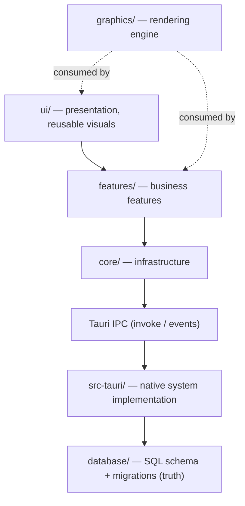

# DEX System Architecture

## Purpose

DEX (Desktop Experience) is an **operating layer** between the user and the
OS — built on Hyprland/Wayland for Arch Linux, packaged as a Tauri v2
application. It is not a desktop application; it is the shell through which
the user drives the machine.

This document is the canonical architecture reference. It explains the layer
model, the boundaries between subsystems, and the rules that keep the system
composable and safe. Decisions recorded here are binding; structural or
cross-cutting changes go through `50-adr/`.

Stack: Svelte 5 (runes) · TypeScript (strict) · Three.js (Phase 2) ·
CSS variables · Bun · Tauri v2 · Rust · Tokio · Serde · SQLite (rusqlite).

## Background

DEX is a Workspace Runtime: the operating layer that activates, restores and
orchestrates complete development workspaces. Because it mediates between the
user and the OS, its architecture is a set of hard boundaries — between
presentation and business logic, between the webview and native code, and
between the shell and third-party extensions. Those boundaries are fixed in
Phase 0 because they are cheap to set now and expensive to retrofit later.

## Goals

| Goal | Contract |
|---|---|
| Modularity | Feature-first; every feature is self-contained under `features/<feature>/` |
| Boundaries | UI never touches SQLite, shell, or filesystem — Rust owns system access |
| Typed seams | Every IPC call is schema-validated at both edges (ADR-0002) |
| Performance | Cold start < 500 ms, 60 FPS floor, GPU-composited motion (ADR-0003/0004) |
| Scale | Structure must hold comfortably past 100,000 LOC |
| Desktop-native | Shell UX, not web-app UX; transparency, glass, keyboard-first |

## Non-Goals

- DEX is not a window manager, desktop environment, IDE, launcher, or AI
  application. It does not replace Hyprland or the applications it hosts.
- Business features are out of scope until Phase 1; Phase 0 ships the layer
  model and infrastructure only.

## Layer Model



**Dependency rule (one-way, acyclic):** `ui → features → core → IPC → src-tauri`.
`graphics` is consumed by `ui`/`features`; it never imports business logic.
`core` never imports `features` or `ui`. `features` may import `core` and `ui`.

## Folder Ownership

```
src/
  lib/
    core/          infrastructure only
      api/         generic typed IPC plumbing (invoke, listen, errors, registry)
      services/    IPC contract clients — one module per Rust command domain
      stores/      cross-cutting rune state (theme, …)
      composables/ reactive helper logic (formerly hooks/, composables/, animations/)
      utils/       pure helpers (storage, logger, format, …)
      config/      constants and app config
      types/       shared domain models
    ui/            reusable visuals only
      layout/      the HUD shell (HUD, AppShell, TopBar, Sidebar, Dock, StatusBar, Viewport)
      primitives/  GlassPanel, Button, Tooltip, Divider, …
      styles/      tokens.css + design system docs
      themes/      ThemePalette TS mirrors (light/dark/cyber)
    features/      business features; each owns components/, services/, stores/,
                   types/, utils/ (business logic only — never raw IPC)
    graphics/      rendering engine contracts + future Three.js implementation

src-tauri/
    commands/      #[tauri::command] handlers — thin, delegate to services/
    services/      domain logic (Rust)
    system/        OS access (Hyprland, Wayland, hardware)
    database/      SQLite access layer (rusqlite)
    models/        serde wire models (IPC truth on the Rust side)
    events/        event emission
    ipc/           protocol/contract helpers
    config/        app configuration
    state/         managed Tauri state
    utils/         errors (AppError), paths, logger

database/          SQL schema + migrations (empty migrations are filled per feature)
docs/              architecture + ADRs
tests/             unit/ integration/ e2e per side
scripts/           dev automation (build, clean, migrate, seed, release)
```

Details and rationale: ADR-0001.

## Communication Boundaries

- **Frontend → Rust**: features call `core/services/<domain>` contract
  clients. Clients call `core/api` plumbing (`invoke`), which validates args
  and results with zod schemas, then `@tauri-apps/api/core.invoke`.
  `@tauri-apps/api` is imported nowhere outside `core/api/`.
- **Rust → Frontend**: `core/api/events.ts` `onEvent` wrapper over Tauri
  `listen`, with schema validation and log-and-drop on invalid payloads.
- **SQLite**: only Rust touches it. Schema truth: `database/migrations/*.sql`.
  Rust models (`src-tauri/src/models/`) are the IPC representation; zod schemas
  (`core/services/`) mirror them at the frontend edge.
- **The wire contract** for any command lives in exactly two places:
  `core/api/commands.ts` (registry entry) and `src-tauri/src/lib.rs`
  (`invoke_handler`). A command that is not in both is not callable.

### Adding a command (the checklist)

1. Rust: `src-tauri/src/commands/<domain>.rs` — `#[tauri::command]`,
   `Result<T, AppError>`, typed serde args.
2. Rust: declare the module and register the fn by **appending to the single
   `generate_handler![...]`** in `src-tauri/src/lib.rs` — exactly one
   `invoke_handler` call may exist (a second call silently shadows the
   first, ADR-0002).
3. TS: add `defineCommand(...)` contract + schemas in
   `core/api/commands.ts`.
4. TS: expose a typed function in `core/services/<domain>.ts`.
5. Capability grant if a plugin is involved
   (`src-tauri/capabilities/default.json`).

- **Logging**: the frontend logs only through `core/utils/logger.ts` (facade
  over `@tauri-apps/plugin-log`; the Rust plugin writes stdout + app log
  dir). No `console.*` in new code.
- **Plugins / CSP**: native extensions are Rust-hosted and capability-gated,
  manifests are schema-validated, and the shell ships a strict CSP
  (`tauri.conf.json`) — ADR-0005.

## State Model

- Svelte 5 rune stores (`.svelte.ts`) are the state mechanism. Cross-cutting
  state lives in `core/stores/`; feature state in `features/<f>/stores/`.
- Rune stores are module singletons by convention (the Svelte 5 idiom);
  services and logic that need injection accept dependencies explicitly.
- No legacy `svelte/store` (writable/readable). No globals beyond rune state.

## Rendering & Graphics

- DOM/UI is composited by the browser; the shell window is transparent, so the
  Wayland desktop shows through (ADR-0004).
- `graphics/` will host the Three.js renderer (Phase 2): a WebGL canvas with
  `alpha: true` composited under the DOM chrome. Contracts live in
  `graphics/contracts.ts`; implementations arrive with the first feature that
  needs GPU visuals. The renderer owns its frame loop, resources, and
  lifecycle; it never reaches into features.
- Animation contract: `transform`/`opacity` only, durations from the
  `--duration-*` scale (`--duration-fast/normal/slow/slower` =
  120/220/360/600 ms) with the single easing `--ease-standard`
  (`cubic-bezier(0.2, 0.8, 0.2, 1)`), `prefers-reduced-motion` respected
  (ADR-0003).

## Design System

- Three-layer CSS custom-property tokens (`ui/styles/tokens.css`):
  primitive → semantic → component-scoped. Components consume semantic tokens
  only. Theme switching via `data-theme` on `<html>` (ADR-0003).
- `ui/primitives/` holds reusable visual components; `ui/layout/` holds the
  shell. Features compose both — they never re-implement panel/button/icon
  styling.
- Copy rule: UI copy is grounded and technical; no marketing voice.

## Error Handling

- Rust: `AppError` has a **manual `Serialize` impl** emitting exactly
  `{ "type", "message" }`; `type` is one of the closed set `validation`,
  `not_found`, `permission_denied`, `conflict`, `unsupported`, `internal`
  (`src-tauri/src/utils/errors.rs`, ADR-0002).
- TS: `core/api/tauri.ts` mirrors the set as a zod union and validates every
  rejection; two shapes reach callers — the structured envelope and a
  transport/string rejection — both normalized to `IpcError`.
- Commands return `Result<T, AppError>`; contract clients surface `IpcError`
  to features. UI code handles typed errors, never `unknown`. Infallible
  commands return `Ok(())` / `z.null()`.

## Performance Contract

- Cold start < 500 ms: SPA, no heavy work at boot; theme init is sync and
  cheap; heavy features lazy-load.
- 60 FPS: motion on compositor-only properties; no layout thrash in effects;
  blur is not animated.
- Minimal allocations: module-level singleton schemas; no per-call schema
  construction; arrays reused where hot paths exist (renderer, later).
- Lazy where appropriate: feature modules load on demand (route/plugin
  boundaries); `graphics/` renderer initializes on first visual need.

## Engineering Conventions

- Svelte 5 runes everywhere; strict TS; never `any`; no magic values (tokens/
  constants); components < 300 lines; functions focused and pure where
  possible; composition over inheritance; no duplicated logic; no unnecessary
  abstractions; incremental change over rewrites (ADR-0001).
- New dependencies require justification (minimize deps): prefer platform
  features and existing deps (`cva`, `clsx`, `zod`).
- Conventional commits (`feat:`, `fix:`, `refactor:`, `docs:`, `test:`,
  `style:`, `perf:`).
- Verification order: the standard gate is `bun run verify` — nine steps,
  fail-fast, in order: `format:check` → `cargo:fmt:check` → `lint` → `check`
  → `cargo:clippy` → `cargo:check` → `test` → `build` → `cargo:test`. CI runs
  exactly this on push/PR to `develop`/`main`. `bun run tauri:dev` stays the
  manual desktop check — transparent/compositor behavior is not testable
  headless (ADR-0004).

## Evolution Rules

- Every structural or cross-cutting decision gets an ADR (`50-adr/`) with
  status, context, decision, consequences.
- Features are vertical slices: one command domain + contract client + feature
  module + tests; no cross-feature coupling.
- If a pattern would be needed twice more, it is promoted to `core/` or
  `ui/primitives/` — never copy-pasted.

## Phase 0 Deliverable Status

Implemented in Phase 0: layer model + ADRs (0001–0006), design tokens +
primitives, transparency contract, typed IPC layer (`core/api`,
`core/services` pattern), theme store, Rust command scaffolding (incl.
`tauri-plugin-log` + `log:default` grant), strict CSP, engineering docs.
Roadmap milestones M0.1–M0.4 are done — Phase 0 is shipped, and the standard
gate `bun run verify` (nine steps, fail-fast) is wired into CI on push/PR to
`develop`/`main`. M1.1 (Window) is delivered; the current milestone is M1.2
(HUD). Business features are explicitly out of scope until Phase 1.

## Related Documents

- Layer ownership, IPC contract, design tokens, transparency, plugin boundary,
  window startup lifecycle: `50-adr/` (ADR-0001–0006)
- Product roadmap and milestones: `10-product/11_Product_Roadmap.md`
- Design system usage: `40-engineering/DesignSystem.md`
- Frontend subsystem: `20-architecture/21_Frontend.md`
- Backend subsystem: `20-architecture/22_Backend.md`
- Database: `20-architecture/23_Database.md`
- Event bus: `20-architecture/24_EventBus.md`
- Graphics: `20-architecture/25_Graphics.md`
- AI: `20-architecture/26_AI.md`
- Plugins: `20-architecture/27_Plugins.md`
- Search: `20-architecture/28_Search.md`
- Security: `20-architecture/29_Security.md`