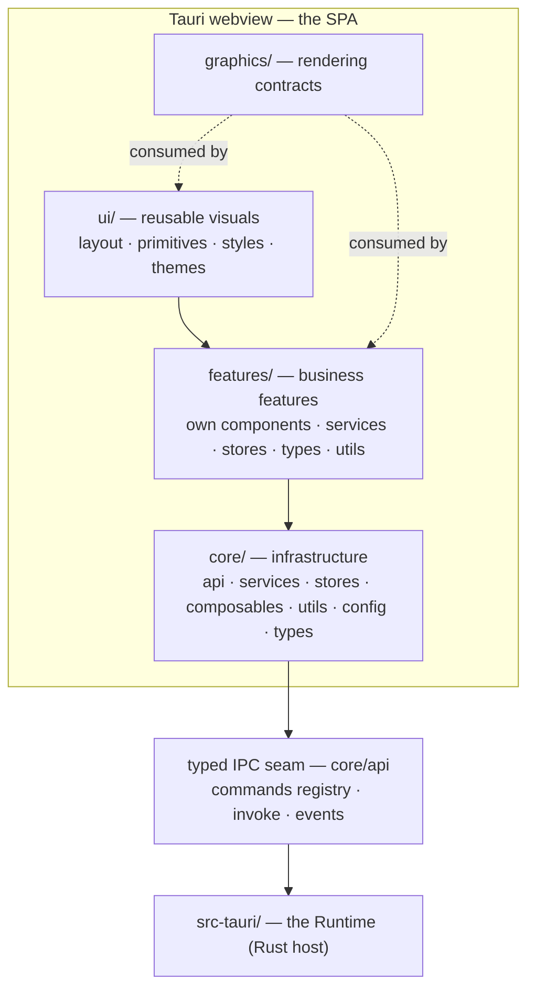
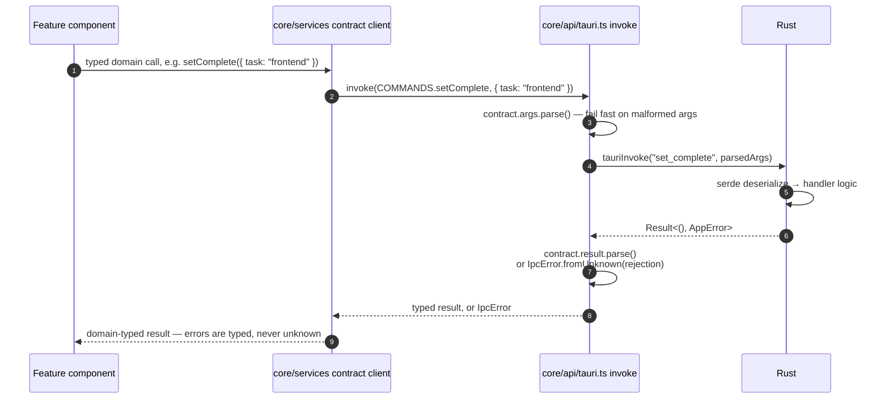

# DEX Frontend Architecture

## Purpose

The frontend is the presentation layer of the Workspace Runtime: the Svelte
application that renders the shell chrome — HUD, TopBar, Dock, StatusBar —
and hosts the business features. It is a presentation layer by contract, not
by accident: every capability that touches the operating system is reached
through the typed IPC seam and executed in Rust. ADR-0001 fixes this
boundary; the frontend owns zero system access — no SQLite, no filesystem,
no shell.

The frontend exists to satisfy four requirements:

- **Cold start under 500 ms** into a transparent, composited window
  (ADR-0004). The shell must appear instantly and never paint an opaque
  background.
- **A strongly typed seam to Rust** so contract drift fails at the boundary
  with a named error instead of `undefined` deep in a component (Principle 8,
  Strong Typing).
- **A feature-first structure** that scales past 100k LOC without
  cross-feature coupling (Principle 10).
- **A locked web security posture**: the webview runs only first-party shell
  code under a strict CSP (ADR-0005).

## SPA Runtime Model

DEX is a single-page application. There is no Node server in the stack; the
Tauri webview is the only host. The build configuration enforces this and
the SPA mode is not optional — a server would break offline, transparent,
desktop-native behavior:

- `svelte.config.js`: `adapter-static` with `fallback: "index.html"` — every
  route falls back to the shell document.
- `src/routes/+layout.ts`: `export const ssr = false` — nothing is rendered
  server-side.
- `vite.config.js`: dev server on port `1420` with `strictPort`; the desktop
  window loads from that origin in development.

The shell bootstraps in `src/routes/+layout.svelte`, in this order:

1. `import "../app.css"` — wires the global reset, which `@import`s the
   design tokens (`ui/styles/tokens.css`) first.
2. `initTheme()` from `core/stores/theme.svelte.ts` — applies the persisted
   theme to `<html data-theme>` before first paint.
3. Render the slot; the root route (`src/routes/+page.svelte`) mounts the
   HUD shell from `ui/layout/`.

## Layer Model

The dependency rule is one-way and acyclic: `ui → features → core → IPC →
src-tauri`. `core` never imports `features` or `ui`; `features` may import
`core` and `ui`; `graphics` is consumed by `ui` and `features` and never
imports business logic. The full folder-ownership contract lives in
[`20_System_Architecture.md`](20_System_Architecture.md) and
ADR-0001; this document describes how the frontend layers behave.

## The Typed IPC Seam

The seam is the most-used boundary in the system: every feature call that
reaches the operating system crosses it. The purpose of the seam is
**drift detection** — TypeScript types and Rust types and the wire format
must agree, or the mismatch must fail loudly and locally. Zod is the
validator; the registry is the single source of command names; the error
envelope is the single error shape.

The seam is three modules in `core/api/`, and a hard import rule:

### Command registry — `core/api/commands.ts`

Every callable command is described by one `CommandContract`: a name plus a
zod schema pair for args and result. `defineCommand` registers the contract
and **rejects duplicate names at module load** — a second command with the
same name is a programming error, not a runtime surprise. The contract name
must equal the Rust `#[tauri::command]` fn name. A command is not callable
until it exists here **and** in the Rust `invoke_handler`; the wire contract
lives in exactly these two places (ADR-0002).

### Invoke wrapper — `core/api/tauri.ts`

`invoke(contract, args)` validates in two directions:

- **Args before the round trip** (`contract.args.parse`): a caller that
  builds a malformed payload fails fast, before crossing to Rust.
- **Result after the round trip** (`contract.result.parse`): a Rust reply
  that no longer matches the contract is detected the moment it arrives,
  reported as a contract error naming the command.

Rejections are normalized through `IpcError.fromUnknown`: the structured
`AppError` envelope is validated against the closed code set (`validation`,
`not_found`, `permission_denied`, `conflict`, `unsupported`, `internal`);
anything else is a transport rejection. Exactly two shapes reach callers —
the structured envelope and a transport string — both as `IpcError`
(ADR-0002). UI code handles typed errors, never `unknown`.

### Event subscription — `core/api/events.ts`

Rust pushes state changes to the shell through events. `onEvent(name,
schema, handler)` wraps Tauri's `listen` with payload validation: invalid
payloads are **logged and dropped**, never thrown into the handler — a
misbehaving emitter must not crash the shell. Event names follow
`dex.<domain>.<event>` and must be declared in the `EVENTS` registry. Only
`src-tauri/src/events/` emits. See [`24_EventBus.md`](24_EventBus.md).

### The import rule

`@tauri-apps/api` is imported nowhere outside `core/api/`. The command
registry, the invoke wrapper, and the event wrapper are the only files that
touch the Tauri runtime API. Everything else — every feature, every
component — talks to Rust through `core/services` contract clients.

## Contract Clients — `core/services/`

`core/services/` holds **one contract client per Rust command domain**,
mirroring `src-tauri/src/commands/<domain>.rs` (ADR-0001/0002). A contract
client is the only public surface a feature may use to reach Rust: a set of
typed async functions built on the shared `invoke`, surfacing `IpcError` on
failure. The first command wired end-to-end is `set_complete`:

- `core/api/commands.ts` → `COMMANDS.setComplete` contract (`set_complete`,
  args `{ task: string }` with values `"frontend"`/`"backend"`, result
  `null`, errors `validation`/`internal`)
- the splashscreen (`src/routes/splashscreen/+page.svelte`) invokes
  `COMMANDS.setComplete` with `{ task: "frontend" }` at boot

`greet` is Rust-only — registered in `generate_handler!` but with no
`COMMANDS` entry and no contract client, so it is not callable from the
frontend; `core/services/greet.ts` does not exist.

Adding a command domain follows the five-step checklist in
[`20_System_Architecture.md`](20_System_Architecture.md). New domains —
`settings`, `system`, `terminal`, `hyprland`, `widgets`, `plugins`, `ai` —
are declared as their owning roadmap phase lands; the contract clients for
them do not exist yet.

## State Model

State lives in **module-singleton rune stores** (`.svelte.ts` files), the
Svelte 5 idiom. A store is a module that declares reactive state with
`$state`, derives with `$derived`, and reacts with `$effect`, then exposes
read functions (and mutators) as the only public surface. This gives the
shell cross-cutting state that is reactive inside components without a
global mutable object.

- Cross-cutting state lives in `core/stores/`; feature state lives in
  `features/<feature>/stores/`.
- Legacy `svelte/store` (`writable`/`readable`) is forbidden.
- Services and logic that need injection accept dependencies explicitly;
  there are no hidden globals beyond rune state.

The canonical example is `core/stores/theme.svelte.ts` (ADR-0003): it owns
the current `ThemeName`, applies it by setting `data-theme` on `<html>`,
persists the choice through `core/utils/storage.ts`, and exposes
`getThemeName()` / `getPalette()` for reads that stay reactive inside
`$derived`/`$effect`. The CSS does the visual switching — no inline styles.
`initTheme()` runs once at boot, before first paint.

## Rendering and Visuals

The DOM is composited by the browser over a **transparent window** — the
Wayland desktop shows through the shell (ADR-0004). Visual backdrops come
from glass panels (`backdrop-filter` over translucent `--glass-*`/`--surface-*`
tokens), never from an opaque window-sized paint. Layout components in
`ui/layout/` compose the shell; primitives in `ui/primitives/` provide
GlassPanel, Button, Badge, Separator, Tooltip, Divider, ViewPlaceholder. Components consume semantic
design tokens only — no hardcoded colors, radii, or durations; the token
architecture and its dual CSS/TS mirrors are owned by
[`../40-engineering/DesignSystem.md`](../40-engineering/DesignSystem.md).

Motion is a performance contract, not a preference: `transform`/`opacity`
only, driven by the `--duration-*` scale (120/220/360/600 ms) with
`--ease-standard` (cubic-bezier(0.2, 0.8, 0.2, 1)), `prefers-reduced-motion`
respected (ADR-0003). GPU visuals are delegated to `graphics/`, whose
engine-agnostic renderer contracts live in `graphics/contracts.ts` and whose
implementation is covered by [`25_Graphics.md`](25_Graphics.md).

## Logging

The frontend logs exclusively through `core/utils/logger.ts` — a facade over
`@tauri-apps/plugin-log` (the Rust plugin writes stdout + the app log
directory), falling back to the browser console only when running outside
Tauri (plain `bun run dev`). No `console.*` calls appear in new code; the
logger is the single seam for observability on the frontend. It is also the
destination for dropped invalid event payloads, so emitter bugs stay
traceable.

## Security Posture

The webview is a privileged context by design — it can reach Rust through
the typed seam — so its attack surface is minimized at the edges:

- **Strict CSP** from `tauri.conf.json`: `default-src 'self'; style-src
  'self' 'unsafe-inline'; img-src 'self' data:; connect-src ipc:
  http://ipc.localhost`. Even a compromised renderer cannot fetch arbitrary
  origins or run inline scripts. Dev-mode HMR may require temporary
  relaxation — never ship the loosened policy.
- **Capability gating**: the webview's permissions come from
  `src-tauri/capabilities/default.json`, not from code.
- **Plugins and Widgets never enter the privileged webview.** Native
  extensions are Rust-hosted; Widget UI renders in isolated contexts with no
  IPC of its own. The boundary is owned by
  [`../50-adr/0005-plugin-boundary.md`](../50-adr/0005-plugin-boundary.md)
  and [`27_Plugins.md`](27_Plugins.md).

## Related Documents

- System architecture and boundaries: [`20_System_Architecture.md`](20_System_Architecture.md)
- Backend subsystem (the Rust side of the seam): [`22_Backend.md`](22_Backend.md)
- Database ownership: [`23_Database.md`](23_Database.md)
- Event bus: [`24_EventBus.md`](24_EventBus.md)
- Rendering engine: [`25_Graphics.md`](25_Graphics.md)
- Plugin boundary: [`27_Plugins.md`](27_Plugins.md)
- Layer ownership: [`../50-adr/0001-layer-ownership.md`](../50-adr/0001-layer-ownership.md)
- Typed IPC contract: [`../50-adr/0002-typed-ipc-contract.md`](../50-adr/0002-typed-ipc-contract.md)
- Design tokens: [`../50-adr/0003-design-tokens.md`](../50-adr/0003-design-tokens.md)
- Transparent compositing: [`../50-adr/0004-transparent-compositing.md`](../50-adr/0004-transparent-compositing.md)
- Plugin boundary and CSP: [`../50-adr/0005-plugin-boundary.md`](../50-adr/0005-plugin-boundary.md)
- Canonical terminology: [`../00-vision/03_Glossary.md`](../00-vision/03_Glossary.md)
- Product roadmap: [`../10-product/11_Product_Roadmap.md`](../10-product/11_Product_Roadmap.md)
- Design system usage: [`../40-engineering/DesignSystem.md`](../40-engineering/DesignSystem.md)
