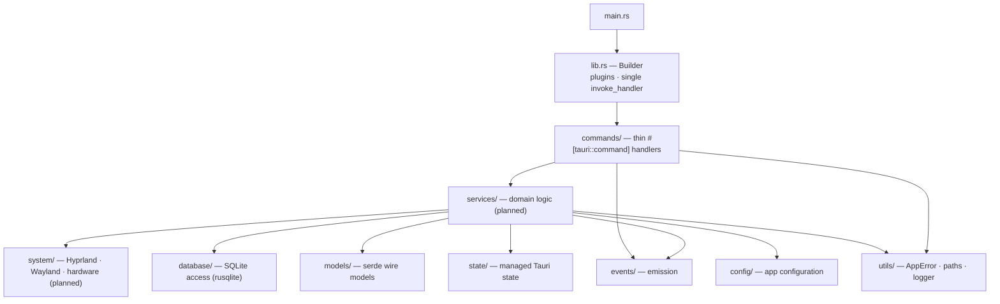
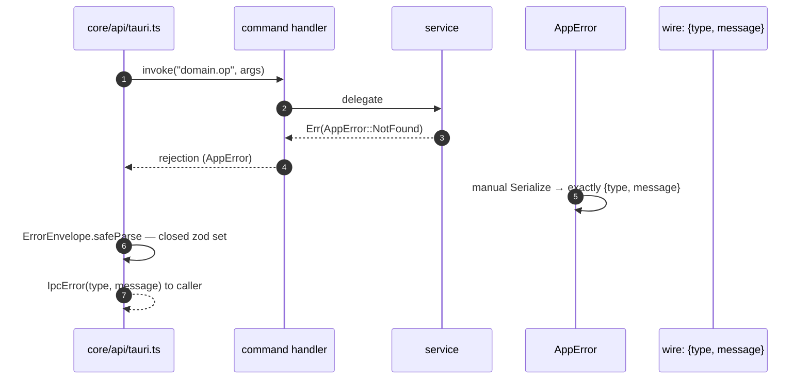

# DEX Backend Architecture (Rust)

## Purpose

The backend is the native host of the Workspace Runtime: the Rust crate that
owns all system access. It is the only place in the system that touches the
operating system — Hyprland, Wayland, hardware, the filesystem, and SQLite —
because Native First (Principle 5) makes native integration the product, and
because the security boundary (ADR-0005) keeps the privileged surface small
and auditable. The frontend never reaches the OS directly; it calls the
backend through the typed IPC seam (ADR-0002).

The backend is the crate `omnizya-dex` (`src-tauri/`), whose library target
is `omnizya_dex_lib`. It is built on Tauri 2, Tokio, Serde, and rusqlite
(bundled SQLite).

## Process and Entry

The binary entry point is `src-tauri/src/main.rs`, which calls
`omnizya_dex_lib::run()`. `run()` in `src-tauri/src/lib.rs` builds the Tauri
application:

- registers the `opener` plugin and the `log` plugin (stdout + app log
  directory, `LevelFilter::Trace`);
- registers **exactly one `invoke_handler`** via a single
  `generate_handler![...]` call;
- runs the application context.

The single-`invoke_handler` rule is a hard invariant (ADR-0002): a second
`invoke_handler` call **silently shadows the first**, so commands registered
in the first call would become uncallable with no error. Every new command is
**appended** to the one existing `generate_handler![...]`; a new
`invoke_handler` is never added.



## Module Layout

The backend is organized by responsibility, mirroring the frontend's
`core/services` contract clients one-to-one per command domain (ADR-0001).

| Module | Responsibility |
|---|---|
| `commands/` | Thin `#[tauri::command]` handlers. One module per command domain; each handler takes exactly one serde struct arg, returns `Result<T, AppError>`, and delegates to `services/`. |
| `services/` | Domain logic. The real work behind a command; composed by handlers and by other services. |
| `system/` | OS access: Hyprland, Wayland, and hardware (CPU, memory, disk, network, battery, monitor, process). |
| `database/` | SQLite access layer over rusqlite: connection, migrations, queries, repository, schema. |
| `models/` | Serde wire models — the IPC representation of data, mirroring the zod schemas at the frontend edge. |
| `events/` | Event emission to the shell. Only this module emits; see [`24_EventBus.md`](24_EventBus.md). |
| `ipc/` | Protocol and contract helpers for the IPC boundary. |
| `config/` | Application configuration. |
| `state/` | Managed Tauri state shared across commands. |
| `utils/` | `AppError`, path resolution, and the logger. |
| `plugins/`, `ai/` | Native extension host and AI providers — future phases; not yet declared. |

Only real modules are declared in their `mod.rs`; modules whose owning phase
has not landed are **not declared** and therefore not compiled. A module is
declared when its first real file exists — never by `mod`-ing an empty file.
Today the live modules are `commands::core`, `database::{connection,
migrations}`, `providers/*`, and `utils/*`; the rest of the tree is
scaffolding that joins as its roadmap phase lands.

## Command Surface

A command domain is a vertical slice: one Rust module in `commands/`, one
contract client in `core/services/`, one registry entry in
`core/api/commands.ts`, and one registration in the single
`generate_handler!`. The canonical example is `commands/core.rs`:

- `GreetArgs` — exactly one `#[derive(Deserialize)]` struct arg, no
  `#[serde(rename_all = ...)]`; serde defaults (snake_case) are the wire
  authority.
- `GreetOutput` — a `#[derive(Serialize)]` result struct.
- `greet(args) -> Result<GreetOutput, AppError>` — the `#[tauri::command]`.

Handlers are thin by design: they deserialize, validate at the boundary, and
delegate to `services/`. Business logic lives in services, not in handlers,
so the command surface stays a stable, auditable facade.

## Error Model

Errors cross the boundary as a single, stable envelope. `AppError`
(`utils/errors.rs`) is an enum over a **closed set** of codes:
`validation`, `not_found`, `permission_denied`, `conflict`, `unsupported`,
`internal`. Its `Serialize` impl is **hand-written** — a derived impl would
key on variant names and leak Rust internals. The manual impl emits exactly
two fields:

```json
{ "type": "not_found", "message": "Resource not found" }
```

`From` impls map `tauri::Error` and `rusqlite::Error` to `AppError::Internal`,
so services can use `?` and still produce a valid envelope. The frontend
mirrors the closed set as a zod union and validates every rejection
(ADR-0002); the envelope is the only structured error shape that reaches
callers.



## Managed State and Configuration

Cross-command state lives in `state/` as managed Tauri state, injected into
handlers rather than reached through globals. Application configuration
lives in `config/`. Both are declared as their first consumer lands; today
neither is live.

## Events Emission

The backend pushes state changes to the shell through `events/`. Emission is
the counterpart of the frontend's `onEvent` subscription: the emitter names
an event `dex.<domain>.<event>`, and the shell validates the payload against
the `EVENTS` registry schema. Only `events/` emits; the full contract is
described in [`24_EventBus.md`](24_EventBus.md).

## Capabilities and Plugins

The backend's reach is gated by capability grants in
`src-tauri/capabilities/`. `default.json` scopes its grants to the `main`
window only: `core:default`, `opener:default`, `log:default`, plus
`core:window:allow-set-decorations`, `core:window:allow-set-shadow`,
`core:window:allow-set-effects`, `core:window:allow-set-background-color`,
and `core:window:allow-set-title-bar-style` — the minimum the shell needs
today. New native extensions (Plugins) receive **per-plugin capability
grants**, never default elevation; manifests are schema-validated at
install/update (ADR-0005). The plugin host lives in `plugins/` and is owned
by [`27_Plugins.md`](27_Plugins.md).

## Related Documents

- System architecture and boundaries: [`20_System_Architecture.md`](20_System_Architecture.md)
- Frontend subsystem (the other side of the seam): [`21_Frontend.md`](21_Frontend.md)
- Database ownership: [`23_Database.md`](23_Database.md)
- Event bus: [`24_EventBus.md`](24_EventBus.md)
- Plugin boundary: [`27_Plugins.md`](27_Plugins.md)
- Layer ownership: [`../50-adr/0001-layer-ownership.md`](../50-adr/0001-layer-ownership.md)
- Typed IPC contract: [`../50-adr/0002-typed-ipc-contract.md`](../50-adr/0002-typed-ipc-contract.md)
- Plugin boundary and CSP: [`../50-adr/0005-plugin-boundary.md`](../50-adr/0005-plugin-boundary.md)
- Canonical terminology: [`../00-vision/03_Glossary.md`](../00-vision/03_Glossary.md)
- Product roadmap: [`../10-product/11_Product_Roadmap.md`](../10-product/11_Product_Roadmap.md)