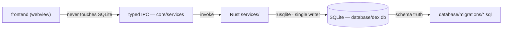
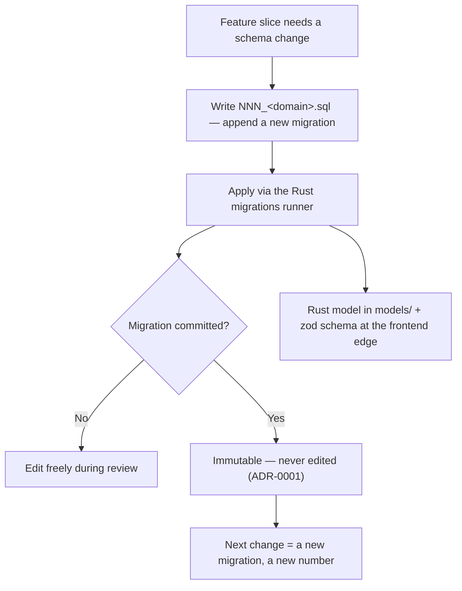

# DEX Database Architecture (SQLite)

## Purpose

SQLite is the durable local store of the Workspace Runtime. It holds the
state that must survive a restart — settings, widget layout, plugin
registrations, and, in later phases, Workspace data and the Knowledge Vault.
It is chosen for Offline First (Principle 2): the machine works fully with
no network, and local state is the source of truth.

The database has one governing rule: **only Rust touches it.** The frontend
never opens a connection, never runs a query, and never reads the file. All
data access flows through the typed IPC seam into Rust, which owns SQLite as
a single writer (ADR-0001). This is a security rule, not a convenience: the
webview is a privileged context, and keeping SQL behind the native boundary
keeps the attack surface small and the schema authority in one place.

## Ownership Model

The frontend reaches data only through contract clients in `core/services/`,
which call Rust commands. Rust services read and write through the
`database/` access layer. The schema itself is declared in
`database/migrations/*.sql`, which is the source of truth — the SQL files
define the schema; the Rust models and the zod schemas are representations of
it, not independent definitions.

## Schema Truth and Migrations

The schema lives in `database/migrations/` as numbered SQL files,
`NNN_<domain>.sql`. The directory currently holds empty numbered files
(`001_init.sql` through `005_history.sql`) and an empty committed
`database/dex.db`; no schema is committed yet. The naming convention is the
contract: each file is one ordered, immutable migration.

Migrations are **append-only** (ADR-0001). A committed migration file is
never edited — not to fix a typo, not to add a column. Every schema change is
a new migration with a new number, applied in order. This makes the schema
history a linear, replayable log: any database can be brought to the current
schema by applying migrations in sequence, and a deployed database is never
silently mutated by an edit to an old file.

## The Rust Access Layer

Rust owns SQLite through `src-tauri/src/database/`, an access layer over
rusqlite (bundled). Its modules — `connection`, `migrations`, `queries`,
`repository`, `schema` — are scaffolding today; they are declared as their
owning roadmap milestone lands. The **repository pattern** is planned at
roadmap M4.3 (SQLite access layer, repository pattern, migrations): services
depend on repository interfaces rather than raw connections, so the data
layer stays testable and the single-writer rule stays enforceable.

## One Slice per Feature

A schema change is never shipped alone. Each feature that owns data delivers
its slice in one unit (ADR-0001):

1. a new migration in `database/migrations/`;
2. a Rust model in `src-tauri/src/models/` — the serde wire representation;
3. a zod schema at the frontend edge in `core/services/` mirroring the model.

The migration is the truth; the Rust model and the zod schema are its typed
projections on each side of the IPC boundary. Because they are delivered
together, the three can never drift silently.

### Wire representation and integer precision

SQLite integers arrive in Rust as `i64`/`u64`. Values beyond 2^53 lose
precision when serialized to JavaScript, so IDs and small integers stay in
range or are serialized as strings (ADR-0001). This is a wire-contract
concern, not a storage concern: the schema may use integer keys, but the
frontend-facing representation must not lose them.

## Future Domains

The database will own several domains as their phases land. These are
**planned**, not committed — no schema exists for them yet, and their
contracts are owned by the specifications:

- **Workspaces** — the Workspace, its Workspace Manifest, Workspace
  Activation, and Workspace Snapshot records. Contract:
  [`../30-specs/Workspace.md`](../30-specs/Workspace.md),
  [`../30-specs/Manifest.md`](../30-specs/Manifest.md),
  [`../30-specs/Snapshot.md`](../30-specs/Snapshot.md).
- **Knowledge Vault** — the durable local memory layer. Contract:
  [`../30-specs/Knowledge.md`](../30-specs/Knowledge.md).
- **Journal** — the durable event log, distinct from the in-memory event bus.
  Contract: [`../30-specs/Journal.md`](../30-specs/Journal.md).
- **Settings, widgets, plugins, history** — the empty numbered migration
  files hint at these domains; their schemas are written when each owning
  phase lands.

Each domain follows the one-slice-per-feature rule: migration + Rust model +
zod schema, delivered together, append-only.

## Related Documents

- System architecture and boundaries: [`20_System_Architecture.md`](20_System_Architecture.md)
- Backend subsystem (the Rust access layer): [`22_Backend.md`](22_Backend.md)
- Frontend subsystem (the typed seam to data): [`21_Frontend.md`](21_Frontend.md)
- Event bus (vs. the durable Journal): [`24_EventBus.md`](24_EventBus.md)
- Layer ownership and append-only migrations: [`../50-adr/0001-layer-ownership.md`](../50-adr/0001-layer-ownership.md)
- Canonical terminology: [`../00-vision/03_Glossary.md`](../00-vision/03_Glossary.md)
- Product roadmap (M4.3 SQLite milestone): [`../10-product/11_Product_Roadmap.md`](../10-product/11_Product_Roadmap.md)
- Workspace contract: [`../30-specs/Workspace.md`](../30-specs/Workspace.md)
- Manifest contract: [`../30-specs/Manifest.md`](../30-specs/Manifest.md)
- Snapshot contract: [`../30-specs/Snapshot.md`](../30-specs/Snapshot.md)
- Knowledge Vault contract: [`../30-specs/Knowledge.md`](../30-specs/Knowledge.md)
- Journal contract: [`../30-specs/Journal.md`](../30-specs/Journal.md)