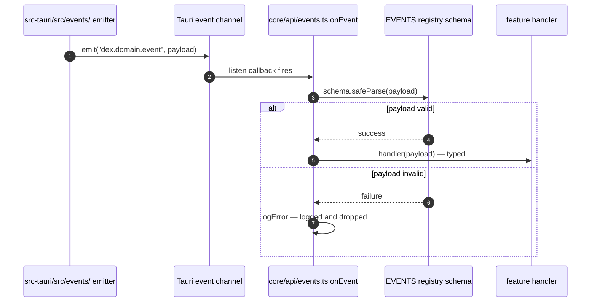
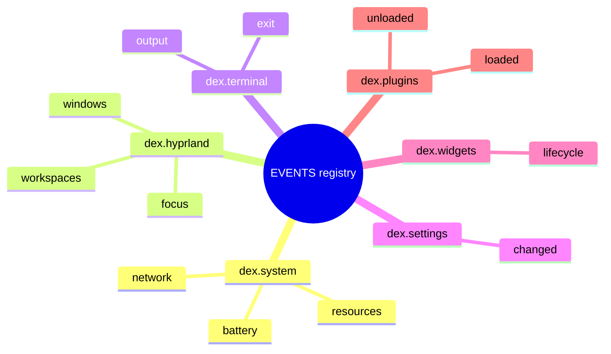

# DEX Event Bus Architecture

## Purpose

The event bus is the Rust→UI push channel of the Workspace Runtime. It is
how the Runtime tells the shell that the world changed — a Workspace was
activated, a window gained focus, a service exited, a resource reading
updated — without the shell polling. Push is the right model because the
events originate on the native side (Hyprland socket events, process and
device state) and because the shell must react to them promptly, on the
compositor clock, not on a timer.

The bus is a **typed contract** like every seam in the system (Principle 8,
Strong Typing): the emitter names an event, the payload is schema-validated,
and a malformed payload is dropped, never tolerated. ADR-0002 §5 fixes this
contract; this document describes how it works, who may emit, who may
subscribe, and how the bus relates to durable storage.

## Direction and Scope

The bus is one-directional: **Rust emits, the shell listens.** Tauri events
flow from the native side to the webview; there is no shell→Rust event path
and no peer-to-peer bus. Shell→Rust communication is commands (the typed IPC
seam, [`21_Frontend.md`](21_Frontend.md)), not events.

- **Only `src-tauri/src/events/` emits.** No command handler, service, or
  plugin emits directly from anywhere else in the backend.
- **Only names declared in the `EVENTS` registry may be subscribed.** An
  undeclared name is not part of the contract and is ignored by
  convention.
- **A subscription is session-scoped.** `onEvent` returns an `UnlistenFn`;
  the shell's subscriptions live for the life of the webview and are torn
  down when the window closes.

## The Contract

The contract has two halves, one per side of the boundary.

On the frontend, `core/api/events.ts` holds the **`EVENTS` registry**: every
emittable event, declared with its canonical name and payload schema. Names
follow the grammar `dex.<domain>.<event>` — the domain matches the Rust
command domain, the event names the notification. Subscriptions go through
`onEvent(name, schema, handler)`, which wraps Tauri's `listen`:

- the payload is validated with `schema.safeParse`;
- a valid payload is delivered to the handler with its inferred type;
- an **invalid payload is logged and dropped** — it never reaches the
  handler, and it never throws into the listener. A misbehaving emitter must
  not crash the shell.

On the backend, `src-tauri/src/events/` owns emission: an emitter dispatches
a payload under a registered `dex.<domain>.<event>` name after the state
change it reports has already happened. Emission is fire-and-forget; the bus
does not confirm delivery.

## Naming

The registry names events `dex.<domain>.<event>`: the `dex` prefix scopes the
namespace, the domain names the emitting subsystem (and matches a Rust
command domain and its contract client), and the event names the
notification. The grammar is the naming authority; the domain set grows with
the roadmap.

These are the planned namespaces — the registry is empty today and entries
are added when their first emitter lands (Phase 4 M4.x onward), each with a
payload schema.

## Live Bus vs. Durable Journal

The event bus and the Journal are two different things and must not be
confused:

- **The live bus is in-memory and session-scoped.** It exists for the life
  of the running shell. Events are delivered to live listeners and are
  gone — they are not replayed, not persisted, and not recoverable after a
  restart. Its job is reactivity, not history.
- **The Journal is durable.** It is the persistent record of what happened,
  owned by the database layer and readable after restart. Its contract is
  owned by [`../30-specs/Journal.md`](../30-specs/Journal.md); its storage
  is described in [`23_Database.md`](23_Database.md).

A future event can be both delivered on the live bus and recorded in the
Journal, but the two mechanisms have different guarantees: the bus guarantees
delivery to listeners that exist now; the Journal guarantees retention. The
bus never substitutes for the Journal, and the Journal never replaces the
bus's low-latency delivery.

## Current State

The bus is wired but empty:

- `core/api/events.ts` implements `onEvent` and the `EVENTS` registry; the
  registry has no entries.
- `src-tauri/src/events/` holds the emitter module scaffold; no emitter is
  live.
- The only Rust→shell wiring active in the Runtime is the log plugin
  (`tauri-plugin-log`), which is command-side, not event-bus traffic.

The first emitters arrive with the first business domains (Phase 4 M4.x —
Hyprland socket events, system resource readings). Each lands as one slice:
an emitter in `src-tauri/src/events/`, an entry in the `EVENTS` registry
with its payload schema, and a subscription in the consuming feature.

## Related Documents

- System architecture and boundaries: [`20_System_Architecture.md`](20_System_Architecture.md)
- Frontend subsystem (the `onEvent` seam): [`21_Frontend.md`](21_Frontend.md)
- Backend subsystem (emission in `events/`): [`22_Backend.md`](22_Backend.md)
- Database architecture (the durable Journal): [`23_Database.md`](23_Database.md)
- Typed IPC contract (ADR-0002 §5): [`../50-adr/0002-typed-ipc-contract.md`](../50-adr/0002-typed-ipc-contract.md)
- Canonical terminology: [`../00-vision/03_Glossary.md`](../00-vision/03_Glossary.md)
- Product roadmap (Phase 4 event sources): [`../10-product/11_Product_Roadmap.md`](../10-product/11_Product_Roadmap.md)
- Journal contract: [`../30-specs/Journal.md`](../30-specs/Journal.md)