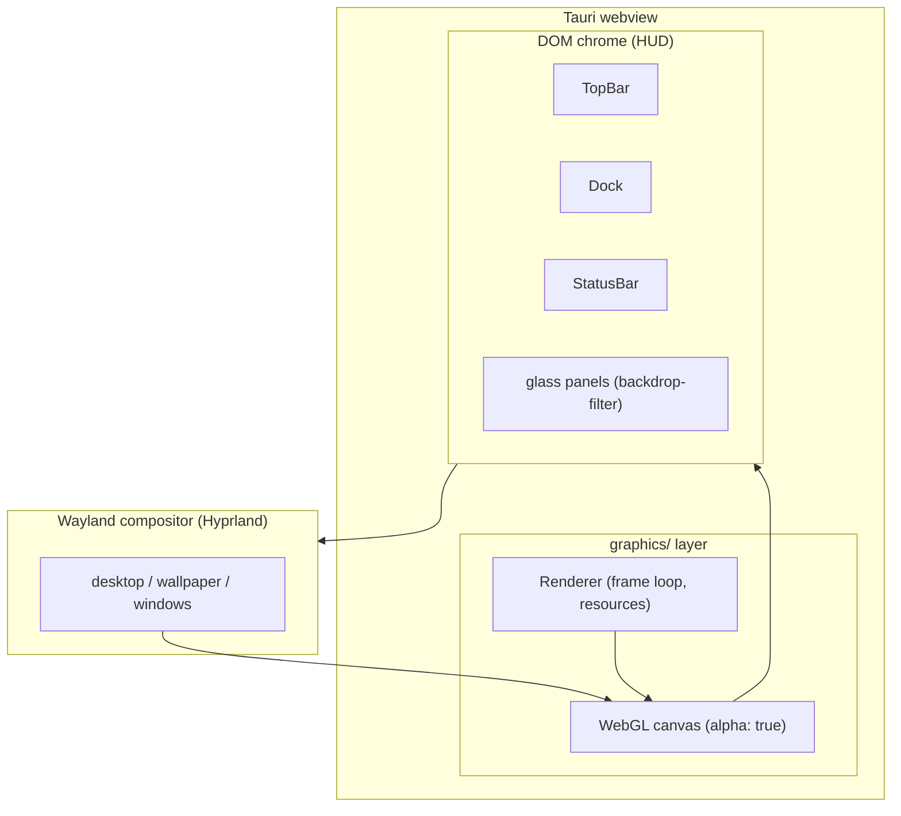
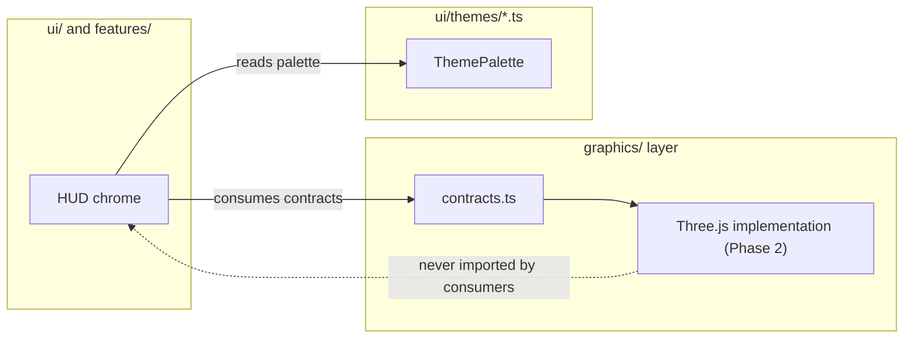
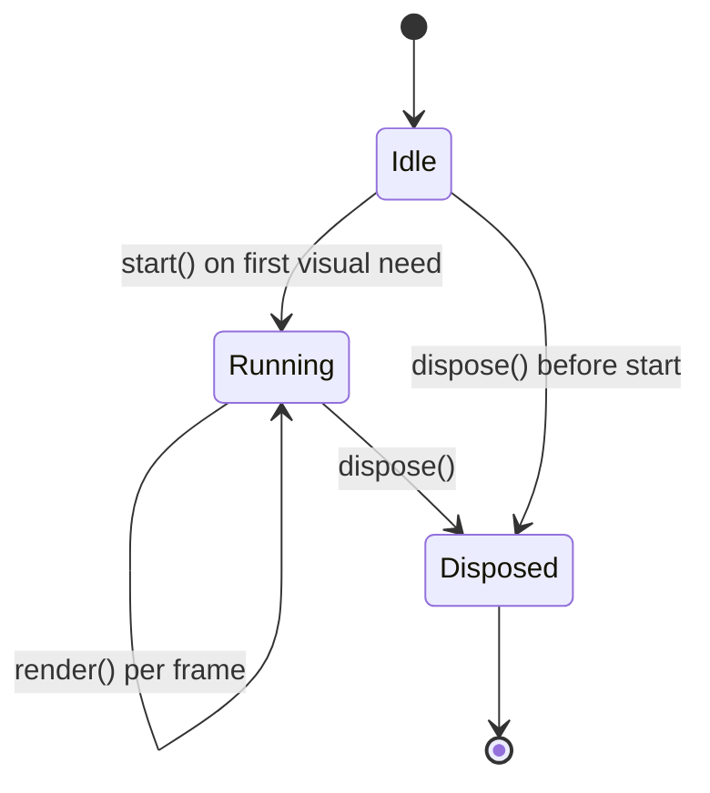

# DEX Graphics Architecture

## Purpose

This document describes the graphics subsystem of the Workspace Runtime: the
engine-agnostic renderer contracts, the rendering stack, the ownership
boundary, the renderer lifecycle, and the performance contract. It explains
*why* the shell renders the way it does and *how* the pieces compose. It is
not an implementation guide; the formal renderer contracts live in
`src/lib/graphics/contracts.ts` and the renderer decision is recorded in
ADR-0006.

## Background — why a graphics layer exists

DEX is a transparent, GPU-composited shell over Hyprland (ADR-0004). The
desktop, the wallpaper, and the Wayland compositor output are visible through
the window; the shell's visual depth — backdrop scenes, particle ambience,
window effects — is drawn by a GPU renderer into a transparent WebGL canvas
composited **under** the DOM chrome. The DOM chrome (the HUD: TopBar, Dock,
StatusBar) floats above that canvas on glass surfaces.

Two constraints shape the design:

1. **Transparency is a hard contract, not a style choice** (ADR-0004). The
   window background is always transparent; the renderer never paints an
   opaque backdrop. The desktop shows through both the canvas and the glass
   panels.
2. **The renderer is a dependency, not a framework.** The shell must not be
   coupled to Three.js or to WebGL. Consumers depend on contracts; the
   implementation is swappable and arrives only when a feature needs GPU
   visuals (roadmap Phase 2, M2.1–M2.4).

## Rendering stack

The shell renders through a single pipeline: the Wayland compositor owns the
screen, the webview owns the DOM, and the graphics layer owns the GPU canvas
beneath the DOM chrome.

The canvas is transparent (`alpha: true`), so the compositor output passes
through it before the DOM chrome is drawn on top. The renderer draws into the
canvas; the DOM chrome is composited by the browser. Neither paints an opaque
window-sized surface.

## Engine-agnostic contracts

The graphics layer exposes exactly three contracts, defined in
`src/lib/graphics/contracts.ts`:

| Contract | Role |
|---|---|
| `RgbaColor` | RGBA color in 0..1 space, as used by GPU code |
| `RenderSurface` | The drawing surface: a canvas plus a DPR-aware `resize` |
| `Renderer` | The shell renderer: `start()`, `render()`, `dispose()` |

These contracts are engine-agnostic on purpose. Three.js is not yet a
dependency; Phase 2 implements the contracts inside `graphics/`. Consumers in
`ui/` and `features/` depend on the contracts and on the theme palette — never
on WebGL or Three.js directly.

## Ownership boundary

The graphics layer owns everything GPU. The rule is absolute: **nothing
outside `graphics/` touches WebGL or Three.js.** `ui/` and `features/` consume
`graphics/contracts.ts` and the `ThemePalette` mirror from `ui/themes/*.ts`
(ADR-0003) — never the `three` module.

The renderer owns its frame loop, its resources, and its lifecycle. It never
reaches into features, and nothing outside `graphics/` schedules frames or
touches the canvas context.

## Renderer lifecycle

The renderer is a single instance owned by the graphics layer. It starts
lazily on first visual need and stops on dispose. `dispose()` is total: it
releases every GPU object (geometry, texture, material) and every listener —
no orphaned buffers, no leaked state.

The frame loop is driven by `requestAnimationFrame` and is owned exclusively
by the renderer. It starts lazily (the renderer initializes on first visual
need, per the performance contract) and stops with `dispose()`.

## Performance contract

The graphics layer is bound by the same performance contract as the rest of
the shell (ADR-0003, `40-engineering/Performance.md`):

- **60 FPS floor.** Motion runs on compositor-only properties —
  `transform`/`opacity` — so the compositor never repaints. The renderer
  never animates layout properties.
- **Zero per-frame allocations in steady state.** Hot paths reuse arrays and
  pooled objects; no per-frame garbage. Object pooling and the texture cache
  land in M2.4.
- **DPR-aware backing store.** The canvas is sized in device pixels via
  `RenderSurface.resize`; resize follows the window, not the CSS box.
- **Reduced motion.** `prefers-reduced-motion` disables ambient animation.
- **Lazy initialization.** The renderer initializes on first visual need, not
  at boot, keeping cold start under 500 ms.

## Roadmap mapping

The graphics subsystem ships in Phase 2 (roadmap M2.1–M2.4). Phase 0 ships
only the contracts and this document; implementations arrive with the first
feature that needs GPU visuals — no speculative engine code.

| Milestone | Deliverable |
|---|---|
| M2.1 | Three.js core: renderer, scene, camera, lights |
| M2.2 | Effects: bloom, fog, background, grid, particles |
| M2.3 | Animation engine: timeline, motion manager, transition manager |
| M2.4 | Performance: object pooling, texture cache, FPS monitor |

## Related Documents

- System architecture and layer model: [`20_System_Architecture.md`](20_System_Architecture.md)
- Layer ownership: [`../50-adr/0001-layer-ownership.md`](../50-adr/0001-layer-ownership.md)
- Design tokens and the programmatic palette mirror: [`../50-adr/0003-design-tokens.md`](../50-adr/0003-design-tokens.md)
- Transparent window compositing: [`../50-adr/0004-transparent-compositing.md`](../50-adr/0004-transparent-compositing.md)
- Renderer decision (recorded when the renderer is chosen, Phase 2): [`../10-product/11_Product_Roadmap.md`](../10-product/11_Product_Roadmap.md)
- Design system and motion policy: [`../40-engineering/DesignSystem.md`](../40-engineering/DesignSystem.md)
- Performance standard: [`../40-engineering/Performance.md`](../40-engineering/Performance.md)
- Product roadmap (Phase 2): [`../10-product/11_Product_Roadmap.md`](../10-product/11_Product_Roadmap.md)
- Canonical terminology: [`../00-vision/03_Glossary.md`](../00-vision/03_Glossary.md)