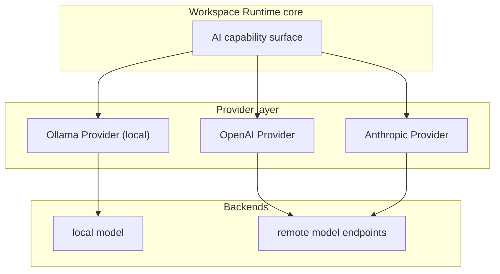
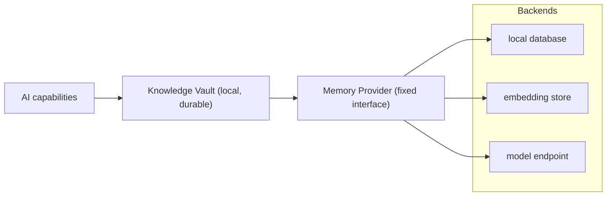
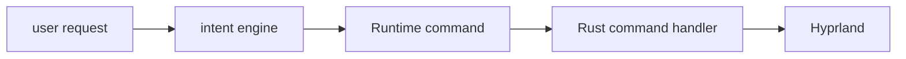
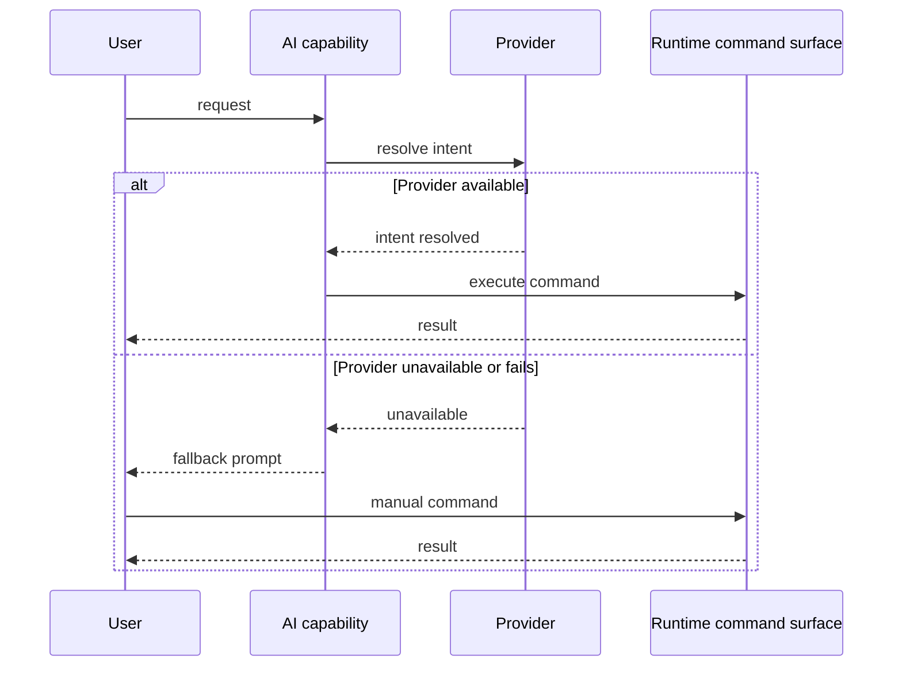

# DEX AI Architecture

## Purpose

This document describes the AI subsystem of the Workspace Runtime: the
Provider model, the Memory Provider interface to the Knowledge Vault, the
intent engine, AI widgets, and voice. It explains *why* AI is architected as
an optional, local-first capability and *how* the pieces compose. It is not a
specification; the formal contracts live in `30-specs/Knowledge.md` and the
voice proposal in `60-rfc/Voice.md`.

## Background — why AI is optional

DEX is not an AI application (Manifesto; Non-Goals). Intelligence is a
feature, not an identity. Principle 12 — **AI is Optional** — is the governing
rule: every AI capability degrades gracefully to a fully manual workflow, and
no core capability may require a model, an API key, or a network. The Workspace
Runtime must be complete without any of them.

Two consequences follow:

1. **Local-first.** Offline First (principle 2) applies to AI as to everything
   else. The machine works fully with no network; anything that leaves the
   machine does so by explicit request. Local models are the default posture.
2. **Never on the critical path.** AI capabilities sit behind Providers and
   are never on the critical path of the Workspace Runtime. The Knowledge
   Vault works without intelligence; intelligence is a *consumer* of the
   Vault, never a precondition.

## Provider model

AI capabilities are reached through Providers — adapters that implement a
well-defined backend interface. A Provider is the seam that keeps the core
independent of any specific model service. The model Provider surface ships in
Phase 6 (roadmap M6.1) with three backends: Ollama (local), OpenAI, and
Anthropic.

The Provider interface is fixed; swapping the backend never changes the
capability surface. A Provider that is unavailable — no network, no local
model, no API key — reports unavailability, and the capability degrades to the
manual path.

A Provider's name denotes its interface, not its deployment. The OpenAI
Provider targets the OpenAI wire format, which local runtimes also speak
(Ollama's streaming protocol matches the OpenAI wire format chunk-for-chunk,
and OpenAI publishes open-weight Apache-2.0 models such as gpt-oss-20b/120b).
This means any Provider can serve a local model, and any local runtime can back
a Provider — the local-first posture (principle 2) holds without adding
backends to the diagram.

## Memory Provider and the Knowledge Vault

The Knowledge Vault is DEX's persistent, local memory layer: the durable store
of a developer's Context, notes, and history, spanning Workspaces and time. It
is owned by the Knowledge subsystem and is always local. AI is a consumer of
the Vault, not its owner.

The **Memory Provider** is the adapter that connects the Knowledge Vault to a
storage or model backend — a local database, an embedding store, a model
endpoint. It implements a fixed interface; swapping the backend never changes
the Vault's contract. The contract detail lives in `30-specs/Knowledge.md`.

The Vault works without intelligence; intelligence reads and writes it through
the Memory Provider. This keeps memory durable and local regardless of whether
any model is present.

## Intent engine

The intent engine (roadmap M6.3) translates a natural-language request into a
command the Runtime can execute. The pipeline is: intent → command → Rust →
Hyprland. The intent engine is a consumer of the command surface; it never
bypasses it. A request that cannot be resolved to a command degrades to the
manual path.

The intent engine sits entirely behind the Provider model. When no Provider is
available, the intent engine is absent and the user drives the same command
surface directly.

## AI widgets and voice

AI widgets (roadmap M6.4) — chat, search, assistant — are Widgets: sandboxed
UI extensions with no IPC access of their own, their effects mediated by the
Workspace Runtime. They render in isolated contexts and never import
`@tauri-apps/api` (ADR-0005; `30-specs/WidgetAPI.md`).

Voice (roadmap M6.5) covers speech-to-text, text-to-speech, and wake word. It
is an input/output channel for the same capability surface, never a separate
authority. The voice proposal lives in `60-rfc/Voice.md`.

## Optionality and fallback

The defining property of the AI subsystem is that its absence costs nothing.
Every AI path has a manual equivalent, and the fallback is automatic: when an
AI capability fails or is unavailable, the user reaches the same result through
the manual path.

The fallback is not an error path; it is the primary path. AI is a shortcut
over a fully functional manual surface, and the manual surface is always
present.

## Roadmap mapping

The AI subsystem ships in Phase 6 (roadmap M6.1–M6.5).

| Milestone | Deliverable |
|---|---|
| M6.1 | LLM Provider: Ollama, OpenAI, Anthropic |
| M6.2 | Memory: conversations, desktop state, context |
| M6.3 | Intent Engine: intent → command → Rust → Hyprland |
| M6.4 | AI Widgets: chat, search, assistant |
| M6.5 | Voice: STT, TTS, wake word |

## Related Documents

- System architecture and layer model: [`20_System_Architecture.md`](20_System_Architecture.md)
- AI is Optional (principle 12): [`../00-vision/02_Principles.md`](../00-vision/02_Principles.md)
- Offline First (principle 2): [`../00-vision/02_Principles.md`](../00-vision/02_Principles.md)
- Canonical terminology (Knowledge Vault, Memory Provider, Provider): [`../00-vision/03_Glossary.md`](../00-vision/03_Glossary.md)
- Knowledge Vault and Memory Provider contract: [`../30-specs/Knowledge.md`](../30-specs/Knowledge.md)
- Widget contract: [`../30-specs/WidgetAPI.md`](../30-specs/WidgetAPI.md)
- Voice proposal: [`../60-rfc/Voice.md`](../60-rfc/Voice.md)
- Product roadmap (Phase 6): [`../10-product/11_Product_Roadmap.md`](../10-product/11_Product_Roadmap.md)