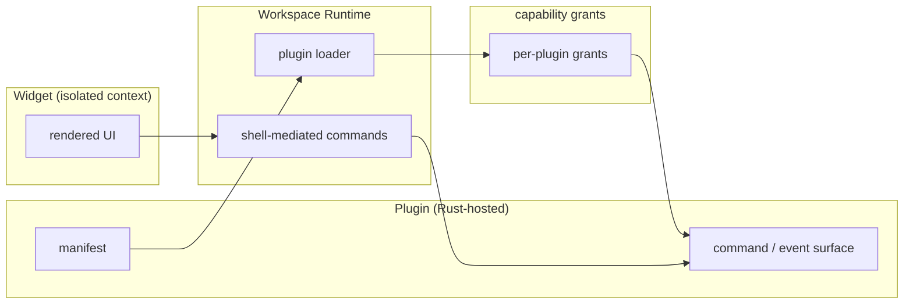
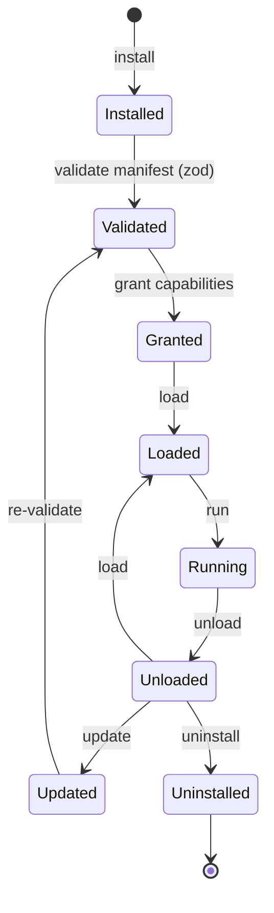

# DEX Plugin Architecture

## Purpose

This document describes the plugin subsystem of the Workspace Runtime: the
Plugin model, the Widget model, the lifecycle, versioning, and the security
boundary. It explains *why* the extension boundary is fixed in Phase 0 and
*how* Plugins and Widgets compose with the Runtime. It is not a specification;
the formal contracts live in `30-specs/PluginAPI.md` and
`30-specs/WidgetAPI.md`, and the boundary decision in ADR-0005.

## Background — why the boundary is fixed first

DEX will ship a widget and plugin ecosystem (roadmap Phases 3 and 8). The
shell is a single Tauri webview with full typed IPC access; if third-party code
ever ran inside that privileged context it could reach the filesystem through
the same typed surface as the shell itself. The boundary must be fixed in
Phase 0, because CSP and capability grants are cheap to set now and expensive
to retrofit later (ADR-0005).

Plugin First (principle 4) states the rule: extensibility is designed into the
platform from the start, bounded by a hard security boundary — never added as
an afterthought.

## Plugin model

A Plugin is a Rust-hosted, capability-gated extension to the Workspace
Runtime, declared by a manifest, validated by the host, and executed in native
code. A Plugin extends the Runtime's command and event surface with exactly
the capabilities granted to it — never more, and never inside the privileged
webview.

Three properties define a Plugin:

1. **Rust-hosted.** A Plugin is an extension of `src-tauri/`, not arbitrary
   web code in the privileged webview. A Plugin = manifest + command/event
   surface + capability grants, loaded and versioned by the host.
2. **Manifest-validated.** Manifests are schema-validated (zod) at
   install/update; unknown fields are rejected, never silently ignored.
3. **Capability-gated.** Per-plugin capability grants live in
   `src-tauri/capabilities/*.json`. A Plugin gets exactly the permissions it
   declares — no default elevation.

## Widget model

A Widget is a sandboxed UI extension, rendered in an isolated context with no
IPC access of its own. A Widget's every effect is mediated by the Workspace
Runtime through shell-mediated commands; a Widget never imports
`@tauri-apps/api`.

The Plugin extends the Runtime's native surface; the Widget renders in an
isolated context and reaches the Runtime only through mediated commands. The
Widget never holds IPC access of its own.

## Lifecycle

A Plugin moves through a fixed lifecycle, from installation to uninstallation.
Each transition is validated by the host; a Plugin cannot skip a stage.

The lifecycle is: install → validate → grant → load → run → unload → update →
uninstall. Update re-enters validation, so a changed manifest is re-checked
before it is granted and loaded again.

## Versioning

Plugins are versioned by the host. A Plugin declares a version in its manifest;
the host tracks the installed version and applies updates through the lifecycle
above. Versioning is part of the Plugin API contract (`30-specs/PluginAPI.md`)
and the marketplace surface (roadmap M8.3). A version change is an update, not
a fresh install: it re-validates the manifest and re-grants capabilities before
the new version loads.

## Security boundary

The plugin boundary is the security boundary of the extension ecosystem
(ADR-0005):

- Plugins are Rust-hosted and capability-gated; a Plugin gets exactly the
  permissions it declares, with no default elevation.
- Manifests are schema-validated at install/update; unknown fields are
  rejected.
- Widgets render in isolated contexts with no IPC access; all effects go
  through shell-mediated commands.
- The shell ships a strict CSP from Phase 0, which is the blast-radius reducer
  even if a renderer is compromised.

The full security model is described in `29_Security.md`.

## Roadmap mapping

The plugin subsystem ships in two phases.

**Phase 3 — Widget Platform** (roadmap M3.1–M3.4):

| Milestone | Deliverable |
|---|---|
| M3.1 | Widget SDK: registry, metadata, lifecycle |
| M3.2 | Layout Engine: drag, resize, snap, dock, float |
| M3.3 | Persistence: SQLite-backed positions/sizes/settings |
| M3.4 | Widget Marketplace API: discovery, install, update |

**Phase 8 — Plugin Platform** (roadmap M8.1–M8.4):

| Milestone | Deliverable |
|---|---|
| M8.1 | SDK: commands, widgets, services |
| M8.2 | API: permissions, versioning, lifecycle |
| M8.3 | Marketplace: browse, install, update, remove |
| M8.4 | Sandboxing: permission system |

## Related Documents

- System architecture and layer model: [`20_System_Architecture.md`](20_System_Architecture.md)
- Plugin boundary and CSP baseline: [`../50-adr/0005-plugin-boundary.md`](../50-adr/0005-plugin-boundary.md)
- Plugin First (principle 4): [`../00-vision/02_Principles.md`](../00-vision/02_Principles.md)
- Canonical terminology (Plugin, Widget): [`../00-vision/03_Glossary.md`](../00-vision/03_Glossary.md)
- Plugin API contract: [`../30-specs/PluginAPI.md`](../30-specs/PluginAPI.md)
- Widget API contract: [`../30-specs/WidgetAPI.md`](../30-specs/WidgetAPI.md)
- Security architecture: [`29_Security.md`](29_Security.md)
- Product roadmap (Phases 3 and 8): [`../10-product/11_Product_Roadmap.md`](../10-product/11_Product_Roadmap.md)