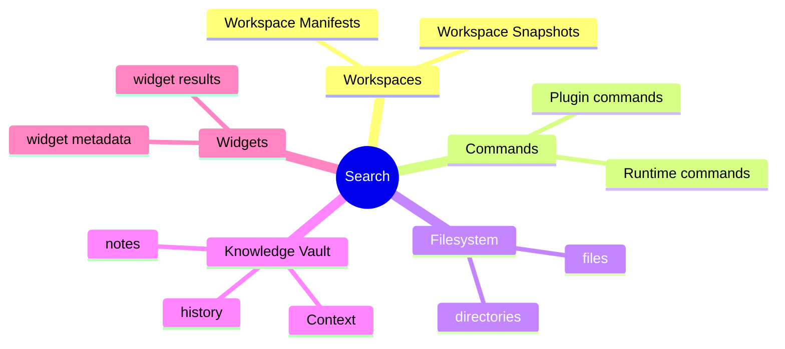
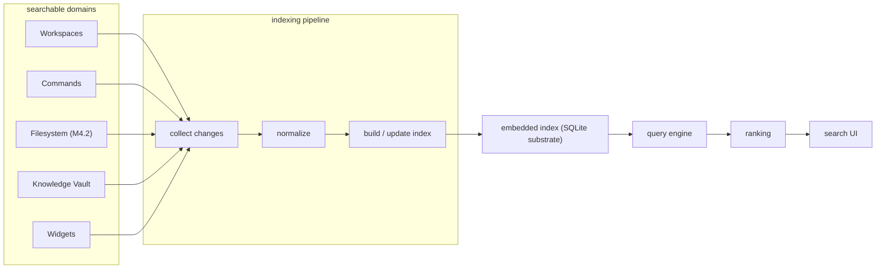

# DEX Search Architecture

## Purpose

This document describes the search subsystem of the Workspace Runtime: the
searchable domains, the offline-first indexing strategy, incremental updates,
ranking, and the security rule that search never bypasses capability grants.
It explains *why* search is a local, indexed capability and *how* it composes
with the rest of the system. It is not a specification; the query syntax and
ranking contract live in `30-specs/Search.md`.

## Background — why search is offline-first

DEX is Offline First (principle 2): the machine is fully functional with no
network, and local state is the source of truth. Search is a core shell
capability — a launcher, a knowledge query, a command lookup — and it must work
with the network cable pulled. There is no remote search service; the index is
built over local data and lives on the machine.

Search is also a capability within the Workspace Runtime, not its purpose
(Non-Goals: DEX is not a launcher). It serves the shell: finding Workspaces,
running commands, locating files, querying the Knowledge Vault.

## Searchable domains

Search spans the domains the shell manages. Each domain owns its data; search
indexes it.

| Domain | Source | Notes |
|---|---|---|
| Workspaces | Workspace Manifests, Workspace Snapshots | declared and captured state |
| Commands | Runtime and Plugin command surfaces | the CLI First surface, searchable as actions |
| Filesystem | local files and directories | arrives with M4.2 (browse, watch, search) |
| Knowledge Vault | Context, notes, history | durable local memory |
| Widgets | widget metadata and results | searchable surfaces from the widget ecosystem |

## Indexing strategy

Search is built on an embedded index over local data. The index is an offline,
incremental view of the searchable domains, derived from the same stores the
shell already owns. SQLite is the substrate: the database layer is Rust-owned
and single-writer (ADR-0001), and the index lives in it or is built from it.

The pipeline is: collect changes from the domains, normalize them, and build or
update the index. The query engine reads the index, ranking produces an
ordered result, and the search UI presents it. The frontend never touches the
index or SQLite directly — all access flows through `core/services` → Rust.

## Incremental updates

The index is updated incrementally, not rebuilt. Each domain signals change —
a Workspace activated or declared, a command registered, a file created or
modified (M4.2 watch), the Knowledge Vault appended to — and the pipeline
updates only the affected entries. Full rebuilds are a recovery operation, not
the normal path. Incremental updates keep indexing cost proportional to change,
so search stays responsive while the shell is in use.

## Ranking

Ranking orders the results across and within domains. The ranking contract —
score composition, boosts, and result shaping — lives in `30-specs/Search.md`.
At the architecture level, ranking operates on the indexed fields, weights
matches by domain and by field (exact over fuzzy, identifiers over prose),
and keeps results deterministic so the same query yields the same order.

## Security — search never bypasses grants

Search has no authority of its own. It returns references — a command name, a
file path, a Workspace identifier, a Vault entry — and executing or opening a
result is subject to the same permission model as any other action:

- **Capability grants apply.** A result that resolves to a Plugin command is
  gated by the Plugin's grants; a Plugin cannot be reached through search
  beyond what it was granted.
- **Schema validation applies.** Search indexes and returns typed results
  through the command contract layer (ADR-0002); malformed index entries are
  dropped, never surfaced.
- **The frontend never queries the filesystem or the index directly.** All
  search traffic flows through `core/services` → Rust, like every other system
  access.

The full trust-boundary model is described in `29_Security.md`.

## Roadmap mapping

Search is not a single milestone; it is a capability composed across phases.
The launcher (M5.1) is its first full surface, and filesystem search arrives
with the native filesystem domain (M4.2).

| Milestone | Deliverable |
|---|---|
| M4.2 | Filesystem domain: browse, watch, search |
| M5.1 | Launcher: search, execute, recent |
| Phase 6 | Knowledge-backed search over the Vault |

## Related Documents

- System architecture and layer model: [`20_System_Architecture.md`](20_System_Architecture.md)
- Offline First (principle 2): [`../00-vision/02_Principles.md`](../00-vision/02_Principles.md)
- Canonical terminology (Knowledge Vault, Workspace): [`../00-vision/03_Glossary.md`](../00-vision/03_Glossary.md)
- Search query and ranking contract: [`../30-specs/Search.md`](../30-specs/Search.md)
- Knowledge Vault contract: [`../30-specs/Knowledge.md`](../30-specs/Knowledge.md)
- Security architecture: [`29_Security.md`](29_Security.md)
- Product roadmap: [`../10-product/11_Product_Roadmap.md`](../10-product/11_Product_Roadmap.md)