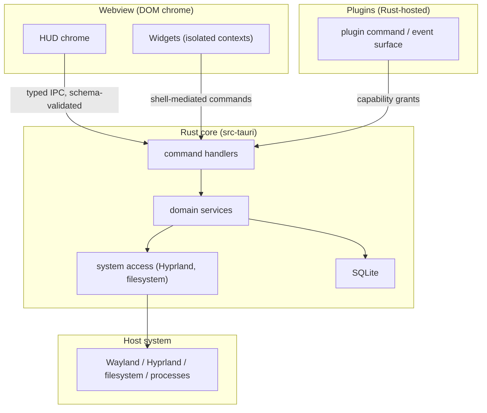

# DEX Security Architecture

## Purpose

This document describes the security architecture of the Workspace Runtime:
the trust boundaries, the Content Security Policy baseline, capability grants
as the permission model, schema validation at every edge, secrets handling,
the plugin supply chain, and the threat model. It explains *why* the security
boundaries are fixed in Phase 0 and *how* the controls compose. It is not a
specification; the secrets contract lives in `30-specs/Secrets.md` and the
plugin boundary decision in ADR-0005.

## Background — why security is fixed first

DEX is an operating layer between the user and the OS. It mediates system
access — filesystem, Hyprland, processes — through a single Tauri webview with
full typed IPC access. The blast radius of a compromised renderer or a
malicious extension is the whole machine. The boundaries must be fixed in
Phase 0, because CSP and capability grants are cheap to set now and expensive
to retrofit later (ADR-0005).

The security posture rests on a small number of hard rules:

- The frontend never touches the filesystem, SQLite, or the shell directly;
  all system access flows through typed services → Rust (ADR-0001).
- Every IPC call is schema-validated at both edges (ADR-0002).
- The shell ships a strict CSP from Phase 0 (ADR-0005).
- Extensions are Rust-hosted and capability-gated; Widgets render in isolated
  contexts with no IPC access (ADR-0005).

## Trust boundaries

The system is divided into distinct trust domains. Each boundary is a control
point: data crossing it is validated, and authority crossing it is granted.



| Trust domain | Authority | Boundary control |
|---|---|---|
| Webview (DOM chrome) | presentation only; no system access | typed IPC, schema-validated (ADR-0002) |
| Widgets | no IPC access of its own | isolated context; shell-mediated commands (ADR-0005) |
| Rust core | all system access | single writer to SQLite; Rust-owned (ADR-0001) |
| Plugins | exactly the granted capabilities | per-plugin capability grants (ADR-0005) |
| Host system | the machine | reached only through Rust |

The webview is the least trusted domain that renders untrusted content
(Widgets); the Rust core is the authority that owns system access; Plugins are
native but capability-gated; the host system is reached only through Rust.

## Content Security Policy

The shell ships a strict CSP from Phase 0 (`tauri.conf.json`, ADR-0005):

```
default-src 'self'; style-src 'self' 'unsafe-inline';
img-src 'self' data:; connect-src ipc: http://ipc.localhost
```

The CSP is the blast-radius reducer: even a compromised renderer cannot fetch
arbitrary origins or run inline scripts. Dev-mode HMR (Vite websocket) may
require temporary relaxation during development — the loosened policy is never
shipped.

## Capability grants as the permission model

Permissions are expressed as capability grants, not as ad-hoc checks. A grant
is a declared, per-plugin permission in `src-tauri/capabilities/*.json`. A
Plugin gets exactly the permissions it declares — no default elevation. The
same model gates the shell's own plugin-backed commands. Search and other
cross-cutting capabilities never bypass grants: a result that resolves to a
Plugin command is gated by the Plugin's grants.

## Schema validation at every edge

Every seam between components is a typed contract (Strong Typing, principle 8;
ADR-0002). Validation is enforced at both edges of every IPC call:

- **Rust edge:** commands take exactly one serde-deserialized struct arg;
  results are typed. `AppError` serializes manually to exactly
  `{ "type", "message" }` with a closed code set.
- **Frontend edge:** every command is described by a zod schema pair (args +
  result); `invoke` validates args before the round trip and the result after.
  Invalid event payloads are logged and dropped, never thrown.

Schema validation is the defense against contract drift and malformed input at
the boundary; it is not a substitute for semantic validation in command logic.

## Secrets handling

Secrets — API keys, tokens, credentials — are handled by the secrets subsystem
and stay local (Offline First, principle 2). The frontend never stores or
transmits secrets directly; secrets are accessed through the Rust core, which
owns the credential store. The contract detail lives in `30-specs/Secrets.md`.
Anything that leaves the machine does so by explicit request.

## Plugin supply chain

The plugin supply chain is controlled at every stage:

- **Manifest validation.** Manifests are schema-validated (zod) at
  install/update; unknown fields are rejected, never silently ignored.
- **No default elevation.** A Plugin gets exactly the capabilities it declares;
  there is no implicit trust.
- **Rust-hosted execution.** Plugins run as native extensions of `src-tauri/`,
  not as arbitrary web code in the privileged webview.
- **Widget isolation.** Widget UI renders in isolated contexts with no IPC
  access; all effects are shell-mediated.

The lifecycle — install → validate → grant → load → run → unload → update →
uninstall — is described in `27_Plugins.md`.

## Threat model

The threat model maps the principal threats to the controls that contain them.

| Threat | Target | Control |
|---|---|---|
| Compromised renderer fetches arbitrary origins | webview | strict CSP (`connect-src ipc: http://ipc.localhost`) |
| Compromised renderer runs inline scripts | webview | strict CSP (`script-src` via `default-src 'self'`) |
| Malicious Plugin exceeds its scope | Rust core / host | per-plugin capability grants; no default elevation |
| Malformed manifest smuggles unknown fields | plugin loader | zod manifest validation at install/update |
| Widget reaches IPC directly | Rust core | isolated context; shell-mediated commands only |
| Contract drift between TS and Rust | IPC boundary | schema validation at both edges (ADR-0002) |
| Frontend touches filesystem / SQLite directly | host system | one-way dependency rule; Rust owns system access (ADR-0001) |
| Secret exfiltration | secrets | secrets stay local; accessed only through Rust |

The model is defense-in-depth: no single control is the whole boundary. CSP
limits a compromised renderer; grants limit a Plugin; schema validation limits
the IPC seam; the dependency rule limits the frontend's reach.

## Related Documents

- System architecture and layer model: [`20_System_Architecture.md`](20_System_Architecture.md)
- Plugin boundary and CSP baseline: [`../50-adr/0005-plugin-boundary.md`](../50-adr/0005-plugin-boundary.md)
- Typed IPC contract and boundary validation: [`../50-adr/0002-typed-ipc-contract.md`](../50-adr/0002-typed-ipc-contract.md)
- Layer ownership and the dependency rule: [`../50-adr/0001-layer-ownership.md`](../50-adr/0001-layer-ownership.md)
- Strong Typing (principle 8): [`../00-vision/02_Principles.md`](../00-vision/02_Principles.md)
- Offline First (principle 2): [`../00-vision/02_Principles.md`](../00-vision/02_Principles.md)
- Canonical terminology (Plugin, Widget): [`../00-vision/03_Glossary.md`](../00-vision/03_Glossary.md)
- Secrets contract: [`../30-specs/Secrets.md`](../30-specs/Secrets.md)
- Plugin architecture and lifecycle: [`27_Plugins.md`](27_Plugins.md)
- Search security (grants never bypassed): [`28_Search.md`](28_Search.md)