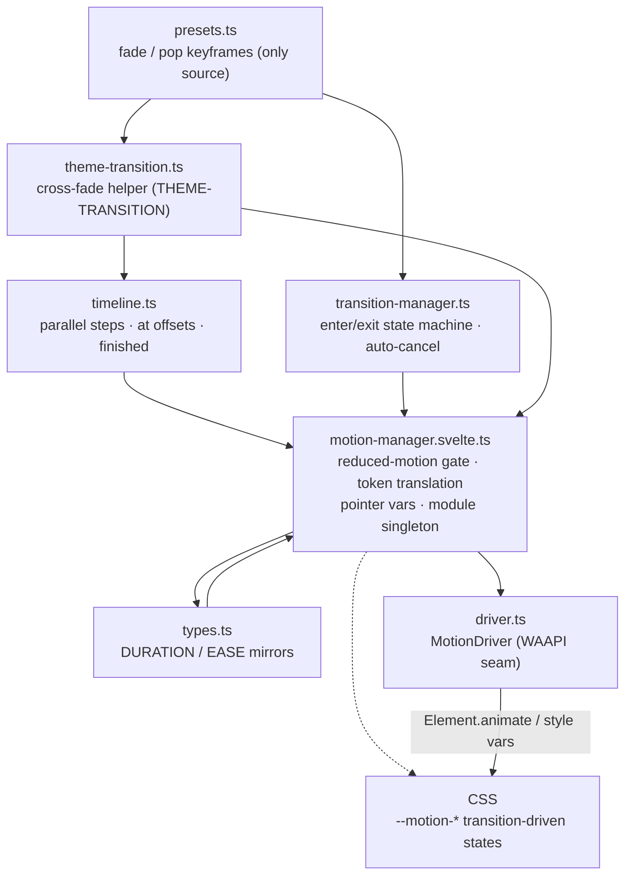
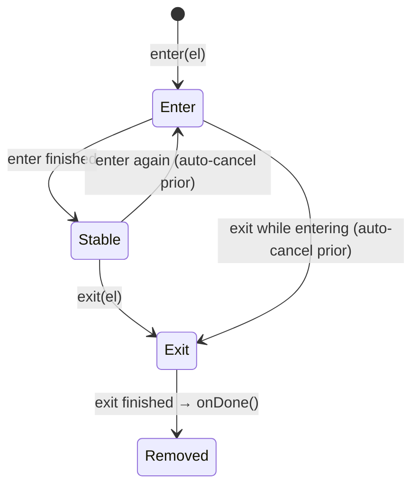

# DEX Animation Specification

Contract version 1.

The motion engine is implemented as `src/lib/ui/motion/` (M2.3, ADR-0009) and
the motion token vocabulary lives in `src/lib/ui/styles/tokens.css` (the live
source), mirrored into `src/lib/ui/motion/types.ts`. This specification states
the contract that both imply.

## Purpose

Motion in DEX is a performance contract first and a design rule second
(`40-engineering/Performance.md`). The shell is a DOM/CSS layer composited
over a transparent window (ADR-0004) with a GPU-rendered backdrop
(`graphics/`, ADR-0008). Motion therefore has two strictly separated domains:

- **DOM/CSS motion — this engine (`ui/motion/`).** Drives the chrome, the
  primitives, and the theme cross-fade. It is rAF-free: it never schedules its
  own frame loop. JS-orchestrated sequences go through the Web Animations API
  (`Element.animate`) behind a driver seam; interaction states (hover, press,
  focus) stay CSS-transition-driven through the `--motion-*` role tokens.
- **Graphics motion — M2.4 owns it.** Anything that animates the WebGL scene
  belongs to the renderer loop / compose seam in `graphics/` — never to
  `ui/motion/` (see `25_Graphics.md`).

This engine is what makes enter/exit, reveal, and theme transitions one system
with one policy and one reduced-motion gate.

## Motion contract (normative)

The contract restates ADR-0003 §4 as amended by ADR-0009 (R1–R7) plus the
THEME-TRANSITION carve-out.

| # | Rule |
|---|---|
| R1 | **Compositor properties only.** JS animation animates `transform` and `opacity` exclusively. Layout properties (width, height, top, left, margin) are never animated. |
| R2 | **Token durations.** Every duration comes from a `DurationToken` (`--duration-micro/fast/normal/slow/slower` = 80/120/220/360/600 ms). No raw ms numbers. |
| R3 | **Designated easings.** Every easing is one of `--ease-standard` (default), `--ease-spring` (overshoot; hover lifts, entrance pops), or `--ease-smooth` (symmetric; theme cross-fade, expand/collapse). No raw bezier strings. |
| R4 | **One default per role.** Hover/`fast`+spring, press/`micro`+standard, focus/`fast`+standard, enter/`normal`+standard, exit/`fast`+standard, expand/`slow`+smooth, collapse/`fast`+smooth, theme/`slower`+smooth — the `--motion-*` role pairs. |
| R5 | **Reduced motion wins.** The manager gate (`MotionManager.reduced`) makes every JS-orchestrated call finish immediately; CSS `@media (prefers-reduced-motion: reduce)` disables transition-driven states. Two independent layers. |
| R6 | **One rAF loop.** No module under `ui/motion/` schedules frames. The renderer (ADR-0008) is the sole continuous-loop owner. |
| R7 | **One keyframe source.** `presets.ts` is the only place keyframes exist (`fade`, `pop`). Consumers pick a preset by name; they never write inline keyframes. |
| R8 | **THEME-TRANSITION carve-out (ADR-0003 amendment).** Theme switching fades the `<html>` root with a two-step opacity timeline (`--motion-theme-duration` = `--duration-slower` / `--motion-theme-ease` = `--ease-smooth`), palette swapped at the opacity floor, both steps `fill: "both"` so the root never flashes at full opacity between steps, fully disabled under reduced motion (instant apply), never layout properties, never an opaque full-window overlay (ADR-0004). |

## Engine architecture

`ui/motion/` is a small dependency DAG with the driver as its only platform
seam:



- **rAF rule.** `ui/motion/` never schedules frames; the renderer stays the
  sole continuous-loop owner (R6). The motion-enforcement test greps the module
  for `requestAnimationFrame` and the whole of `src/lib` for Svelte transition
  directives.
- **Reduced motion.** `MotionManager` lazily wires a `prefers-reduced-motion`
  listener at construction (DI-injectable `matchMedia`, null-safe →
  `reduced=false` when absent, mirroring `renderer.ts`). Under reduced motion
  `animate()` returns an already-finished handle and synchronously places the
  element at the keyframes' final state (enter fully visible, exit fully
  hidden), never reaching the driver; callers treat the handle as
  already-done.

## MotionManager API

```ts
interface MotionManagerOptions {
  driver?: MotionDriver;                 // DI seam for tests
  matchMedia?: typeof window.matchMedia; // DI seam; absent → reduced=false
}
class MotionManager {
  reduced = $state(false);
  animate(
    el: Element,
    keyframes: Keyframe[],
    options: { duration: DurationToken; easing: EaseToken } & KeyframeAnimationOptions,
  ): MotionHandle;
  onPrefsChange(listener: (reduced: boolean) => void): () => void;
  pointer: { update(x: number, y: number): void }; // --cursor-x / --cursor-y
}
createMotionManager(options?): MotionManager;
motionManager: MotionManager; // app singleton (default web driver)
```

- `animate()` translates `DurationToken` → ms and `EaseToken` → bezier from
  `types.ts`, then delegates to the driver (R2/R3). Under `reduced` it returns
  an immediately-finished handle after placing the element at the keyframes'
  final state (R5); it does **not** call the driver.
- `pointer.update(x, y)` writes `--cursor-x`/`--cursor-y` on the document root
  unless reduced.
- `onPrefsChange` fires on media-query changes; the manager detaches its
  listener on `dispose()`.

## Timeline API

```ts
interface TimelineStep {
  el: Element;
  keyframes: Keyframe[];
  options: { duration: DurationToken; easing: EaseToken } & KeyframeAnimationOptions;
  at?: number; // ms offset from timeline start; absent/0 = parallel with step 1
}
interface Timeline {
  play(): void;
  cancel(): void;
  readonly finished: Promise<void>;
}
createTimeline(steps: TimelineStep[], manager: MotionManager): Timeline;
```

- `play()` starts every step via `manager.animate`, delaying `at`-offset steps
  via `setTimeout`. `finished` resolves when the longest step completes.
- Under reduced motion all steps finish immediately; no animation or timer is
  scheduled (R5). `cancel()` cancels started steps, clears pending timers, and
  settles `finished` so callers never await a dead promise.

## TransitionManager API

```ts
interface EnterExitOptions {
  el: Element;
  kind: "fade" | "pop";
  duration?: DurationToken; // default: enter=normal, exit=fast
}
interface TransitionManager {
  enter(opts: EnterExitOptions): MotionHandle;
  exit(opts: EnterExitOptions & { onDone(): void }): MotionHandle;
}
createTransitionManager(manager: MotionManager): TransitionManager;
transitionManager: TransitionManager; // app singleton
```

**Phase state machine** (mount/unmount contract):



- `exit()` runs the exit animation, then calls `onDone` exactly once —
  immediately under reduced motion, and never when the exit was cancelled or
  superseded (the element is no longer leaving).
- Auto-cancel: any new `enter`/`exit` on an element cancels the previously
  active handle (`WeakMap<Element, MotionHandle>`), so rapid
  enter→exit→enter sequences never stack animations.
- Mount/unmount contract: consumers pair a mount with `enter` and an unmount
  with `exit({ onDone })`; `onDone` owns the actual removal.

## Motion tokens

Primitives (non-themeable, per `30-specs/Theme.md`): the duration scale gains
`--duration-micro: 80ms` (press/active tactile) beside the existing
`fast/normal/slow/slower`. The easing vocabulary is the three designated
variants. Role pairs map each interaction to a default duration + ease:

| Role | Duration | Ease |
|---|---|---|
| hover | `--duration-fast` (120) | `--ease-spring` |
| press | `--duration-micro` (80) | `--ease-standard` |
| focus | `--duration-fast` (120) | `--ease-standard` |
| enter | `--duration-normal` (220) | `--ease-standard` |
| exit | `--duration-fast` (120) | `--ease-standard` |
| expand | `--duration-slow` (360) | `--ease-smooth` |
| collapse | `--duration-fast` (120) | `--ease-smooth` |
| theme | `--duration-slower` (600) | `--ease-smooth` |

**JS mirror sync rule (ADR-0003/0009):** `types.ts` (`DURATION`/`EASE`) mirrors
the `--duration-*` / `--ease-*` tokens. Changing either side without the other
fails the motion-tokens test.

## Consumer contract

**Banned** (enforced by the motion-enforcement test, review-rejectable on
sight):

- Svelte transition directives (`transition:`, `in:`, `out:`, `animate:`) in
  `src/lib` markup — one engine, one policy.
- Raw durations (`transition: all 150ms`, `style="transition-duration: 100ms"`)
  — always a `--motion-*` role or `--duration-*` token.
- `transition: all` — it drags layout properties onto the compositor path.
- Inline keyframes (`el.animate([{ opacity: 0 }], …)` outside `ui/motion/`) —
  always `presets.fade` / `presets.pop` by name.
- Any `requestAnimationFrame` under `ui/motion/` (R6).

**Allowed:** CSS `transition:` declarations inside `<style>` blocks using the
`--motion-*` / `--duration-*` / `--ease-*` tokens (this is how interaction
states animate), and the root-`<html>` theme fade carve-out (R8).

**Migrated consumers (M2.3):** Modal + Menu enter/exit (pop/fade via
`transitionManager`, phase state machine); Button + NavItem targeted
transitions (`--motion-hover-*` / `--motion-press-*`); Card hover
(`--motion-hover-*`, spring); Tooltip (`--motion-enter-*`); CursorGlow
(pointer via `motionManager.pointer`, no rAF); ThemeSwitcher theme
cross-fade (`transitionTheme`); splashscreen loading bar (`--motion-enter-*`).

**Deferred (tracked debt, NOT migrated):** GlassPanel / ContextMenu /
Dropdown / Dock hover and Menu-item hover. Ambient decorative loops
(aurora/spotlight/noise) are exempt.

## Reduced-motion policy

Two independent layers, both mandatory:

1. **Manager gate (JS).** `MotionManager.reduced` is the single source of
   truth for the engine. `animate()` jumps to the end state; `exit()` runs
   `onDone` immediately; `transitionTheme()` applies instantly. Callers never
   await a promise that cannot settle — handles are already-done.
2. **CSS safety net.** A single global `!important` net in `app.css` disables
   transition-driven states under `prefers-reduced-motion: reduce` — no
   per-component media queries. The theme fade carve-out (R8) is fully
   disabled under reduced motion.

## Testability

- `MotionDriver` and `matchMedia` are injectable; tests use fake drivers that
  record `animate`/`setVar` calls with **resolved** ms/bezier values, proving
  no raw token strings leak past the manager.
- Fake timers sequence `at` offsets; controllable `finished` promises drive
  the timeline/transition state machines deterministically.
- `motion-tokens.test.ts` reads `tokens.css` from disk and asserts the
  `DURATION`/`EASE` mirrors match (sync rule).
- `motion-enforcement.test.ts` statically asserts the rAF rule and the
  no-Svelte-directive rule.

## Related Documents

- Decision: [`../50-adr/0009-motion-engine.md`](../50-adr/0009-motion-engine.md)
- Design tokens (amended): [`../50-adr/0003-design-tokens.md`](../50-adr/0003-design-tokens.md)
- Design system (tokens, motion policy): [`../40-engineering/DesignSystem.md`](../40-engineering/DesignSystem.md)
- System architecture: [`../20-architecture/20_System_Architecture.md`](../20-architecture/20_System_Architecture.md)
- Graphics boundary: [`../20-architecture/25_Graphics.md`](../20-architecture/25_Graphics.md)
- Token source of truth: `src/lib/ui/styles/tokens.css`
