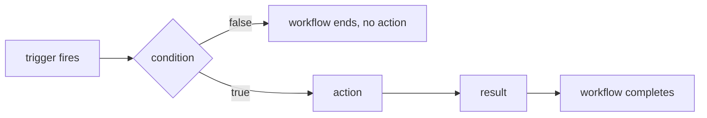
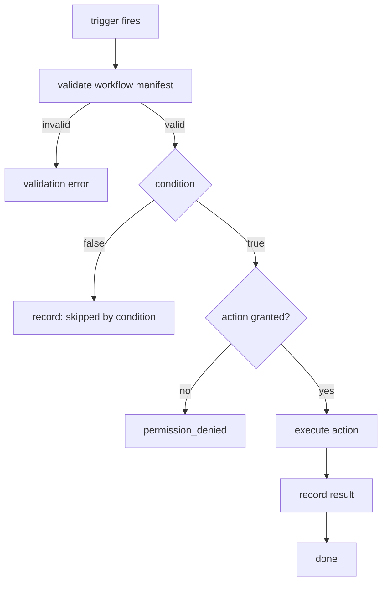
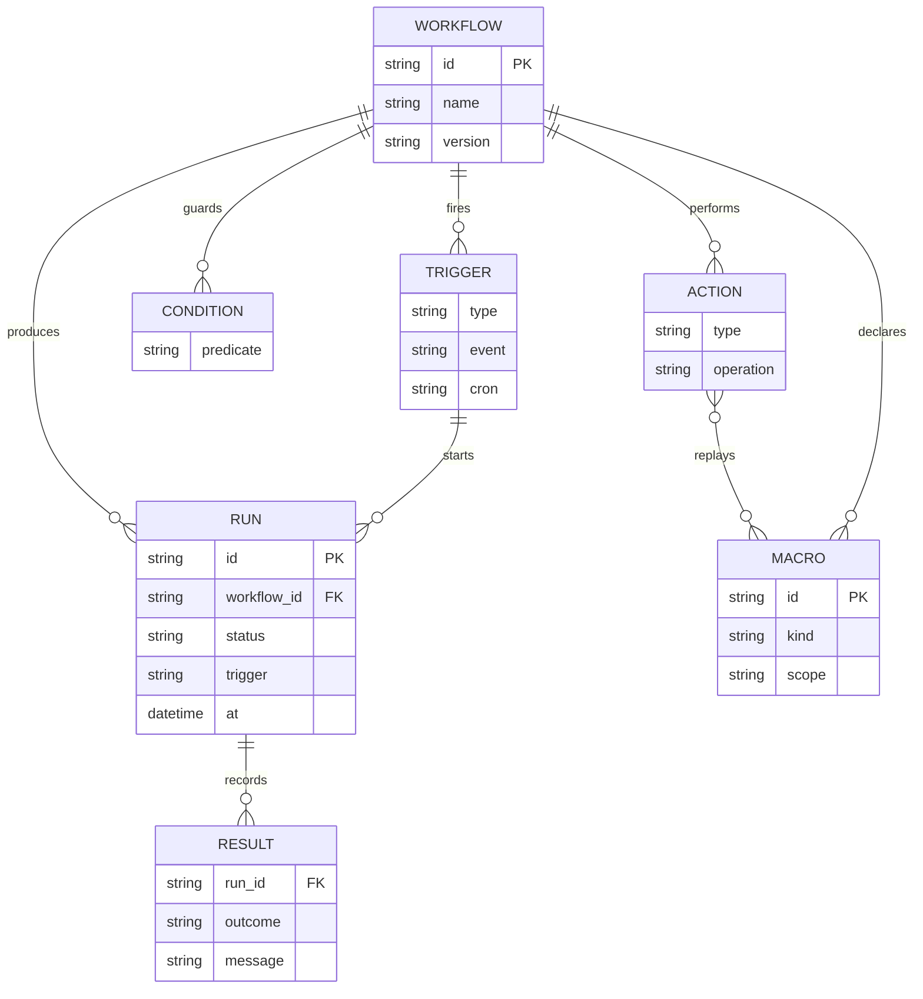

# DEX Automation Specification

Contract version 1 (draft).

## Purpose

Automation makes the desktop programmable: a declared workflow — trigger,
action, condition, result — that the Workspace Runtime evaluates and executes.
Automation targets the development workflow: Workspaces, Workspace Services,
tooling, and the terminal/editor/browser context that surrounds them. It is not
a general-purpose consumer-desktop automation platform (see
[`../00-vision/04_NonGoals.md`](../00-vision/04_NonGoals.md)).

This document is the normative contract for the workflow model, trigger and
action types, the scheduler, macros, smart actions, and the workflow manifest
format. The workflow engine, scheduler, and macros ship in roadmap Phase 7
(M7.1–M7.4); this specification is the contract that phase implements.

## Why automation is workflow-shaped

DEX is organized around Context, not applications (principle 6). Automation
follows the same shape: a workflow reacts to something that happened (a
trigger), performs a bounded action, optionally guarded by a condition, and
produces a result. This declarative model keeps automation visible,
scriptable (principle 3), and safe to review — an automation that is declared
in a manifest is an automation that can be validated, scheduled, and revoked.

## Workflow model

A workflow is a four-part declaration:

```
trigger → condition → action → result
```

- **trigger** — the event that starts evaluation.
- **condition** — an optional predicate evaluated before the action runs. A
  false condition ends the workflow without acting.
- **action** — the bounded effect the workflow performs.
- **result** — the observable outcome, recorded for the journal and for
  subsequent workflows.



### Trigger types

| Type | Meaning |
|---|---|
| `event` | A Runtime or plugin event (for example a build finished, a Workspace activated) |
| `cron` | A scheduled time, per the scheduler contract |
| `startup` | Runtime startup |
| `manual` | An explicit run via `dex automation run <workflow>` |

### Action types

| Type | Meaning |
|---|---|
| `run command` | Invoke a Runtime command through the typed surface |
| `execute shell` | Run a shell command; gated by explicit grant, never by default |
| `control Workspace Service` | Start, stop, or restart a declared Workspace Service |
| `macro` | Replay a recorded keyboard, mouse, or shell macro |

### Result

Every run produces a result: success or failure, with the workflow id, the
trigger that fired, and the action's outcome. Results are recorded in the
journal and are queryable through the CLI.

## Scheduler contract

- **Cron semantics** — `cron` triggers follow standard five-field cron
  semantics (`minute hour day-of-month month day-of-week`), evaluated against
  local time.
- **Missed-run policy** — if the Runtime is not running when a scheduled run
  comes due, the run is missed. Missed runs are recorded as missed and are not
  retroactively executed; the next scheduled run proceeds normally. The policy
  is deterministic and documented: a `cron` trigger never catches up in bursts.
- **Startup triggers** — `startup` workflows run once per Runtime start, after
  the Runtime is ready but off the critical path of startup (per the
  performance contract).
- **Manual triggers** — always available, always immediate, and the fallback
  when any other trigger is unavailable.

## Macros

Macros are the recording-and-replay capability of Automation.

- **Keyboard macros** — a sequence of key presses and releases, replayed into
  the focused window.
- **Mouse macros** — a sequence of pointer moves and clicks, replayed within the
  Wayland surface the Runtime can address.
- **Shell macros** — a declared sequence of shell commands, executed through the
  same gated `execute shell` path as shell actions.

A macro is a first-class declared artifact: it has a name, a version, and a
granted scope. Recording is explicit and user-initiated; a macro is never
recorded implicitly.

## Smart actions

Smart actions are AI-generated workflows (roadmap M7.4). They follow the AI is
Optional principle (principle 12) and the Non-Goals rule that no core capability
may require a model, an API key, or a network:

- A smart action is an ordinary workflow once generated; it is validated against
  the same schema and executed by the same engine.
- If the AI capability is unavailable (no Provider, no network, no grant), a
  smart action degrades to the manual workflow it would have generated: the
  user composes the same trigger/condition/action by hand.
- Generation is never on the critical path of a scheduled or startup workflow.

## Workflow manifest format

A workflow is declared in a manifest, schema-validated before it can be
scheduled or run. Unknown fields are rejected.

```yaml
# workflow manifest (illustrative)
id: build-on-activate
name: Build on Workspace Activation
version: 1.0.0
trigger:
  type: event
  event: dex.workspace.activated
  filter: { workspace: "web" }
condition:
  has: dex.workspace.service.web-api
action:
  type: control-workspace-service
  operation: restart
  service: web-api
result:
  record: true
```

### Manifest fields

| Field | Type | Required | Meaning |
|---|---|---|---|
| `id` | string | yes | Unique workflow identifier |
| `name` | string | yes | Human-readable name |
| `version` | string | yes | Semantic version of the workflow |
| `trigger` | object | yes | One trigger type and its parameters |
| `condition` | object | no | Optional predicate |
| `action` | object | yes | One action type and its parameters |
| `result` | object | no | Result-recording policy |

## Evaluation flow



## Workflow domain model



## Related Documents

- Automation as development-workflow only: [`../00-vision/04_NonGoals.md`](../00-vision/04_NonGoals.md)
- AI is Optional principle: [`../00-vision/02_Principles.md`](../00-vision/02_Principles.md)
- CLI surface for automation: [`CLI.md`](CLI.md)
- Workspace Service contract: [`Workspace.md`](Workspace.md)
- Plugin event surface: [`PluginAPI.md`](PluginAPI.md)
- Journal: [`Journal.md`](Journal.md)
- Automation roadmap milestones (M7.1–M7.4): [`../10-product/11_Product_Roadmap.md`](../10-product/11_Product_Roadmap.md)