# DEX CLI Specification

Contract version 1 (draft).

## Purpose

The CLI is the complete, stable surface of the Workspace Runtime. This follows
the CLI First principle (principle 3): every capability is reachable and
scriptable from the command line, and a capability that cannot be automated is
a capability that does not exist. The graphical shell is a second client of the
same command surface — it drives the same commands, so nothing is GUI-only and
nothing is CLI-only.

This document is the *contract*: the command tree, the global flags, the output
and exit-code guarantees, and the scripting rules that make the CLI safe to
compose in pipelines. The user-facing reference for everyday use is
[`../70-api/CLI.md`](../70-api/CLI.md); this specification is the normative
contract that reference describes.

## Why the CLI is the contract

The shell and the CLI must not diverge. If a feature is reachable only through
the shell, it is not scriptable and therefore, by the CLI First principle, does
not exist. The CLI is therefore the authoritative surface: every Runtime
operation has a CLI form with a stable interface, and the shell is implemented
as a client of that same surface.

Two consequences follow and are binding:

1. **Stable output.** Machine-readable output (`--json`) is a stable contract.
   Field names, ordering, and types do not change between minor versions without
   a versioned change to this specification.
2. **No interactive prompts when not a TTY.** When standard input is not a
   terminal, the CLI never prompts. Every operation that would require a
   decision either takes it from flags, uses a documented default, or fails with
   a usage error (exit code 2). This is what makes the CLI safe in scripts,
   cron, and automation.

## Command tree

The command tree is a single binary `dex`. Commands are grouped by domain and

```mermaid
flowchart TD
    DEX["dex"]
    DEX --> INIT["init"]
    DEX --> ACT["activate"]
    DEX --> SNAP["snapshot"]
    DEX --> REST["restore"]
    DEX --> SVC["service"]
    DEX --> PLG["plugin"]
    DEX --> WGT["widget"]
    DEX --> VAULT["vault"]
    DEX --> THEME["theme"]
    DEX --> JRNL["journal"]
    DEX --> SEC["secrets"]
    DEX --> AUTO["automation"]
    DEX --> HELP["help"]
    DEX --> VER["version"]

    SVC --> SVC_START["start <service>"]
    SVC --> SVC_STOP["stop <service>"]
    SVC --> SVC_STATUS["status"]
    SVC --> SVC_LIST["list"]

    PLG --> PLG_INSTALL["install <manifest>"]
    PLG --> PLG_LIST["list"]
    PLG --> PLG_UPDATE["update <id>"]
    PLG --> PLG_UNINSTALL["uninstall <id>"]

    WGT --> WGT_INSTALL["install <manifest>"]
    WGT --> WGT_LIST["list"]
    WGT --> WGT_ENABLE["enable <id>"]
    WGT --> WGT_DISABLE["disable <id>"]

    VAULT --> VAULT_QUERY["query <terms>"]
    VAULT --> VAULT_ADD["add <note>"]
    VAULT --> VAULT_SEARCH["search <terms>"]

    THEME --> THEME_LIST["list"]
    THEME --> THEME_SET["set <name>"]
    THEME --> THEME_VALIDATE["validate <manifest>"]

    JRNL --> JRNL_SHOW["show"]
    JRNL --> JRNL_EXPORT["export"]

    SEC --> SEC_SET["set <key>"]
    SEC --> SEC_GET["get <key>"]
    SEC --> SEC_ROTATE["rotate <key>"]
    SEC --> SEC_REVOKE["revoke <key>"]

    AUTO --> AUTO_RUN["run <workflow>"]
    AUTO --> AUTO_LIST["list"]
    AUTO --> AUTO_VALIDATE["validate <manifest>"]
```

mirror the command domains of the Runtime (`core/services/<domain>.ts` ↔
`src-tauri/src/commands/<domain>.rs`).



### Command semantics

| Command | Operation | Notes |
|---|---|---|
| `init` | Declare a new Workspace Manifest | Writes a Manifest at the target path; see [`Manifest.md`](Manifest.md) |
| `activate <workspace>` | Perform Workspace Activation | Brings a declared Workspace to life; see [`Workspace.md`](Workspace.md) |
| `snapshot <workspace>` | Capture a Workspace Snapshot | Point-in-time capture; see [`Snapshot.md`](Snapshot.md) |
| `restore <snapshot>` | Restore a Workspace from a Snapshot | Re-establishes the captured state |
| `service …` | Manage Workspace Services | Start/stop/status/list; see [`Workspace.md`](Workspace.md) |
| `plugin …` | Manage Plugins | Install/list/update/uninstall; see [`PluginAPI.md`](PluginAPI.md) |
| `widget …` | Manage Widgets | Install/list/enable/disable; see [`WidgetAPI.md`](WidgetAPI.md) |
| `vault …` | Query and write the Knowledge Vault | See [`Knowledge.md`](Knowledge.md) |
| `theme …` | List, set, and validate themes | See [`Theme.md`](Theme.md) |
| `journal …` | Read and export the journal | See [`Journal.md`](Journal.md) |
| `secrets …` | Manage Secrets | Set/get/rotate/revoke; see [`Secrets.md`](Secrets.md) |
| `automation …` | Run and validate workflows | See [`Automation.md`](Automation.md) |
| `help [command]` | Print usage for a command | Never exits non-zero for a valid command name |
| `version` | Print the Runtime version | Machine-readable with `--json` |

## Global flags

Global flags are accepted before or after the subcommand and apply to the whole
invocation.

| Flag | Type | Meaning |
|---|---|---|
| `--json` | boolean | Emit machine-readable JSON instead of human text |
| `--workspace <path>` | string | Select the active Workspace by path or id; overrides the ambient Context |
| `--verbose` | boolean | Emit additional diagnostic detail on stderr |

`--workspace` selects the Workspace that a command operates on when the command
does not take a Workspace argument of its own. When neither is given, the
command uses the ambient Context (the currently active Workspace). A command
that requires a Workspace and cannot resolve one fails with a `not_found` error.

## Output formats

### Human text (default)

Human output is line-oriented, stable in structure, and free of control
characters. It is intended for a person reading a terminal, not for parsing.
Scripts must use `--json`.

### Machine output (`--json`)

With `--json`, every command emits exactly one JSON document on stdout. The
document is a stable envelope:

```json
{
  "ok": true,
  "data": { }
}
```

On failure the envelope carries the structured error:

```json
{
  "ok": false,
  "error": {
    "type": "not_found",
    "message": "workspace 'web' not found"
  }
}
```

The `error.type` field is drawn from the closed error-envelope set defined by
ADR-0002: `validation`, `not_found`, `permission_denied`, `conflict`,
`unsupported`, `internal`. The `data` shape is per-command and is part of this
contract; it is documented in the user-facing reference
([`../70-api/CLI.md`](../70-api/CLI.md)).

## Exit codes

Exit codes are a stable contract. Scripts branch on them.

| Code | Meaning |
|---|---|
| `0` | Success |
| `1` | Runtime error — an `internal` failure inside the Runtime |
| `2` | Usage error — malformed invocation, unknown command, missing required flag |
| `3` | `validation` — input failed schema or semantic validation |
| `4` | `not_found` — a referenced entity does not exist |
| `5` | `permission_denied` — the operation is not granted |
| `6` | `conflict` — the operation conflicts with existing state |
| `7` | `unsupported` — the operation is not supported in this environment |

The mapping from the error-envelope `type` to the exit code is fixed and
documented above. A transport failure (the Runtime cannot be reached) exits `1`.
`help` and `version` exit `0` for valid invocations and `2` for malformed ones.

## Scripting contract

The following rules are binding so that the CLI is safe to compose:

- **No prompts when not a TTY.** If standard input is not a terminal, the CLI
  never prompts. Required decisions come from flags, documented defaults, or a
  usage error (exit code 2).
- **stdout carries the result; stderr carries diagnostics.** Human text and
  `--json` results go to stdout. Warnings and `--verbose` detail go to stderr.
  A successful command writes nothing to stderr.
- **Stable field names.** `--json` field names and their types are stable within
  a contract version. A breaking change is a new contract version, not a silent
  field rename.
- **Idempotent where documented.** Commands that declare idempotency (for
  example `theme set` to the current theme) succeed without error on repeat.
- **No hidden state.** Every effect of a command is observable through the
  command surface; there is no side channel.

## Completion

The CLI provides shell completion for `bash`, `zsh`, and `fish`. Completion is
generated from the same command tree that defines the CLI, so it never drifts
from the implemented surface. Completion covers command names, subcommands, and
the `--workspace` values known to the Runtime. The completion script is emitted
by `dex completion <shell>` and is deterministic for a given contract version.

## Related Documents

- User-facing CLI reference: [`../70-api/CLI.md`](../70-api/CLI.md)
- CLI First principle: [`../00-vision/02_Principles.md`](../00-vision/02_Principles.md)
- Error envelope and typed IPC: [`../50-adr/0002-typed-ipc-contract.md`](../50-adr/0002-typed-ipc-contract.md)
- Workspace Manifest: [`Manifest.md`](Manifest.md)
- Workspace Activation and Workspace Service: [`Workspace.md`](Workspace.md)
- Workspace Snapshot: [`Snapshot.md`](Snapshot.md)
- Plugin contract: [`PluginAPI.md`](PluginAPI.md)
- Widget contract: [`WidgetAPI.md`](WidgetAPI.md)
- Knowledge Vault: [`Knowledge.md`](Knowledge.md)
- Theme contract: [`Theme.md`](Theme.md)
- Secrets contract: [`Secrets.md`](Secrets.md)
- Automation contract: [`Automation.md`](Automation.md)
- Journal: [`Journal.md`](Journal.md)