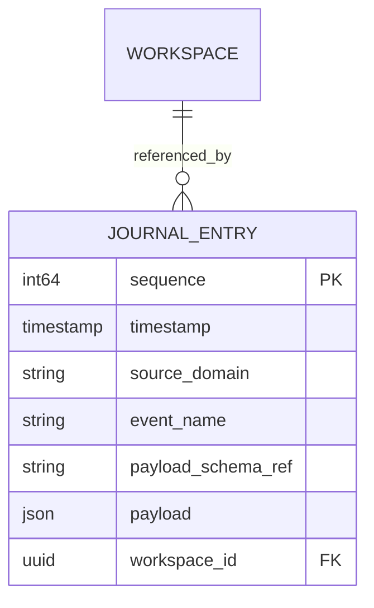
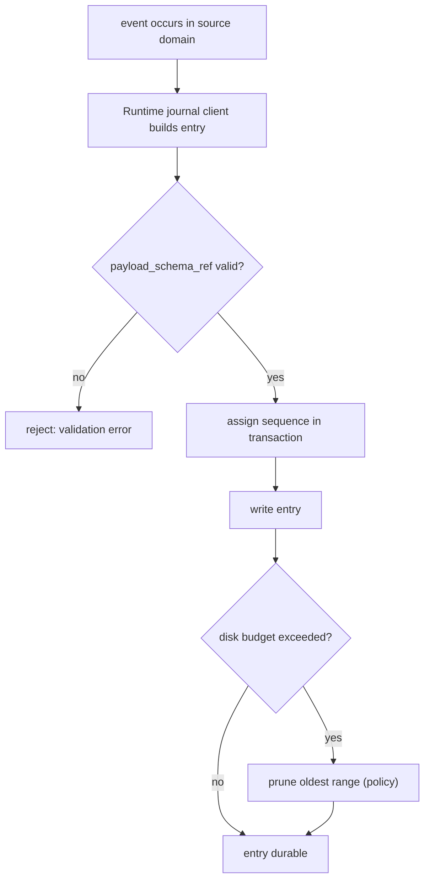

# Journal — Specification

- **Contract version:** 1 (draft)
- **Status:** Draft
- **Owner:** Runtime subsystem (`src-tauri/src/services/journal/`)
- **Canonical terminology:** [`../00-vision/03_Glossary.md`](../00-vision/03_Glossary.md)

## Purpose

The Journal is the append-only, durable record of Runtime and Workspace
activity — the memory of what happened. It is distinct from the live EventBus:
the EventBus delivers events to live subscribers in real time; the Journal
records them durably for later query.

**Why a Journal exists.** The Workspace lifecycle, the Snapshot protocol, and
the Manifest versioning rule all make promises that only hold if *what
happened* is itself recoverable. When a Workspace enters `failed`, when a
restore is refused for schema drift, when a service exhausts its restart
budget — the Journal is the record a developer or the Runtime can consult to
understand why, after the fact, with no live subscriber attached. It is the
contract that makes the Runtime's behavior auditable.

**What this contract guarantees.**

1. Entries are append-only and immutable once written.
2. Every entry is sequenced, timestamped, and attributed to a source domain and
   an event name.
3. Retention and pruning are policy-driven and explicit; pruning never mutates
   retained entries.
4. The Journal is queryable over time ranges, by domain and Workspace, with
   pagination.

## Entry Model

A journal entry is an immutable record. The sequence number is the Journal's
backbone: it is monotonic, dense at write time, and the basis for range
queries and pagination.

| Field | Type | Description |
|---|---|---|
| `sequence` | `int64` | Monotonic sequence number, assigned by the Journal on append. The primary key. |
| `timestamp` | `timestamp` | UTC instant the entry was written (RFC 3339). |
| `source_domain` | `string` | The subsystem that produced the entry: `workspace`, `manifest`, `snapshot`, `knowledge`, `service`, `runtime`, `ipc`, … |
| `event_name` | `string` | The stable event name, `dex.<domain>.<event>` (matching the EventBus naming rule in ADR-0002). |
| `payload_schema_ref` | `string` | Reference to the schema that describes `payload` (e.g. a schema registry key or versioned schema name). Null when the entry has no payload. |
| `payload` | `json` | The entry's data, conforming to `payload_schema_ref`. |
| `workspace_id` | `uuid` | The Workspace the entry concerns; null for Runtime-global entries. |



**Sequence semantics.** `sequence` is assigned at append time and is
monotonic per Journal (the Journal is a single global sequence, not a
per-Workspace sequence, so global ordering is always available). Sequence
numbers are never reused; a pruned Journal has gaps, and gaps are expected.

## Append-Only Semantics

1. **Append-only.** The Journal exposes only append and query operations. There
   is no update, no delete-by-key, and no edit of an existing entry. The
   schema exposes `append` and `query`; everything else is rejected.
2. **Immutability.** An entry's fields are fixed at write time. Corrections are
   new entries that supersede, never rewrites.
3. **Atomic append.** Each append is a single SQLite transaction; an entry is
   either fully visible or not present. The sequence is assigned inside the
   transaction, so concurrent appenders never collide.
4. **Failure handling.** A failed append is reported to the caller with an
   `AppError` of type `internal`; the Journal does not partially write. The
   Runtime treats Journal failure as non-fatal to Workspace operations — the
   Journal is a record, not a dependency — but the failure is itself logged to
   stderr via the logger facade.

### Retention and pruning policy

The Journal is the durable record, but durability is bounded by disk. Retention
is policy-driven:

- The default policy retains all entries, with a configurable disk budget. When
  the budget is exceeded, the Runtime prunes oldest entries first.
- Pruning is batch, oldest-first, by `sequence`; a prune operation deletes a
  contiguous range of oldest entries in a transaction.
- Pruning never mutates retained entries. After a prune, sequence numbers of
  retained entries are unchanged; queries simply observe a lower sequence
  floor.
- Policy changes (budget, retention duration) are themselves Journal entries,
  so the history of the policy is part of the record.
- The Journal is a local, Rust-owned store; there is no remote Journal and no
  synchronization (Offline First, Principle 2).

## Query Interface

Queries are typed and validated at the IPC boundary (ADR-0002), exposed through
`core/services/journal.ts`. The Journal's query surface is:

| Operation | Shape | Description |
|---|---|---|
| `journal.append` | `AppendEntryArgs` | Appends one entry; returns its `sequence`. Used by the Runtime's journal client; not callable by arbitrary frontend features without capability grant. |
| `journal.query` | `JournalQueryArgs` | Range/domain/Workspace query with pagination. |

```ts
interface JournalQueryArgs {
  from?: number;           // inclusive lower sequence bound
  to?: number;             // inclusive upper sequence bound
  fromTime?: string;       // ISO 8601 lower bound on timestamp
  toTime?: string;         // ISO 8601 upper bound on timestamp
  sourceDomains?: string[];// filter by source domain
  workspaceId?: string;    // filter by Workspace
  eventNames?: string[];   // filter by event name
  limit?: number;          // page size (default 100, max 1000)
  before?: number;         // pagination cursor: return entries with sequence < before
}
```

```ts
interface JournalQueryResult {
  entries: JournalEntry[];
  hasMore: boolean;
}
```

**Pagination.** The `before` cursor gives stable, keyset pagination over the
immutable sequence; there is no offset drift under concurrent appends. Filter
combinations are AND-ed. A query never returns more than `limit` entries.

## Relationship to the EventBus

The EventBus and the Journal are two consumers of the same underlying activity,
with different contracts.

- **EventBus = live delivery.** The EventBus delivers events to live
  subscribers in real time (architecture document:
  [`../20-architecture/24_EventBus.md`](../20-architecture/24_EventBus.md)). A
  subscriber that is not attached when an event fires does not receive it.
- **Journal = durable record.** The Journal records entries for later query,
  whether or not any subscriber was live. Entries outlive processes, sessions,
  and Workspaces.
- **The bus may feed the Journal.** A Runtime-internal bridge may subscribe the
  Journal to the EventBus and append an entry for each subscribed event. The
  reverse does not hold: the Journal never emits onto the bus. The bus is the
  live path; the Journal is the record path. They share the `dex.<domain>.<event>`
  naming rule so that an EventBus event and a Journal entry for the same
  activity are name-identical and traceable to each other.
- **Guarantees differ.** The EventBus offers at-least-once live delivery with
  no durability across restarts; the Journal offers durable, append-only,
  queryable history. A feature that needs to survive a restart must write (or
  rely on something that writes) a Journal entry; a feature that needs a live
  reaction must subscribe to the EventBus.

```mermaid
flowchart LR
    SRC["source domain"] -->|emit| BUS["EventBus (live delivery)"]
    SRC -->|append| J["Journal (durable record)"]
    BUS -. bridge .->|subscribe & append| J
    BUS --> SUB["live subscribers"]
    J --> Q["journal.query (range / domain / workspace / pagination)"]
```

## Append Lifecycle



## Related Documents

- Canonical terminology: [`../00-vision/03_Glossary.md`](../00-vision/03_Glossary.md)
- EventBus (live delivery): [`../20-architecture/24_EventBus.md`](../20-architecture/24_EventBus.md)
- System architecture: [`../20-architecture/20_System_Architecture.md`](../20-architecture/20_System_Architecture.md)
- Workspace contract (lifecycle transitions journaled): [`Workspace.md`](Workspace.md)
- Point-in-time restore (capture/restore journaled): [`Snapshot.md`](Snapshot.md)
- Knowledge Vault (memory of what is known): [`Knowledge.md`](Knowledge.md)
- Typed IPC contract: [`../50-adr/0002-typed-ipc-contract.md`](../50-adr/0002-typed-ipc-contract.md)