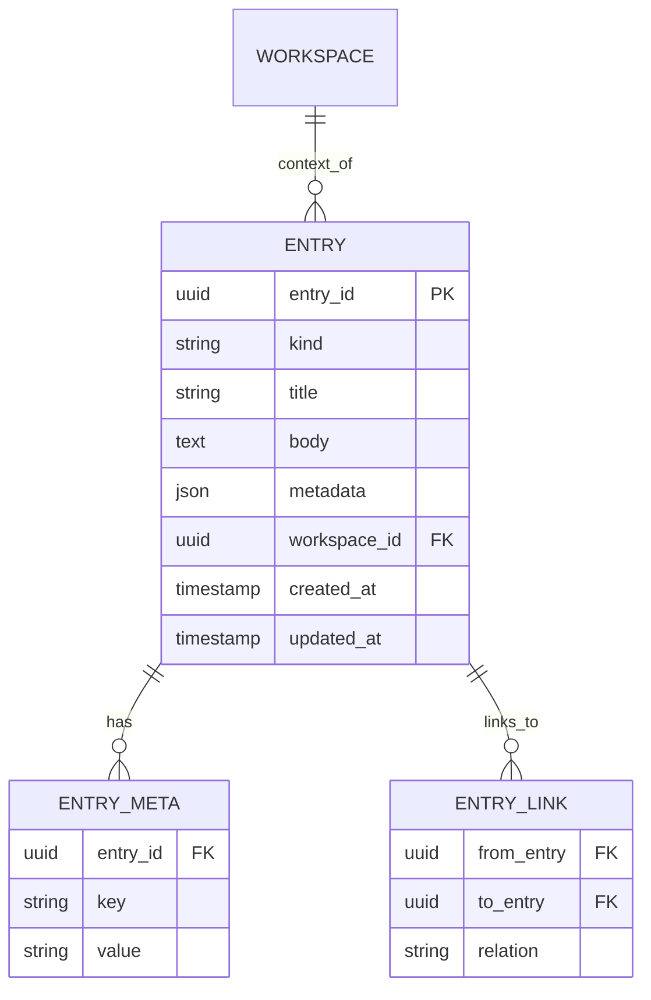
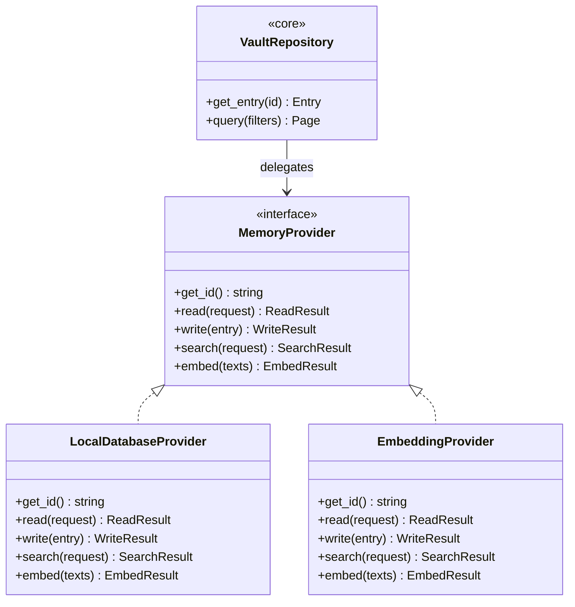

# Knowledge Vault — Specification

- **Contract version:** 1 (draft)
- **Status:** Draft
- **Owner:** Knowledge subsystem (`src-tauri/src/services/knowledge/`)
- **Canonical terminology:** [`../00-vision/03_Glossary.md`](../00-vision/03_Glossary.md)

## Purpose

The Knowledge Vault is DEX's persistent, local memory layer: the durable store
of a developer's Context, notes, and history, spanning Workspaces and time
(Glossary). It is the foundation of DEX's memory and of every AI capability,
and it is always local.

**Why the Vault exists.** Principle 6 (Context over Applications) makes Context
the top-level model of the shell; principle 2 (Offline First) makes local state
the source of truth; principle 12 (AI is Optional) makes intelligence a
*consumer* of memory, never a precondition. The Knowledge Vault is the single
place these three principles meet: a durable, local, queryable store that
survives across Workspaces, sessions, and reboots, and that intelligence
capabilities may read from — or not.

**What this contract guarantees.**

1. The Vault is local by default; nothing leaves the machine without an
   explicit request.
2. Every entry is typed, versioned, and carries provenance (the Workspace it
   belongs to, the time it was written).
3. Queries are typed and predictable; adapters implement a fixed interface and
   never change the Vault's contract.
4. The Vault works fully without a model, an API key, or a network.

## Storage Model

The Knowledge Vault is a local SQLite database owned by Rust (ADR-0001: SQLite
is accessed only by Rust; schema truth lives in `database/migrations/`). The
frontend and CLI reach it only through typed contract clients in
`core/services/knowledge.ts`. The Vault is a single database spanning all
Workspaces; entries carry their own provenance.

- **Local by construction.** The Vault database lives under the user's data
  directory. There is no remote store, no account, and no telemetry. A
  synchronization capability would be an opt-in extension layered on top —
  never a precondition (Principle 2).
- **Migrations.** Schema changes are append-only migrations (ADR-0001), shipped
  with the Rust model and zod schema in one slice.
- **Embedding storage.** If an embedding backend is present (via a Memory
  Provider), vectors are stored in a provider-owned store, never inside the
  core Vault schema. The core Vault remains usable without embeddings.

## Entry Model

An entry is the unit of the Vault. Every entry is an immutable record with a
type, metadata, provenance, and timestamps.



### Entry types

| `kind` | Semantics | Notes |
|---|---|---|
| `note` | Free-form durable note. | The general-purpose unit. |
| `decision` | A recorded decision and its rationale. | Anchored to a Workspace; carries `metadata.resolved_at`. |
| `context` | A Context record for a Workspace: what was in progress, focus, pinned items. | One active Context per Workspace at a time; older Contexts remain as history. |
| `activity` | A machine-derived record of activity (session opened, file visited, service started). | Written by the Runtime and feature subsystems; distinct from the Journal (see below). |

### Fields

| Field | Type | Description |
|---|---|---|
| `entry_id` | `uuid` | Stable identity (UUIDv7). |
| `kind` | `enum` | One of the four types above. |
| `title` | `string` | Short human-readable title. |
| `body` | `text` | The entry's content (markdown). |
| `metadata` | `json` | Opaque key/value metadata; reserved keys prefixed `dex.` are not permitted. |
| `workspace_id` | `uuid` | Provenance: the Workspace the entry belongs to. May be absent for global entries. |
| `created_at` | `timestamp` | UTC instant of creation. |
| `updated_at` | `timestamp` | UTC instant of last edit. |

**Immutability rule.** An entry's `entry_id`, `kind`, and `created_at` are
immutable. Editing rewrites `body`/`metadata` and bumps `updated_at`; deleting
is a soft delete (a `deleted_at` tombstone), because a Journal and memory
subsystem must not lose history silently.

### Provenance

Every entry records the Workspace it belongs to and the time it was written.
`workspace_id` is the same identifier used by the Workspace registry
([`Workspace.md`](Workspace.md)), the Journal, and Snapshots, so history can be
reconstructed across subsystems: which Workspace was active when an activity
entry was written, and which Context it referenced.

## Query Interface

Queries are typed and validated at the IPC boundary (ADR-0002). The Runtime
exposes a fixed set of query operations through contract clients in
`core/services/knowledge.ts`; features and the CLI use only these.

| Operation | Shape | Description |
|---|---|---|
| `vault.entry.create` | `CreateEntryArgs` | Writes a new entry; returns the entry. |
| `vault.entry.get` | `{ entry_id }` | Fetches one entry. |
| `vault.entry.update` | `{ entry_id, body?, metadata? }` | Edits body/metadata; bumps `updated_at`. |
| `vault.entry.delete` | `{ entry_id }` | Soft-deletes an entry. |
| `vault.entry.search` | `SearchArgs` | Typed query over entries (below). |
| `vault.context.get_active` | `{ workspace_id }` | Returns the active Context for a Workspace. |
| `vault.context.set_active` | `ContextArgs` | Sets the active Context for a Workspace. |

### Search and filters

`vault.entry.search` takes typed filters; every filter is optional and
filters are AND-combined.

```ts
interface SearchArgs {
  workspaceId?: string;        // filter by provenance
  kind?: EntryKind;            // filter by entry type
  from?: string;               // created_at >= (ISO 8601)
  to?: string;                 // created_at <= (ISO 8601)
  query?: string;              // full-text query over title + body
  limit?: number;              // page size (default 50, max 200)
  offset?: number;             // pagination cursor
}
```

- **Full-text.** `query` runs a full-text search over `title` and `body`.
- **Pagination.** Results are returned as a page: `{ entries, total, offset }`.
  Pages are stable for the duration of a query; the Vault does not guarantee
  snapshot isolation across pages if concurrent writes occur.

## Memory Provider Interface

A Memory Provider is an adapter that connects the Knowledge Vault to a storage
or model backend — a local database, an embedding store, a model endpoint
(Glossary). Providers are the seam that keeps the Vault's contract independent
of any specific backend (Principle 9, Composition over Inheritance).



The interface is fixed; adapters implement it. The core Vault (the
`VaultRepository`) delegates backend operations to a Provider and never
depends on a concrete implementation.

```ts
interface MemoryProvider {
  readonly id: string; // stable provider identifier, e.g. "dex.sqlite"

  read(request: ReadRequest): Promise<ReadResult>;
  // Resolves stored entries for a query. The core decides query semantics;
  // the provider returns raw matches for the core to validate and shape.

  write(entry: Entry): Promise<WriteResult>;
  // Persists an entry. Must be idempotent on entry_id (re-write = update).

  search(request: SearchRequest): Promise<SearchResult>;
  // Backend-native search (e.g. full-text or vector). The core merges,
  // deduplicates, and ranks.

  embed(texts: string[]): Promise<EmbedResult>;
  // Optional for storage-only providers: returns vectors for the given
  // texts, or a structured "unsupported" result the core treats as absent.
}
```

**Rules.**

1. The Vault core owns query semantics and validation; a Provider never sees
   unvalidated input (ADR-0002 applies at the Provider boundary as well as the
   IPC boundary).
2. `embed` is the only AI-adjacent operation and it is optional: a Provider
   without an embedding backend returns a structured `unsupported`, and the core
   degrades to full-text search (Principle 12).
3. Swapping the backend never changes the Vault's contract; providers are
   registered at Runtime startup and are not user-facing on the core path.

## Privacy Rules

1. **Local by default.** The Vault database is written only to the local data
   directory. No entry, query, or index leaves the machine as a matter of
   course.
2. **Explicit request required for egress.** Anything that leaves the machine —
   a model endpoint, a sync target, a backup — is an explicit, user-facing
   action. There is no implicit synchronization, no telemetry, and no
   background network activity (Non-Goals: "DEX is not a cloud service").
3. **Workspace-scoped provenance.** Entries carry `workspace_id`; the Vault
   spans Workspaces, but queries may be scoped by provenance, so an entry is
   never assumed to be visible to another Workspace.
4. **Secrets are not knowledge.** Credentials and secrets are governed by the
   Secrets subsystem ([`Secrets.md`](Secrets.md)), not by the Knowledge Vault.
   The Vault never stores secret material; a reference to a secret may be
   stored as a `dex.`-reserved metadata value only via the Secrets subsystem.

## Relationship to other subsystems

- **Context.** The active Context of a Workspace is stored as a `context` entry
  (`vault.context.*`). Workspace Activation re-establishes Context by reading
  the active Context entry (see [`Workspace.md`](Workspace.md)).
- **Journal.** The Journal records *what happened*; the Vault records *what is
  known*. Activity entries in the Vault are curated memory; Journal entries are
  the durable, append-only record. The Journal never writes to the Vault, and
  the Vault never writes to the Journal (see [`Journal.md`](Journal.md)).
- **Snapshots.** A Snapshot references the active Context record; restore
  re-establishes Context from the Vault (see [`Snapshot.md`](Snapshot.md)).

## Related Documents

- Canonical terminology: [`../00-vision/03_Glossary.md`](../00-vision/03_Glossary.md)
- Principles (Offline First, Context over Applications, AI is Optional): [`../00-vision/02_Principles.md`](../00-vision/02_Principles.md)
- System architecture and boundaries: [`../20-architecture/20_System_Architecture.md`](../20-architecture/20_System_Architecture.md)
- Workspace contract (Context re-establishment): [`Workspace.md`](Workspace.md)
- Point-in-time restore (Context reference): [`Snapshot.md`](Snapshot.md)
- Durable activity record: [`Journal.md`](Journal.md)
- Secrets subsystem: [`Secrets.md`](Secrets.md)
- Typed IPC contract: [`../50-adr/0002-typed-ipc-contract.md`](../50-adr/0002-typed-ipc-contract.md)