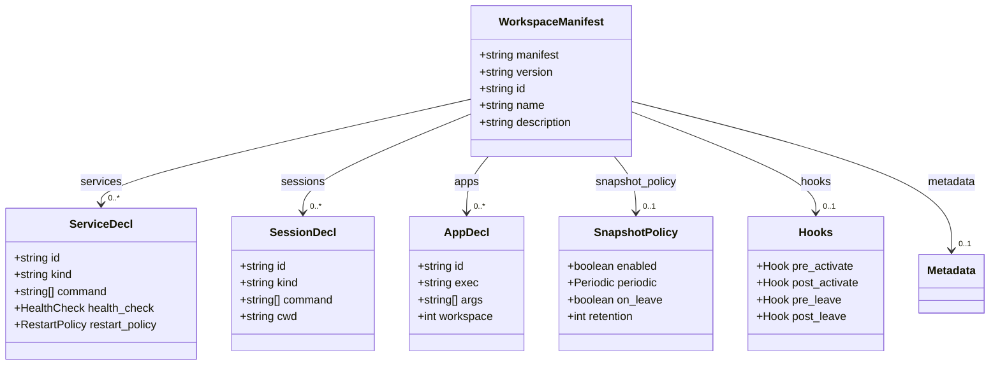

# Workspace Manifest — Specification

- **Contract version:** 1 (draft)
- **Status:** Draft
- **Owner:** Workspace subsystem (`src-tauri/src/services/manifest/`)
- **Canonical terminology:** [`../00-vision/03_Glossary.md`](../00-vision/03_Glossary.md)

## Purpose

A Workspace Manifest is the declarative, versioned document that defines a
Workspace: what it contains, what runs when it is activated, and what state it
captures (Glossary). It is the contract between a Workspace and the Workspace
Runtime: the same declaration activates a Workspace on any machine.

**Why a Manifest exists.** The Manifesto's long-term test for DEX is that a
Workspace can be declared once and recreated anywhere. That promise is only
kept if the declaration is a document, not a set of runtime actions. A
Manifest separates *what a Workspace is* from *how any particular Runtime
instantiates it*: the Runtime reads the Manifest and derives its behavior from
it, so the same Manifest is valid on a fresh machine, after a reboot, or in a
different environment. It also makes Workspaces reviewable (a Manifest is a
diffable artifact) and scriptable (a Manifest is the CLI First surface for
declaring a Workspace).

**What this contract guarantees.**

1. A Manifest is a complete, self-contained declaration: resolving it requires
   no external state beyond the file itself and its referenced snapshots.
2. A Manifest is validated before it is accepted: unknown fields are rejected,
   required fields are enforced, and the versioning rule is stated.
3. A Manifest version is immutable once consumed; evolution happens by version
   increment, never by silent mutation.

The Manifest is a different contract from a Plugin manifest. A Workspace
Manifest declares a *composition of sessions, services, and apps*; a Plugin
manifest declares a *native extension surface* (commands, events, capability
grants). The distinction is enforced at validation time and documented in
[`PluginAPI.md`](PluginAPI.md).

## Format

- **Canonical form:** YAML. YAML is the authoring and exchange form because it
  is human-writable, diffable, and commentable.
- **Documented and versioned:** every Manifest carries an explicit `manifest` /
  `version` field identifying the schema version it conforms to. A Runtime
  accepts a Manifest only if it understands the declared schema version.
- **Alternative forms:** the Runtime may accept JSON as an equivalent
  serialization of the same schema (YAML 1.2 is a superset of JSON). Both
  forms parse into the same validated model; there is no third wire format.
- **Location:** Manifests live as files (e.g. `dex.workspace.yaml` at a
  project root) and are resolved by the Runtime's manifest resolver. A
  Workspace record references a Manifest by `manifest_ref` (see
  [`Workspace.md`](Workspace.md)).

## Top-Level Schema

The top level of a Manifest has the following fields.

| Field | Type | Required | Description |
|---|---|---|---|
| `manifest` | `string` | yes | Schema marker, always the literal `dex.workspace`. |
| `version` | `semver` | yes | Schema version this Manifest conforms to. |
| `id` | `string` | yes | Declared identifier for the Workspace; a stable slug (lowercase, `[a-z0-9-]`). The Runtime derives the registry `workspace_id` from it plus a machine-local suffix. |
| `name` | `string` | yes | Human-readable display name. |
| `description` | `string` | no | Human-readable summary. |
| `services` | `list` | no | Workspace Services to start, supervise, and stop (see below). |
| `sessions` | `list` | no | Terminal and application sessions to launch on Activation. |
| `apps` | `list` | no | Desktop applications to launch on Activation. |
| `snapshot_policy` | `object` | no | Scheduling policy for Workspace Snapshots (see [`Snapshot.md`](Snapshot.md)). |
| `hooks` | `object` | no | Declared lifecycle hooks (see below). |
| `metadata` | `object` | no | Free-form key/value metadata; opaque to the Runtime. |

### Field semantics

- **`services`** — each entry declares one Workspace Service: `id`, `name`,
  `kind` (the service backend, e.g. `process`), `command` (argv for the
  process), `health_check` (`type`, `probe`, `interval_ms`, `timeout_ms`,
  `grace_period_ms`), and `restart_policy` (`mode` ∈ `always` |
  `on_failure` | `never`, `max_restarts`, `backoff_ms`). Lifecycle semantics
  are specified in [`Workspace.md`](Workspace.md).
- **`sessions`** — each entry declares a session to launch: `id`, `kind`
  (e.g. `terminal`), `command` (the program and argv), `cwd`, `env` (variable
  overrides), and `workspace_dir`. A session is launched during Activation,
  before Context re-establishment.
- **`apps`** — each entry declares a desktop application to launch: `id`,
  `exec` (the application launcher entry or executable), `args`, `workspace`
  (the target window-manager workspace), and `env`. Apps are launched during
  Activation; their windows are arranged by the window manager and restored per
  the Snapshot policy.
- **`snapshot_policy`** — declares whether and when Snapshots are taken:
  `enabled` (`boolean`), `periodic` (`interval` or `cron`), `on_leave`
  (`boolean`), `retention` (number of Snapshots kept). Semantics in
  [`Snapshot.md`](Snapshot.md).
- **`hooks`** — declared lifecycle hooks the Runtime may invoke:
  `pre_activate`, `post_activate`, `pre_leave`, `post_leave`. Each is a command
  specification (`command`, `args`, `timeout_ms`). Hooks are advisory
  extension points; a failing hook is logged to the Journal and does not abort
  the lifecycle transition.
- **`metadata`** — arbitrary key/value data, treated as opaque by the Runtime.
  It is persisted with the Workspace record and never interpreted. Reserved
  keys starting with `dex.` are not permitted (namespace is reserved for the
  Runtime).

## Validation Rules

Validation runs at declaration and at every resolution. A Manifest that fails
validation is rejected with an `AppError` of type `validation`; the Runtime
never partially applies a Manifest.

1. **Unknown fields are rejected, never ignored.** A Manifest containing a
   top-level field outside the schema (or an unknown field inside a known
   object) fails validation. This is the ADR-0005 stance applied to Workspace
   Manifests: silent tolerance of unknown fields hides typos and version drift.
2. **Required fields are enforced.** `manifest`, `version`, `id`, and `name`
   must be present and well-typed. A Manifest without a name or identifier is
   not a Workspace.
3. **`id` must be a stable slug** (`[a-z0-9-]`), because it becomes part of the
   derived `workspace_id` and of snapshot and journal keys.
4. **`version` must be a valid semver** matching a schema version the Runtime
   declares support for. Unknown schema versions are rejected with a
   `validation` error naming the supported range.
5. **`services[].id` and `sessions[].id` must be unique** within the Manifest.
6. **`snapshot_policy` references must be internally consistent**: `periodic`
   is required when `enabled` is `true` and `on_leave` is `false`.
7. **Hooks and commands must be well-formed argv** (non-empty arrays of
   strings) when present.

### Versioning and migration rule

- The Manifest schema itself is versioned by the `version` field (currently
  `1.0.0`). A new schema version is additive and backward-compatible: fields
  may be added, but no existing field may change meaning or be removed without
  a major version bump.
- A Manifest's declared `version` is immutable once consumed: the Workspace
  record captures `manifest_version` at declaration and never silently upgrades
  it. To adopt a new schema version, a developer edits the Manifest and
  re-declares or re-resolves the Workspace; the change is recorded in the
  Journal.
- A major schema change is carried by the versioning rule itself: the Runtime
  rejects Manifests whose major `version` it does not support, and the
  migration path is "author a Manifest for the current schema version". No
  silent reinterpretation of an old Manifest under a new schema is ever
  performed.

## Illustrative Example

The following is a complete, valid Manifest. It is illustrative of the schema,
not of a specific product feature set.

```yaml
manifest: dex.workspace
version: 1.0.0

id: arcade-engine
name: Arcade Engine
description: Core development workspace for the arcade engine project.

services:
  - id: database
    name: Postgres
    kind: process
    command: [postgres, -D, .dex/data/postgres]
    health_check:
      type: tcp
      probe: 127.0.0.1:5432
      interval_ms: 2000
      timeout_ms: 500
      grace_period_ms: 10000
    restart_policy:
      mode: on_failure
      max_restarts: 3
      backoff_ms: 1500
  - id: build-daemon
    name: Cargo Watch
    kind: process
    command: [cargo, watch, -x, check]
    cwd: .
    health_check:
      type: process
      probe: alive
      interval_ms: 5000
      timeout_ms: 1000
      grace_period_ms: 5000
    restart_policy:
      mode: always
      max_restarts: 5
      backoff_ms: 2000

sessions:
  - id: terminal-main
    kind: terminal
    command: [fish]
    cwd: .
    env:
      DEX_WORKSPACE: arcade-engine
    workspace_dir: true
  - id: editor
    kind: terminal
    command: [nvim, -S, Session.vim]
    cwd: .

apps:
  - id: browser-docs
    exec: firefox
    args: [--new-window, https://docs.example.org/arcade-engine]
    workspace: 2
  - id: gpu-debug
    exec: renderdoc
    args: []
    workspace: 3

snapshot_policy:
  enabled: true
  periodic:
    interval: 30m
  on_leave: true
  retention: 12

hooks:
  pre_activate:
    command: [./scripts/prepare-env.sh]
    args: []
    timeout_ms: 30000
  post_leave:
    command: [./scripts/teardown-env.sh]
    args: []
    timeout_ms: 30000

metadata:
  team: engine-core
  prd_ref: "docs/arcade-engine/PRODUCT.md"
```

## Relationship to Plugin Manifests

A Workspace Manifest and a Plugin manifest are different contracts with
different validation domains. A Workspace Manifest is consumed by the Workspace
subsystem and declares a composition of runtime artifacts; a Plugin manifest
is consumed by the plugin host and declares a native extension surface bounded
by capability grants (ADR-0005). The two never merge: a Workspace cannot
declare a Plugin, and a Plugin cannot declare a Workspace. A Plugin may expose
a command or event that a Workspace session or hook invokes, but the boundary
between the two manifests is fixed. See [`PluginAPI.md`](PluginAPI.md).



## Related Documents

- Canonical terminology: [`../00-vision/03_Glossary.md`](../00-vision/03_Glossary.md)
- Workspace contract (lifecycle, services, persistence): [`Workspace.md`](Workspace.md)
- Point-in-time restore (snapshot policy semantics): [`Snapshot.md`](Snapshot.md)
- Durable activity record (manifest changes): [`Journal.md`](Journal.md)
- Plugin manifest (different contract): [`PluginAPI.md`](PluginAPI.md)
- Plugin boundary decision: [`../50-adr/0005-plugin-boundary.md`](../50-adr/0005-plugin-boundary.md)
- Product roadmap (Workspace Manager milestone): [`../10-product/11_Product_Roadmap.md`](../10-product/11_Product_Roadmap.md)