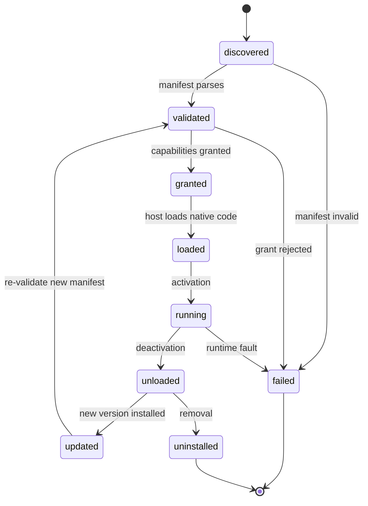
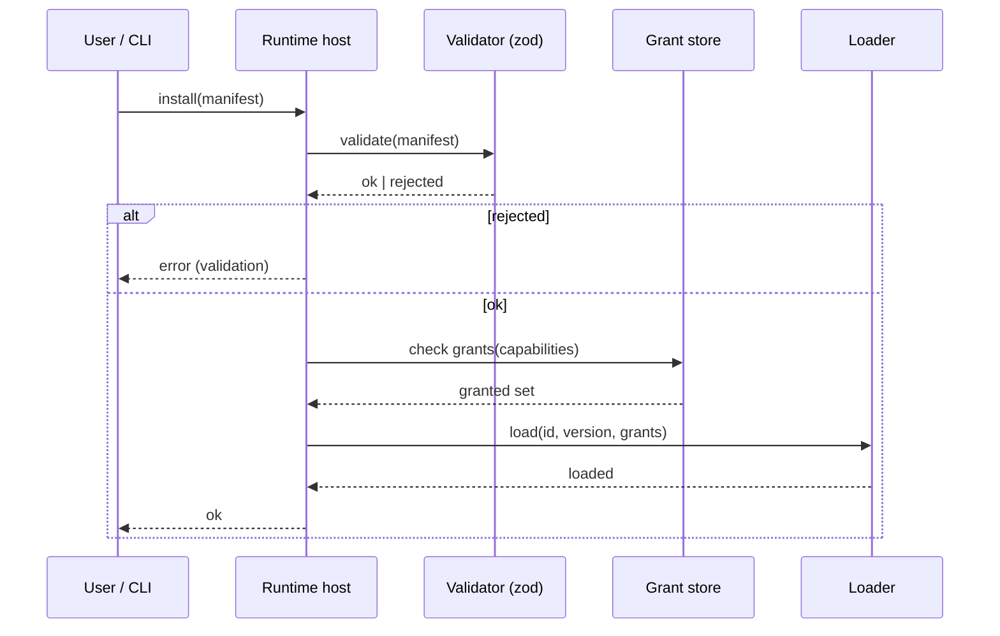

# DEX Plugin API Specification

Contract version 1 (draft).

## Purpose

A Plugin is a Rust-hosted, capability-gated extension to the Workspace Runtime,
declared by a manifest, validated by the host, and executed in native code. A
Plugin extends the Runtime's command and event surface with exactly the
capabilities granted to it — never more, and never inside the privileged
webview. This follows the Plugin First principle (principle 4) and the plugin
boundary fixed in ADR-0005.

This document is the normative contract for authoring, installing, validating,
granting, loading, and versioning Plugins. The security boundary is decided in
[`../50-adr/0005-plugin-boundary.md`](../50-adr/0005-plugin-boundary.md); this
specification states the contract that boundary implies.

## Why the boundary is Rust-hosted

The shell is a single Tauri webview with full typed IPC access. If third-party
code ever ran inside that privileged context, it could reach the filesystem
through the same typed surface as the shell itself. The boundary is therefore
fixed in Phase 0: a Plugin is native code hosted by `src-tauri/`, not arbitrary
web code in the privileged webview. A Plugin's UI, where it has one, is a Widget
and is governed by the Widget contract ([`WidgetAPI.md`](WidgetAPI.md)).

## Plugin manifest

A Plugin is declared by a manifest. The manifest is schema-validated (zod) at
install and update; unknown fields are rejected, never silently ignored
(ADR-0005). The manifest is the single source of truth for what a Plugin
declares and what it may do.

```yaml
# plugin manifest (illustrative)
id: dev.example.gitflow
name: Git Flow
version: 1.2.0
author: Example
capabilities:
  - dex.commands.run
  - dex.secrets.read:dev.example.gitflow
commands:
  - name: gitflow.start
    args: { branch: string }
    result: { ok: boolean }
events:
  - name: dex.gitflow.merged
    schema: { branch: string }
services:
  - name: gitflow.daemon
```

### Manifest fields

| Field | Type | Required | Meaning |
|---|---|---|---|
| `id` | string | yes | Reverse-DNS identifier; globally unique, immutable |
| `name` | string | yes | Human-readable display name |
| `version` | string | yes | Semantic version of the Plugin |
| `author` | string | yes | Author identity |
| `capabilities` | string[] | yes | Exact capability grants the Plugin declares |
| `commands` | object[] | no | The command surface the Plugin exposes |
| `events` | object[] | no | The events the Plugin emits or subscribes to |
| `services` | object[] | no | Long-running services the Plugin hosts |

The `id` is immutable once published; a renamed Plugin is a new Plugin. The
`version` follows semantic versioning and drives the compatibility rules below.

## Lifecycle

A Plugin moves through a fixed lifecycle. Every transition is observable and
recorded in the journal.



- **discovered** — the manifest is found on disk or in the install location.
- **validated** — the manifest parses against the schema; unknown fields are
  rejected. A Plugin that fails validation never proceeds.
- **granted** — the declared capabilities are checked against the per-Plugin
  grants in `src-tauri/capabilities/*.json`. A Plugin receives exactly the
  permissions it declares and that are granted — no default elevation.
- **loaded** — the host loads the Plugin's native code.
- **running** — the Plugin is active and its commands and events are live.
- **unloaded** — the Plugin is deactivated; its commands and events are removed
  from the surface.
- **updated** — a new version is installed; the new manifest is re-validated and
  re-granted before the Plugin returns to `running`.
- **uninstalled** — the Plugin is removed and its grants are revoked.
- **failed** — a terminal fault (validation, grant, or runtime). A failed
  Plugin is not loaded.

## Capability model

Capabilities are exact grants. There is no default elevation: a Plugin has no
capability it did not declare and that was not granted. Grants live per-Plugin
in `src-tauri/capabilities/*.json` and are reviewed at install time.

```json
{
  "identifier": "dev.example.gitflow",
  "capabilities": ["dex.commands.run", "dex.secrets.read:dev.example.gitflow"]
}
```

A capability is a string naming a permission. Capabilities that carry a scope
use the `:` separator (for example `dex.secrets.read:<plugin-id>`). The grant
set is the intersection of what the manifest declares and what the host grants;
a declared-but-ungranted capability is refused at the boundary, never silently
ignored.

## Command and event surface

A Plugin's commands and events are typed and zod-validated at the boundary,
exactly as the core IPC surface is (ADR-0002). A Plugin command is invoked
through the same typed plumbing as a core command; its result is validated
against the declared result schema. A Plugin event is emitted through the
Runtime event bus and validated against its declared schema; invalid payloads
are logged and dropped.

A Plugin command may not shadow a core command name. Command and event names are
namespaced by the Plugin `id` to prevent collision.

## Versioning and compatibility

- The Plugin `version` is semantic. The host records the installed version and
  the manifest schema version it was validated against.
- A Plugin declares the minimum host API version it requires. A Plugin whose
  requirement exceeds the host's API version is refused with an `unsupported`
  error.
- An update re-validates the new manifest and re-checks grants before the
  Plugin returns to `running`. A failed update leaves the previous version
  loaded.
- The manifest schema itself is versioned. A manifest written against a newer
  schema than the host understands is refused, not partially parsed.

## Sandbox rules

- A Plugin is native code hosted by the Runtime; it never runs inside the
  privileged webview.
- A Plugin's UI, if any, is a Widget and renders in an isolated context with no
  IPC access of its own (see [`WidgetAPI.md`](WidgetAPI.md)).
- A Plugin reaches system resources only through the capabilities granted to it.
  It never reads the host's keyring directly; it receives a Secret only through
  a granted capability (see [`Secrets.md`](Secrets.md)).
- The shell's strict CSP (ADR-0005) applies to the webview regardless of any
  Plugin; a Plugin cannot relax it.

## SDK surface summary

The Plugin SDK is the typed surface a Plugin author compiles against. It
provides:

- **Manifest authoring** — schema-validated manifest types.
- **Command registration** — typed command handlers with declared arg and result
  schemas.
- **Event emission and subscription** — typed event helpers.
- **Service hosting** — long-running service lifecycle hooks.
- **Capability access** — the granted capability set, enforced at the boundary.

The SDK is a compile-time contract; a Plugin that references an undeclared
capability fails validation before it is loaded.

## Install → validate → grant → load



## Related Documents

- Plugin boundary decision: [`../50-adr/0005-plugin-boundary.md`](../50-adr/0005-plugin-boundary.md)
- Plugin First principle: [`../00-vision/02_Principles.md`](../00-vision/02_Principles.md)
- Plugin definition: [`../00-vision/03_Glossary.md`](../00-vision/03_Glossary.md)
- Typed IPC contract: [`../50-adr/0002-typed-ipc-contract.md`](../50-adr/0002-typed-ipc-contract.md)
- Widget contract: [`WidgetAPI.md`](WidgetAPI.md)
- Secrets contract: [`Secrets.md`](Secrets.md)
- CLI surface for Plugins: [`CLI.md`](CLI.md)
- Plugin subsystem architecture: [`../20-architecture/27_Plugins.md`](../20-architecture/27_Plugins.md)