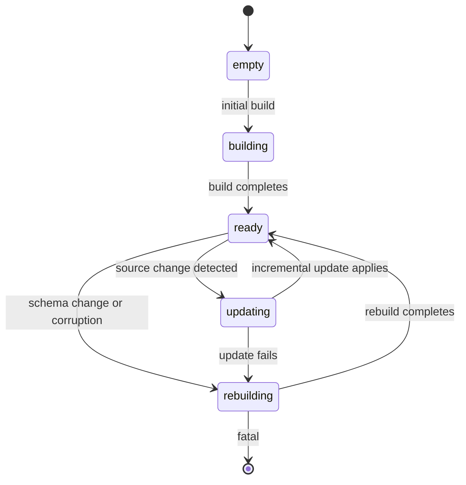
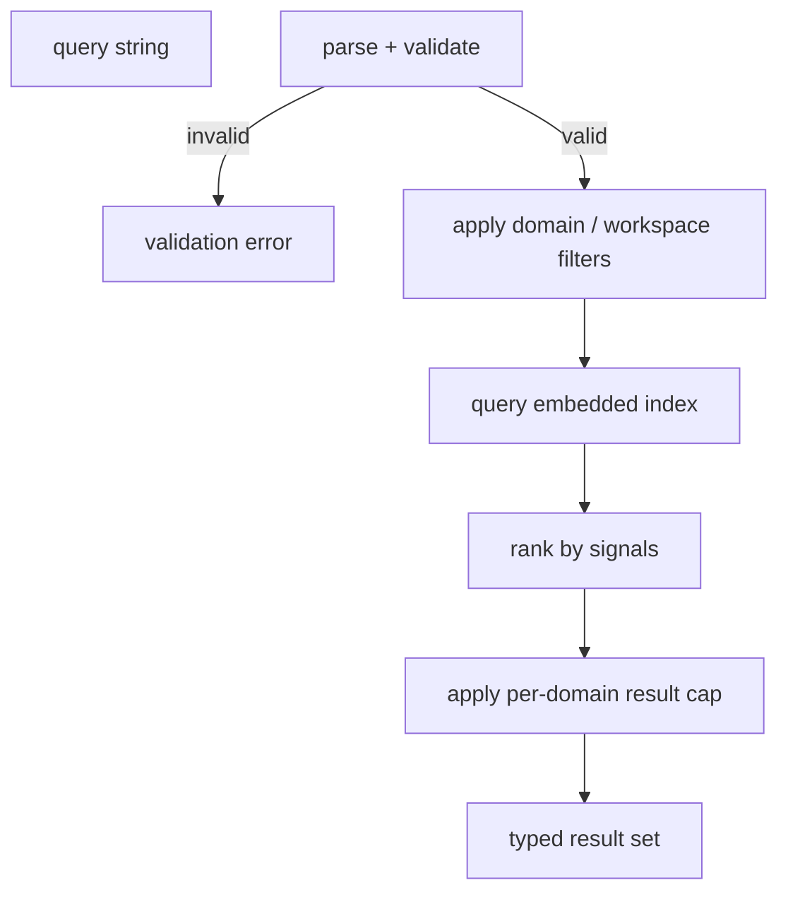

# DEX Search Specification

Contract version 1 (draft).

## Purpose

Search is the capability by which the Workspace Runtime finds things across the
domains it owns: Workspaces, commands, files, the Knowledge Vault, and Widgets.
Search is a capability within the Workspace Runtime, not the identity of DEX
(see [`../00-vision/04_NonGoals.md`](../00-vision/04_NonGoals.md)). It is
offline-first (principle 2): the index is local and the machine searches fully
without a network.

This document is the normative contract for the index model, the index
lifecycle, the query syntax, the result model, and the validation and limits
that keep search bounded. The search architecture and its domains are decided in
[`../20-architecture/28_Search.md`](../20-architecture/28_Search.md); this
specification states the contract that architecture implies.

## Why an offline embedded index

The machine must work fully without a network (principle 2). Search therefore
runs against a local, embedded index owned by the Runtime — never against a
remote service. The index is built from local state and updated incrementally as
that state changes. Synchronization is layered on top, never required.

## Index model

The index is partitioned into domains. Each domain indexes a distinct kind of
entity and has its own fields and ranking signals.

| Domain | Indexes | Primary fields |
|---|---|---|
| Workspaces | Workspace Manifests | name, id, description, tags |
| Commands | Runtime command surface | command name, domain, help text |
| Files | filesystem paths | path, basename, extension |
| Knowledge Vault | Vault notes and Context | title, body, tags, timestamps |
| Widgets | installed Widgets | name, id, description |

The index is embedded in the Runtime's local store. It is built from the same
sources of truth the Runtime already owns — Manifests, the command registry, the
filesystem, the Knowledge Vault, and the Widget registry — so it never holds a
separate, divergent copy of state.

## Index lifecycle



- **build** — the initial construction of the index from all domains. Runs once
  on first use and is offline.
- **incremental update** — the normal path. When a source changes (a Manifest is
  edited, a command is registered, a file is written, a Vault note is added, a
  Widget is installed), the affected domain updates incrementally. Updates are
  cheap and do not require a full rebuild.
- **rebuild** — a full reconstruction, triggered by an index schema change or
  by detected corruption. A rebuild is a maintenance operation, not the normal
  path.

## Query syntax contract

A query is a sequence of terms with optional filters. The syntax is stable and
documented here.

- **Terms** — space-separated tokens. Each token is matched against the indexed
  fields of the target domain. Terms are case-insensitive.
- **Domain filter** — `domain:<name>` restricts the search to one domain. The
  valid domain names are `workspaces`, `commands`, `files`, `vault`, `widgets`.
- **Workspace filter** — `workspace:<id>` restricts the search to entities
  within a named Workspace. It is valid for the `files` and `vault` domains.
- **Ranking signals** — results are ranked by relevance: exact field matches
  outrank substring matches; matches in the primary name field outrank matches
  in description or body; recency is a tie-breaker for the `vault` domain.

```text
# illustrative queries
dex vault query "activation restore"
dex vault search "snapshot domain:workspaces"
dex vault search "notes workspace:web"
```

The query syntax is parsed and validated before execution. A malformed filter
or an unknown domain name is a `validation` error, not a silent fallback.

## Result model

A search result is a typed record identifying the matched entity and its
relevance. The result shape is stable and is the same whether the search is
issued from the CLI or the shell.

```json
{
  "domain": "workspaces",
  "id": "web",
  "title": "Web Platform",
  "snippet": "…activation restores the web platform…",
  "score": 0.92
}
```

Results are returned in descending score order. The result set is bounded by the
limits below.

## Validation and limits

- **Query length** — a query is limited to a maximum token count and a maximum
  length; longer queries are rejected with a `validation` error rather than
  truncated silently.
- **Result cap** — a search returns at most a fixed number of results per
  domain. The cap is a documented constant and is applied per domain, so a
  single domain cannot crowd out the others.
- **Unknown domains** — a `domain:` filter naming a domain outside the closed
  set is rejected.
- **Offline guarantee** — search never requires a network; a search issued with
  no network succeeds against the local index.

## Relationship to Vault search

The Knowledge Vault has its own search surface for its own content
([`Knowledge.md`](Knowledge.md)). The Search capability indexes the Vault as one
of its domains, so a cross-domain search can find Vault notes alongside
Workspaces, commands, files, and Widgets. The Vault's own search is the
domain-specific surface; Search is the unified surface across domains. The two
share the same index source and the same ranking signals for the `vault` domain.

## Query flow



## Related Documents

- Search architecture and domains: [`../20-architecture/28_Search.md`](../20-architecture/28_Search.md)
- Offline First principle: [`../00-vision/02_Principles.md`](../00-vision/02_Principles.md)
- Search as a capability, not identity: [`../00-vision/04_NonGoals.md`](../00-vision/04_NonGoals.md)
- Knowledge Vault contract: [`Knowledge.md`](Knowledge.md)
- CLI surface for search: [`CLI.md`](CLI.md)
- Workspace Manifest: [`Manifest.md`](Manifest.md)