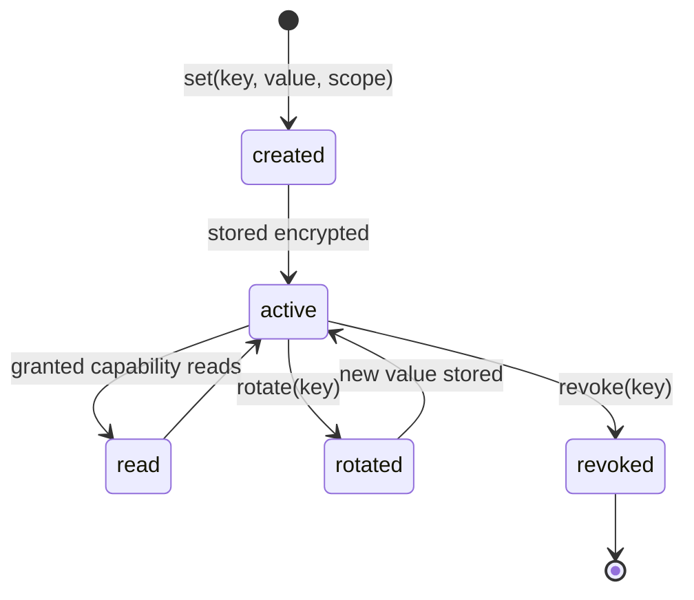
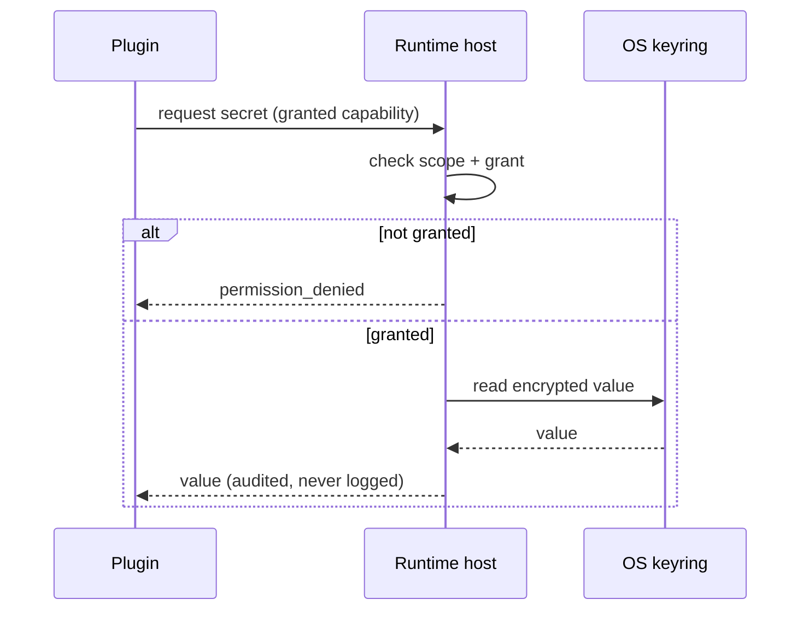

# DEX Secrets Specification

Contract version 1 (draft).

## Purpose

Secrets — API keys, tokens, credentials — never live in Manifests and never
live in plaintext. The Secrets subsystem is the single, Rust-owned store for
sensitive material, encrypted at rest, scoped to a Workspace or a Plugin, and
readable only through granted capabilities. This follows the Offline First
principle (principle 2): Secrets stay local and anything that leaves the machine
does so by explicit request.

This document is the normative contract for Secret storage, scoping, access
rules, lifecycle, and the interaction with the plugin boundary.

## Why Secrets are separate from Manifests

A Workspace Manifest is a declarative, versioned document that is meant to be
shared and recreated anywhere ([`Manifest.md`](Manifest.md)). A Secret is the
opposite: it is sensitive, machine-local, and must never be committed, shared,
or serialized into a Manifest. Keeping Secrets in a separate, Rust-owned,
encrypted store makes the boundary explicit: a Manifest can be copied freely
because it contains no Secrets; a Secret can be rotated or revoked without
touching the Manifest.

## Storage

- Secrets are stored in the OS keyring, owned by the Rust side of the Runtime.
- Secrets are encrypted at rest. The keyring is the encryption boundary; the
  Runtime never writes a Secret to a plaintext file.
- The frontend never touches the keyring. All Secret access flows through typed
  services → Tauri IPC → Rust, per the layer model (ADR-0001).
- Secrets are local by default (principle 2). Nothing leaves the machine except
  by explicit request.

## Scoping

A Secret is bound to exactly one scope: a Workspace or a Plugin.

- **Workspace-scoped** — a Secret belongs to a named Workspace and is available
  to operations within that Workspace.
- **Plugin-scoped** — a Secret belongs to a named Plugin and is available only
  to that Plugin through its granted capability.

Scoping is enforced at the boundary. A Secret is never global; a request for a
Secret outside its scope is refused with `permission_denied`.

## Access rules

- Only granted capabilities may read a Secret. A capability that reads a Secret
  names the scope it may read (for example `dex.secrets.read:<plugin-id>`).
- The CLI surface is `dex secrets …` (see [`CLI.md`](CLI.md)): `set`, `get`,
  `rotate`, `revoke`.
- A read of a Secret is an auditable event recorded in the journal
  ([`Journal.md`](Journal.md)); the Secret's value is never logged.
- The frontend receives a Secret value only as the result of a granted,
  mediated read; it never reads the keyring directly.

## Lifecycle

- **create** — `dex secrets set <key> --workspace <id>` (or `--plugin <id>`)
  stores a new Secret, encrypted, in the keyring.
- **read** — a granted capability reads the Secret value. Reads are mediated and
  audited.
- **rotate** — `dex secrets rotate <key>` replaces the value with a new one. The
  old value is discarded; rotation is the supported way to change a Secret.
- **revoke** — `dex secrets revoke <key>` removes the Secret and its grants. A
  revoked Secret cannot be read.

## No-secret-in-log rule

A Secret value never appears in any log, journal entry, error message, or
diagnostic output. This is a hard rule:

- Logging never includes a Secret value, in whole or in part.
- Error messages reference a Secret by key, never by value.
- `--verbose` output and the journal record that a read or rotation occurred,
  not the material.

## Interaction with the plugin boundary

A Plugin receives a Secret only through a granted capability; it never reads the
host's keyring directly. The plugin boundary (ADR-0005) and the Secrets scope
rules together mean:

- A Plugin declares the Secret capability it needs in its manifest
  ([`PluginAPI.md`](PluginAPI.md)).
- The host grants that capability per-Plugin in `src-tauri/capabilities/*.json`.
- When the Plugin requests the Secret through its granted capability, the host
  reads the keyring and hands the value to the Plugin. The Plugin has no direct
  keyring access.
- A Plugin-scoped Secret is readable only by that Plugin; a Workspace-scoped
  Secret is readable only by capabilities granted within that Workspace.

## Related Documents

- Offline First principle: [`../00-vision/02_Principles.md`](../00-vision/02_Principles.md)
- Layer model and Rust ownership of system access: [`../50-adr/0001-layer-ownership.md`](../50-adr/0001-layer-ownership.md)
- Plugin boundary: [`../50-adr/0005-plugin-boundary.md`](../50-adr/0005-plugin-boundary.md)
- Plugin contract: [`PluginAPI.md`](PluginAPI.md)
- CLI surface for Secrets: [`CLI.md`](CLI.md)
- Journal: [`Journal.md`](Journal.md)
- Workspace Manifest: [`Manifest.md`](Manifest.md)