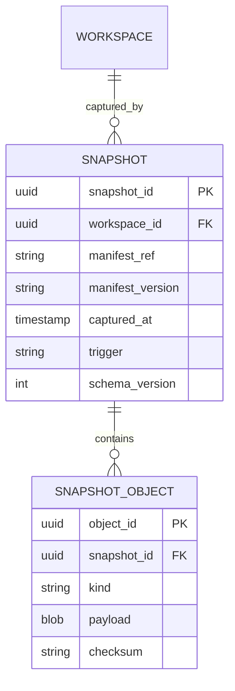
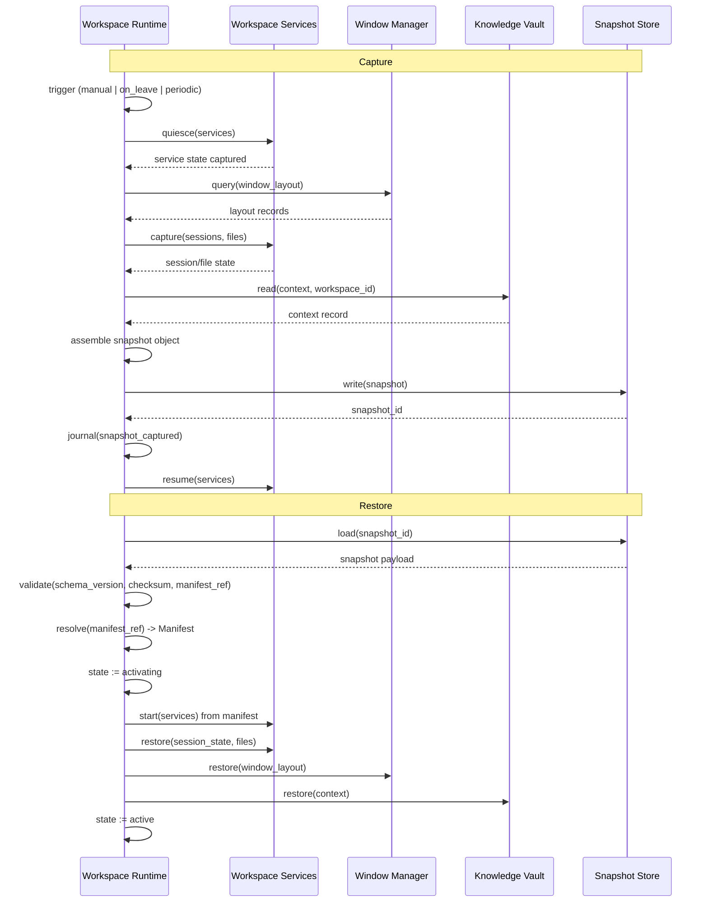
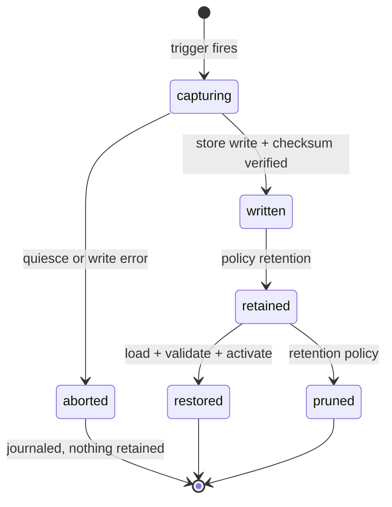

# Workspace Snapshot — Specification

- **Contract version:** 1 (draft)
- **Status:** Draft
- **Owner:** Workspace subsystem (`src-tauri/src/services/snapshot/`)
- **Canonical terminology:** [`../00-vision/03_Glossary.md`](../00-vision/03_Glossary.md)

## Purpose

A Workspace Snapshot is a point-in-time capture of a Workspace's runtime state
(Glossary). It makes it possible to restore a Workspace to exactly where work
left off — after a reboot, on another machine, or after a failed experiment.

**Why Snapshots exist.** A Workspace is declared by a Manifest, but the
declaration alone does not capture where work actually left off: which files
are open, which sessions have which history, what a Workspace Service was
doing. The Manifest is the reproducible floor; the Snapshot is the recoverable
ceiling. Snapshots are what turn "the same declaration activates a Workspace on
any machine" (Manifest purpose) into "the same declaration restores the same
state on any machine". They are also the mechanism for the recovery the
Workspace lifecycle needs: a `failed` Workspace can be restored from a Snapshot
rather than re-assembled by hand.

**What this contract guarantees.**

1. A Snapshot is an immutable, versioned capture; it is never mutated after
   writing.
2. Capture and restore follow a defined protocol with explicit ordering; both
   are observable and journaled.
3. Restore semantics are precise about what is restored exactly and what is
   re-derived — a Snapshot is not a magic time machine, and the contract says
   so.
4. The snapshot store is local, versioned, and Rust-owned; it survives reboots
   and is the source of truth for restores.

## Capture Scope

A Snapshot captures the runtime state of a Workspace. The capture scope is
fixed by this specification and is the same on every platform.

| Scope | What is captured | How |
|---|---|---|
| Sessions | Open sessions, their working directories, environment, and command state | Session state serialized by the session backend; process state captured at the shell level |
| Window layout | Window positions, sizes, and arrangement on the window-manager workspaces | Queried from the window manager during quiesce |
| Workspace Service state | Service instances, their health at capture time, and their declared configuration | Read from the Workspace Service supervision state |
| Open files | Files open in editors and session buffers | Reported by the session backends (e.g. editor session files, terminal `cwd`) |
| Context | The active Context for the Workspace: what was in progress, pinned notes, current focus | Read from the Knowledge Vault via the Context record |

The Snapshot does **not** capture the contents of the filesystem or the
working tree. Code is versioned by the developer's own tools (git); capturing
tree contents would duplicate a system the developer already owns and would
make Snapshots enormous. Files are captured by *reference* — paths and open
states — never by content.

### What is stored in a Snapshot

```yaml
snapshot:
  snapshot_id: uuid
  workspace_id: uuid
  manifest_ref: string
  manifest_version: string
  captured_at: timestamp
  scope:
    sessions: [ ... serialized session state ... ]
    windows: [ ... window layout records ... ]
    services: [ ... service instance records ... ]
    files: [ ... open file references ... ]
    context: { ... context record reference ... }
  schema_version: int
```

Every Snapshot carries `schema_version`; a Snapshot whose schema version the
Runtime does not support is refused at restore time with a `validation` error.

## Storage Model

The snapshot store is a versioned, local store owned by Rust. Snapshots are
written as immutable objects keyed by `snapshot_id`; a Snapshot is never
overwritten.



- **Registry.** The `snapshots` table records Snapshot metadata; the payload is
  stored as immutable snapshot objects (`snapshot_objects`) with a checksum for
  integrity verification at restore time.
- **Immutability.** Once written, a Snapshot is immutable. The
  `schema_version` is fixed at write time. A restore reads the Snapshot and
  validates it; it never rewrites it.
- **Retention.** The snapshot store is pruned by the policy in effect at capture
  time (see Scheduling). Pruning deletes whole Snapshots (metadata + objects)
  oldest-first; it never partially deletes a Snapshot.
- **Versioning.** `schema_version` increments when the capture scope or the
  payload layout changes. Snapshots written under an older schema version are
  rejected at restore by a Runtime that no longer supports that version; the
  error names the supported range.

## Scheduling

A Snapshot is captured on one of three triggers.

| Trigger | Source | Notes |
|---|---|---|
| Manual | User command (`workspace.snapshot` from CLI or shell) | Always available, regardless of policy. |
| On-demand | A lifecycle transition (e.g. `pre_leave`) | Governed by `snapshot_policy.on_leave` in the Manifest. |
| Periodic | A timer | Governed by `snapshot_policy.periodic` (`interval` or `cron`); the timer belongs to the Runtime, not to a cron daemon. |

Scheduling is declared in the Workspace Manifest's `snapshot_policy`
(`enabled`, `periodic`, `on_leave`, `retention`); the Runtime enforces the
policy. A periodic capture never runs concurrently with an Activation or
teardown; it is skipped (and journaled) if the Workspace is not `active`.

## Capture and Restore Protocol

Capture and restore are ordered protocols executed by the Runtime.



### Capture ordering

1. **Quiesce.** Workspace Services are quiesced (graceful suspension, not
   termination) so the captured state is stable.
2. **Capture service state and window layout** while quiesced.
3. **Capture sessions, open files, and Context.**
4. **Write** the immutable Snapshot object and verify its checksum.
5. **Journal** the capture.
6. **Resume** services.

### Restore semantics

Restore is exact where the captured state is authoritative and re-derived where
it is not. The contract is explicit:

| Artifact | Restored exactly | Re-derived |
|---|---|---|
| Session state (cwd, env, command) | yes | — |
| Window layout | yes (positions/sizes/arrangement) | — |
| Workspace Services | configuration from the Manifest | process state (restarted fresh, then health-checked) |
| Open files | references restored as "open these files in these sessions" | file *contents* come from the filesystem / developer's VCS |
| Context | yes (restored as the active Context) | — |

Two consequences follow. First, a restore never claims to reproduce
unserializable state (in-memory buffers, unsaved keystrokes, network
connections); those are re-established by the developer's own tools. Second,
Workspace Service *processes* are re-derived: the Runtime starts the declared
service and health-checks it, rather than restoring a process image. This keeps
Snapshots portable across machines and architectures.

A restore is atomic in effect: it either completes and leaves the Workspace
`active`, or it fails and leaves the Workspace `failed` with the failure
journaled. There is no partially-restored Workspace.

## Snapshot Lifecycle



## Related Documents

- Canonical terminology: [`../00-vision/03_Glossary.md`](../00-vision/03_Glossary.md)
- Workspace contract (lifecycle, services): [`Workspace.md`](Workspace.md)
- Workspace Manifest (snapshot policy declaration): [`Manifest.md`](Manifest.md)
- Durable activity record (capture/restore events): [`Journal.md`](Journal.md)
- Durable local memory (restored Context): [`Knowledge.md`](Knowledge.md)
- System architecture and boundaries: [`../20-architecture/20_System_Architecture.md`](../20-architecture/20_System_Architecture.md)
- Product roadmap (Workspace Manager milestone): [`../10-product/11_Product_Roadmap.md`](../10-product/11_Product_Roadmap.md)