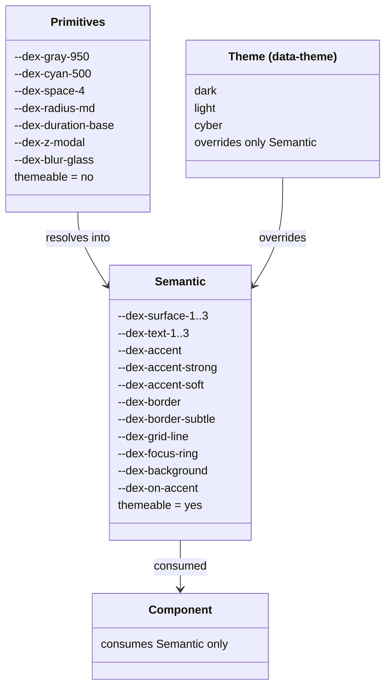
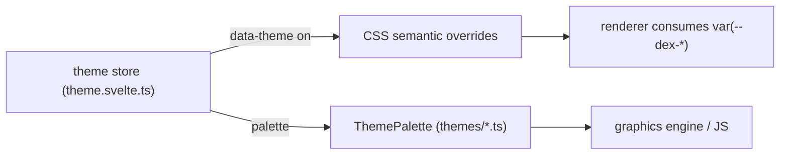
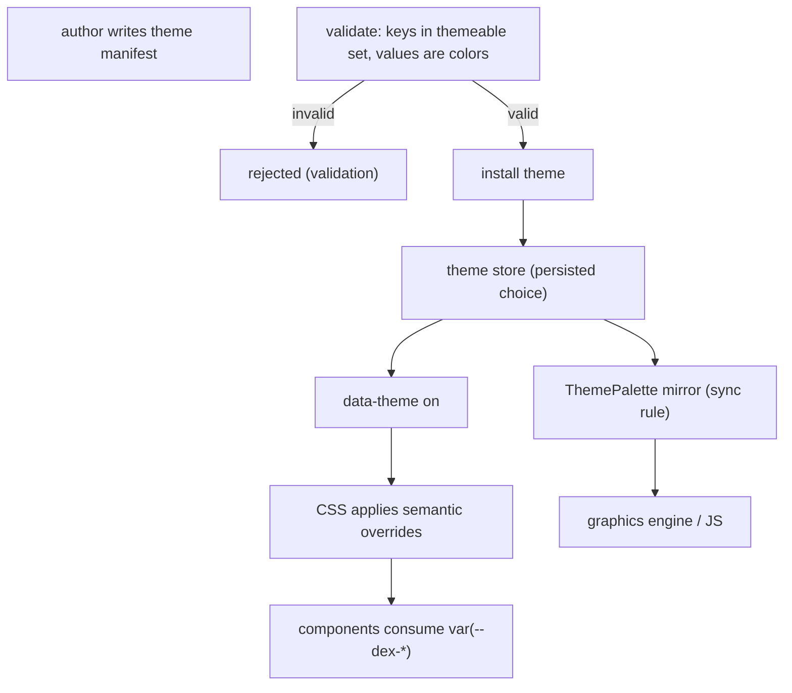

# DEX Theme Specification

Contract version 1 (draft).

## Purpose

Theming is the contract by which users and authors create themes without
touching the core. A theme is a semantic-layer override: it changes the role
tokens that components consume, and nothing else. The token architecture and the
sync rule are decided in ADR-0003; the exact token values and the semantic token
reference live in [`../40-engineering/DesignSystem.md`](../40-engineering/DesignSystem.md)
and in `src/lib/ui/styles/tokens.css`. This specification states the authoring
and switching contract that they imply.

This document deliberately does not duplicate the value table. The value table
is owned by the DesignSystem reference; this specification owns the contract for
what a theme is, how it is declared, how it is validated, and how it reaches the
renderer.

## Why themes are semantic-layer overrides

Components consume semantic tokens only (`var(--dex-surface-1)`,
`var(--dex-text-1)`, …) — never primitive ramps and never hardcoded values
(ADR-0003). Because components are theme-agnostic, restyling DEX is a matter of
editing the semantic layer. A theme therefore overrides *only* the semantic
layer; primitives (color ramps, spacing, radii, durations, z-index, blur) are
shared across themes and are not themeable.

## Token architecture



The layer rule: components consume semantic tokens for every color and
typography decision. The scale tokens (spacing, radii, duration, z-index, blur)
are stable by design and may be consumed directly. Never hardcode a hex or rgba
value in a component.

## The themeable token set

A theme may override exactly the following semantic tokens:

- Surfaces: `--dex-surface-1`, `--dex-surface-2`, `--dex-surface-3`
- Text: `--dex-text-1`, `--dex-text-2`, `--dex-text-3`
- Accent: `--dex-accent`, `--dex-accent-strong`, `--dex-accent-soft`
- Lines: `--dex-border`, `--dex-border-subtle`, `--dex-grid-line`,
  `--dex-focus-ring`
- Backdrop: `--dex-background`, `--dex-on-accent`

A theme may not override a primitive token. An attempt to override a token
outside the themeable set is a `validation` error.

## data-theme switching contract

Themes are driven by a `data-theme` attribute on `<html>`. CSS owns the switch;
there are no inline styles.

- The default theme is `dark` and lives in `:root` (the semantic layer without a
  `data-theme` qualifier).
- `[data-theme="light"]` and `[data-theme="cyber"]` override the semantic layer
  only.
- The attribute is managed by `src/lib/core/stores/theme.svelte.ts`: a rune
  store that sets the attribute, persists the choice via
  `core/utils/storage.ts`, and exposes the current `ThemePalette` for JS and the
  graphics engine.
- `initTheme()` runs at boot so the attribute is set before first paint.



## ThemePalette TS mirror and the sync rule

`src/lib/ui/themes/types.ts` defines `ThemePalette`, a typed record of concrete
color strings for programmatic and GPU use (WebGL uniforms, canvas fills — code
that cannot read CSS custom properties). `src/lib/ui/themes/{dark,light,cyber}.ts`
export one `ThemePalette` const per theme.

```ts
// src/lib/ui/themes/types.ts (illustrative shape; the real file is the contract)
interface ThemePalette {
  name: string;
  accent: string;
  accentStrong: string;
  surface1: string;
  surface2: string;
  surface3: string;
  text1: string;
  text2: string;
  border: string;
  gridLine: string;
  background: string;
}
```

**Sync rule (ADR-0003):** when a semantic value changes in `tokens.css`, update
the matching palette file in `themes/`. The comment block at the top of
`themes/types.ts` states this rule. `ThemePalette` carries only what JS/GPU
need; role tokens that stay in CSS (`--dex-accent-soft`, `--dex-border-subtle`,
`--dex-focus-ring`, `--dex-text-3`, `--dex-on-accent`) are not mirrored. The CSS
is authoritative for the UI; the TS mirror is authoritative for programmatic
use.

## Theme authoring format

A theme is declared by a manifest. A theme manifest contains a name, a version,
and semantic-layer overrides. The override keys must be drawn from the themeable
token set.

```yaml
# theme manifest (illustrative)
name: solar
version: 1.0.0
overrides:
  --dex-surface-1: rgba(40, 44, 30, 0.35)
  --dex-surface-2: rgba(40, 44, 30, 0.6)
  --dex-text-1: "#f4f1de"
  --dex-accent: "#e07a5f"
  --dex-accent-strong: "#e07a5f"
  --dex-background: "#1a1d14"
```

| Field | Type | Required | Meaning |
|---|---|---|---|
| `name` | string | yes | Theme identifier; must match the `data-theme` value |
| `version` | string | yes | Semantic version of the theme |
| `overrides` | object | yes | Semantic-layer token overrides, keyed by token name |

A theme may omit tokens it does not override; omitted tokens inherit from the
default theme. An installed theme is applied by setting `data-theme` to the
theme's `name`.

## Validation

- A theme manifest is schema-validated at authoring and install time.
- Unknown tokens are rejected: an override key outside the themeable set is a
  `validation` error, never silently ignored.
- An override value that is not a valid CSS color is rejected.
- A theme name that collides with a built-in theme (`dark`, `light`, `cyber`)
  is rejected unless it is an explicit redefinition with a bumped version.

## Default themes

Three themes ship with the shell:

- **dark** — the default identity; the semantic layer in `:root`.
- **light** — bright glass over a light desktop.
- **cyber** — electric dark variant: brighter cyan with violet/magenta-tinted
  hairlines; still dark, still glass.

Each has a matching palette in `src/lib/ui/themes/`. Their resolved values are
in `tokens.css` and the DesignSystem reference; this specification does not
repeat them.

## How a theme reaches the renderer



## Related Documents

- Design token architecture decision: [`../50-adr/0003-design-tokens.md`](../50-adr/0003-design-tokens.md)
- Token reference and values: [`../40-engineering/DesignSystem.md`](../40-engineering/DesignSystem.md)
- Token source of truth: `src/lib/ui/styles/tokens.css`
- ThemePalette mirror: `src/lib/ui/themes/types.ts` and `src/lib/ui/themes/{dark,light,cyber}.ts`
- Theme store and bootstrapping: `src/lib/core/stores/theme.svelte.ts`
- Transparency and compositing contract: [`../50-adr/0004-transparent-compositing.md`](../50-adr/0004-transparent-compositing.md)
- CLI surface for themes: [`CLI.md`](CLI.md)