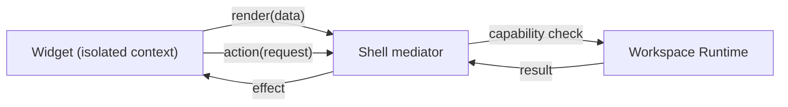
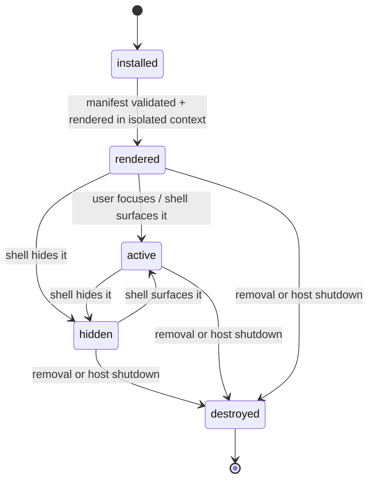
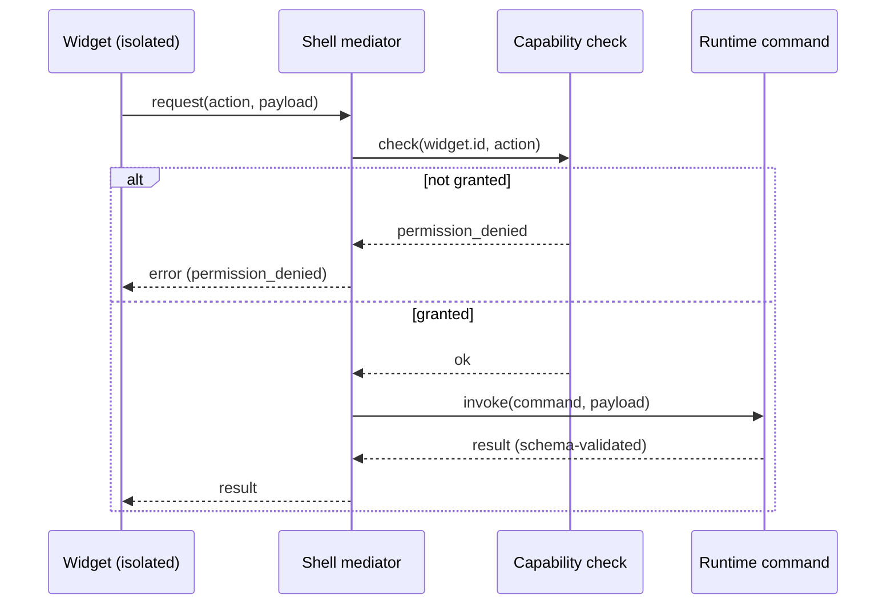

# DEX Widget API Specification

Contract version 1 (draft).

## Purpose

A Widget is a sandboxed UI extension, rendered in an isolated context with no
IPC access of its own. A Widget's every effect is mediated by the Workspace
Runtime through shell-mediated commands; a Widget never imports
`@tauri-apps/api`. This follows the Plugin First principle (principle 4) and
the plugin boundary fixed in ADR-0005.

This document is the normative contract for authoring, installing, rendering,
and mediating Widgets. The Widget contract is part of the plugin boundary: it
exists so that third-party UI can extend the shell without ever gaining the
privileged surface of the shell's own webview.

## Why every effect is shell-mediated

The shell is a single Tauri webview with full typed IPC access. A Widget's code
is third-party code; if it ran inside that privileged context it could reach
the filesystem through the same typed surface as the shell itself (ADR-0005).
The Widget contract therefore has one non-negotiable rule:

> A Widget has no IPC access of its own. Every effect — a command, a state
> write, a navigation, a launch — is a *mediated action* that the Workspace
> Runtime performs on the Widget's behalf, subject to the Widget's granted
> capabilities.

A Widget that imports `@tauri-apps/api` fails validation and is not rendered.

## Isolation model

- A Widget renders in an isolated context: a sandboxed frame with its own
  origin, distinct from the shell's privileged webview.
- The Widget receives its data through the mediated surface below; it has no
  direct channel to the Runtime.
- The Widget's visual output is composited into the shell by the Runtime; the
  Widget never paints outside the bounds the shell gives it.



## Manifest fields

A Widget is declared by a manifest, schema-validated at install and update.
Unknown fields are rejected.

```yaml
# widget manifest (illustrative)
id: dev.example.ci-badge
name: CI Badge
version: 0.4.1
entry: index.html
capabilities:
  - dex.commands.run:dex.gitflow.status
lifecycle:
  refresh: 60s
settings:
  schema: { repo: string }
```

| Field | Type | Required | Meaning |
|---|---|---|---|
| `id` | string | yes | Reverse-DNS identifier; globally unique, immutable |
| `name` | string | yes | Human-readable display name |
| `version` | string | yes | Semantic version of the Widget |
| `entry` | string | yes | The isolated-context entry document |
| `capabilities` | string[] | yes | Exact capability grants the Widget declares |
| `lifecycle` | object | no | Render-time behavior (refresh interval, …) |
| `settings` | object | no | Declared settings schema, validated on write |

A Widget that declares no capabilities renders but may perform no effects; every
action it requests is refused with `permission_denied`.

## SDK surface

The Widget SDK is the only API surface a Widget author compiles against. It is
deliberately small and effect-free by construction:

- **render** — receives the data payload the Runtime grants to the Widget.
- **state** — a local state container; state is per-Widget and is not persisted
  unless the Widget declares a settings schema and writes through the mediated
  settings action.
- **lifecycle hooks** — `onMount`, `onRefresh`, `onDestroy`, called by the
  Runtime at the corresponding lifecycle transitions.
- **mediated action calls** — `request(action, payload)`; every action goes to
  the shell mediator, never to IPC.

The SDK does not export `invoke`, `listen`, or any other Tauri API. There is no
path from a Widget to the Runtime other than `request`.

## Lifecycle



- **installed** — the Widget manifest is installed and validated.
- **rendered** — the Widget's entry document is rendered in the isolated
  context. Rendering alone grants no capability.
- **active** — the Widget is visible and interactive. A Widget may be active
  without being visible; visibility is a shell decision.
- **hidden** — the Widget is not visible. A hidden Widget receives refresh
  cadence at the declared `lifecycle.refresh` interval or is paused per the
  declared lifecycle policy.
- **destroyed** — the Widget is removed or the host shuts down; its state is
  discarded.

## Command mediation protocol

Every effect a Widget requests is mediated: the Widget asks, the shell checks
capability, the Runtime performs, the result returns. The Widget never performs
the effect itself.



The mediation protocol is the same typed IPC machinery the shell itself uses
(ADR-0002): the action's payload and result are zod-validated at the boundary,
invalid payloads are logged and dropped, and the error envelope is the closed
set from ADR-0002.

## Security rules

1. **No direct IPC.** A Widget never imports `@tauri-apps/api` and never reaches
   the Runtime except through `request`.
2. **Isolated context.** A Widget renders in a sandboxed frame with its own
   origin; it never shares the shell webview's origin or privileges.
3. **Exact grants.** A Widget receives exactly the capabilities it declares and
   that are granted — no default elevation.
4. **No filesystem, no shell, no SQLite.** A Widget cannot reach the
   filesystem, execute shell commands, or touch SQLite; only the Runtime can,
   through mediated actions.
5. **Strict CSP applies.** The shell's CSP baseline (ADR-0005) constrains the
   Widget context; a Widget cannot relax it.
6. **Validation at install.** Manifests and entry documents are validated at
   install and update; unknown fields and forbidden imports are rejected.

## Related Documents

- Plugin boundary decision: [`../50-adr/0005-plugin-boundary.md`](../50-adr/0005-plugin-boundary.md)
- Widget definition: [`../00-vision/03_Glossary.md`](../00-vision/03_Glossary.md)
- Typed IPC contract: [`../50-adr/0002-typed-ipc-contract.md`](../50-adr/0002-typed-ipc-contract.md)
- Plugin contract: [`PluginAPI.md`](PluginAPI.md)
- CLI surface for Widgets: [`CLI.md`](CLI.md)
- Widget subsystem architecture: [`../20-architecture/27_Plugins.md`](../20-architecture/27_Plugins.md)