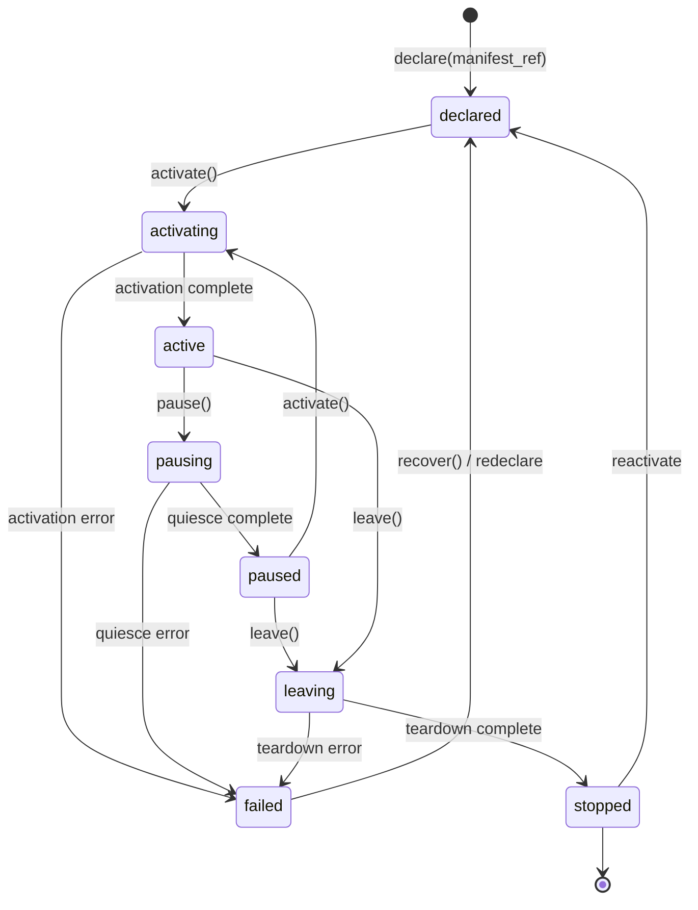
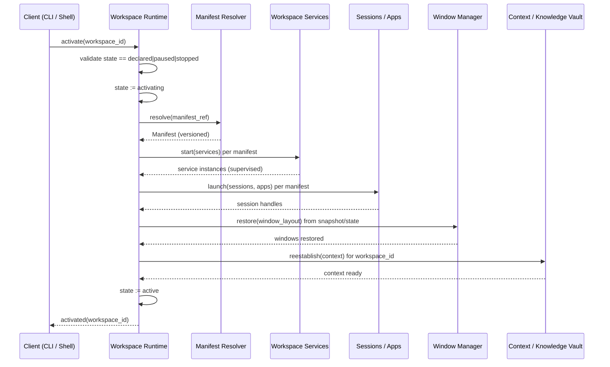
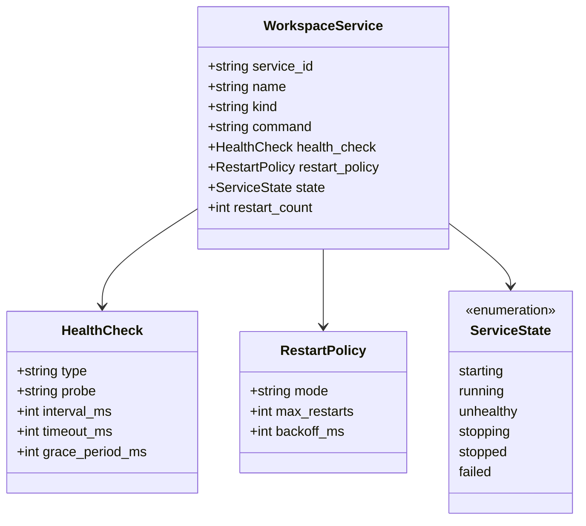
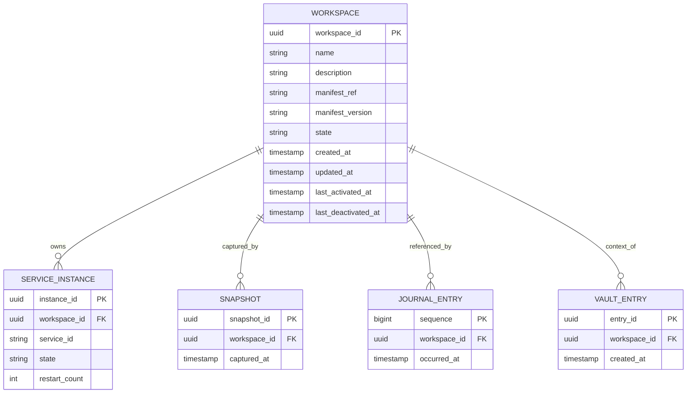

# Workspace — Contract Specification

- **Contract version:** 1 (draft)
- **Status:** Draft
- **Owner:** Workspace subsystem (`src-tauri/src/services/workspace/`)
- **Product narrative:** [`../10-product/15_Workspace_Runtime.md`](../10-product/15_Workspace_Runtime.md)

## Purpose

A Workspace is the atomic unit of a developer's work (Glossary). It is a
declared, self-contained environment that bundles the configuration, tooling,
and state for one development effort. This specification is the formal
contract for the Workspace as a first-class object of the Workspace Runtime:
its identity, its data model, its lifecycle, and the rules by which the
Runtime activates, supervises, and stops it.

**Why Workspaces are first-class objects.** The Manifesto states that a
developer's work does not live in applications but in Workspaces. If the
Workspace were merely a convenience — a saved list of windows — then starting
work would remain a manual assembly job, and the state of a project's
supporting processes would be an accident of what happened to be running. By
making the Workspace a first-class object with an explicit lifecycle and a
durable registry, the Runtime can treat "activate this Workspace" as a single,
recoverable, scriptable operation. This is the difference between a launcher
and a Workspace Runtime (Principle 1, Workspace First).

**What this contract guarantees.**

1. A Workspace has a stable identity independent of any single machine or
   process lifetime.
2. A Workspace moves through a defined lifecycle; every transition is
   observable and every terminal state is explicit.
3. Workspace Services declared by the Workspace are started, supervised, and
   stopped by the Runtime — never left to chance.
4. The Workspace registry is durable, local, and Rust-owned; it survives
   reboots and is the source of truth for what exists.

The product narrative — what it feels like to activate a Workspace — lives in
[`../10-product/15_Workspace_Runtime.md`](../10-product/15_Workspace_Runtime.md).
This document is the implementation contract.

## Data Model

A Workspace is a record in the Workspace registry. Its identity and metadata
are stable; its runtime state is transient and owned by the live Runtime.

### Identity

- **`workspace_id`** — a globally unique identifier, generated by the Runtime
  at declaration time. Canonical form is a UUIDv7 string. It is immutable for
  the life of the Workspace and is the foreign key used by every other
  subsystem (Snapshots, Journal, Knowledge Vault entries) that references a
  Workspace.
- **`manifest_ref`** — a reference to the Workspace Manifest that declares
  this Workspace. The reference is a path or a manifest identifier resolved by
  the Runtime's manifest resolver. The Manifest is the declarative contract;
  the Workspace record is the runtime instance of that contract.

### Fields

| Field | Type | Mutability | Description |
|---|---|---|---|
| `workspace_id` | `uuid` | immutable | Stable identity (UUIDv7). |
| `name` | `string` | mutable | Human-readable display name. Defaults to the Manifest `name`. |
| `description` | `string` | mutable | Optional human-readable summary. |
| `manifest_ref` | `string` | immutable | Reference to the declaring Workspace Manifest. |
| `manifest_version` | `semver` | immutable | The Manifest version captured at declaration. |
| `state` | `enum` | runtime | Current lifecycle state (see below). |
| `service_instances` | `list` | runtime | Live Workspace Service instances (see Workspace Service model). |
| `created_at` | `timestamp` | immutable | UTC instant of declaration. |
| `updated_at` | `timestamp` | runtime | UTC instant of the last state or metadata change. |
| `last_activated_at` | `timestamp` | runtime | UTC instant of the most recent Activation. |
| `last_deactivated_at` | `timestamp` | runtime | UTC instant of the most recent stop. |

Timestamps are stored as UTC RFC 3339 instants. SQLite integers arrive as
`i64`/`u64`; per ADR-0001, values beyond 2^53 lose precision in JS, so
timestamps and identifiers are serialized as strings across the IPC boundary.

## Lifecycle State Machine

A Workspace exists in exactly one state at a time. The Runtime is the only
actor that may transition a Workspace between states; the frontend and CLI
request transitions through typed commands, never by mutating state directly.

### State semantics

- **`declared`** — the Workspace exists in the registry and is bound to a
  Manifest, but nothing is running. This is the resting state of a Workspace
  that has never been activated or has been fully stopped.
- **`activating`** — the Runtime is executing the Workspace Activation
  protocol (below). Transient; the Workspace is not yet usable.
- **`active`** — the Workspace is live: sessions are running, Workspace
  Services are supervised, windows and state are restored, Context is
  re-established. This is the only state in which the Workspace is usable.
- **`pausing`** — the Runtime is quiescing Workspace Services and suspending
  sessions in preparation for a pause. Transient.
- **`paused`** — the Workspace's processes are suspended but its state is
  retained in memory and on disk; it can resume without a full Activation.
- **`leaving`** — the Runtime is tearing down the Workspace: stopping Workspace
  Services, closing sessions, and persisting state. Transient.
- **`stopped`** — the Workspace is fully torn down; its runtime state is
  released. The registry record and any Snapshots persist. A stopped Workspace
  may be reactivated.
- **`failed`** — a transition aborted with an error. The Workspace is not
  usable. Recovery is explicit: `recover()` returns it to `declared` (or to
  `paused` if the failure occurred during resume), and the failure is recorded
  in the Journal.

**Transition rules.**

- Only the Runtime may transition state; requests arrive as typed commands
  (`workspace.activate`, `workspace.pause`, `workspace.leave`, …) and are
  validated against the current state. An invalid transition is rejected with
  an `AppError` of type `conflict`.
- Every transition is recorded in the Journal (see
  [`Journal.md`](Journal.md)) with the prior and new state.
- A transition that raises an error moves the Workspace to `failed`; the
  Runtime never leaves a Workspace in a transient state.

## Workspace Activation Protocol

Activation is the central act of DEX (Glossary: Workspace Activation) — the
transition from "declared" to "live". The Runtime executes the protocol in
order; a step that fails aborts Activation and moves the Workspace to
`failed`.

**Protocol guarantees.**

1. **Manifest resolution precedes any process launch.** The Runtime never
   starts a session or service without first resolving and validating the
   declaring Manifest.
2. **Workspace Services start before sessions.** Sessions may depend on
   services (a database, a build daemon); the Runtime guarantees service
   availability before launching dependent sessions.
3. **Window and state restoration is best-effort and non-blocking.** If a
   window cannot be restored (the application is absent), Activation continues
   and the failure is recorded in the Journal. Restoration never blocks the
   Workspace from becoming `active`.
4. **Context re-establishment is the final step.** Context is the developer's
   working state; it is re-established only once the Workspace is otherwise
   live, so the restored Context reflects the actual running state.
5. **Activation is idempotent in effect.** Re-activating an `active` Workspace
   is rejected (`conflict`); activating a `paused` Workspace resumes rather
   than re-launches.

## Workspace Service Model

A Workspace Service is a managed subsystem that a Workspace declares and
depends on (Glossary). The Manifest declares services; the Runtime owns their
lifecycle.

**Lifecycle rules.**

- **Start.** The Runtime starts each declared service during Activation, in
  declaration order. A service that fails to start aborts Activation.
- **Supervision.** While the Workspace is `active`, the Runtime supervises each
  service: it runs the declared health check on its interval and applies the
  restart policy. A service that exhausts its restart budget is marked
  `failed` and the Workspace is notified; the Runtime does not silently leave a
  dead dependency running.
- **Stop.** On `leave`, the Runtime stops services in reverse declaration order
  (dependents before dependencies). On `pause`, services are quiesced but not
  terminated.
- **Restart policy.** `mode` is one of `always`, `on_failure`, `never`.
  `max_restarts` bounds restarts within a supervision window; `backoff_ms`
  spaces retries. Restart counts reset on a successful health check.

A service instance is a runtime artifact: it exists only while the Workspace is
`active` or `paused`. It is not persisted as a first-class record; its
declaration lives in the Manifest and its runtime state lives in the
`service_instances` field of the Workspace record.

## Persistence

The Workspace registry is a SQLite database owned by Rust (ADR-0001: SQLite is
accessed only by Rust; schema truth lives in `database/migrations/`). The
frontend and CLI reach it only through typed contract clients in
`core/services/workspace.ts`; they never touch SQLite directly.

- **Registry.** The `workspaces` table stores the durable fields of the data
  model above. It is the source of truth for what Workspaces exist.
- **Migrations.** Schema changes are append-only migrations (ADR-0001). Each
  migration ships with the Rust model and the zod schema in one slice.
- **Runtime state.** The `state` and `service_instances` fields are written on
  every transition. On Runtime startup, any Workspace left in a transient state
  (`activating`, `pausing`, `leaving`) by a crash is reconciled to `failed` and
  recorded in the Journal.

The relationships to Snapshot, Journal, and Knowledge Vault are owned by their
respective specifications; this diagram states only that a Workspace is the
referenced subject of each.

## Related Documents

- Canonical terminology: [`../00-vision/03_Glossary.md`](../00-vision/03_Glossary.md)
- Product narrative: [`../10-product/15_Workspace_Runtime.md`](../10-product/15_Workspace_Runtime.md)
- System architecture and boundaries: [`../20-architecture/20_System_Architecture.md`](../20-architecture/20_System_Architecture.md)
- Database access layer: [`../20-architecture/23_Database.md`](../20-architecture/23_Database.md)
- Layer ownership and SQLite rule: [`../50-adr/0001-layer-ownership.md`](../50-adr/0001-layer-ownership.md)
- Typed IPC contract: [`../50-adr/0002-typed-ipc-contract.md`](../50-adr/0002-typed-ipc-contract.md)
- The Workspace Manifest (declarative contract): [`Manifest.md`](Manifest.md)
- Point-in-time restore: [`Snapshot.md`](Snapshot.md)
- Durable activity record: [`Journal.md`](Journal.md)
- Durable local memory: [`Knowledge.md`](Knowledge.md)