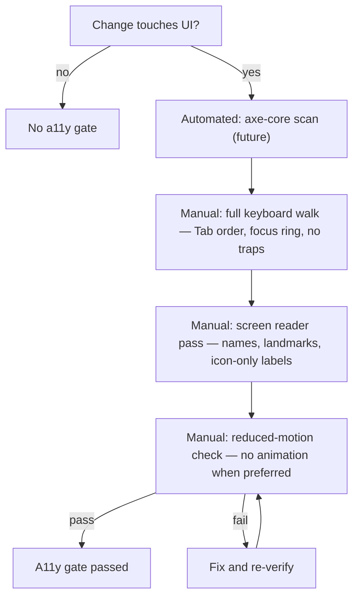

# DEX Accessibility Standard

## Purpose

This document is the canonical accessibility standard for DEX. It owns the
full standard; the accessibility section in `DesignSystem.md` states the
rules in compact form and points here for the detail. It exists because DEX is
a keyboard-first, native shell over the operating system (Native First,
Principle 5) — accessibility is not an accommodation bolted on to a mouse-first
UI, it is the baseline the shell is built on. A developer who cannot use a
mouse must be able to drive the entire Workspace Runtime from the keyboard.

## Why these rules

- **Keyboard-first is native.** DEX orchestrates a developer's tools. The
  developer's hands are on the keyboard. If the shell is not fully keyboard
  operable, it is not usable by its primary audience.
- **Accessibility is correctness.** A control that cannot be focused, named,
  or read by a screen reader is a control that does not exist for a class of
  users. The rules below are the definition of "the control exists".
- **Token-governed contrast.** Contrast is a design-token property, not a
  per-component choice. Keeping it token-governed means a theme change cannot
  silently break readability.

## Keyboard operability

Everything in the shell is reachable and operable by keyboard.

- **Interactive elements are real `<button>`s and `<a>`s — never clickable
  divs.** A real button is focusable, activatable with Enter and Space, and
  announced by screen readers for free. A clickable div is none of those.
- **Every control is reachable by Tab** in a logical order, and every control
  is activatable with the keyboard.
- **No keyboard traps.** Focus never gets stuck; a modal can always be closed
  and focus returned to its origin.
- **Focus is never removed without replacement.** Removing a focus style
  without providing a visible alternative is a regression.

## Visible focus

Keyboard users must always see where focus is.

- **`:focus-visible` renders the `var(--focus-ring)` ring.** This is the
  token-governed focus indicator; it is never removed and never replaced with
  an invisible style.
- The focus ring is visible on every interactive element, including the
  primitives (`Button`, `GlassPanel` when interactive, `Tooltip`'s trigger).
- Focus styles are not shown for mouse clicks (`:focus-visible` handles this
  distinction) but are always shown for keyboard navigation.

## Accessible names

Every control has an accessible name.

- **Icon-only controls carry `aria-label`.** A button that shows only an icon
  must name itself. The `Button` primitive forwards `aria-label`, and the
  `Dock` labels every launcher.
- **Icons are `aria-hidden`.** The `Icon` primitive is `aria-hidden`; the
  owning control supplies the accessible name. This prevents a screen reader
  from announcing "zap" instead of "New session".
- **Text controls are named by their visible text** or by an explicit
  `aria-label` when the visible text is insufficient.

## Contrast

Contrast is token-governed and meets WCAG AA for body copy.

- **`--text-primary` on `--surface-1` passes AA for body copy.** This is the
  default pairing and it is enforced by the token values, not by hand.
- **Muted text (`--text-muted`) is reserved for non-critical chrome** (the
  status bar). It is not used for body copy.
- **Never lower text contrast by hand.** A component that needs more contrast
  uses a higher-contrast token; it never hardcodes a color.

## Reduced motion

Users who prefer reduced motion get a static shell.

- **`prefers-reduced-motion` disables all non-essential animation.** Every
  interactive component wraps its transitions in
  `@media (prefers-reduced-motion: reduce)` and disables them.
- **Tooltips and hovers do not animate** when the user prefers reduced motion.
- The motion contract (transform/opacity only, 150–250 ms) is in
  `DesignSystem.md`; the accessibility rule here is that reduced motion wins
  over the motion contract.

## Tooltips

Tooltips are reachable by keyboard, not just by hover.

- **Tooltips appear on `:hover` and `:focus-within`.** A keyboard user who
  tabs to a control gets the tooltip for free, because focus is within the
  tooltip's trigger.
- The `Tooltip` primitive implements this; it is pure CSS with no floating-ui
  dependency.

## Screen-reader basics

The shell is readable by a screen reader.

- **Real semantics.** Use real elements (`button`, `a`, `nav`, `main`,
  `aside`, `footer`) so the accessibility tree is correct without ARIA
  gymnastics. The `GlassPanel` primitive accepts an `element` prop for this.
- **Landmarks.** The HUD chrome uses semantic landmarks (`TopBar`, `Dock`,
  `StatusBar`) so a screen reader user can navigate the shell structure.
- **No emojis in UI copy.** Emojis are announced unpredictably by screen
  readers; UI copy is technical and grounded (see `DesignSystem.md`).
- **ARIA only where semantics fall short.** Prefer native semantics; add ARIA
  only when a native element cannot express the role.

## Automated and manual checks

Accessibility is verified by both automated and manual checks. The automated
checks are not part of the `bun run verify` gate; the manual checks below are
the gate, and the manual desktop pass (`bun run tauri:dev`) includes them.

**Automated checks (future):** an axe-core scan in CI catches missing labels,
contrast violations, and non-semantic interactive elements.

**Manual checks (always):**

- **Keyboard walk.** Tab through the entire shell. Every control is reachable,
  the focus ring is visible, and no focus is trapped.
- **Screen reader pass.** Navigate with a screen reader. Every icon-only
  control is named, landmarks are present, and no element is announced as
  "image" or "group" when it is a button.
- **Reduced-motion check.** Enable `prefers-reduced-motion` and confirm the
  shell is static.

## Related Documents

- Canonical terminology: [`../00-vision/03_Glossary.md`](../00-vision/03_Glossary.md)
- Design system (a11y rules, tokens, primitives): [`DesignSystem.md`](DesignSystem.md)
- Design tokens (focus ring, contrast): [`../50-adr/0003-design-tokens.md`](../50-adr/0003-design-tokens.md)
- Coding standards: [`CodingStandards.md`](CodingStandards.md)
- Testing strategy (a11y in the test layers): [`Testing.md`](Testing.md)
- Frontend subsystem: [`../20-architecture/21_Frontend.md`](../20-architecture/21_Frontend.md)