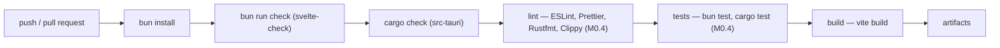

# DEX CI Design

## Purpose

This document defines the continuous-integration design for DEX: the pipeline
stages, the artifact strategy, the branch-protection intent, and the roadmap
that delivers it. It exists because a shell that grows to 100,000 lines of
code cannot be held together by local verification alone. CI is the machine
that runs the verification order on every commit, so a red check is caught the
moment it is pushed, not the moment it is deployed.

## Current state — honest

**No CI is configured.** The workflow files (`.github/workflows/ci.yml`,
`lint.yml`, `release.yml`) are empty scaffolding, `scripts/*.ts` are empty
scaffolding, and the repository has no remote. The verification order —
`bun run check` → `cargo check` → `bun run tauri dev` — is run locally.

This gap is tracked by roadmap milestone **M0.4 (Development Tooling)**, which
is open. M0.4 delivers ESLint, Prettier, Rustfmt, Clippy, a test runner, git
hooks, and the CI skeleton. This document describes the **intended** pipeline
as the design that M0.4 and the Phase 9 production milestones will implement.
It does not claim the pipeline is live.

## Why CI

- **The verification order must be enforceable, not voluntary.** A reviewer
  cannot trust a diff that was not checked. CI makes the checks objective and
  machine-run.
- **Rust and TypeScript fail differently.** A type error in the frontend and a
  borrow-check error in the Rust crate are caught by different tools. CI runs
  both on every commit.
- **The milestone gate requires green checks.** The roadmap's phase gate is a
  working vertical slice with green checks. CI is what makes "green" a
  verifiable claim.

## Pipeline design

The pipeline is a linear sequence of stages. Each stage must pass before the
next runs; a failure stops the pipeline and reports the failing stage.

### Stage details

1. **`bun install`** — install dependencies with Bun, never npm. Lockfile
   changes are validated (a PR that adds a dependency without justification is
   caught at review, not by CI).
2. **`bun run check`** — `svelte-kit sync && svelte-check`. The frontend type
   gate.
3. **`cargo check`** — inside `src-tauri/`. The Rust type gate.
4. **Lint** (M0.4) — ESLint + Prettier for the frontend, Rustfmt + Clippy for
   the Rust crate. Formatting and lint are enforced by the machine so style
   disputes never reach review.
5. **Tests** (M0.4) — the automated suites defined in `Testing.md`: frontend
   unit/integration via the test runner, Rust via `cargo test`.
6. **Build** — `vite build` produces the static SPA bundle (adapter-static,
   SPA mode). A build failure is a hard gate.
7. **Artifacts** — build outputs and (at release milestones) installable
   packages are stored as pipeline artifacts.

### What CI does not run

The manual desktop check (`bun run tauri dev`) is **not** part of CI. It
requires Wayland/Hyprland and a real compositor (ADR-0004), which CI runners
do not provide. CI covers every check that can run headless; the desktop check
remains a manual gate at review and at milestone gates.

## Artifact strategy

- **Every successful build stores the SPA bundle** as an artifact for
  inspection and debugging.
- **At release milestones** (M9.x), the build stage produces the packaging
  targets defined in `Release.md` — Arch, AppImage, Flatpak (M9.3) — and
  stores them as release artifacts.
- Artifacts are ephemeral for ordinary builds and permanent for releases.

## Branch protection intent

Branch protection is a goal for `develop` and `main` once CI is live:

- **`main` requires CI green** and a release gate; it is not pushed directly.
- **`develop` requires CI green** and at least one review; feature branches
  merge through pull requests (see `GitWorkflow.md`).
- **No force-push** to either protected branch.

The exact settings land with M0.4; the intent is that a red pipeline blocks a
merge, and a merge without the pipeline is impossible.

## Roadmap

- **M0.4 (open):** the CI skeleton with the stages above, plus the lint and
  test tooling the pipeline runs. This is the first CI slice.
- **M9.x (Production):** the pipeline is hardened — packaging artifacts
  (M9.3), performance and testing gates (M9.1, M9.2) — as part of the road to
  v1.0 at M9.5.

## Related Documents

- Canonical terminology: [`../00-vision/03_Glossary.md`](../00-vision/03_Glossary.md)
- Coding standards: [`CodingStandards.md`](CodingStandards.md)
- Testing strategy: [`Testing.md`](Testing.md)
- Git workflow: [`GitWorkflow.md`](GitWorkflow.md)
- Release process: [`Release.md`](Release.md)
- Product roadmap (M0.4, M9.x): [`../10-product/11_Product_Roadmap.md`](../10-product/11_Product_Roadmap.md)