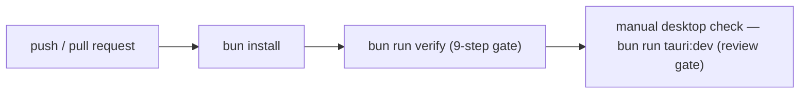

# DEX CI Design

## Purpose

This document defines the continuous-integration design for DEX: the pipeline
stages, the artifact strategy, the branch-protection intent, and the roadmap
that delivers it. It exists because a shell that grows to 100,000 lines of
code cannot be held together by local verification alone. CI is the machine
that runs the verification order on every commit, so a red check is caught the
moment it is pushed, not the moment it is deployed.

## Current state — honest

**M0.4 CI skeleton is live.** `.github/workflows/ci.yml` runs the single
authoritative gate, `bun run verify` (`scripts/verify.ts`), on push/PR to
`develop`/`main`. The gate is nine steps, fail-fast: `format:check` →
`cargo:fmt:check` → `lint` → `check` → `cargo:clippy` → `cargo:check` →
`test` → `build` → `cargo:test`. Every cargo step passes `--manifest-path`, so
the gate is cwd-independent and CI runs exactly the same commands a developer
runs locally. CI runs a single "Verify" job on push/PR to `develop`/`main`
(ubuntu-latest, Bun 1.3.14, Rust stable with rustfmt + clippy, webkit2gtk
system dependencies, `bun install --frozen-lockfile`, then `bun run verify`).

The manual desktop check (`bun run tauri:dev`) is still not in CI — it requires
Wayland/Hyprland and a real compositor (ADR-0004).

This document describes the **intended** full pipeline as the design that M0.4
and the Phase 9 production milestones will implement; the M0.4 slice (verify
gate) is the first live stage of that design.

## Why CI

- **The verification order must be enforceable, not voluntary.** A reviewer
  cannot trust a diff that was not checked. CI makes the checks objective and
  machine-run.
- **Rust and TypeScript fail differently.** A type error in the frontend and a
  borrow-check error in the Rust crate are caught by different tools. CI runs
  both on every commit.
- **The milestone gate requires green checks.** The roadmap's phase gate is a
  working vertical slice with green checks. CI is what makes "green" a
  verifiable claim.

## Pipeline design

The pipeline is a linear sequence of stages. Each stage must pass before the
next runs; a failure stops the pipeline and reports the failing stage.

### Stage details

1. **`bun install`** — install dependencies with Bun, never npm. Lockfile
   changes are validated (a PR that adds a dependency without justification is
   caught at review, not by CI).
2. **`bun run verify`** — the M0.4 gate (`scripts/verify.ts`), nine fail-fast
   steps: frontend format (`prettier --check src/`) → backend format
   (`cargo fmt --check`) → frontend lint (`eslint src/`) → frontend types
   (`svelte-check`) → backend lint (`clippy -D warnings`) → backend types
   (`cargo check`) → frontend tests (`vitest`) → frontend build (`vite build`)
   → backend tests (`cargo test`). CI runs exactly this script and no other
   checks, so a red pipeline reproduces locally with one command.
3. **Manual desktop check** — `bun run tauri:dev` stays a review-time gate; it
   cannot run headless (ADR-0004).

### What CI does not run

The manual desktop check (`bun run tauri:dev`) is **not** part of CI. It
requires Wayland/Hyprland and a real compositor (ADR-0004), which CI runners
do not provide. CI covers every check that can run headless; the desktop check
remains a manual gate at review and at milestone gates.

## Artifact strategy

- **The M0.4 gate does not publish artifacts.** It verifies code; packaging
  and artifact storage land with the release pipeline.
- **At release milestones** (M9.x), the build stage produces the packaging
  targets defined in `Release.md` — Arch, AppImage, Flatpak (M9.3) — and
  stores them as release artifacts.
- Artifacts are ephemeral for ordinary builds and permanent for releases.

## Branch protection intent

Branch protection is a goal for `develop` and `main` now that CI is live:

- **`main` requires CI green** and a release gate; it is not pushed directly.
- **`develop` requires CI green** and at least one review; feature branches
  merge through pull requests (see `GitWorkflow.md`).
- **No force-push** to either protected branch.

The exact settings land with M0.4; the intent is that a red pipeline blocks a
merge, and a merge without the pipeline is impossible.

## Roadmap

- **M0.4 (shipped):** the CI skeleton — a single `bun run verify` gate run on
  push/PR. Formatting, lint, types, tests, and the build are all machine-enforced.
- **M9.x (Production):** the pipeline is hardened — packaging artifacts
  (M9.3), performance and testing gates (M9.1, M9.2), branch protection — as
  part of the road to v1.0 at M9.5.

## Related Documents

- Canonical terminology: [`../00-vision/03_Glossary.md`](../00-vision/03_Glossary.md)
- Coding standards: [`CodingStandards.md`](CodingStandards.md)
- Testing strategy: [`Testing.md`](Testing.md)
- Git workflow: [`GitWorkflow.md`](GitWorkflow.md)
- Release process: [`Release.md`](Release.md)
- Product roadmap (M0.4, M9.x): [`../10-product/11_Product_Roadmap.md`](../10-product/11_Product_Roadmap.md)