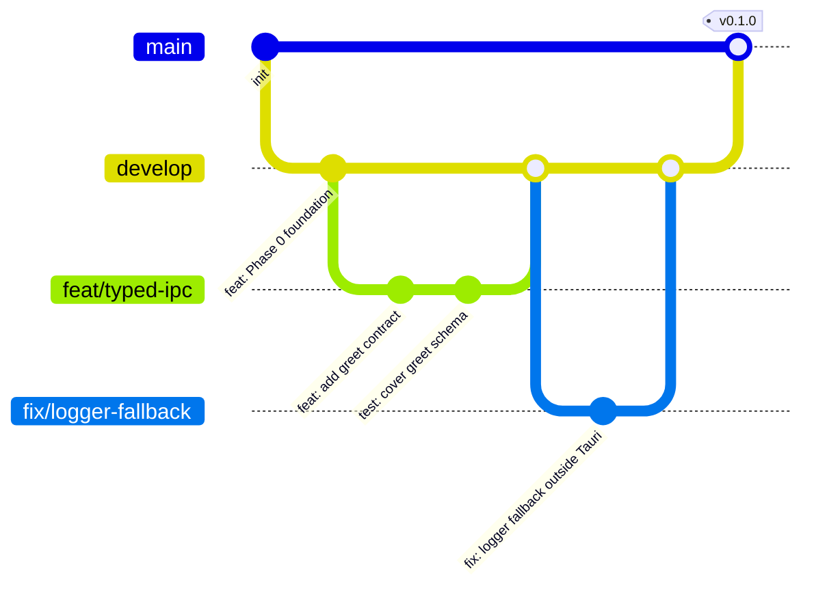

# DEX Git Workflow

## Purpose

This document defines how DEX uses Git: the branch model, the commit format,
commit hygiene, the pull-request flow, and the review checklist. It exists
because the repository is designed to hold past 100,000 lines of code across
ten roadmap phases, and a repository that large is only navigable if its
history is legible. A commit that says "fix stuff" is a dead end for the next
engineer; a commit that says `fix: validate IPC result before use` is a
searchable record of intent.

The commit format and the review checklist are the operational form of the
engineering rules in `CodingStandards.md`. The branch model is the operational
form of the roadmap's phase gates.

## Why this workflow

- **Legible history.** Conventional commits make `git log` a changelog and a
  blame trail. When a regression appears, the commit that introduced it should
  be findable by reading the message, not by bisecting blindly.
- **Reviewable change.** A focused commit is a reviewable commit. A commit
  that mixes a refactor with a feature change cannot be reviewed fairly and
  cannot be reverted safely.
- **Safe collaboration.** The repository has no remote today and two branches
  (`develop`, `main`). The workflow below is the contract that keeps that
  structure sound as contributors and CI arrive (roadmap M0.4).

## Branch model

The repository uses a two-branch trunk with feature branches:



- **`main`** is the release branch. It always reflects a shippable state and
  advances only at a milestone gate or a release.
- **`develop`** is the integration branch. Feature branches merge here; it is
  the default working branch.
- **Feature branches** are named `feat/<slug>`, `fix/<slug>`,
  `refactor/<slug>`, `docs/<slug>`, `test/<slug>`, `perf/<slug>`,
  `style/<slug>` — matching the commit type. They are short-lived and merge
  back to `develop` when their vertical slice is complete and green.

## Conventional commits

Every commit message uses the conventional-commits format:

```
<type>: <imperative summary>

<body — why, not what>
```

The allowed types are `feat:`, `fix:`, `refactor:`, `perf:`, `docs:`,
`test:`, `style:`. The summary is imperative and under ~72 characters. The
body explains **why** the change exists, not what the diff already shows.

Examples:

```
feat: add greet IPC contract and contract client

The greet command is the first end-to-end IPC slice. It proves the
two-edge schema validation (ADR-0002) before business features land.
```

```
fix: logger fallback outside Tauri

isTauri() is false under plain `bun run dev`, so the facade must
fall back to the browser console or logs vanish in dev.
```

## Commit hygiene

- **Focused commits.** One logical change per commit. A refactor and a feature
  are two commits. If a commit needs "and also", split it.
- **No secrets.** Never commit credentials, API keys, or local state. The
  `.gitignore` excludes `.env` and `.env.*`; keep secrets out of committed
  files entirely. Secrets and knowledge stay local (Offline First, Principle 2).
- **No force-push to shared branches.** `main` and `develop` are never
  force-pushed. History on a shared branch is immutable; rewriting it breaks
  every other contributor's view. Force-push is reserved for a feature branch
  that has never been shared.
- **No empty commits.** A commit carries a real change.
- **Stage intentionally.** Stage only the files that belong to the commit.
  `git add -A` on a dirty tree stages unrelated changes.
- **Verify before committing.** The change must pass `bun run check` and
  `cargo check` before the commit is made (see `CodingStandards.md`).

## Pull-request flow

A pull request is the unit of review. It maps to a vertical slice: one command
domain + contract client + feature module + tests, per ADR-0001.

1. Branch from `develop` with a `feat/`-style name.
2. Make focused commits with conventional messages.
3. Open a pull request against `develop`. The description states the problem,
   the approach, and the verification performed.
4. The PR must pass the verification order before review: `bun run check` →
   `cargo check` → `bun run tauri dev` (manual, desktop).
5. Reviewers approve, the branch is merged, and the branch is deleted.

## Review checklist

The reviewer is the last gate before a change reaches `develop`. The checklist
is the concrete form of the engineering rules:

- **Read the ADRs before touching cross-cutting code.** A change that touches
  the IPC boundary, the layer model, the design tokens, transparency, or the
  plugin boundary must be checked against ADR-0001 through ADR-0005. A change
  that violates an ADR is rejected with a citation.
- **Diff review.** Read the diff, not just the summary. Verify the change does
  what the message says and nothing else.
- **Boundary compliance.** No `@tauri-apps/api` imports outside `core/`. No
  `fetch`/`fs`/SQL in the frontend. No cross-feature imports. No opaque
  full-window background (ADR-0004).
- **Typed seams.** Every new IPC command is registered in both
  `core/api/commands.ts` and `src-tauri/src/lib.rs`, with a contract client in
  `core/services/`. No `any`. No magic values.
- **Tokens, not literals.** No hardcoded colors, radii, durations, or z-index.
- **Dependency policy.** Any new dependency is justified in the PR.
- **Tests.** The change is covered at the appropriate layer (see
  `Testing.md`). A behavior change without a test is a review blocker once the
  test runner exists (roadmap M0.4); until then, the reviewer verifies the
  change manually.

## Merge strategy

- **Squash-merge** feature branches into `develop`. A feature branch's
  intermediate commits are implementation noise; the squash produces one
  conventional commit that reads as a unit of work.
- **Merge (or fast-forward)** `develop` into `main` at a milestone gate or
  release, preserving the milestone history.
- **No merge of a red branch.** A branch that fails `bun run check` or
  `cargo check` is not merged, regardless of review approval.

## Related Documents

- Canonical terminology: [`../00-vision/03_Glossary.md`](../00-vision/03_Glossary.md)
- Coding standards: [`CodingStandards.md`](CodingStandards.md)
- Testing strategy: [`Testing.md`](Testing.md)
- CI design: [`CI.md`](CI.md)
- Release process: [`Release.md`](Release.md)
- Product roadmap (phase gates): [`../10-product/11_Product_Roadmap.md`](../10-product/11_Product_Roadmap.md)
- Layer model and folder ownership: [`../50-adr/0001-layer-ownership.md`](../50-adr/0001-layer-ownership.md)