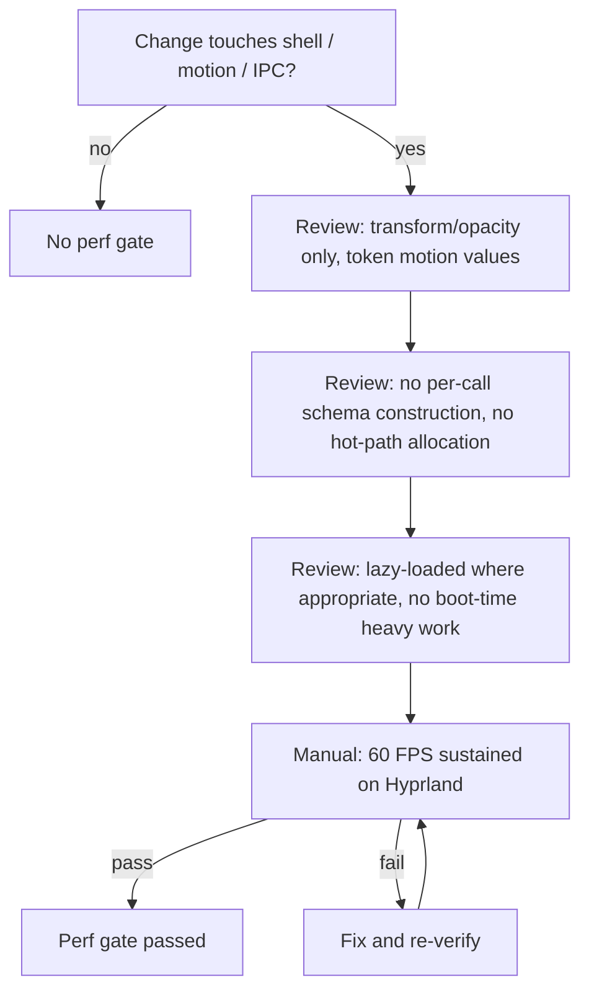

# DEX Performance Standards

## Purpose

This document defines the performance contract for DEX: the budgets, the
motion contract, the allocation discipline, the lazy-loading rules, and the
measurement and review gates. It exists because DEX is a native layer over the
operating system (Native First, Principle 5), not a web surface. The shell is
transparent and GPU-composited (ADR-0004); every frame the compositor cannot
handle is a frame the user sees as lag. Performance is not an optimization
phase — it is a contract enforced from Phase 0.

The budgets here are the technical success criteria of the roadmap. The motion
values are owned by `DesignSystem.md`; this document states the performance
rationale and the enforcement gates.

## Why these budgets

- **Cold start < 500 ms.** DEX is the layer the developer reaches for first.
  A shell that takes seconds to appear is a shell the developer avoids. The
  SPA boots with no heavy work; theme init is synchronous and cheap; heavy
  features lazy-load.
- **60 FPS sustained.** The shell is composited over the desktop. Motion on
  compositor-only properties keeps every animation on the GPU; layout thrash
  drops frames.
- **< 200 MB idle RAM.** DEX is a lightweight core (Principle 7). A shell that
  idles at half a gigabyte is not lightweight, and it competes with the very
  tools it orchestrates.

## The motion contract

The motion contract is a performance rule first and a design rule second.
Animating layout properties forces the browser to reflow and repaint on every
frame; animating `transform` and `opacity` keeps the work on the compositor.

- **Transform and opacity only.** Never animate width, height, top, left,
  margin, or `background-color`. Hover color changes are an opacity-faded
  pseudo-element wash, not a `background-color` transition.
- **Durations 150–250 ms**, single easing `var(--dex-ease-out)`
  (`cubic-bezier(.22,.61,.36,1)`).
- **`prefers-reduced-motion`** disables non-essential motion entirely.
- **Blur is not animated.** `backdrop-filter` is a compositor cost on every
  repaint; blur radii stay within the token scale and panels never
  re-blur-every-frame (ADR-0004).

## Allocation discipline

The IPC boundary validates every call with zod (ADR-0002). Validation is
cheap only if the schemas are not re-created per call.

- **Module-level singleton schemas.** A zod schema is constructed once at
  module load and reused. Never construct a schema inside a function that runs
  per call.
- **No per-call schema construction.** The `defineCommand` registry in
  `core/api/commands.ts` builds each contract once.
- **Reuse arrays on hot paths.** The renderer (Phase 2) and any per-frame loop
  reuse buffers instead of allocating per frame.
- **No unnecessary allocations in effects.** A `$effect` that allocates on
  every reactive change is a leak waiting to happen.

## Lazy loading

The core stays small by loading only what is needed, when it is needed.

- **Features load on demand** at route/plugin boundaries. A feature the user
  has not opened is not in memory.
- **`graphics/` initializes on first visual need.** The Three.js renderer
  (Phase 2) is not created at boot; it is created when the first GPU visual
  requires it. Nothing outside `graphics/` touches WebGL.
- **Theme init is synchronous and cheap** so the `data-theme` attribute is set
  before first paint without delaying it.

## Measurement

Performance is enforced by measurement, not by hope. The measurement guide
lives in [`../90-dev/Profiling.md`](../90-dev/Profiling.md): the procedures for
each budget and the review gates. Automated profiling tooling is scheduled for
roadmap M9.1 (Performance); until then, the budgets are verified manually at
the desktop check and by code review against the rules above.

The three budgets are measured as follows:

- **Cold start:** time from process launch to first interactive frame, on a
  representative Hyprland desktop.
- **Frame rate:** sustained FPS during the shell's motion, verified on the
  compositor, not in a browser tab (ADR-0004).
- **Idle RAM:** resident memory with the shell idle and no features active.

## Performance review gates

Every change that touches the shell surface passes a performance review. The
gates are ordered so that cheap checks run first and expensive ones run only
when the cheap ones pass.

## Graphics performance roadmap

The graphics engine (Phase 2) has its own performance milestone:

- **M2.4 (Performance):** object pooling, texture cache, and an FPS monitor.
  This is where the renderer's per-frame allocation discipline is enforced and
  measured. The renderer owns its frame loop, resources, and lifecycle; it
  never reaches into features (ADR-0001).

## Related Documents

- Canonical terminology: [`../00-vision/03_Glossary.md`](../00-vision/03_Glossary.md)
- Design system (motion values, tokens): [`DesignSystem.md`](DesignSystem.md)
- Transparent compositing contract: [`../50-adr/0004-transparent-compositing.md`](../50-adr/0004-transparent-compositing.md)
- Design tokens (motion contract): [`../50-adr/0003-design-tokens.md`](../50-adr/0003-design-tokens.md)
- System architecture (performance contract): [`../20-architecture/20_System_Architecture.md`](../20-architecture/20_System_Architecture.md)
- Graphics subsystem: [`../20-architecture/25_Graphics.md`](../20-architecture/25_Graphics.md)
- Profiling guide: [`../90-dev/Profiling.md`](../90-dev/Profiling.md)
- Product roadmap (M2.4, M9.1): [`../10-product/11_Product_Roadmap.md`](../10-product/11_Product_Roadmap.md)