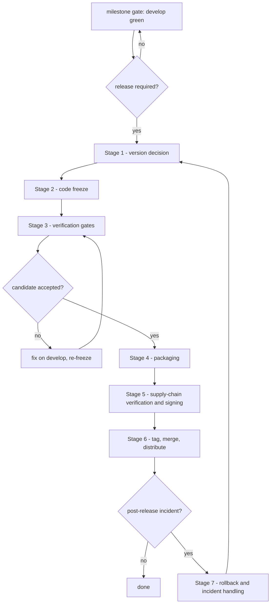

# DEX Release Process

## Purpose

This document defines how DEX ships: the versioning decision, the changelog
practice, and the staged release pipeline — code freeze, verification gates,
packaging, supply-chain verification and signing, distribution, and rollback
and incident handling. It exists because a release is the one moment the
repository leaves the repository. A native desktop binary — a Rust crate and a
TypeScript shell in a privileged webview with a strict CSP and minimal
capability grants (ADR-0005) — is trusted by users only if it can be verified
as built from the repository and traced back to a tag.

This document is the release-time counterpart of `CodingStandards.md`
(how code is written) and `GitWorkflow.md` (how code is merged). It does not
restate the branch model or the review checklist; it states the rules that
turn a green `develop` into a signed, distributed, recoverable artifact.

## Current state — honest

Release tooling is not yet configured. **M0.4 (Development Tooling) is
shipped**: `bun run verify` is the authoritative nine-gate check and
`.github/workflows/ci.yml` runs it on push/PR to `develop`/`main`. The release
pipeline itself is not wired yet — `.github/workflows/release.yml` and
`scripts/release.ts` remain scaffolding; a release process is planned for a
later milestone. No `CHANGELOG.md` exists yet. The repository has two branches
(`develop`, `main`) and no tag; the version `0.1.0` is current in
`package.json`, `src-tauri/Cargo.toml`, and `src-tauri/tauri.conf.json`.

Until the release pipeline and the Phase 9 production milestones land, a
release is executed manually by the release engineer following the stages
below. Each stage names the milestone that delivers its tooling; nothing in
this document depends on tooling that does not exist. The stages are the
process; the tooling only makes the process machine-enforced.

## Why this process

- **The verification order is the release ticket.** The same gates that guard
  a commit guard the release, but on the exact candidate commit. A change that
  passed review on `develop` and passes the gates on the tagged source is
  releasable; anything less is not.
- **A release ships a trust boundary, not just code.** The shell runs under a
  strict CSP (ADR-0005) as the blast-radius reducer, Plugins are Rust-hosted
  and capability-gated, and the window is transparent (ADR-0004). The
  release-specific gates exist because none of these properties is checked by
  a type checker.
- **Recovery is part of the process.** A release that fails in the field must
  have a named response before it is needed. The previous tag is always a
  valid state; the process says how to get back to it.

## The release pipeline

Every stage has entry criteria and exit criteria. A stage may not be entered
until its entry criteria hold and may not be left until its exit criteria
hold. A failed gate sends the release back to the freeze, never forward by
waiver.

## Stage 1 — Version decision

**Why:** The version is the contract the user sees and the tag that incidents
refer back to. It must be derivable from history, so no two people can
disagree about what the next number is, and it must be recorded in every place
an installer reads it.

**Entry criteria:**

- A milestone gate is reached (roadmap phase gate), or a defect requires a
  release on a released version (patch path, Stage 7).
- `develop` passes `bun run check` and `cargo check`, so the decision is made
  on a sane base.

**Process — the versioning decision:**

- DEX uses semantic versioning, tagged `vMAJOR.MINOR.PATCH`
  (`GitWorkflow.md`). The bump is read off the conventional-commit history
  since the last tag (`git log <last-tag>..develop`):
  - a breaking change (conventional-commits footer `BREAKING CHANGE:` or `!`
    after the type) bumps the **MAJOR** version;
  - a `feat:` commit bumps the **MINOR** version;
  - a `fix:` commit bumps the **PATCH** version;
  - `refactor:`, `perf:`, `docs:`, `test:`, `style:` are not user-visible and
    never justify a release on their own.
- Before v1.0 (`0.x.y`, semver initial development) the public API is not
  stable: a breaking change or a `feat:` bumps the **MINOR** version and
  resets `PATCH`. The first release of the repository is `v0.1.0`, matching
  the version already current in all three manifests.
- The version is recorded in exactly three places, bumped in one commit:
  `package.json`, `src-tauri/Cargo.toml`, and `src-tauri/tauri.conf.json`.
  A release whose manifests disagree is not a release.
- The changelog draft is opened at this stage from the conventional-commit
  history and curated for users (see below).

**Changelog practice:**

- The repository keeps a curated `CHANGELOG.md` at the root, updated at every
  release with the user-visible changes since the previous tag, grouped by
  conventional-commit type: **Added** (`feat:`), **Changed** (`refactor:`,
  `perf:`), **Fixed** (`fix:`), **Removed** (breaking changes). Entries are
  written for users, not for the diff: what changed, why it matters, and any
  migration a breaking change requires.
- The commit history is the draft and the changelog is the curation. Commit
  messages say why a change exists; the changelog says what it means to a
  user. `git log` with conventional-commit subjects is the reliable draft
  source (`GitWorkflow.md`).
- M0.4 ships the CI skeleton that machine-runs the verification gates. The
  release engineer curates the changelog at this stage and the reviewer checks
  it at Stage 3.

**Exit criteria:**

- A version string is decided and recorded against the candidate release.
- The changelog draft lists the user-visible changes since the last tag.

## Stage 2 — Code freeze

**Why:** A moving base cannot be verified. The freeze fixes the candidate set
so the verification gates test exactly the commit that ships, and a failed
gate can be answered with a specific fix rather than a resync.

**Entry criteria:**

- Stage 1 complete: version decided, changelog draft opened.
- `develop` is green.

**Process:**

- The candidate commit SHA is recorded. All later stages run against that SHA.
- During the freeze, only `fix:`, `test:`, `docs:`, and `style:` commits may
  merge to `develop`, each through the normal pull-request flow
  (`GitWorkflow.md`). A `feat:` during a freeze invalidates the release
  decision and restarts Stage 1.
- A defect found by a later gate is fixed on `develop`, the candidate SHA
  moves to the new merge commit, and the affected stages re-run.

**Exit criteria:**

- `develop` is at the recorded candidate commit, green, and no further change
  is planned except defects found by the gates.

## Stage 3 — Verification gates

**Why:** The verification order (`AGENTS.md`) is the entry ticket to any
release. The release-specific gates exist because a native, transparent,
capability-gated binary breaks in ways a type checker cannot see — a loosened
CSP, a `console.*` in shipped code, an opaque window background, an
over-granted capability.

**Entry criteria:**

- The candidate commit is frozen (Stage 2).

**Process — the verification order, on the exact candidate commit, from a
clean checkout:**

`bun install` runs first against the committed lockfile — a new frontend
dependency enters only with justification (`CodingStandards.md` dependency
policy). Then the gate:

Run `bun run verify` (`scripts/verify.ts`) from any cwd before merging. It runs nine gates in order, fail-fast:

1. `format:check` — frontend formatting (`prettier --check src/`)
2. `cargo:fmt:check` — backend formatting (`cargo fmt --check`, `--manifest-path`)
3. `lint` — frontend lint (`eslint src/`)
4. `check` — frontend types (`svelte-kit sync && svelte-check`)
5. `cargo:clippy` — backend lint (`clippy --all-targets --all-features -D warnings`)
6. `cargo:check` — backend types
7. `test` — frontend tests (`vitest run`)
8. `build` — frontend production build (`vite build`)
9. `cargo:test` — backend tests

CI runs exactly this gate on push/PR to `develop`/`main`. The individual
`bun run check` and `bun run cargo:check` remain valid single-gate checks
during development. After the gate, `bun run tauri:dev` is the manual desktop
pass on Wayland/Hyprland: transparent-window and compositor behavior cannot be
verified headless (ADR-0004). The release engineer exercises shell boot, theme
switching, the HUD surface, and the feature slice the release ships.

**Release-specific gates** (each is a diff review against the last release):

- **CSP unchanged (ADR-0005).** The `security.csp` in `tauri.conf.json` must
  equal the baseline `default-src 'self'; style-src 'self' 'unsafe-inline';
  img-src 'self' data:; connect-src ipc: http://ipc.localhost`. Any deviation
  is a release blocker. Dev-mode HMR relaxation is for development only and is
  never committed or shipped.
- **No `console.*` in new code.** Only `core/utils/logger.ts` may touch the
  browser console, as its out-of-Tauri fallback. New or changed files carry
  no `console.*`; logging goes through the facade.
- **No opaque window background (ADR-0004).** No new opaque background on
  `html` or `body`. The window stays transparent; the backdrop is glass
  (`backdrop-filter` + translucent surface tokens, `DesignSystem.md`).
- **Capability grants minimal (ADR-0005).** `src-tauri/capabilities/*.json`
  is reviewed as a diff. A release ships no grant beyond what the shipped code
  declares, and every grant traces to a manifest and a review.
- **Migrations append-only (ADR-0001).** A release may add migrations; it may
  not edit committed ones.
- **Version fields in sync.** `package.json`, `src-tauri/Cargo.toml`, and
  `src-tauri/tauri.conf.json` agree with the decided version.

**Exit criteria:**

- Every gate passes on the candidate SHA. A failed gate returns the release to
  the freeze; the fix lands on `develop` through review, the candidate SHA
  moves, and the gates re-run. No gate is waived for a release.

## Stage 4 — Packaging

**Why:** Packaging is where the shell and the Rust crate become an artifact an
operating system will install. Packaging automation is a Phase 9 production
milestone (roadmap M9.3, targets: Arch, AppImage, Flatpak); Tauri bundling is
already active (`bundle.active: true` in `tauri.conf.json`), so the same
discipline applies today by hand.

**Entry criteria:**

- Stage 3 green on the candidate SHA.

**Process:**

- Build from the tagged candidate source with `tauri build`, never from a
  local working tree with uncommitted changes. The `beforeBuildCommand`
  (`bun run build`) produces the SPA bundle as part of the same build.
- Every packaging target for the release is built and launched on a clean
  machine before the release is accepted. A target that cannot be installed
  and started is a release blocker.
- When the release pipeline is live (M9.x), the pipeline builds the packages
  from the tag as release artifacts per `CI.md`; the manual step remains the
  install-and-launch check that CI runners cannot do headless.

**Exit criteria:**

- Every packaging target for the release builds from the tagged source and
  launches. The artifacts are recorded against the candidate SHA.

## Stage 5 — Supply-chain verification and signing

**Why (ADR-0005):** DEX's security model is the strict CSP, Rust-hosted
capability-gated Plugins, and manifest validation at install/update. A release
is the moment that model is exposed to users: an artifact that cannot be
verified as built from the repository, with its security configuration
byte-equal to what was reviewed, is not a DEX release.

**Entry criteria:**

- Stage 4 artifacts exist for the candidate SHA.

**Process:**

- **Lockfile integrity.** `bun.lock` and `src-tauri/Cargo.lock` are committed
  and their diffs reviewed against the dependency policy
  (`CodingStandards.md`). A release ships only pinned, reviewed dependencies.
- **Packaged security configuration.** The CSP and capability files inside the
  packaged artifact are re-verified against the baseline reviewed at Stage 3 —
  the packaged `tauri.conf.json` is the shipped one, and it is byte-equal to
  the reviewed file.
- **Artifact signing.** Release artifacts are signed with the release key and
  a checksum file is published alongside. Signatures and checksums are
  verified before announcement. The signing step lands with the Phase 9
  hardening milestones; until then the release engineer signs with the
  release key and records the signatures with the artifacts.
- **Manifest validation** is enforced at Plugin install/update time
  (ADR-0005). The release gate is that no mechanism ships that can install a
  Plugin without schema validation.

**Exit criteria:**

- Artifacts signed and checksums published; the packaged CSP and capability
  set are byte-equal to the reviewed baseline; every dependency in the shipped
  binaries is pinned and reviewed.

## Stage 6 — Tag, merge, distribution

**Why:** The release becomes observable. The tag is the contract users and
incidents refer to; the merge is the branch-model rule (`GitWorkflow.md`); the
distribution is the moment the artifact reaches users — under a process that
never adds a network or telemetry dependence (Offline First, Principle 2).

**Entry criteria:**

- Stages 1–5 complete.

**Process:**

1. Create the release commit on `develop`: the version bump across
   `package.json`, `src-tauri/Cargo.toml`, `src-tauri/tauri.conf.json`, plus
   the `CHANGELOG.md` entry. This commit is the one documented exception to
   the allowed conventional-commit types — its message is
   `chore(release): vX.Y.Z` — because a version bump is the act of releasing,
   not a product change. The exception is scoped to this commit; nothing else
   may use `chore:`.
2. Merge `develop` into `main` at the release (`GitWorkflow.md`: merge or
   fast-forward, preserving the milestone history). `main` advances only
   here; it is never pushed to directly.
3. Tag `vX.Y.Z` on the merge commit. A tag that has been pushed is never
   moved or deleted.
4. Push the tag and publish the signed artifacts with their checksums and the
   changelog entry. The intended channel is a GitHub release driven by
   `.github/workflows/release.yml` once the remote exists and the release
   pipeline is wired; today the release engineer publishes the signed
   artifacts manually.
5. Distribution adds no telemetry and no network requirement. The artifact
   behaves identically with no network (Offline First, Principle 2; the
   Non-Goals).

**Exit criteria:**

- Tag `vX.Y.Z` pushed, `main` at the release commit, artifacts published with
  signatures, checksums, and the changelog entry. A user can verify the
  artifact against the tag.

## Stage 7 — Rollback and incident handling

**Why:** Releases fail in the field. The response must be named before it is
needed, and it must never require rewriting history — the previous tag is the
rollback target, and the buggy version keeps its tag and its changelog entry.

**Entry criteria:**

- A released version is reported defective: a regression, a security issue, or
  a packaging defect.

**Process — severity triage:**

- **P0 — security or data loss:** users must leave the affected version.
  Mitigation is announced immediately, distribution of the affected artifact
  stops, and a patch release is cut.
- **P1 — functional regression:** a `fix:` patch release follows Stages 1–6.
  Gates the fix does not touch may be re-run at the release engineer's
  discretion, but the `bun run verify` gate and the manual desktop pass
  (`bun run tauri:dev`) are never skipped.
- **P2 — cosmetic or non-blocking:** fixed in the next scheduled release.

**Rollback:**

- The previous tag is the rollback target. Because the distribution channel
  publishes signed artifacts keyed to tags, rollback is: stop distributing the
  affected artifact, point users at the previous tag, cut the patch release.
  The buggy version's tag and changelog entry remain, annotated with the
  incident, so the history stays legible.

**Incident record:**

- Every incident closes with a root-cause entry in the changelog. Where the
  defect touches a seam — the IPC contract (ADR-0002), the plugin boundary or
  CSP (ADR-0005), the transparent surface (ADR-0004), the layer model
  (ADR-0001) — the fix is reviewed against the ADR it implicates. A release
  that needs rollback is a process failure to fix, not a label on a person.

**Exit criteria:**

- Users are on a known-good version, distribution of the defective artifact
  has stopped, the root cause is recorded, and a patch release is underway.

## Roadmap

- **M0.4 (shipped):** lint and test tooling, the vitest runner, and the CI
  skeleton. The Stage 3 verification gates are machine-run by `bun run verify`
  in CI; the distribution channel in Stage 6 and the release pipeline remain
  for a later milestone.
- **M9.3 (Production):** packaging automation for Arch, AppImage, and Flatpak —
  the Stage 4 targets become pipeline-built.
- **M9.5 (Production):** v1.0. The release process above, hardened by M0.4 and
  the M9.x milestones, is the gate that makes v1.0 a signed, distributed,
  recoverable release.

## Related Documents

- Canonical terminology: [`../00-vision/03_Glossary.md`](../00-vision/03_Glossary.md)
- Coding standards: [`CodingStandards.md`](CodingStandards.md)
- Git workflow: [`GitWorkflow.md`](GitWorkflow.md)
- CI design: [`CI.md`](CI.md)
- Testing strategy: [`Testing.md`](Testing.md)
- Design system (tokens, transparency): [`DesignSystem.md`](DesignSystem.md)
- System architecture: [`../20-architecture/20_System_Architecture.md`](../20-architecture/20_System_Architecture.md)
- Product roadmap (M0.4, M9.3, M9.5): [`../10-product/11_Product_Roadmap.md`](../10-product/11_Product_Roadmap.md)
- Plugin boundary and CSP baseline: [`../50-adr/0005-plugin-boundary.md`](../50-adr/0005-plugin-boundary.md)
- Transparent compositing: [`../50-adr/0004-transparent-compositing.md`](../50-adr/0004-transparent-compositing.md)
