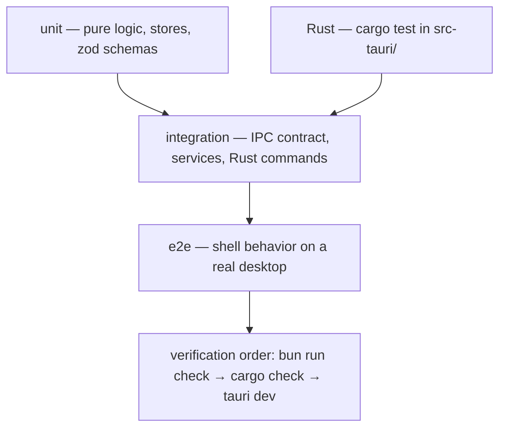

# DEX Testing Strategy

## Purpose

This document defines how DEX is tested: the test layers, what must be tested
at each layer, and the verification order that gates every change. It exists
because DEX crosses a language boundary at every IPC call and because the
repository is designed to hold past 100,000 lines of code. At that scale,
"it worked in dev" is not a test strategy; it is a promise that will break in
production.

## Current state — honest

The repository does **not** yet have a frontend test runner, a lint runner, or
a formatter configured. The `tests/` directory is scaffolding only
(`tests/{unit,integration,e2e,frontend,backend}/` each contain a `.gitkeep`),
and `scripts/*.ts` are empty scaffolding. Rust has `cargo test` available
inside `src-tauri/`, but no test suite is written yet.

This gap is tracked by roadmap milestone **M0.4 (Development Tooling)**, which
is open. M0.4 will add ESLint, Prettier, Rustfmt, Clippy, a test runner, git
hooks, and the CI skeleton. Until M0.4 lands, the verification order below is
the gate, and the manual desktop check carries the load that automated tests
will later carry. This document describes the intended setup and the testing
rules that will be enforced once the tooling exists — it does not claim the
tooling is live.

## Why test at all

- **Strong Typing (Principle 8).** The IPC boundary is schema-validated at
  both edges (ADR-0002). Tests are the second line of defense: they catch
  contract drift that type-checking and zod parsing miss because they exercise
  the behavior, not just the types.
- **Feature First Architecture (Principle 10).** Features are vertical slices.
  A slice is only complete when it is tested; a feature folder without tests is
  a feature that cannot be changed safely.
- **Native First (Principle 5).** The shell is transparent and composited
  (ADR-0004). Some behavior — compositor motion, transparent-window input —
  can only be verified on a real desktop, which is why the manual check is part
  of the order.

## Test layers

DEX tests at four layers. Each layer has a different cost and a different
purpose; the strategy is to put each test at the cheapest layer that can
meaningfully run it.

### Unit tests

Unit tests exercise pure logic in isolation: a store's transitions, a helper
function, a zod schema's accept/reject behavior. They are the cheapest layer
and the most numerous.

**What must be tested:**

- **Zod schemas** for every IPC command contract (`core/api/commands.ts`) and
  every event payload (`core/api/events.ts`). Each schema is tested for the
  valid shape and for representative invalid shapes, so contract drift is
  caught at the boundary.
- **Rune stores** (`core/stores/*.svelte.ts`): initial state, transitions,
  persistence round-trip. The `theme.svelte.ts` store is the reference: test
  that `applyTheme` sets the `data-theme` attribute and persists the choice.
- **Pure helpers** in `core/utils/` (`format`, `date`, `storage`).
- **Rust unit tests** inside `src-tauri/` for pure logic — error serialization
  (`AppError` emits exactly `{ "type", "message" }`), model conversions, and
  any pure domain logic.

### Integration tests

Integration tests exercise a seam: the IPC contract between the frontend
contract client and the Rust command. They verify that a command registered in
`core/api/commands.ts` and in `src-tauri/src/lib.rs` actually round-trips
correctly, and that the error envelope surfaces as `IpcError` on failure.

**What must be tested:**

- **Contract clients** in `core/services/`: given a mocked or real invoke, the
  client returns the typed result and surfaces `IpcError` on a rejected
  envelope.
- **Rust commands** (`src-tauri/src/commands/`): each `#[tauri::command]`
  returns the correct `Result<T, AppError>` for its happy path and its error
  paths.
- **Event handling** (`core/api/events.ts`): invalid payloads are logged and
  dropped, never thrown into the handler.

### End-to-end tests

E2E tests drive the shell on a real desktop and verify user-visible behavior:
the HUD renders, the Dock launches a launcher, theme switching changes the
surface. Because the window is transparent and composited (ADR-0004), E2E must
run on Wayland/Hyprland, not in a browser tab.

**What must be tested:**

- Shell boot: the HUD mounts, `initTheme()` runs before first paint.
- Keyboard operability and focus visibility (see `Accessibility.md`).
- Feature vertical slices end to end, once features exist (Phase 1+).

### Rust tests

`cargo test` inside `src-tauri/` covers the Rust side: unit tests for pure
logic and integration tests for command handlers and the database access layer.
Rust owns all system access (ADR-0001), so the Rust test suite is the primary
guard on filesystem, SQLite, and Hyprland behavior.

## What must be tested at each layer — summary

| Layer | Scope | Gate |
|---|---|---|
| Unit | zod schemas, stores, pure helpers, Rust pure logic | fast, run on every change |
| Integration | IPC contract clients, Rust commands, events | run on every change |
| E2E | shell behavior on a real desktop | run at milestone gates |
| Rust | `cargo test` in `src-tauri/` | run on every change |

## Verification order

The verification order is fixed and is the gate for every change:

1. `bun run check` — frontend types (`svelte-kit sync && svelte-check`).
2. `cargo check` — Rust, inside `src-tauri/`.
3. `bun run tauri dev` — desktop, manual, requires Wayland/Hyprland.

Once M0.4 lands, the automated test runner slots into this order after the
type checks and before the manual desktop check. The manual check remains
because compositor and transparent-window behavior cannot be automated
reliably (ADR-0004).

## Roadmap

- **M0.4 (Development Tooling, open):** ESLint, Prettier, Rustfmt, Clippy, a
  test runner, git hooks, and the CI skeleton. This is when the automated test
  suite becomes enforceable in CI.
- **M9.2 (Testing, Phase 9):** the full unit, integration, UI, and Rust test
  suites are completed and hardened as part of the production milestone. This
  is the gate that makes v1.0 shippable.

## Related Documents

- Canonical terminology: [`../00-vision/03_Glossary.md`](../00-vision/03_Glossary.md)
- Coding standards: [`CodingStandards.md`](CodingStandards.md)
- CI design: [`CI.md`](CI.md)
- Performance standards: [`Performance.md`](Performance.md)
- Accessibility standard: [`Accessibility.md`](Accessibility.md)
- Typed IPC contract: [`../50-adr/0002-typed-ipc-contract.md`](../50-adr/0002-typed-ipc-contract.md)
- Product roadmap (M0.4, M9.2): [`../10-product/11_Product_Roadmap.md`](../10-product/11_Product_Roadmap.md)