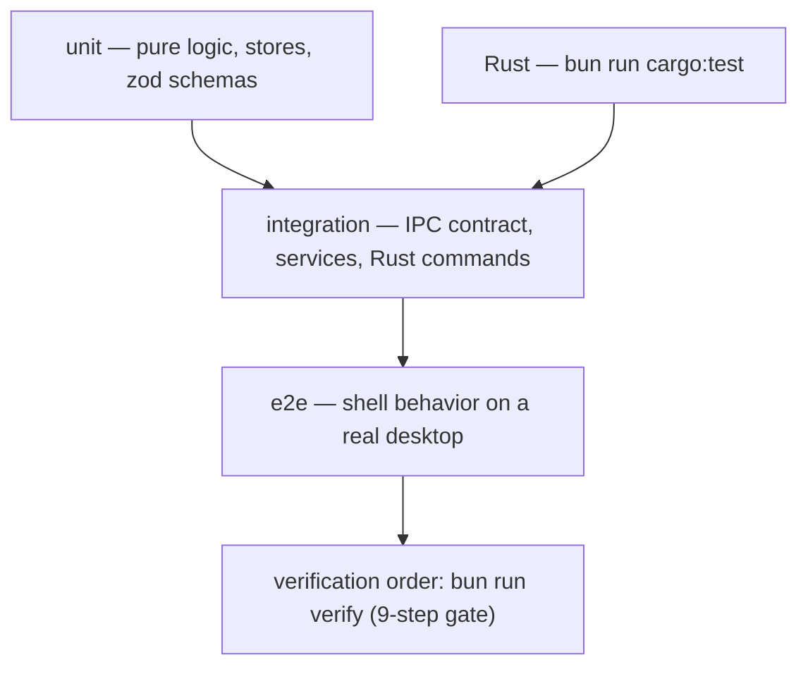

# DEX Testing Strategy

## Purpose

This document defines how DEX is tested: the test layers, what must be tested
at each layer, and the verification order that gates every change. It exists
because DEX crosses a language boundary at every IPC call and because the
repository is designed to hold past 100,000 lines of code. At that scale,
"it worked in dev" is not a test strategy; it is a promise that will break in
production.

## Current state — honest

Frontend tests run via `bun run test` (`vitest run`): 21 files under
`tests/frontend/` — contracts, events, graphics-backdrop, graphics-camera,
graphics-lighting, graphics-renderer, graphics-scene, helpers, ipc-error,
navigation-config, primitives-card, primitives-context-menu,
primitives-dropdown, primitives-modal, shell-store, storage, theme-store,
theme-switcher, utils, window-geometry, window-store — 94 tests in the default
**node** environment plus 43 jsdom component-behavior tests (Card, Modal,
ContextMenu, Dropdown, ThemeSwitcher, plus the M2.1 GraphicsBackdrop and the
renderer lifecycle via DI stubs), with `$lib` and lucide-svelte stubs
configured in `vitest.config.ts`. Behavior tests that render components opt into a DOM per
file (see [Component behavior tests](#component-behavior-tests) below). Rust tests run via `bun run cargo:test` (cwd-independent,
`--manifest-path`): 67 unit tests across the providers, database migrations,
utils, and commands. The other `tests/` directories —
`tests/{backend,unit,integration,e2e}/` — remain scaffolding.

The tooling is live: ESLint, Prettier, Rustfmt, Clippy, the vitest runner, and
the CI skeleton all landed with milestone **M0.4 (Development Tooling)**, which
is shipped. `bun run verify` is the authoritative gate, and CI runs exactly it
on push/PR to `develop`/`main`. The manual desktop check remains part of the
verification picture because compositor and transparent-window behavior cannot
be tested headless (ADR-0004).

## Why test at all

- **Strong Typing (Principle 8).** The IPC boundary is schema-validated at
  both edges (ADR-0002). Tests are the second line of defense: they catch
  contract drift that type-checking and zod parsing miss because they exercise
  the behavior, not just the types.
- **Feature First Architecture (Principle 10).** Features are vertical slices.
  A slice is only complete when it is tested; a feature folder without tests is
  a feature that cannot be changed safely.
- **Native First (Principle 5).** The shell is transparent and composited
  (ADR-0004). Some behavior — compositor motion, transparent-window input —
  can only be verified on a real desktop, which is why the manual check is part
  of the order.

## Test layers

DEX tests at four layers. Each layer has a different cost and a different
purpose; the strategy is to put each test at the cheapest layer that can
meaningfully run it.



### Unit tests

Unit tests exercise pure logic in isolation: a store's transitions, a helper
function, a zod schema's accept/reject behavior. They are the cheapest layer
and the most numerous.

**What must be tested:**

- **Zod schemas** for every IPC command contract (`core/api/commands.ts`) and
  every event payload (`core/api/events.ts`). Each schema is tested for the
  valid shape and for representative invalid shapes, so contract drift is
  caught at the boundary.
- **Rune stores** (`core/stores/*.svelte.ts`): initial state, transitions,
  persistence round-trip. The `theme.svelte.ts` store is the reference: test
  that `applyTheme` sets the `data-theme` attribute and persists the choice.
- **Pure helpers** in `core/utils/` (`format`, `date`, `storage`).
- **Rust unit tests** inside `src-tauri/` for pure logic — error serialization
  (`AppError` emits exactly `{ "type", "message" }`), model conversions, and
  any pure domain logic.

### Component behavior tests

Added in **M1.3 (UI Components)** for the overlay primitives (Modal,
ContextMenu, Dropdown, Card) and extended in **M1.4 (Theme)** for the
ThemeSwitcher. These tests render **real Svelte 5 runes components** and
assert _behavior_ — open/close transitions, keyboard and focus handling,
Escape and click-outside dismissal, live theme application — **not visual
appearance** (layout, colors, and motion stay in the manual desktop gate).

**Strategy — node stays the default.** `vitest.config.ts` keeps
`environment: "node"`. A behavior test opts into a DOM with a per-file
docblock as its first line:

```ts
// @vitest-environment jsdom
import { render, screen, fireEvent } from "@testing-library/svelte";
```

Vitest 4 honors the per-file environment override out of the box — the file
runs in jsdom while node stays the default for everything else. Existing node
tests are **not migrated**; they keep running in the default environment
untouched.

**Two setup requirements confirmed during the M1.3 infrastructure task:**

1. **Client-mode compilation.** Vitest transforms `.svelte` files with
   `ssr: true`, so Svelte components compile to server output and
   `mount()` is unavailable (`lifecycle_function_unavailable`). The docblock
   alone switches the runtime _environment_ but not the _compile mode_.
   Rendering real Svelte 5 runes components therefore requires the
   `svelteTesting()` plugin from `@testing-library/svelte/vite` registered in
   `vitest.config.ts` — it adds `browser` to `resolve.conditions` so Svelte
   resolves its client build. This is a documented `@testing-library/svelte`
   requirement for Svelte 5 and is a one-line `vitest.config.ts` change
   (kept out of this milestone's diff; the first behavior test lands with it).
2. **The lucide-svelte stub still applies.** Behavior tests render real
   components, and any component under test that imports icons resolves
   through the existing `lucide-svelte` alias in `vitest.config.ts`. The stub
   must keep exporting every icon a rendered component imports (extend
   `tests/frontend/stubs/lucide-svelte.js` as components grow).

Because each behavior test mounts into jsdom, tests must not assert layout
geometry, computed styles, or animation state — jsdom does not run real layout
or transitions. Those stay in the manual desktop gate (ADR-0004).

### Integration tests

Integration tests exercise a seam: the IPC contract between the frontend
contract client and the Rust command. They verify that a command registered in
`core/api/commands.ts` and in `src-tauri/src/lib.rs` actually round-trips
correctly, and that the error envelope surfaces as `IpcError` on failure.

**What must be tested:**

- **Contract clients** in `core/services/`: given a mocked or real invoke, the
  client returns the typed result and surfaces `IpcError` on a rejected
  envelope.
- **Rust commands** (`src-tauri/src/commands/`): each `#[tauri::command]`
  returns the correct `Result<T, AppError>` for its happy path and its error
  paths.
- **Event handling** (`core/api/events.ts`): invalid payloads are logged and
  dropped, never thrown into the handler.

### End-to-end tests

E2E tests drive the shell on a real desktop and verify user-visible behavior:
the HUD renders, the Dock launches a launcher, theme switching changes the
surface. Because the window is transparent and composited (ADR-0004), E2E must
run on Wayland/Hyprland, not in a browser tab.

**What must be tested:**

- Shell boot: the HUD mounts, `initTheme()` runs before first paint.
- Keyboard operability and focus visibility (see `Accessibility.md`).
- Feature vertical slices end to end, once features exist (Phase 1+).

### Rust tests

`bun run cargo:test` (`--manifest-path`, cwd-independent) covers the Rust
side: 67 unit tests across the providers, database migrations, utils, and
commands, plus integration tests for command handlers and the database access
layer. Rust owns all system access (ADR-0001), so the Rust test suite is the
primary guard on filesystem, SQLite, and Hyprland behavior.

## What must be tested at each layer — summary

| Layer              | Scope                                                                          | Gate                      |
| ------------------ | ------------------------------------------------------------------------------ | ------------------------- |
| Unit               | zod schemas, stores, pure helpers, Rust pure logic                             | fast, run on every change |
| Component behavior | rendered Svelte 5 components in jsdom (open/close, keyboard, focus, dismissal) | fast, run on every change |
| Integration        | IPC contract clients, Rust commands, events                                    | run on every change       |
| E2E                | shell behavior on a real desktop                                               | run at milestone gates    |
| Rust               | `bun run cargo:test` in `src-tauri/`                                           | run on every change       |

## Verification (the gate)

Run `bun run verify` (`scripts/verify.ts`) from any cwd before merging. It runs nine gates in order, fail-fast:

1. `format:check` — frontend formatting (`prettier --check src/`)
2. `cargo:fmt:check` — backend formatting (`cargo fmt --check`, `--manifest-path`)
3. `lint` — frontend lint (`eslint src/`)
4. `check` — frontend types (`svelte-kit sync && svelte-check`)
5. `cargo:clippy` — backend lint (`clippy --all-targets --all-features -D warnings`)
6. `cargo:check` — backend types
7. `test` — frontend tests (`vitest run`)
8. `build` — frontend production build (`vite build`)
9. `cargo:test` — backend tests

CI runs exactly this gate on push/PR to `develop`/`main`. The individual `bun run check` and `bun run cargo:check` remain valid single-gate checks during development; `bun run tauri:dev` stays a manual desktop gate (transparent/compositor behavior cannot be tested headless, ADR-0004). A change failing any gate is not ready for review.

## Roadmap

- **M0.4 (Development Tooling, shipped):** ESLint, Prettier, Rustfmt, Clippy,
  the vitest runner, and the CI skeleton. The automated test suite is now
  enforceable in CI via `bun run verify`.
- **M9.2 (Testing, Phase 9):** the full unit, integration, UI, and Rust test
  suites are completed and hardened as part of the production milestone. This
  is the gate that makes v1.0 shippable.

## Related Documents

- Canonical terminology: [`../00-vision/03_Glossary.md`](../00-vision/03_Glossary.md)
- Coding standards: [`CodingStandards.md`](CodingStandards.md)
- CI design: [`CI.md`](CI.md)
- Performance standards: [`Performance.md`](Performance.md)
- Accessibility standard: [`Accessibility.md`](Accessibility.md)
- Typed IPC contract: [`../50-adr/0002-typed-ipc-contract.md`](../50-adr/0002-typed-ipc-contract.md)
- Product roadmap (M0.4, M9.2): [`../10-product/11_Product_Roadmap.md`](../10-product/11_Product_Roadmap.md)
