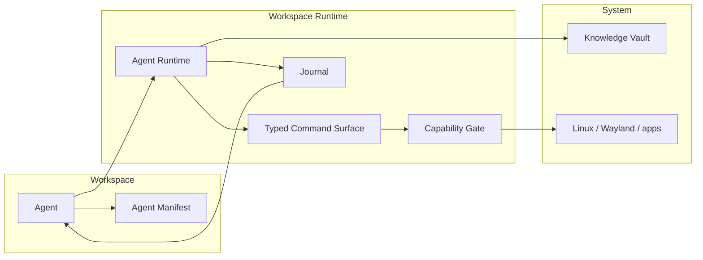
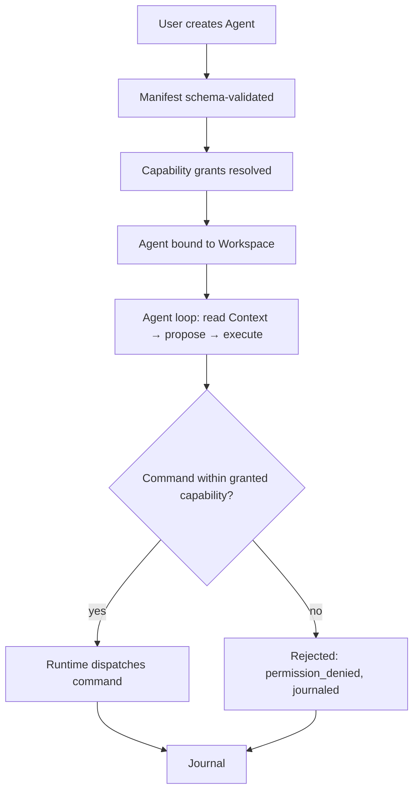

# RFC: Autonomous Agents Operating Within Workspaces

- **Status:** Draft
- **Owner:** AI Platform (roadmap Phase 6) with the Workspace Runtime
- **Related phase:** M6.x (AI Platform), M7.x (Automation)
- **Depends on:** [`../50-adr/0005-plugin-boundary.md`](../50-adr/0005-plugin-boundary.md), [`../50-adr/0002-typed-ipc-contract.md`](../50-adr/0002-typed-ipc-contract.md)

## Context

DEX is a Workspace Runtime: the operating layer that activates, restores, and
orchestrates complete development Workspaces on Linux. Its memory layer, the
Knowledge Vault, is the durable, always-local store of a developer's Context,
notes, and history. The roadmap's Long-Term Vision (v2) names *distributed AI
agents* as a future capability, and Phase 6 builds the AI Platform that such
agents would consume.

Two principles bound any agent design. **AI is Optional** (principle 12): every
AI capability must degrade gracefully to a fully manual workflow, and no core
capability may require a model, an API key, or a network. **CLI First**
(principle 3): every capability is scriptable from the command line, and the
graphical shell is a second client of the same surface. An agent that cannot be
reduced to a scripted, user-invoked sequence is a capability that does not
exist.

The Non-Goals add a third bound: DEX is **not a general-purpose automation
platform**. Automation targets the development workflow — Workspaces, Workspace
Services, and tooling — not the consumer desktop. An agent is therefore a
development-workflow actor bound to a Workspace, never a free-roaming system
agent.

This RFC proposes the shape of that agent: a runtime bound to a Workspace,
reading Context from the Knowledge Vault, and acting only through the Runtime's
typed command surface — never through raw system access.

## Proposal

An **Agent** is an AI-driven actor that operates within a single Workspace. It
is declared by the Workspace, supervised by the Runtime, and executes by issuing
the same typed commands a human would issue from the CLI or the shell. It has no
privileges of its own; every effect is mediated by the Runtime's command
surface and gated by the same capability model that governs Plugins
(ADR-0005).

The Agent's contract:

1. **Workspace-bound.** An Agent is created against a specific Workspace and
   cannot act outside it. Its lifecycle is tied to the Workspace lifecycle: it
   is suspended when the Workspace pauses and stopped when the Workspace leaves.
2. **Vault-fed Context.** The Agent reads Context from the Knowledge Vault
   through Memory Providers. It never holds its own private store of the
   developer's state; the Vault is the single source of what the Agent knows.
3. **Command-surface execution.** The Agent acts by invoking the same typed
   commands available to the CLI (`core/services/<domain>` contract clients).
   It has no filesystem, SQLite, or shell access of its own — exactly as the
   frontend has none (ADR-0001).
4. **Capability-gated like a Plugin.** Each Agent declares a manifest of the
   capabilities it may use. The Runtime grants exactly those capabilities, in
   the same per-agent grants that ADR-0005 defines for Plugins. No default
   elevation.
5. **Always visible and interruptible.** Every Agent action is observable in
   the Journal and in the shell. The user can pause, resume, or terminate the
   Agent at any point, and can step through its proposed actions before they
   execute.
6. **Degrades to manual.** When the Agent is disabled, offline, or lacks a
   model, the Workspace and the Runtime are fully functional. The Agent's
   proposed actions become a checklist the user can execute by hand.

## Design

### Agent runtime

The Agent runtime is a Rust-hosted subsystem of the Workspace Runtime, in the
same family as the Plugin host. It loads an Agent manifest, binds the Agent to a
Workspace, and supervises its execution loop.

The Agent reads Context from the Knowledge Vault, proposes a sequence of
commands, and submits each command to the Runtime's typed command surface. The
capability gate checks the command against the Agent's granted capabilities
before the Runtime dispatches it. Every accepted and rejected action is written
to the Journal, which the shell renders as a live, user-visible transcript.

### The command surface as the only actuator

The Agent never reaches the system directly. It calls the same commands a human
calls — `workspace.activate`, `service.start`, `session.launch`, and the
commands exposed by Plugins — through the typed IPC contract (ADR-0002). This
has three consequences:

- **Auditability.** Because every Agent action is a typed command, it is
  schema-validated at both edges, logged, and journaled. There is no hidden
  side channel.
- **Parity with the CLI.** The Agent is, in effect, a scripted client of the
  same surface the CLI exposes. What the Agent can do, a user can do by hand;
  what a user can do by hand, the Agent can be taught to do.
- **No new attack surface.** The Agent adds no new system access. It reuses the
  boundary that already separates the frontend from the system.

### Capability model

An Agent manifest declares the capabilities it requires, mirroring the Plugin
manifest model of ADR-0005. The Runtime validates the manifest against a schema
at creation time and grants exactly the declared capabilities. A capability is a
named set of commands; granting it means the Agent may invoke those commands.

### Secrets

The Agent operates within the Workspace and may need to act on behalf of the
developer. It must never obtain secrets it was not explicitly granted. Secrets
are handled per the Secrets contract: they stay local, are never exposed to the
Agent's model context, and are referenced by handle rather than by value. An
Agent that needs a credential requests it through the same secret-resolution
path a human uses, and the resolved value is used inside the Runtime, never
passed to the model.

## Impact

- **Plugin boundary (ADR-0005).** The Agent reuses the Plugin capability model
  rather than extending it. The Agent is not a Plugin; it is a supervised actor
  that consumes the same command surface Plugins expose. The boundary holds
  because the Agent adds no new system access.
- **Secrets.** The Agent introduces a new consumer of the Secrets contract. The
  rule is unchanged: secrets never leave the device unencrypted and never enter
  model context. The Agent's manifest may declare which secret handles it may
  reference.
- **Knowledge Vault.** The Agent is a consumer of the Vault, never a writer of
  privileged state. It may append to the Journal and to its own notes, but it
  cannot mutate the developer's Context except through the same commands a
  human uses.
- **Performance.** The Agent loop is off the critical path of the Workspace
  Runtime. A Workspace activates, pauses, and leaves without the Agent running.
- **Lightweight Core.** The Agent runtime lives outside the core, in the AI
  Platform feature, and is loaded only when an Agent is declared.

## Open Questions

- **What is the granularity of an Agent's permission model?** Should a
  capability be a named command, a command domain, or a declarative policy over
  arguments (for example, "may start services but only those declared in this
  Workspace's Manifest")?
- **How does the user approve a proposed action without breaking the Agent's
  flow?** Is approval per-action, per-batch, or a one-time grant for a bounded
  task, and how does each choice affect the interruptibility guarantee?
- **What memory policy governs what the Agent may read from the Knowledge
  Vault?** Does the Agent read all Context for its Workspace, or only the
  subsets its manifest declares, and who decides?
- **How is an Agent's autonomy bounded in time?** Does an Agent run until its
  task completes, until the Workspace leaves, or until a user-set budget of
  actions or wall-clock time is exhausted?
- **What happens to an Agent's in-flight state when the Workspace pauses?** Is
  the Agent's proposed-action queue persisted as part of the Workspace Snapshot,
  or discarded?
- **How are distributed agents (Long-Term Vision v2) reconciled with the
  Workspace-bound model proposed here?** Is a distributed agent a set of
  Workspace-bound agents coordinated by a shared Vault, or a distinct runtime?

## Future Evolution

- **Agent templates.** Reusable, manifest-declared Agent definitions that a
  user instantiates against a Workspace, analogous to how a Workspace is
  declared by a Manifest.
- **Agent-to-agent coordination.** Multiple Agents within a Workspace, each
  capability-gated, coordinating through the Journal and the Vault rather than
  through direct communication.
- **Smart Actions (M7.4).** AI-generated workflows that an Agent can execute,
  reusing the Automation engine's trigger → action → condition → result model.

## Related Documents

- Canonical terminology: [`../00-vision/03_Glossary.md`](../00-vision/03_Glossary.md)
- AI is Optional (principle 12): [`../00-vision/02_Principles.md`](../00-vision/02_Principles.md)
- Not a general-purpose automation platform: [`../00-vision/04_NonGoals.md`](../00-vision/04_NonGoals.md)
- Roadmap Phase 6 (AI Platform) and Long-Term Vision v2: [`../10-product/11_Product_Roadmap.md`](../10-product/11_Product_Roadmap.md)
- AI requirements (AI-1..AI-3): [`../10-product/10_Master_PRD.md`](../10-product/10_Master_PRD.md)
- System architecture and layer model: [`../20-architecture/20_System_Architecture.md`](../20-architecture/20_System_Architecture.md)
- AI subsystem: [`../20-architecture/26_AI.md`](../20-architecture/26_AI.md)
- Knowledge Vault contract: [`../30-specs/Knowledge.md`](../30-specs/Knowledge.md)
- Secrets contract: [`../30-specs/Secrets.md`](../30-specs/Secrets.md)
- Workspace contract: [`../30-specs/Workspace.md`](../30-specs/Workspace.md)
- Plugin boundary: [`../50-adr/0005-plugin-boundary.md`](../50-adr/0005-plugin-boundary.md)
- Typed IPC contract: [`../50-adr/0002-typed-ipc-contract.md`](../50-adr/0002-typed-ipc-contract.md)
- Related RFCs: [`Voice.md`](Voice.md), [`WorkspaceSharing.md`](WorkspaceSharing.md)