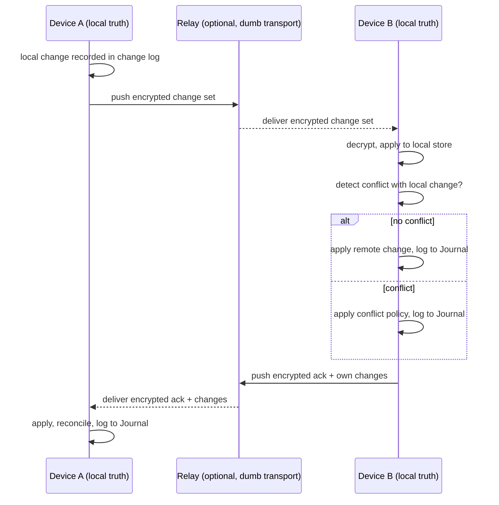

# RFC: Synchronization Layered on Offline First

- **Status:** Draft
- **Owner:** Workspace Runtime with the Knowledge subsystem
- **Related phase:** Long-Term Vision v2 (cloud sync)
- **Depends on:** [`../00-vision/02_Principles.md`](../00-vision/02_Principles.md) (Offline First), [`../30-specs/Secrets.md`](../30-specs/Secrets.md)

## Context

DEX is Offline First (principle 2): the machine is fully functional with no
network, and local state is the source of truth. The Non-Goals state the
corollary in the negative — DEX is **not a cloud service**: there is no account,
no mandatory synchronization, and no telemetry by default. Offline First is not
a mode of DEX; it is DEX.

The roadmap's Long-Term Vision (v2) nevertheless names *cloud sync* as a future
capability. These two statements are not in conflict if synchronization is
designed as a layered, opt-in extension that never becomes the authority. The
Knowledge Vault, the Workspace registry, and every Workspace must work on a
laptop with the network cable pulled; sync is what happens *after* that, when
the user chooses to replicate their local state to another device.

This RFC proposes a sync engine that replicates Workspaces, the Knowledge Vault,
and settings between devices, while preserving the invariant that local state
remains the source of truth and that nothing leaves the machine except by
explicit request.

## Proposal

A **Sync Engine** is an opt-in extension of the Workspace Runtime that
replicates local state between devices. It is a mirror, never the authority:
each device keeps its own authoritative local state, and the engine reconciles
differences according to explicit conflict semantics. Sync is enabled per
device, per data class, and per peer, and it is never a precondition for any
core operation.

The Sync Engine's contract:

1. **Opt-in and layered.** Sync is disabled by default. Enabling it never
   changes how the Runtime, the Knowledge Vault, or a Workspace behaves
   offline; it only adds a replication path.
2. **Mirror, not authority.** The local store on each device remains the source
   of truth. The sync engine does not introduce a remote store that the local
   store must defer to.
3. **Data classes.** Sync replicates three classes of data: Workspaces (their
   Manifests, registry records, and Snapshots), the Knowledge Vault, and
   settings. Each class is independently enabled.
4. **Secrets never leave unencrypted.** Secrets are excluded from replication
   by default, per the Secrets contract. Where a user explicitly opts to
   replicate a secret, it is end-to-end encrypted and never stored in plaintext
   on any peer or relay.
5. **End-to-end encryption.** All replicated data is encrypted before it leaves
   the device. The sync engine never sees plaintext; a relay, if used, is a
   dumb transport.
6. **No telemetry by default.** The sync engine collects no usage data. Any
   diagnostics are local and opt-in.

## Design

### Replication model

Each device maintains a local change log for each replicated data class. The
sync engine exchanges change logs with a peer, applies remote changes to the
local store, and records the reconciliation in the Journal. Because local state
is authoritative, a device never overwrites a local change with a remote change
without a conflict resolution.

### Conflict semantics

Because each device is authoritative over its own local state, concurrent edits
to the same record can diverge. The engine resolves conflicts with an explicit,
user-configurable policy rather than a silent last-writer-wins:

- **Last-writer-wins** for low-risk scalar settings, with the loser recorded in
  the Journal.
- **Merge** for append-only structures such as Vault notes and Journal entries,
  where both versions are preserved and linked.
- **Keep-both** for Workspace records that diverge, surfacing the two versions
  to the user for a decision rather than destroying either.

Every conflict resolution is journaled, so the user can audit what the engine
decided and why.

### Secrets handling

Secrets are the one class that is excluded by default. The Secrets contract
requires that secrets never leave the device unencrypted. The sync engine
therefore:

- Excludes the Secrets store from replication unless the user explicitly opts
  in per secret.
- When opted in, encrypts the secret end-to-end with a key derived on the
  device, so no peer or relay can read it.
- Never places a secret in a Workspace Manifest, a Snapshot, or a Vault note
  that is replicated in plaintext.

### Transport

The engine is transport-agnostic. It can replicate directly between devices on
a local network, through a user-chosen relay, or over a user-managed server. The
engine defines a wire protocol; it does not mandate a hosting model. This keeps
the engine consistent with the Non-Goal that DEX is not a cloud service — DEX
does not operate a sync service; it provides the mechanism.

## Impact

- **Offline First (principle 2).** Sync is layered and opt-in. Disabling it
  returns the system to a fully offline, fully functional state with no loss.
- **Secrets.** The sync engine is a new consumer of the Secrets contract. The
  rule is unchanged: secrets never leave the device unencrypted, and are
  excluded from replication by default.
- **Knowledge Vault.** The Vault remains always local. Sync replicates it only
  when enabled, and the Vault's contract (KV-3: offline operation) is
  unaffected.
- **Lightweight Core.** The sync engine lives outside the core, loaded only
  when a sync peer is configured.
- **Non-Goals.** The engine does not introduce an account, mandatory sync, or
  telemetry. It is a mechanism, not a service.

## Open Questions

- **What wire protocol should the sync engine use?** Should it define a
  bespoke protocol, or adopt an existing one (for example, a CRDT-based or
  version-vector protocol) to gain proven conflict semantics?
- **What server model should the engine support?** Direct peer-to-peer, a
  user-chosen relay, a user-managed server, or all three, and how does the
  choice affect the encryption and trust model?
- **How should multi-device conflict resolution scale beyond two peers?** Does
  the conflict policy hold for three or more devices editing the same record,
  and how are version vectors reconciled?
- **How is a device's identity and trust established with a peer?** Is trust
  based on a key exchange, a shared secret, or a user-verified fingerprint, and
  how is a compromised peer detected?
- **What is the granularity of the per-data-class opt-in?** Is sync enabled per
  class, per Workspace, or per record, and how does granularity affect the
  user's mental model?
- **How are Snapshots replicated?** Are full Snapshots synced, or only
  deltas, and what is the storage cost on each peer?

## Future Evolution

- **Multi-user profiles.** Sync between profiles on the same or different
  devices, with per-profile data classes.
- **Mobile companion.** A read-only or limited-write client that consumes the
  same wire protocol, without becoming a source of truth.
- **Opt-in telemetry.** If telemetry is ever offered, it is a separate,
  explicit opt-in that is never bundled with sync.

## Related Documents

- Canonical terminology: [`../00-vision/03_Glossary.md`](../00-vision/03_Glossary.md)
- Offline First (principle 2): [`../00-vision/02_Principles.md`](../00-vision/02_Principles.md)
- Not a cloud service: [`../00-vision/04_NonGoals.md`](../00-vision/04_NonGoals.md)
- Roadmap Long-Term Vision v2: [`../10-product/11_Product_Roadmap.md`](../10-product/11_Product_Roadmap.md)
- Knowledge Vault requirements (KV-3): [`../10-product/10_Master_PRD.md`](../10-product/10_Master_PRD.md)
- System architecture: [`../20-architecture/20_System_Architecture.md`](../20-architecture/20_System_Architecture.md)
- Knowledge Vault contract: [`../30-specs/Knowledge.md`](../30-specs/Knowledge.md)
- Secrets contract: [`../30-specs/Secrets.md`](../30-specs/Secrets.md)
- Workspace contract: [`../30-specs/Workspace.md`](../30-specs/Workspace.md)
- Offline First principle: [`../00-vision/02_Principles.md`](../00-vision/02_Principles.md)
- Related RFCs: [`WorkspaceSharing.md`](WorkspaceSharing.md), [`AIAgents.md`](AIAgents.md)