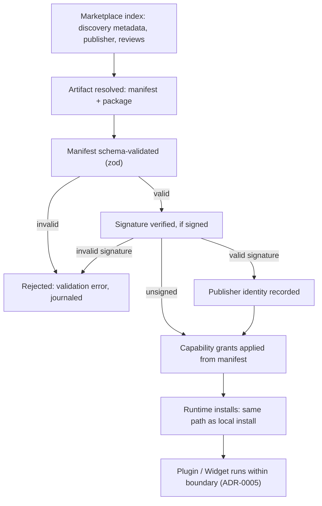

# RFC: Marketplace for Plugins and Widgets

- **Status:** Draft
- **Owner:** Plugin Platform (roadmap Phase 8) with the Widget Platform (Phase 3)
- **Related phase:** M3.4 (Widget Marketplace API), M8.3 (Marketplace)
- **Depends on:** [`../50-adr/0005-plugin-boundary.md`](../50-adr/0005-plugin-boundary.md)

## Context

DEX is Plugin First (principle 4): extensibility is designed into the platform
from the start, bounded by a hard security boundary. The boundary is already
fixed (ADR-0005): Plugins are Rust-hosted, capability-gated extensions declared
by a manifest and validated by the host; Widgets render in isolated contexts
with no IPC access of their own. The roadmap schedules a Widget Marketplace API
(M3.4) and a Plugin Marketplace (M8.3).

The boundary answers *how* an extension runs. This RFC asks a different
question: *how does an extension get to the user*. The answer is a marketplace
that operates as an index over the existing install mechanism — discovery,
install, update, and remove — and never as a bypass of the capability boundary.

The Non-Goals constrain the answer. DEX is not a cloud service: there is no
mandatory account, no telemetry by default. The marketplace must therefore work
without a DEX-operated account system, and installing from the marketplace must
be indistinguishable, from the boundary's point of view, from installing from a
local file.

## Proposal

A **Marketplace** is an index of Plugins and Widgets that the Runtime can query
for discovery and resolve to installable artifacts. It is not a new install
path. Installing a marketplace artifact runs the same manifest validation and
capability gating as any other install; the marketplace contributes only
discovery metadata, trust information, and quality signals.

The Marketplace's contract:

1. **Index over install, never a bypass.** A marketplace is a read-only index
   of extension metadata. The Runtime downloads an artifact, validates its
   manifest against the same schema as a local install, and applies the same
   capability grants (ADR-0005). A marketplace cannot elevate a Plugin or
   grant a Widget IPC access.
2. **Discovery and lifecycle.** The marketplace supports browse, search,
   install, update, and remove. Each operation maps to an existing Runtime
   lifecycle command; the marketplace adds the index query in front of it.
3. **Trust model.** Every artifact carries a manifest that is schema-validated
   at install. Optional signing binds an artifact to a publisher identity.
   Capability review is the responsibility of the marketplace index, not the
   Runtime; the Runtime enforces the boundary regardless of provenance.
4. **Quality signals.** The marketplace exposes quality signals — publisher
   identity, review status, usage, compatibility with the installed Runtime
   version — as metadata, never as a gate on installation.
5. **No account, no telemetry.** The marketplace is a static index plus a
   download endpoint. It requires no account. Installing from it collects no
   telemetry beyond what the local Journal already records.

## Design

### Install trust chain

The trust model is a chain with three independent links. The index (who
publishes and reviews), the artifact (what is being installed and what it
declares), and the Runtime (what it actually grants) are separate; a compromise
in any one link does not weaken the others.

The chain preserves the ADR-0005 invariant at every step: the Runtime never
grants more than the manifest declares, and the manifest is validated
identically whether it came from the marketplace or from a local file.

### Marketplace as index

The marketplace index is a data structure — a catalog of extension records —
that the Runtime queries through a typed contract. Each record describes an
extension: identifier, version, manifest hash, publisher, quality signals, and
the location of the artifact. The Runtime's marketplace client resolves a record
to an artifact, downloads it, and then hands the artifact to the ordinary
install pipeline.

Because the marketplace is an index, multiple marketplaces can coexist. A user
can point the Runtime at a personal index, an organization's index, or the
default community index, without any change to the install pipeline.

### Lifecycle parity

Install, update, and remove from the marketplace are the same commands as
install, update, and remove from a local file, with one addition: the marketplace
client records which index a Plugin came from, so updates are checked against
that index and a removed Plugin's provenance is preserved in the Journal.

## Impact

- **Plugin boundary (ADR-0005).** The marketplace adds no new system access and
  no new grant path. It is a discovery layer in front of the existing boundary.
- **Widget isolation.** Marketplace Widgets install through the same
  shell-mediated command path as all Widgets. A marketplace cannot grant a
  Widget direct IPC.
- **Secrets.** Marketplace artifacts never contain secrets. A Plugin that
  needs a credential requests it through the Secrets contract at runtime, never
  through its package.
- **Lightweight Core.** The marketplace client lives outside the core, in the
  Plugin Platform feature.
- **Non-Goals.** No account, no mandatory telemetry, no DEX-operated service.
  The marketplace mechanism is hosted by whoever publishes the index.

## Open Questions

- **What hosting model should the marketplace use?** A static index served over
  HTTPS, a git repository, or a registry protocol — and who operates the default
  community index?
- **What moderation model should apply to the default index?** Does the
  community index have a review process, a code-review requirement, or a
  reputation system, and who has authority over delisting?
- **Who issues signing keys and how is the trust root established?** Is
  signing by a central authority, by a web-of-trust, or purely optional with
  unsigned artifacts allowed?
- **How are quality signals computed without violating the no-telemetry rule?**
  Can the index use opt-in usage reporting, or must signals be derived from
  review status and maintenance activity alone?
- **How is an update's compatibility with the installed Runtime version
  enforced?** Is compatibility a marketplace signal, a manifest field, or a
  Runtime-enforced check at install time?
- **How do multiple marketplaces interact for the same Plugin?** If an
  extension exists in two indexes, which one owns its update channel, and how
  is the conflict resolved?

## Future Evolution

- **Sandboxing (M8.4).** A full permission system that refines the capability
  grants the marketplace can surface to the user before install.
- **Enterprise deployment.** A read-only marketplace index distributed within an
  organization, with the same trust chain and no public hosting.
- **Marketplace APIs for other extension classes.** The index model generalizes
  to any manifest-declared artifact, including themes and Agent templates.

## Related Documents

- Canonical terminology: [`../00-vision/03_Glossary.md`](../00-vision/03_Glossary.md)
- Plugin First (principle 4): [`../00-vision/02_Principles.md`](../00-vision/02_Principles.md)
- Roadmap M3.4 and M8.3: [`../10-product/11_Product_Roadmap.md`](../10-product/11_Product_Roadmap.md)
- Plugin and Widget requirements (PW-1..PW-4): [`../10-product/10_Master_PRD.md`](../10-product/10_Master_PRD.md)
- Plugin boundary: [`../50-adr/0005-plugin-boundary.md`](../50-adr/0005-plugin-boundary.md)
- Typed IPC contract: [`../50-adr/0002-typed-ipc-contract.md`](../50-adr/0002-typed-ipc-contract.md)
- Plugin API contract: [`../30-specs/PluginAPI.md`](../30-specs/PluginAPI.md)
- Widget API contract: [`../30-specs/WidgetAPI.md`](../30-specs/WidgetAPI.md)
- Secrets contract: [`../30-specs/Secrets.md`](../30-specs/Secrets.md)
- Plugins subsystem: [`../20-architecture/27_Plugins.md`](../20-architecture/27_Plugins.md)
- Related RFCs: [`WorkspaceSharing.md`](WorkspaceSharing.md), [`AIAgents.md`](AIAgents.md)