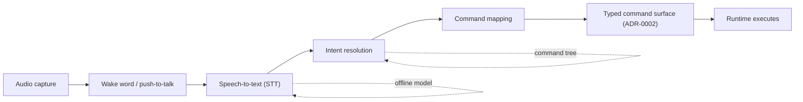

# RFC: Voice Control of the Runtime

- **Status:** Draft
- **Owner:** AI Platform (roadmap Phase 6)
- **Related phase:** M6.5 (Voice: STT, TTS, wake word)
- **Depends on:** [`../50-adr/0002-typed-ipc-contract.md`](../50-adr/0002-typed-ipc-contract.md)

## Context

The roadmap schedules Voice in Phase 6 (M6.5): speech-to-text, text-to-speech,
and a wake word. Voice is an AI capability, and AI is Optional (principle 12):
every AI capability must degrade gracefully to a fully manual workflow, and no
core capability may require a model, an API key, or a network.

Voice is also an input surface, and DEX is CLI First (principle 3): every
capability is scriptable from the command line, and the graphical shell is a
second client of the same surface. The cleanest way to make voice a first-class
input is to treat it as a third client of that same surface — the same commands,
spoken. A spoken command is not a new capability; it is an existing command
reached by a different channel.

Voice has an accessibility value that the manual and graphical surfaces do not
fully cover: it lets a user drive the Runtime without a keyboard, which
complements the accessibility work in the engineering guides. But it must never
be the only way to reach a capability.

This RFC proposes a local-first speech pipeline that maps spoken input onto the
existing command tree, degrades when offline or disabled, and never becomes a
critical path.

## Proposal

**Voice** is an input surface onto the Runtime's existing command tree. A
speech pipeline converts spoken audio to text, resolves the text to an intent,
and maps that intent to a typed command — the same command a user would type in
the CLI. The pipeline is local-first: speech-to-text runs offline where a local
model is available, and the wake word is a local detector. When the pipeline is
offline or disabled, the Runtime is fully functional and every capability
remains reachable by keyboard and CLI.

The Voice contract:

1. **Same commands, spoken.** Voice resolves to the existing command tree. It
   introduces no command that has no CLI form, and it never bypasses the typed
   IPC contract (ADR-0002).
2. **Local-first.** Speech-to-text and the wake word run locally where possible.
   A network model is an optional Provider, never a requirement.
3. **Graceful degradation.** When offline, when no model is available, or when
   Voice is disabled, the Runtime is unchanged. Voice is a convenience, not a
   dependency.
4. **Accessibility complement.** Voice provides a keyboard-free path to the
   Runtime's capabilities, complementing the accessibility guidance rather than
   replacing it.
5. **Privacy by default.** Audio is processed locally and is not transmitted
   unless the user explicitly enables a network Provider. No audio is retained
   beyond the current utterance.

## Design

### Voice → intent → command

The pipeline has four stages. Each stage is a typed seam, so a failure at any
stage degrades cleanly rather than producing a malformed command.

- **Audio capture.** The Runtime captures audio through the host system's input
  devices, owned by Rust. Capture begins on a wake word or an explicit
  push-to-talk signal.
- **Wake word.** A local detector recognizes a user-chosen wake word. It is a
  Provider; a user can disable it and rely on push-to-talk.
- **Speech-to-text.** STT is a Provider. A local model is preferred; a network
  model is an optional alternative. The output is a plain-text transcript.
- **Intent resolution.** The transcript is resolved against the command tree.
  This is the same mapping the CLI's parser performs, expressed for natural
  language. Ambiguous or unrecognized input is rejected with a clear message,
  never silently mapped to a wrong command.
- **Command mapping.** The resolved intent becomes a typed command with
  validated arguments, submitted through the same contract client a human or an
  Agent would use.

### Voice as a third client

Because voice resolves to the command tree, it inherits the guarantees of CLI
First: what works in the CLI works in voice, and nothing is voice-only. The
graphical shell, the CLI, and voice are three clients of one surface. This is
what keeps voice from becoming a parallel, divergent capability.

### Providers and degradation

STT, TTS, and the wake word are each a Provider behind a fixed interface. If a
Provider is absent — no local model, no network — the pipeline reports the
missing stage and the user falls back to keyboard and CLI. The Runtime never
blocks on a model.

### Accessibility

Voice is a keyboard-free input path. It is designed to complement the
accessibility guidance: it does not replace keyboard navigation, screen-reader
support, or reduced-motion behavior, and it respects the same preference
surfaces. A user who cannot use a keyboard can drive the Runtime's command tree
by voice; a user who cannot use voice is unaffected.

## Impact

- **AI is Optional (principle 12).** Voice is entirely optional. Disabling it
  or removing its models leaves the Runtime fully functional.
- **CLI First (principle 3).** Voice adds no command that lacks a CLI form. It
  is a third client of the same command surface.
- **Typed IPC (ADR-0002).** Voice commands pass through the same schema
  validation as any other command. A misrecognized utterance becomes a
  validation error, not a malformed system call.
- **Privacy.** Audio is local by default. A network STT Provider is explicit
  opt-in, and no audio is retained beyond the current utterance.
- **Lightweight Core.** The speech pipeline lives outside the core, in the AI
  Platform feature, and is loaded only when Voice is enabled.

## Open Questions

- **What model size is acceptable for local speech-to-text?** Does the local
  model fit the Runtime's performance and memory budgets, and how is accuracy
  balanced against footprint?
- **Which languages does the command tree support in speech?** Is intent
  resolution language-dependent, and how are non-English utterances handled?
- **How is privacy balanced against a network STT Provider?** If a user opts
  into a network model, what is transmitted, and how is the boundary between
  local and remote processing made explicit?
- **How is the wake word chosen and trained?** Is it a fixed set, a
  user-recorded phrase, or a per-user model, and how does that affect the local
  footprint?
- **How are ambiguous spoken commands resolved?** Does the pipeline ask for
  confirmation, present a ranked list, or reject, and how does that choice
  affect the interruptibility and safety of the command surface?
- **How does voice interact with the Agent and Automation surfaces?** Can a
  spoken command invoke an Agent or a workflow, and does that reuse the same
  command tree or introduce a new one?

## Future Evolution

- **Text-to-speech feedback.** TTS for confirmation and status, as a Provider,
  so the Runtime can respond to a spoken command without a screen.
- **Continuous dictation.** Free-form dictation into the Knowledge Vault,
  reusing the same STT Provider.
- **Voice for accessibility.** Deeper integration with the accessibility
  guidance as the input model matures.

## Related Documents

- Canonical terminology: [`../00-vision/03_Glossary.md`](../00-vision/03_Glossary.md)
- AI is Optional (principle 12) and CLI First (principle 3): [`../00-vision/02_Principles.md`](../00-vision/02_Principles.md)
- Roadmap M6.5: [`../10-product/11_Product_Roadmap.md`](../10-product/11_Product_Roadmap.md)
- AI requirements (AI-1..AI-3): [`../10-product/10_Master_PRD.md`](../10-product/10_Master_PRD.md)
- Accessibility guidance: [`../40-engineering/Accessibility.md`](../40-engineering/Accessibility.md)
- Typed IPC contract: [`../50-adr/0002-typed-ipc-contract.md`](../50-adr/0002-typed-ipc-contract.md)
- AI subsystem: [`../20-architecture/26_AI.md`](../20-architecture/26_AI.md)
- Related RFCs: [`AIAgents.md`](AIAgents.md), [`Marketplace.md`](Marketplace.md)