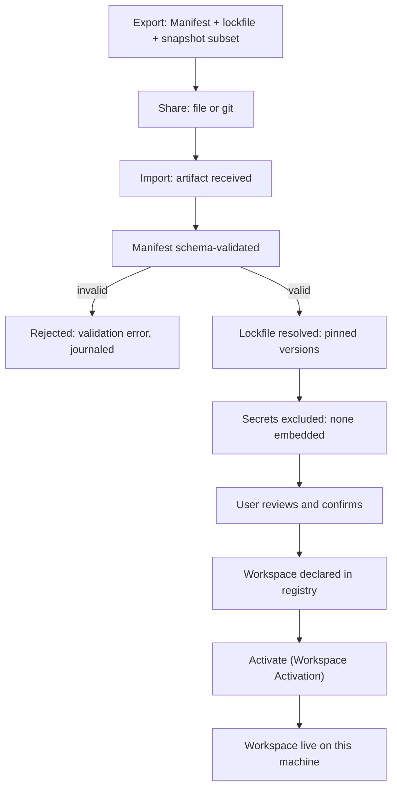

# RFC: Sharing Workspaces Between Machines and Teams

- **Status:** Draft
- **Owner:** Workspace Runtime
- **Related phase:** M3.4, M8.x, Long-Term Vision v2 (collaborative workspaces)
- **Depends on:** [`../30-specs/Manifest.md`](../30-specs/Manifest.md), [`../30-specs/Secrets.md`](../30-specs/Secrets.md)

## Context

The Vision states that a Workspace is a portable object: a Workspace created on
one machine activates on another, and the Workspace Manifest is the contract
that makes this possible. The roadmap's Long-Term Vision (v2) names
*collaborative workspaces* as a future capability. The Workspace contract
already guarantees that a Workspace declared by its Manifest activates on any
machine the Runtime runs on, without manual re-assembly.

Portability within one machine's registry is not the same as sharing between
machines and teams. Sharing requires a Workspace to be packaged as an artifact
that can leave the machine, be inspected, and be imported elsewhere — without
carrying the developer's secrets or credentials, and without losing the
reproducibility that makes a Manifest meaningful.

The Non-Goals constrain the design. DEX is not a cloud service and does not lock
data into proprietary formats. Sharing must therefore work without a DEX-operated
server, and the shared artifact must be an open, documented format.

This RFC proposes export and import of a Workspace as a shareable artifact:
the Manifest, pinned dependency versions, and a snapshot subset, with secrets
and credentials excluded.

## Proposal

**Workspace Sharing** is the export and import of a Workspace as a portable,
self-contained artifact. The artifact bundles the Workspace Manifest, pinned
versions of the dependencies the Manifest references, and an optional snapshot
subset of the Workspace's state. It is shared without a server — as a file, or
through a version-control system such as git. Secrets and credentials are
excluded by default and never embedded in the artifact.

The Sharing contract:

1. **Manifest-led.** The artifact is anchored by the Workspace Manifest. The
   Manifest is the declarative contract; the artifact makes it portable.
2. **Pinned and reproducible.** Dependency versions referenced by the Manifest
   are pinned in the artifact, so importing the artifact reproduces the
   Workspace's declared environment rather than whatever is current.
3. **Snapshot subset.** The artifact may include a subset of the Workspace's
   Snapshots — the state needed to restore where work left off — but never the
   full runtime state by default.
4. **Secrets excluded.** Secrets and credentials are excluded from the artifact
   per the Secrets contract. They never leave the device unencrypted and are
   never embedded in a shared file.
5. **Serverless.** Sharing works through files and git. There is no
   DEX-operated server and no account.
6. **Open format.** The artifact is an open, documented format, consistent with
   the Non-Goal that DEX does not lock data into proprietary formats.

## Design

### The shareable artifact

An exported Workspace is a directory (or an archive of that directory) with a
defined layout:

- **The Workspace Manifest**, the declarative contract.
- **A lockfile** of pinned dependency versions — the versions of the tools,
  Workspace Services, and Plugins the Manifest references.
- **A snapshot subset**, optional, containing the Snapshots the exporter chose
  to include.
- **A provenance record**, describing the source machine, the export time, and
  the Runtime version that produced the artifact.

The artifact is a plain, inspectable structure. A recipient can read the
Manifest and the lockfile before importing; nothing is hidden.

### Share → import → activate

Importing an artifact is a deliberate, user-invoked act. The Runtime validates
the Manifest, resolves the pinned dependencies, and activates the Workspace —
without ever trusting the artifact more than a local Manifest.

The import path is the same as declaring a Workspace from a local Manifest, with
the addition of the lockfile resolution and the explicit user confirmation. The
artifact never bypasses the Workspace lifecycle.

### What is shared vs excluded

The artifact shares the declarative and reproducible parts of a Workspace and
excludes the private parts:

- **Shared:** the Manifest, the pinned dependency lockfile, and the chosen
  snapshot subset.
- **Excluded:** secrets, credentials, and any value the Secrets contract
  protects. These are never embedded in the artifact. A recipient who needs a
  secret provides it locally through the Secrets contract at activation time.

### Reproducibility

The lockfile is what makes the artifact reproducible. Without it, a Manifest
that references "the current version" of a tool would activate differently on
different machines. With it, importing the artifact on a second machine resolves
the same pinned versions, so the Workspace's declared environment is
reproduced rather than approximated.

### Trust of imported Manifests

An imported Manifest is validated by the same schema as a locally authored one.
The artifact's provenance record is informational; it does not confer trust. A
recipient reviews the Manifest and lockfile before confirming the import, and
the Runtime treats the imported Manifest exactly as it treats any other — with
no elevated privileges.

## Impact

- **Workspace First (principle 1).** Sharing treats the Workspace as the atomic,
  portable unit of work, extending the Manifest's portability to a shareable
  artifact.
- **Secrets.** Sharing is a new consumer of the Secrets contract. The rule is
  unchanged: secrets never leave the device unencrypted and are excluded from
  the artifact.
- **Offline First (principle 2).** Sharing is serverless and works fully
  offline. Importing an artifact requires no network.
- **Non-Goals.** No cloud service, no account, no proprietary format. The
  artifact is open and shared through files and git.
- **Lightweight Core.** The export and import logic lives outside the core, in
  the Workspace feature.

## Open Questions

- **What is the granularity of sharing?** Is the unit always a full Workspace,
  or can a user share a subset — a single Workspace Service, a single Snapshot,
  or a Manifest without any snapshot?
- **How is trust in an imported Manifest established?** Beyond schema
  validation, does the recipient rely on the provenance record, on a signature,
  or on manual review, and how is a malicious Manifest detected?
- **What storage format should the artifact use?** A plain directory, a tar
  archive, or a git repository, and how does the choice affect diffing and
  versioning of shared Workspaces?
- **How are pinned dependency versions resolved when a pin is unavailable on
  the importing machine?** Does import fail, fall back to the nearest version,
  or prompt the user, and how is that recorded?
- **How does the snapshot subset interact with the Secrets exclusion?** If a
  Snapshot references a secret by handle, how is that handle resolved on the
  importing machine without embedding the secret?
- **How do collaborative workspaces (Long-Term Vision v2) build on this
  artifact?** Is collaboration a shared artifact plus a merge workflow, or a
  distinct live-sharing mechanism?

## Future Evolution

- **Collaborative workspaces.** Multiple users importing and merging the same
  artifact, with the lockfile and provenance record supporting a merge workflow.
- **Signed artifacts.** Optional signing of the artifact to bind it to a
  publisher, reusing the trust model proposed for the Marketplace.
- **Enterprise distribution.** A read-only index of approved Workspace
  artifacts within an organization, sharing the same open format.

## Related Documents

- Canonical terminology: [`../00-vision/03_Glossary.md`](../00-vision/03_Glossary.md)
- Workspace First (principle 1) and Offline First (principle 2): [`../00-vision/02_Principles.md`](../00-vision/02_Principles.md)
- Not a cloud service, no proprietary formats: [`../00-vision/04_NonGoals.md`](../00-vision/04_NonGoals.md)
- Vision (portable Workspaces) and roadmap Long-Term Vision v2: [`../00-vision/01_Vision.md`](../00-vision/01_Vision.md), [`../10-product/11_Product_Roadmap.md`](../10-product/11_Product_Roadmap.md)
- Workspace requirements (WR-5): [`../10-product/10_Master_PRD.md`](../10-product/10_Master_PRD.md)
- Workspace contract: [`../30-specs/Workspace.md`](../30-specs/Workspace.md)
- Workspace Manifest contract: [`../30-specs/Manifest.md`](../30-specs/Manifest.md)
- Workspace Snapshot contract: [`../30-specs/Snapshot.md`](../30-specs/Snapshot.md)
- Secrets contract: [`../30-specs/Secrets.md`](../30-specs/Secrets.md)
- Related RFCs: [`CloudSync.md`](CloudSync.md), [`Marketplace.md`](Marketplace.md)