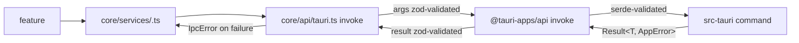

# DEX Commands — Public IPC Command Catalog

## Purpose

This document is the public catalog of the DEX IPC command surface: every
command a consumer can invoke across the frontend ⇄ Rust boundary, its
arguments, its result, the errors it can raise, and the roadmap phase that
owns it. It is a *reference* — it lists what exists and what is planned, and
it never describes a planned command as if it were live.

The wire contract mechanics — zod validation at both edges, the error
envelope, the command registry — are owned by
[`20_System_Architecture.md`](../20-architecture/20_System_Architecture.md)
and [`0002-typed-ipc-contract.md`](../50-adr/0002-typed-ipc-contract.md).
Formal schemas for each domain are owned by the specifications in
[`../30-specs/`](../30-specs/). This document indexes that surface and maps
it to the roadmap; it does not re-derive the contracts.

## Why the surface is shaped this way

DEX crosses a language boundary — TypeScript and Rust — on every IPC call.
The Strong Typing principle (principle 8) makes every seam a typed contract,
so the command surface is not a loose collection of functions but a
**registry**: a command is not callable until it is declared in exactly two
places — the TypeScript contract registry (`core/api/commands.ts`) and the
Rust `invoke_handler` (`src-tauri/src/lib.rs`). A command in only one place
is dead surface.

Three consequences follow from this design:

1. **Two validation edges.** The frontend validates arguments before the
   round trip (fail fast) and the result after (detect contract drift). The
   Rust edge validates on the way in via serde. A mismatch surfaces as a
   typed error at the boundary, not as `undefined` deep in UI code.
2. **One contract client per domain.** Features never import
   `@tauri-apps/api`; they call a typed async function in
   `core/services/<domain>.ts`. The contract client is the only public
   surface a feature may use.
3. **A closed error set.** Every failure is normalized to the `IpcError`
   envelope with a `type` from a closed set, so callers handle typed errors,
   never `unknown`.

## Command lifecycle

A command becomes callable through the five-step checklist (ADR-0002):

1. Rust: `src-tauri/src/commands/<domain>.rs` — `#[tauri::command]`,
   `Result<T, AppError>`, exactly one serde struct argument.
2. Rust: declare the module and **append** the function to the single
   `generate_handler![...]` in `src-tauri/src/lib.rs`. Exactly one
   `invoke_handler` call may exist; a second silently shadows the first.
3. TypeScript: add a `defineCommand(...)` contract plus zod schemas in
   `core/api/commands.ts`. Duplicate names are rejected.
4. TypeScript: expose a typed async function in `core/services/<domain>.ts`.
5. Capability grant if a plugin is involved
   (`src-tauri/capabilities/default.json`).



## Error envelope

Every command returns `Result<T, AppError>`. On the wire, `AppError`
serializes to exactly `{ "type", "message" }`, where `type` is one of the
closed set:

| `type` | Meaning |
|---|---|
| `validation` | Arguments failed semantic validation |
| `not_found` | The requested entity does not exist |
| `permission_denied` | The caller lacks the required capability |
| `conflict` | The operation conflicts with current state |
| `unsupported` | The operation is not supported in this context |
| `internal` | An unexpected failure inside the Runtime |

Two additional `IpcError` types reach callers that are not part of the Rust
envelope: `unknown` (a transport/string rejection) and `contract` (the
result failed zod validation). Infallible commands return `Ok(())`, which
maps to `z.null()` on the frontend.

## Implemented commands

### `greet` — core domain

The canonical command, implemented in Phase 0 (M0.3) to prove the typed IPC
seam end to end. It is the only live command today.

| Field | Value |
|---|---|
| Command name | `greet` |
| Domain | `core` |
| Milestone | M0.3 (implemented) |
| Status | **implemented** |
| Args schema | `{ name: string }` |
| Result schema | `{ message: string }` |
| Error types | `internal` (the handler returns `Ok` unconditionally today) |
| Rust handler | `src-tauri/src/commands/core.rs` → `commands::core::greet` |
| Contract client | `core/services/greet.ts` → `greet(name): Promise<string>` |

The contract client returns the `message` string directly:

```ts
import { greet } from "$lib/core/services/greet";
const message = await greet("Ada"); // "Hello, Ada! You've been greeted from Rust!"
```

## Planned command domains

The following domains are planned and mapped to roadmap milestones. They are
**not implemented**; their exact command names, argument schemas, and result
schemas are owned by the specification named for each domain. Until a domain
lands, its commands are not callable.

| Domain | Roadmap milestone | Status | Contract spec |
|---|---|---|---|
| `theme` | Phase 1 · M1.4 | planned | [`../30-specs/Theme.md`](../30-specs/Theme.md) |
| `widget` | Phase 3 · M3.1 | planned | [`../30-specs/WidgetAPI.md`](../30-specs/WidgetAPI.md) |
| `search` | Phase 4 · M4.2 | planned | [`../30-specs/Search.md`](../30-specs/Search.md) |
| `secrets` | Phase 4 · native layer | planned | [`../30-specs/Secrets.md`](../30-specs/Secrets.md) |
| `workspace` | Phase 5 · M5.5 | planned | [`../30-specs/Workspace.md`](../30-specs/Workspace.md) |
| `manifest` | Phase 5 · M5.5 | planned | [`../30-specs/Manifest.md`](../30-specs/Manifest.md) |
| `snapshot` | Phase 5 · M5.5 | planned | [`../30-specs/Snapshot.md`](../30-specs/Snapshot.md) |
| `service` | Phase 5 · M5.5 | planned | [`../30-specs/Workspace.md`](../30-specs/Workspace.md) |
| `journal` | Phase 5 · core apps | planned | [`../30-specs/Journal.md`](../30-specs/Journal.md) |
| `vault` | Phase 6 · M6.2 | planned | [`../30-specs/Knowledge.md`](../30-specs/Knowledge.md) |
| `automation` | Phase 7 · M7.1 | planned | [`../30-specs/Automation.md`](../30-specs/Automation.md) |
| `plugin` | Phase 8 · M8.1/M8.2 | planned | [`../30-specs/PluginAPI.md`](../30-specs/PluginAPI.md) |

### Representative planned commands

The entries below are representative of each domain's intended surface. They
are **planned** and their authoritative schemas live in the referenced spec;
treat the names as indicative until the spec and the registry agree.

| Domain | Representative command | Intent | Milestone |
|---|---|---|---|
| `theme` | `theme.set` | switch the active theme | M1.4 |
| `widget` | `widget.install` | install a Widget | M3.1 |
| `search` | `search.query` | search filesystem and Context | M4.2 |
| `secrets` | `secrets.get` | retrieve a stored secret | Phase 4 |
| `workspace` | `workspace.activate` | perform Workspace Activation | M5.5 |
| `manifest` | `manifest.validate` | validate a Workspace Manifest | M5.5 |
| `snapshot` | `snapshot.create` | capture a Workspace Snapshot | M5.5 |
| `service` | `service.start` | start a Workspace Service | M5.5 |
| `journal` | `journal.append` | append to the journal | Phase 5 |
| `vault` | `vault.query` | query the Knowledge Vault | M6.2 |
| `automation` | `automation.run` | run a workflow | M7.1 |
| `plugin` | `plugin.install` | install a Plugin | M8.1 |

## Related Documents

- Wire contract mechanics and the command registry:
  [`../20-architecture/20_System_Architecture.md`](../20-architecture/20_System_Architecture.md)
- Typed IPC contract decision:
  [`../50-adr/0002-typed-ipc-contract.md`](../50-adr/0002-typed-ipc-contract.md)
- Public event catalog (the Rust → UI push surface):
  [`Events.md`](Events.md)
- CLI reference (the scriptable surface of the same commands):
  [`CLI.md`](CLI.md)
- Plugin and Widget SDK surface:
  [`PluginsWidgets.md`](PluginsWidgets.md)
- Formal contracts per domain:
  [`../30-specs/`](../30-specs/)
- Roadmap and milestones:
  [`../10-product/11_Product_Roadmap.md`](../10-product/11_Product_Roadmap.md)
- Canonical terminology:
  [`../00-vision/03_Glossary.md`](../00-vision/03_Glossary.md)