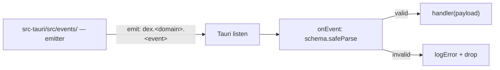

# DEX Events — Public Event Catalog

## Purpose

This document is the public catalog of the DEX event surface: the Rust → UI
push channel by which the Runtime notifies the shell and its extensions of
state changes. It lists the `EVENTS` registry naming convention, the
subscription contract, the current state, and the planned events by domain,
mapped to roadmap milestones.

The protocol details — the registry, the naming rule, payload validation and
drop semantics — are owned by
[`24_EventBus.md`](../20-architecture/24_EventBus.md). This document is the
index; the protocol document is the mechanism. Formal payload schemas per
domain are owned by the specifications in
[`../30-specs/`](../30-specs/).

## Why the surface is shaped this way

Commands are pull: the frontend asks, Rust answers. Not everything fits that
shape. The shell must *react* to things it did not ask for — a window
gaining focus, a Workspace Service stopping, a snapshot completing — and the
Rust side is the only side that owns the system access to observe them
(ADR-0002). The event surface exists for that push direction.

The rules that shape it follow from Strong Typing (principle 8) and from a
defensive posture toward the Runtime as emitter:

1. **Declared, not guessed.** Every event name is declared in the `EVENTS`
   registry in `core/api/events.ts` with its payload schema, before any
   subscription is possible. A name that is not in the registry is not an
   event.
2. **Validate and drop.** An invalid payload is logged and dropped — never
   thrown into the handler. A misbehaving emitter must not crash the shell.
3. **One emitter.** Only `src-tauri/src/events/` emits. The shell never
   fabricates system events; the Runtime is the single source of truth for
   state changes.

## Naming convention

Event names follow the canonical form:

```
dex.<domain>.<event>
```

Each segment is lowercase, dot-separated, and matches the domain and event
identifiers declared in the `EVENTS` registry. The domain segment mirrors the
command domain of the owning feature (see
[`Commands.md`](Commands.md)); the event segment names the state transition,
in the past or simple present tense (`resources.updated`, `window.focused`).

## Subscription contract

Subscriptions use the typed wrapper from `core/api/events.ts`:

```ts
import { onEvent } from "$lib/core/api/events";

const unlisten = await onEvent("dex.system.resources", schema, (payload) => {
  // payload is already validated against `schema`
});
// later: await unlisten()
```

| Rule | Behavior |
|---|---|
| Name | Must be declared in the `EVENTS` registry (`core/api/events.ts`) |
| Schema | Payload is validated with `safeParse` before the handler runs |
| Invalid payload | Logged via the logger facade and dropped; handler never runs |
| Return | `Promise<UnlistenFn>` — call to unsubscribe |
| Emitter | Only `src-tauri/src/events/` may emit |

Only the logger facade (`core/utils/logger.ts`) is used for the
log-and-drop path; the frontend never uses `console.*`.

## Current state

The event surface is **wired but empty**. Phase 0 (M0.3) shipped the
plumbing — the typed `onEvent` wrapper, the validation-and-drop semantics,
the `EVENTS` registry — and the only Rust plugin live today is the log
plugin (`tauri-plugin-log`, granted `log:default`), which writes to stdout
and the app log directory. No `dex.*` event is emitted yet and the `EVENTS`
registry declares no entries.



## Planned events by domain

Each entry below is **planned** and tied to a roadmap milestone. The payload
schema for each is owned by the referenced specification; an event does not
exist until its name is declared in the `EVENTS` registry.

| Domain | Planned event | Meaning | Milestone | Spec |
|---|---|---|---|---|
| `theme` | `dex.theme.changed` | active theme switched | M1.4 | [`../30-specs/Theme.md`](../30-specs/Theme.md) |
| `widget` | `dex.widget.installed` | a Widget was installed or updated | M3.1 | [`../30-specs/WidgetAPI.md`](../30-specs/WidgetAPI.md) |
| `search` | `dex.search.updated` | indexed results changed | M4.2 | [`../30-specs/Search.md`](../30-specs/Search.md) |
| `secrets` | `dex.secrets.updated` | a stored secret changed | Phase 4 | [`../30-specs/Secrets.md`](../30-specs/Secrets.md) |
| `workspace` | `dex.workspace.activated` | a Workspace was activated | M5.5 | [`../30-specs/Workspace.md`](../30-specs/Workspace.md) |
| `workspace` | `dex.workspace.deactivated` | the active Workspace was left | M5.5 | [`../30-specs/Workspace.md`](../30-specs/Workspace.md) |
| `snapshot` | `dex.snapshot.completed` | a Workspace Snapshot finished | M5.5 | [`../30-specs/Snapshot.md`](../30-specs/Snapshot.md) |
| `service` | `dex.service.state` | a Workspace Service changed state | M5.5 | [`../30-specs/Workspace.md`](../30-specs/Workspace.md) |
| `journal` | `dex.journal.appended` | an entry was appended to the journal | Phase 5 | [`../30-specs/Journal.md`](../30-specs/Journal.md) |
| `vault` | `dex.vault.updated` | Knowledge Vault contents changed | M6.2 | [`../30-specs/Knowledge.md`](../30-specs/Knowledge.md) |
| `automation` | `dex.automation.started` | a workflow started | M7.1 | [`../30-specs/Automation.md`](../30-specs/Automation.md) |
| `automation` | `dex.automation.completed` | a workflow completed or failed | M7.1 | [`../30-specs/Automation.md`](../30-specs/Automation.md) |
| `plugin` | `dex.plugin.loaded` | a Plugin was loaded by the Runtime | M8.1 | [`../30-specs/PluginAPI.md`](../30-specs/PluginAPI.md) |

Consumer rule: a feature subscribes to an event only through `onEvent` with
the declared name and schema, and never imports `@tauri-apps/api` directly.
Widgets, which have no IPC access of their own, receive mediated events from
the shell rather than subscribing directly (see
[`PluginsWidgets.md`](PluginsWidgets.md)).

## Related Documents

- Event bus protocol and mechanics:
  [`../20-architecture/24_EventBus.md`](../20-architecture/24_EventBus.md)
- Typed IPC contract decision (events §5):
  [`../50-adr/0002-typed-ipc-contract.md`](../50-adr/0002-typed-ipc-contract.md)
- Command catalog (the pull surface that pairs with this push surface):
  [`Commands.md`](Commands.md)
- Plugin and Widget SDK surface:
  [`PluginsWidgets.md`](PluginsWidgets.md)
- Formal contracts per domain:
  [`../30-specs/`](../30-specs/)
- Roadmap and milestones:
  [`../10-product/11_Product_Roadmap.md`](../10-product/11_Product_Roadmap.md)
- Canonical terminology:
  [`../00-vision/03_Glossary.md`](../00-vision/03_Glossary.md)