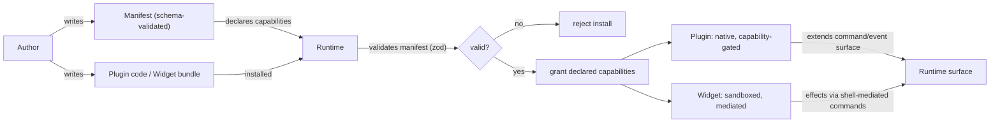

# DEX Plugins & Widgets — Public SDK Surface

## Purpose

This document is the developer-facing index of the DEX extension surface for
Plugin and Widget authors. It explains what a Plugin declares, what a Widget
gets, how the two are versioned and kept compatible, and the permission model
that bounds them. It is an *index*: the formal contracts are owned by
[`../30-specs/PluginAPI.md`](../30-specs/PluginAPI.md) and
[`../30-specs/WidgetAPI.md`](../30-specs/WidgetAPI.md), and the security
boundary is decided in
[`../50-adr/0005-plugin-boundary.md`](../50-adr/0005-plugin-boundary.md).

## Why the surface is shaped this way

DEX is Plugin First (principle 4): extensibility is designed into the
platform from the start, bounded by a hard security boundary — never added as
an afterthought. The consequence is that the extension surface is not a
loose API but a **boundary**. The shell is a single Tauri webview with full
typed IPC access; if third-party code ever ran inside that privileged context
it could reach the filesystem through the same typed surface as the shell
itself. The boundary is fixed in Phase 0 because it is cheap to set now and
expensive to retrofit later.

Two extension kinds exist, and they differ in exactly one decisive way —
where their code runs:

- A **Plugin** is a Rust-hosted extension of the Runtime. It runs in native
  code, is loaded and versioned by the host, and extends the command and
  event surface with exactly the capabilities granted to it.
- A **Widget** is a sandboxed UI extension. It renders in an isolated context
  with no IPC access of its own; every effect is mediated by the Runtime
  through shell-mediated commands.

The distinction is the security model: native code is capability-gated and
reviewed; UI code is sandboxed and mediated. Neither ever runs inside the
privileged webview.

## What a Plugin declares

A Plugin is declared by a manifest and validated by the host at install and
update time. Unknown fields in the manifest are rejected, never silently
ignored (ADR-0005). A Plugin declares:

| Declaration | Description |
|---|---|
| Identity | name, version, author, description |
| Capabilities | the exact permissions the Plugin requires (see [Permission model](#permission-model)) |
| Commands | the `#[tauri::command]` handlers the Plugin contributes to the Runtime surface |
| Events | the `dex.<domain>.<event>` names the Plugin emits or subscribes to |
| Dependencies | other Plugins or Runtime features it requires |

A Plugin's commands and events follow the same contract rules as the core
surface: commands take exactly one serde struct argument, results are typed,
and event names are declared in the `EVENTS` registry. A Plugin gets exactly
the capabilities it declares — no default elevation.

## What a Widget gets

A Widget is a sandboxed UI extension. It renders in an isolated context and
never imports `@tauri-apps/api`. Its surface is:

| Surface | Description |
|---|---|
| Sandbox | isolated render context; no direct IPC, no filesystem, no shell access |
| Mediated actions | every effect goes through shell-mediated commands provided by the Runtime |
| Lifecycle | install, activate, render, suspend, remove — managed by the Runtime |
| Metadata | declared in a manifest, schema-validated at install |
| State | persisted positions, sizes, and settings (SQLite-backed, Phase 3 M3.3) |

Because a Widget has no IPC of its own, it receives state through mediated
events from the shell rather than subscribing to the event bus directly (see
[`Events.md`](Events.md)). The Widget SDK contract is part of the widget
boundary from day one (Phase 3 M3.1), not an afterthought.

## Versioning and compatibility policy

The extension surface is versioned so that a Plugin or Widget written against
one Runtime version keeps working across compatible upgrades.

| Policy | Rule |
|---|---|
| Manifest version | the manifest declares the schema version it targets |
| Runtime compatibility | a Plugin/Widget declares the Runtime versions it supports |
| Validation | manifests are schema-validated at install and update; incompatible versions are rejected |
| Breaking changes | a breaking change to the SDK is a new major version, not a silent behavior change |
| Capability changes | a Plugin that needs a new capability must be updated and re-granted; grants are never silently widened |

The exact versioning scheme is owned by
[`../30-specs/PluginAPI.md`](../30-specs/PluginAPI.md) and
[`../30-specs/WidgetAPI.md`](../30-specs/WidgetAPI.md).

## Permission model

The permission model is the security boundary (ADR-0005). It is summarized
here; the full decision is in
[`../50-adr/0005-plugin-boundary.md`](../50-adr/0005-plugin-boundary.md).

| Rule | Description |
|---|---|
| Rust-hosted | Plugins are native extensions of `src-tauri/`, not web code in the privileged webview |
| Manifest-validated | manifests are schema-validated (zod) at install/update; unknown fields rejected |
| Capability-gated | per-plugin grants in `src-tauri/capabilities/*.json`; a Plugin gets exactly what it declares |
| Sandboxed UI | Widgets render in isolated contexts with no IPC access of their own |
| Mediated effects | all Widget effects go through shell-mediated commands |
| Strict CSP | the shell ships a strict CSP from Phase 0; dev-mode relaxation never ships |

The blast-radius reducer is the CSP: even a compromised renderer cannot fetch
arbitrary origins or run inline scripts.

## Current status

The extension surface is **planned**. Phase 0 fixed the boundary (ADR-0005)
and the security baseline, but no Plugin or Widget SDK ships yet. The Widget
platform lands in Phase 3 (M3.1 Widget SDK, M3.2 Layout Engine, M3.3
Persistence, M3.4 Marketplace API); the Plugin platform lands in Phase 8
(M8.1 SDK, M8.2 API, M8.3 Marketplace, M8.4 Sandboxing). Until those
milestones land, the contracts in
[`../30-specs/PluginAPI.md`](../30-specs/PluginAPI.md) and
[`../30-specs/WidgetAPI.md`](../30-specs/WidgetAPI.md) are the authority for
the intended surface.

## Related Documents

- Plugin contract:
  [`../30-specs/PluginAPI.md`](../30-specs/PluginAPI.md)
- Widget contract:
  [`../30-specs/WidgetAPI.md`](../30-specs/WidgetAPI.md)
- Plugin boundary and CSP decision:
  [`../50-adr/0005-plugin-boundary.md`](../50-adr/0005-plugin-boundary.md)
- Plugin First principle:
  [`../00-vision/02_Principles.md`](../00-vision/02_Principles.md)
- Command catalog (the surface Plugins extend):
  [`Commands.md`](Commands.md)
- Event catalog (the surface Plugins emit and subscribe to):
  [`Events.md`](Events.md)
- CLI reference (the scriptable surface for managing Plugins and Widgets):
  [`CLI.md`](CLI.md)
- Authoring guides:
  [`../80-guides/CreatingPlugin.md`](../80-guides/CreatingPlugin.md) ·
  [`../80-guides/CreatingWidget.md`](../80-guides/CreatingWidget.md)
- Roadmap and milestones:
  [`../10-product/11_Product_Roadmap.md`](../10-product/11_Product_Roadmap.md)
- Canonical terminology:
  [`../00-vision/03_Glossary.md`](../00-vision/03_Glossary.md)